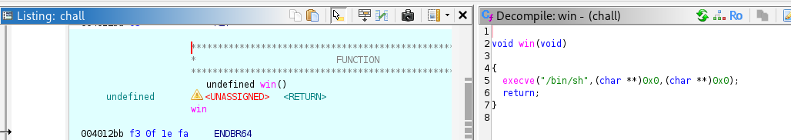
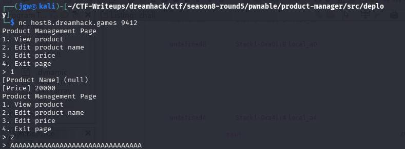
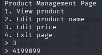
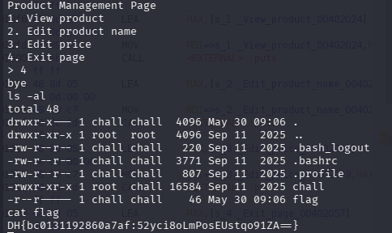

# [Dreamhack CTF] Product Manager - Pwnable

## 1. 문제 개요

* **문제 링크:** [Dreamhack CTF - Product Manager](https://dreamhack.io/wargame/challenges/2982) (Dreamhack CTF Season 8 Round #5 출제)

* **티어:** Gold 2

* **분야:** pwnable

* **목표:** Off-by-One (Null Byte Injection) 취약점을 이용한 GOT Overwrite 및 셸 획득

## 2. 취약점 분석
바이너리 분석 결과, 상품 이름을 수정하는 로직에서 `read` 함수로 32바이트를 꽉 채워 입력받은 후 `strcpy`를 사용할 때 발생하는 오프-바이-원(Off-by-One) 취약점 확인.

```c
// [!] 취약점 발생: strcpy의 널 바이트 삽입 특성
read(0, local_68, 0x20); // 32바이트 꽉 채워 입력 가능
strcpy(local_a0, local_68); // 32바이트 복사 후 끝에 '\0' 강제 삽입
```

```c
// 힙 메모리 구조: 32바이트 이름 버퍼 바로 뒤에 가격 포인터 존재
*(undefined4 **)(local_a0 + 0x20) = &default_price; 
```

```c
// 타겟 함수: 바이너리 내부에 셸을 실행하는 win 함수 존재 (주소: 0x4012bb / 정수 변환: 4199099)
void win(void)
{
  execve("/bin/sh",(char **)0x0,(char **)0x0);
  return;
}
```


* **분석 결론:** 2번 메뉴를 통해 32바이트를 꽉 채워 입력하면 `strcpy`가 33번째 바이트에 `\0`을 삽입. 이로 인해 바로 뒤에 위치한 `default_price` 포인터의 하위 1바이트(LSB)가 `0x00`으로 변조되어 GOT 영역을 가리키게 됨. 이후 3번 가격 수정 메뉴를 이용해 GOT 테이블 값을 `win` 함수 주소로 덮어쓰는 익스플로잇 설계.

## 3. 공격 수행
`nc` 명령어를 통해 문제 서버에 접속 후, 다음과 같은 순서로 페이로드를 전송하여 익스플로잇 진행.

### 3.1. 메모리 할당 및 포인터 변조

1. `1`번(View product) 메뉴를 선택하여 힙 영역에 상품 데이터를 저장할 40바이트 청크 할당.

2. `2`번(Edit product name) 메뉴를 선택하여 정확히 32바이트 길이의 더미 데이터(`A` 32개) 전송. 인접한 가격 포인터의 LSB가 `0x00`으로 오염되어 GOT 영역(`0x404000`)으로 포인터 이동.



### 3.2. GOT Overwrite 및 셸 획득
3. `3`번(Edit price) 메뉴를 선택하여 타겟인 `win` 함수의 주소를 10진수로 변환한 값(`4199099`) 전송. 변조된 포인터로 인해 특정 함수의 GOT 테이블에 `win` 함수 주소 덮어쓰기 완료.



4. `4`번(Exit page) 메뉴를 선택하여 프로그램 종료 시도. 이 과정에서 주소가 덮어씌워진 특정 라이브러리 함수(예: `exit`)가 호출되며 프로그램 제어 흐름이 `win` 함수로 전환, 성공적으로 셸 획득.



## 4. 획득 결과
서버 셸을 획득한 후 `ls -al`로 `flag` 파일을 찾고 `cat flag` 명령어를 실행하여 하드코딩된 서버 플래그 출력.

* **FLAG:** `DH{bc0131192860a7af:CvOfBCMCnc1mPUQsAPCDKg==}`

## 5. 대응 방안
문자열 처리 시 입력 버퍼의 크기와 널 바이트가 들어갈 공간을 명확히 계산하여 메모리 오버플로우가 발생하지 않도록 근본적인 조치 필요.

* **안전한 함수 사용:** 널 바이트를 강제로 삽입하여 경계를 넘을 수 있는 `strcpy` 대신, 복사할 최대 길이를 개발자가 엄격히 제한할 수 있는 `strncpy` 등의 안전한 함수로 교체.

* **버퍼 크기 검증 강화:** `read` 함수로 사용자 입력을 받을 때 널 바이트(`\0`)가 위치할 1바이트 공간을 미리 확보. 버퍼의 실제 크기보다 1바이트 작게 입력받도록 코드 수정 (예: `read(0, local_68, 0x1F)`).