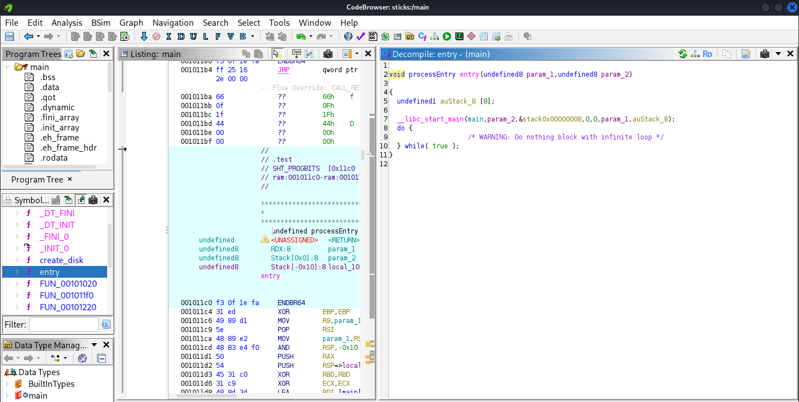
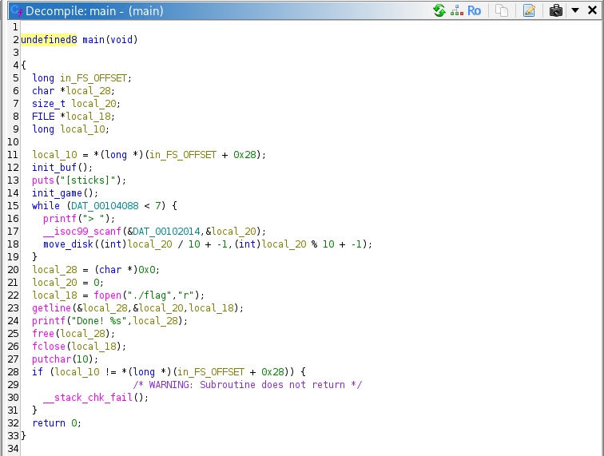
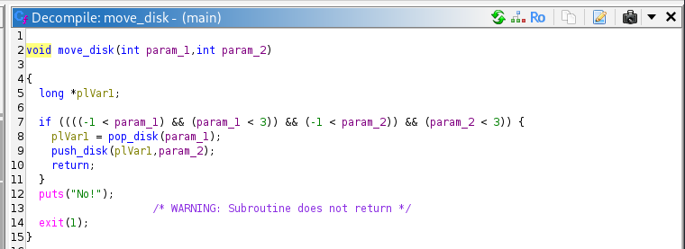
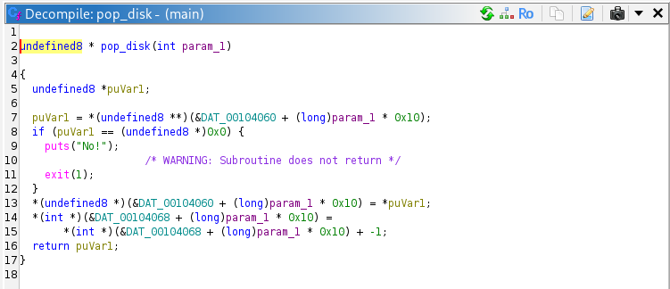
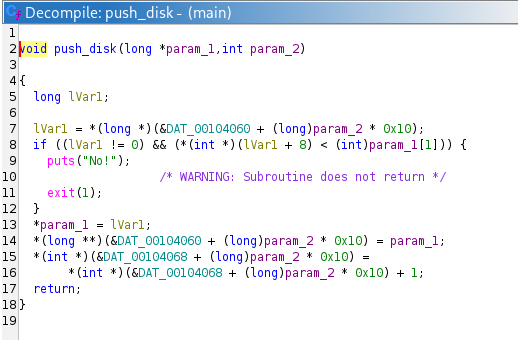
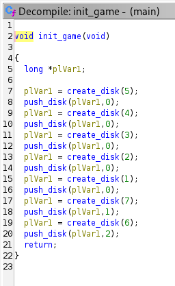
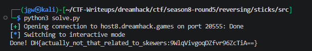

# [Dreamhack CTF] Sticks - Reversing

## 1. 문제 개요

* **문제 링크:** [Dreamhack CTF - sticks](https://dreamhack.io/wargame/challenges/2990) (Dreamhack CTF Season 8 Round #5 출제)

* **티어:** Gold 1

* **분야:** Reversing

* **목표:** 바이너리 역공학을 통한 하노이의 탑 알고리즘 파악 및 자동화 스크립트를 통한 플래그 획득.

## 2. 취약점 분석
제공된 ELF 바이너리를 기드라(Ghidra)로 디컴파일하여 분석한 결과, 해당 프로그램은 터미널 입력을 통해 진행되는 하노이의 탑 게임으로 확인.

```c
// [1] 메인 게임 루프 및 입력값 파싱
while (DAT_00104088 < 7) {
    printf("> ");
    __isoc99_scanf(&DAT_00102014, &local_20);
    FUN_00101437((int)local_20 / 10 + -1, (int)local_20 % 10 + -1);
}
```

```c
// [2] 3x3 보드판 좌표 검증 로직
if ((((-1 < param_1) && (param_1 < 3)) && (-1 < param_2)) && (param_2 < 3)) {
    uVar1 = FUN_001012e1(param_1);
    FUN_0010137f(uVar1,param_2);
    return;
}
```

```c
// [3] 하노이의 탑 절대 규칙 (크기 비교) 검증 로직
lVar1 = *(long *)(&DAT_00104060 + (long)param_2 * 0x10);
if ((lVar1 != 0) && (*(int *)(lVar1 + 8) < (int)param_1[1])) {
    puts("No!");
    exit(1);
}
```

* **분석 결론:** 사용자의 두 자리 숫자 입력값을 십의 자리(출발 기둥)와 일의 자리(도착 기둥)로 분리하여 원판을 이동시키는 로직. 초기 원판 세팅이 변형되어 있으며, 7개의 원판을 모두 3번째 기둥으로 옮기면 무한 루프를 탈출하고 플래그가 출력되는 구조.

## 3. 공격 수행

### 3.1. 바이너리 흐름 및 메인 로직 분석

#### 📌 주요 함수 식별 요약
> 효율적인 코드 분석을 위해 바이너리 내부의 주요 함수들을 기능별로 파악하여 아래와 같이 이름을 변경한 후 분석을 진행함.
> 
| 원래 이름 | 변경된 이름 | 식별 근거 |
| :--- | :--- | :--- |
| `FUN_001015a8` | **`main`** | `__libc_start_main`을 통해 호출되는 실제 프로그램 메인 루프. |
| `FUN_00101497` | **`init_game`** | `malloc`으로 원판을 연속 생성해 초기 게임판을 세팅하는 로직 확인. |
| `FUN_001012e1` | **`pop_disk`** | 출발 기둥 포인터에서 맨 위의 원판 객체를 반환하고 제거함. |
| `FUN_0010137f` | **`push_disk`** | 하노이 핵심 규칙(큰 원판 위에 작은 원판) 검증 후 원판을 스택에 추가. |

1. 기드라를 통해 바이너리 진입점(`entry`)에서 `__libc_start_main`을 통해 호출되는 실제 `main` 함수 식별.



2. `main` 함수 내부에서 카운터(`DAT_00104088`)가 7에 도달할 때까지 반복되는 루프 및 사용자의 입력을 쪼개어 전달하는 부분 확인.



### 3.2. 블록 이동 로직 및 게임 규칙 파악

3. 전달된 입력값이 `0~2` (실제 입력 기준 `1~3`) 범위를 벗어나는지 검증하는 방어 로직 확인.



4. 출발 기둥에서 원판을 빼내는(Pop) 함수(`pop_disk`) 로직 분석.



5. 도착 기둥에 원판을 쌓는(Push) 함수(`push_disk`)에서 큰 원판 위에 작은 원판만 올라갈 수 있다는 하노이의 탑 핵심 규칙 발견.



### 3.3. 익스플로잇 스크립트 작성 및 실행

6. 스크립트 작성 전, 게임 초기화 함수(`init_game`)를 분석하여 출제자가 의도적으로 변형해 둔 초기 게임판 상태(1번: 원판 5개, 2번: 7번 원판, 3번: 6번 원판) 확인.



7. 파악한 변형 초기 상태에 맞추어 최소 이동 횟수로 3번 기둥에 모두 정렬하는 `pwntools` 기반 파이썬 자동화 스크립트 작성.

```python
from pwn import *

r = remote('host8.dreamhack.games', 20555)

def move(start, end):
    r.recvuntil(b'> ')
    cmd = f"{start}{end}".encode()
    r.sendline(cmd)

def hanoi(n, start, end, aux):
    if n == 1:
        move(start, end)
        return
    hanoi(n - 1, start, aux, end)
    move(start, end)
    hanoi(n - 1, aux, end, start)

# [초기 상태] 1번 기둥: [5,4,3,2,1] / 2번 기둥: [7] / 3번 기둥: [6]
hanoi(5, 1, 2, 3)  
move(3, 1)         

hanoi(5, 2, 1, 3)  
move(2, 3)         

hanoi(5, 1, 2, 3)  
move(1, 3)         

hanoi(5, 2, 3, 1)  

r.interactive()
```

7. 작성한 `solve.py` 스크립트를 실행하여 원격 서버와 통신 진행.

## 4. 획득 결과
익스플로잇 실행 결과, 서버 측에서 모든 원판 이동을 정상 처리하고 루프를 탈출하여 숨겨진 플래그 출력 성공.



* **FLAG:** `DH{actually_not_that_related_to_skewers:9WlqVivgoqDZfvr96ZcTiA==}`

## 5. 대응 방안
리버싱 문제의 특성상 의도된 로직이나, 실제 상용 프로그램에서 알고리즘과 중요 로직(플래그 출력부)을 보호하기 위한 보안 조치 적용.

* **바이너리 난독화 적용:** OLLVM(Obfuscator-LLVM) 등의 컴파일러 수준 난독화 도구를 사용하여 제어 흐름 평탄화(Control Flow Flattening) 및 불투명한 술어(Opaque Predicate) 삽입을 통해 디컴파일된 코드의 가독성 저하.

* **데이터 암호화 및 하드코딩 지양:** 플래그 파일 이름(`./flag`)이나 중요 판별 변수(`DAT_00104088`)를 평문으로 노출하지 않고 런타임 시 동적으로 복호화하여 사용.