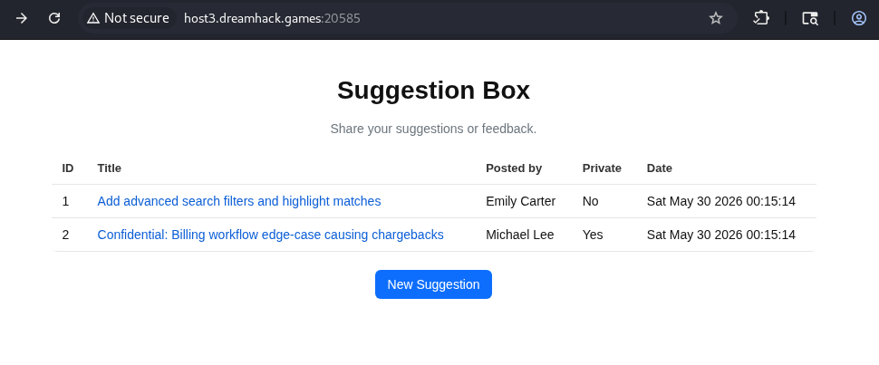
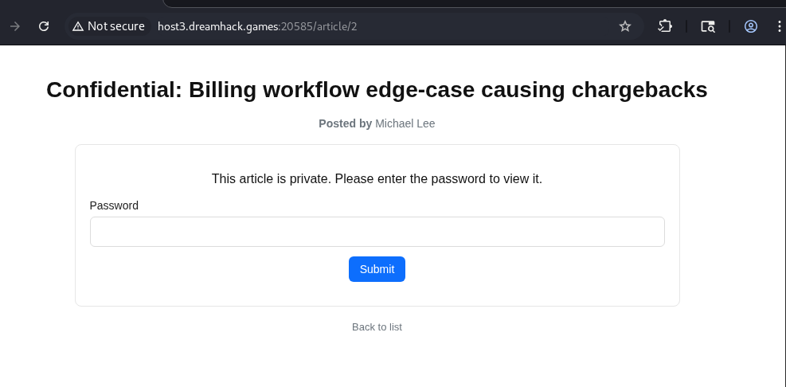
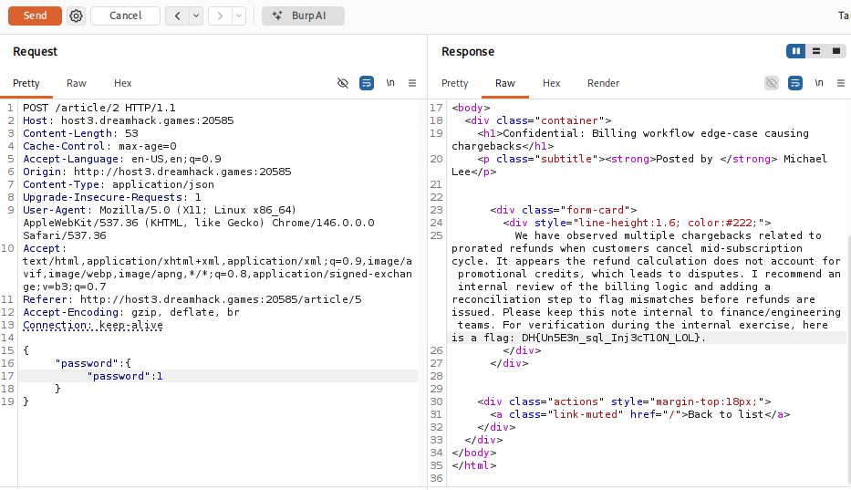

# [Dreamhack CTF] Suggestion Box - Web Hacking

## 1. 문제 개요

* **문제 링크:** Dreamhack CTF Season 8 Round #5 (종료된 대회. 링크 X)

* **분야:** Web

* **목표:** Object Injection을 통한 DB 검증 로직 우회 및 비공개 데이터 탈취

## 2. 취약점 분석
제공된 `app.js` 소스 코드 분석 결과, `express.json()`을 통해 JSON 형태의 입력을 허용하며, `mysql2` 패키지를 이용한 쿼리 바인딩 시 객체(Object) 타입에 대한 검증 누락 확인.

```javascript
app.use(express.json());

// ... (중략) ...

app.post('/article/:id', async (req, res) => {
    const id = req.params.id;
    const { password } = req.body;

    // [!] 취약점 발생: mysql2 패키지의 객체 매핑 취약점 (Type/Object Juggling)
    const q = 'SELECT id, title, author, content FROM articles WHERE id = ? AND is_private = 1 AND password = ? LIMIT 1';
    try {
        const rows = await dbQuery(q, [id, password]);
// ... (생략) ...
```

* **분석 결론:** 입력값이 `{"password": {"password": 1}}`과 같은 중첩 객체 형태일 경우, 내부적으로 쿼리가 ``password = `password` = 1``로 변환되어 조건문이 무조건 참(True)으로 평가되는 취약점 존재.

## 3. 공격 수행
Burp Suite를 활용하여 웹 브라우저를 거치지 않고 조작된 JSON 페이로드를 서버로 직접 전송하여 익스플로잇.

### 3.1. 패킷 캡처 및 페이로드 변조

1. 웹 브라우저를 통해 문제 서버 접속 후, 플래그가 포함된 비공개 게시글(ID: 2) 존재 확인.



2. 해당 게시글 열람 페이지로 이동 후 패스워드 입력 폼에서 패킷을 캡처하여 Burp Suite의 Repeater로 전송.



3. Repeater에서 `Content-Type`을 `application/json`으로 변경. 이후 패스워드 검증 로직을 무력화하기 위해 객체 주입(Object Injection) 페이로드 `{"password": {"password": 1}}` 삽입 후 전송.

4. 서버 내부 데이터베이스 쿼리가 다음과 같이 변조되어 실행됨.
```sql
SELECT ... FROM articles WHERE id = 2 AND is_private = 1 AND password = `password` = 1
```
이로 인해 패스워드 일치 여부와 관계없이 검증을 우회함.



## 4. 획득 결과
Burp Suite의 Response 탭 확인 결과, 비공개 게시글 열람에 성공하여 하드코딩된 서버 플래그 출력.

* **FLAG:** `DH{Un5E3n_sqL_Inj3cT1ON_LOL}`

## 5. 대응 방안
사용자 입력값을 데이터베이스 쿼리에 바인딩하기 전, 입력값의 데이터 타입을 서버 단에서 엄격하게 검증하는 과정 필요.

* **입력값 타입 검증:** `typeof password === 'string'`과 같이 입력값이 반드시 문자열인지 확인하는 방어 로직 추가.

* **ORM 및 Query Builder 도입:** Raw Query 작성과 모듈의 암시적 형변환에 의존하지 않고, 객체가 쿼리 인자로 오용되지 않도록 안전하게 추상화된 데이터베이스 API 사용.