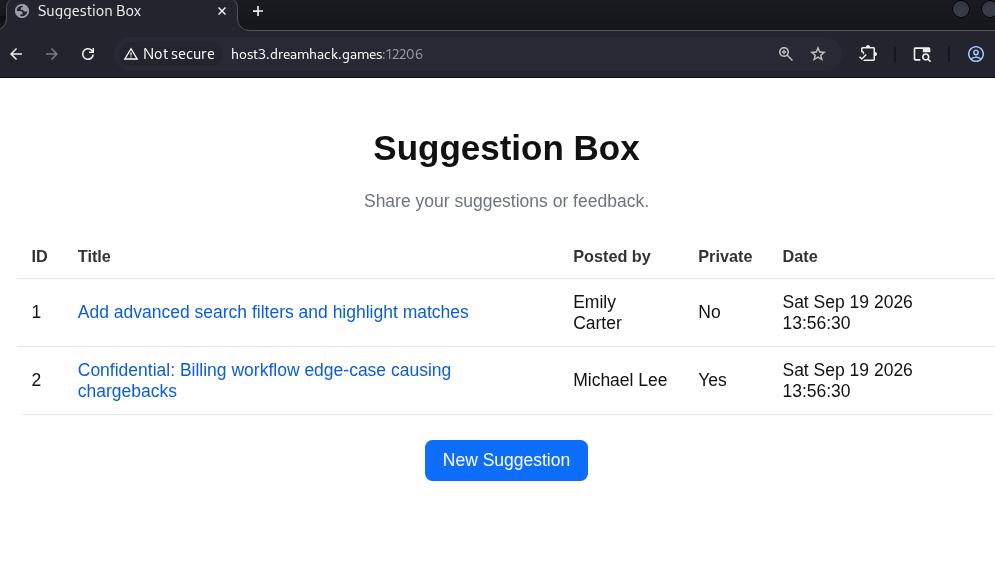
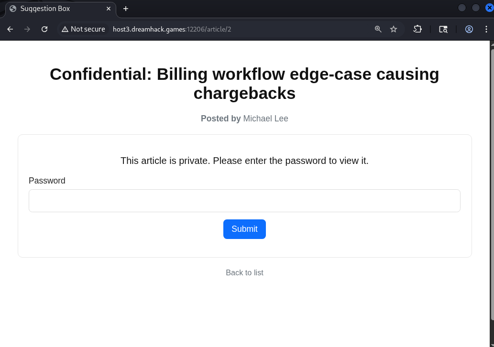
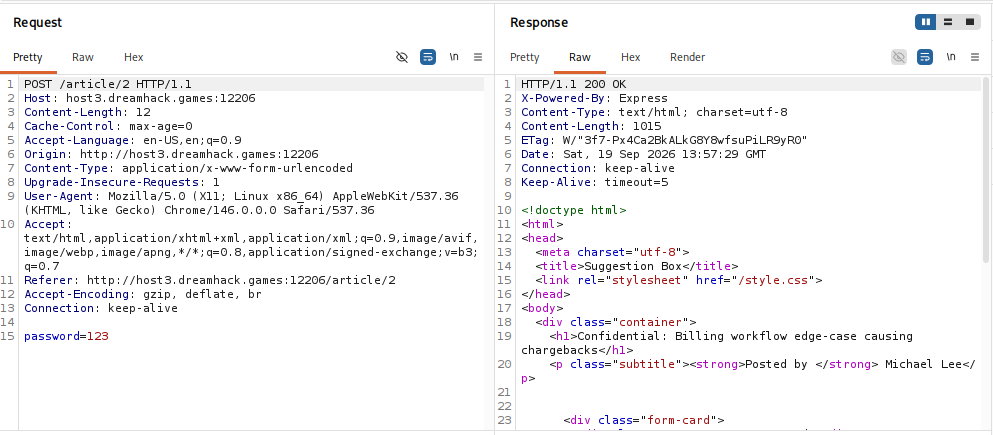
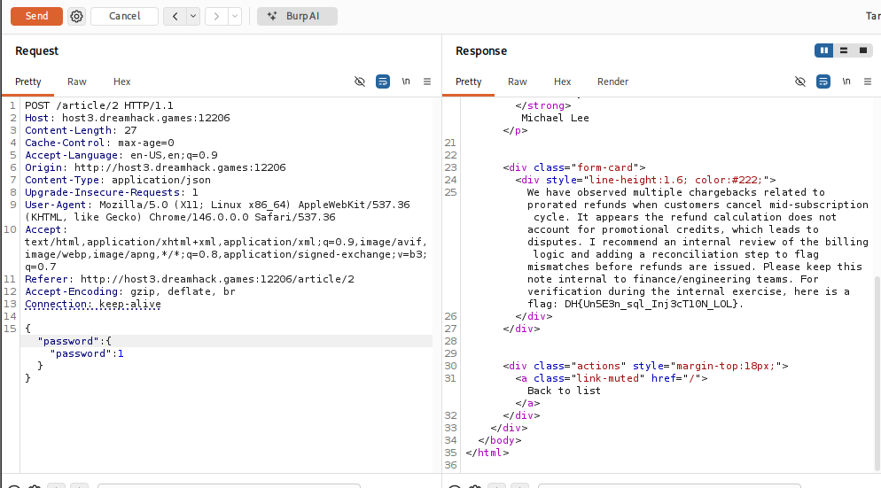

# [Dreamhack CTF] Suggestion Box - Web Hacking

## 1. 문제 개요

* **문제 링크:** [Dreamhack CTF - Suggestion Box](https://dreamhack.io/wargame/challenges/2986) (Dreamhack CTF Season 8 Round #5 출제)

* **티어:** Silver 1

* **분야:** Web

* **목표:** Object Injection을 통한 비밀번호 검증 로직 우회 및 비공개 게시글 탈취

## 2. 취약점 분석
제공된 `app.js` 분석 결과, 비공개 게시글은 GET 요청만으로는 `content`가 응답에 포함되지 않아 반드시 비밀번호 검증 쿼리를 통과해야 하는 구조로 확인.

```javascript
// [app.js] GET /article/:id - 비공개 글은 content 필드 자체를 응답에서 제외
if (article.is_private) {
  return res.render('article', { article: { id: article.id, title: article.title, author: article.author }, showPasswordForm: true, error: null });
} else {
  const contentHtml = escapeAndFormat(article.content);
  return res.render('article', { article: { id: article.id, title: article.title, author: article.author, contentHtml }, showPasswordForm: false, error: null });
}
```

DB 드라이버로 `mysql2`를 사용하며, 해당 검증은 `execute()`가 아닌 `query()`를 통해 이루어지는 구조로 확인. `query()`는 파라미터를 DB 서버로 별도 전달하는 방식이 아니라 mysql2가 클라이언트 단에서 직접 SQL 텍스트를 조립하는 방식이며, 이 조립 과정에서 문자열·숫자 타입 값은 안전하게 이스케이프되어 값으로만 삽입되나 객체 타입 값이 들어오면 `` `key` = value `` 형태(SET절 포맷)로 직렬화되는 동작이 확인됨.

```javascript
// [app.js] mysql2 드라이버 연결 및 db.query() 사용 - 서버 사이드 Prepared Statement 미적용
const mysql = require('mysql2');
const db = mysql.createConnection({ host: 'db', user: 'chall', password: 'password', database: 'post_db' });
const dbQuery = util.promisify(db.query).bind(db);
```

```javascript
// [app.js] POST /article/:id - 비밀번호 검증 쿼리
app.post('/article/:id', async (req, res) => {
  const id = req.params.id;
  const { password } = req.body;

  const q = 'SELECT id, title, author, content FROM articles WHERE id = ? AND is_private = 1 AND password = ? LIMIT 1';
  try {
    const rows = await dbQuery(q, [id, password]);
    // ... (중략) ...
```

이 자리에 문자열이 아닌 값을 전달할 경로가 있는지 확인한 결과, `express.urlencoded({ extended: false })`는 중첩된 객체 형태의 값을 생성할 수 없으나 `express.json()`은 `Content-Type: application/json` 요청에 대해 임의 깊이의 중첩 객체를 그대로 `req.body`에 파싱하는 구조로 확인, 비밀번호 검증 쿼리는 이 값의 타입을 검증하지 않고 그대로 바인딩에 사용함을 확인.

```javascript
// [app.js] JSON 파싱 미들웨어 - 중첩 객체(Nested Object) 형태의 요청 바디 허용
app.use(express.urlencoded({ extended: false }));
app.use(express.json());
```

* **분석 결론:** `password`에 `{"password": 1}`과 같은 중첩 객체가 전달될 경우 mysql2가 이를 `` `password` = 1 ``로 직렬화해 최종 쿼리가 `password = `password` = 1`로 조립됨. 백틱으로 감싼 `` `password` ``는 문자열이 아닌 컬럼 이름으로 해석되어 "password 컬럼이 자기 자신과 같은가"라는 항상 참인 비교가 성립, 이 결과가 다시 `= 1`과 비교되며 실제 비밀번호 값과 무관하게 조건문 전체가 참으로 평가.

## 3. 공격 수행

1. 브라우저로 문제 서버 접속 후 플래그가 포함된 비공개 게시글(ID: 2) 존재 확인.



2. 해당 게시글 열람 시 비밀번호 입력을 요구하는 것을 확인.



3. 임의 비밀번호로 제출한 실제 요청을 Burp Suite HTTP History에서 Raw로 확인, `Content-Type: application/x-www-form-urlencoded`로 정상 전송됨을 확인.



4. Repeater에서 `Content-Type`을 `application/json`으로 변경하고 아래 페이로드로 Body 교체 후 전송, 비밀번호 일치 여부와 무관하게 비공개 게시글 `content`가 그대로 응답에 포함되어 플래그가 노출됨을 확인.

```json
{
  "password": {
    "password": 1
  }
}
```



## 4. 획득 결과
Burp Suite Repeater Response의 Raw 탭 확인 결과, 비공개 게시글 열람에 성공해 하드코딩된 서버 플래그 출력.

* **FLAG:** `DH{Un5E3n_sqL_Inj3cT1ON_LOL}`

## 5. 대응 방안
사용자 입력값을 DB 쿼리에 바인딩하기 전 타입 검증을 서버 단에서 엄격히 수행하고, 쿼리 실행 방식 자체를 안전한 방식으로 전환할 필요.

* **입력값 타입 검증:** `typeof password === 'string'`과 같이 바인딩 대상 값이 반드시 원시 타입(문자열)인지 확인하는 방어 로직 추가.

* **Prepared Statement 전환:** `db.query()` 대신 `db.execute()`를 사용해 파라미터가 DB 서버로 별도 전달되도록 변경, 값이 SQL 문장에 직접 이어붙는 경로 자체를 제거.

* **ORM 및 Query Builder 도입:** Raw Query 작성과 암시적 타입 변환에 의존하지 않고, 객체가 쿼리 인자로 오용되지 않도록 안전하게 추상화된 데이터베이스 API 사용.

## 6. 블루팀 관점 요약
보안관제 및 침해사고 대응(IR) 관점에서, 비정상 타입의 파라미터를 이용한 인증/인가 로직 우회 시도 탐지.

* **WAF 및 웹 서버 로그 분석:** `POST /article/<id>` 요청의 `Content-Type`이 `application/json`이면서 body 내 `password` 필드 값이 문자열이 아닌 중첩 객체(`{"password": {...}}`) 형태로 전달되는 패턴 식별.

* **침해사고 대응(IR) 시나리오:** 동일 세션에서 `GET /article/<id>` 이후 `POST /article/<id>` 요청의 `password` 파라미터가 정상 로그인 흐름과 달리 JSON 객체 구조를 가지며, 해당 응답에 비공개(`is_private=1`) 게시글의 `content` 필드가 포함될 경우 검증 로직 우회 성공으로 판단.

* **네트워크 기반 탐지 룰 제안 (Snort 3):**

  - `POST /article/<id>` 요청 body 내 `password` 키의 값이 문자열이 아닌 중괄호(객체)로 시작하는 패턴 탐지.

  - `alert tcp $EXTERNAL_NET any -> $HTTP_SERVERS $HTTP_PORTS (msg:"[Web] Object Injection via Non-String Password Parameter"; flow:to_server,established; http_uri; content:"/article/"; http_method; content:"POST"; http_client_body; content:"\"password\""; pcre:"/\"password\"\s*:\s*\{/"; sid:1000009; rev:1;)`