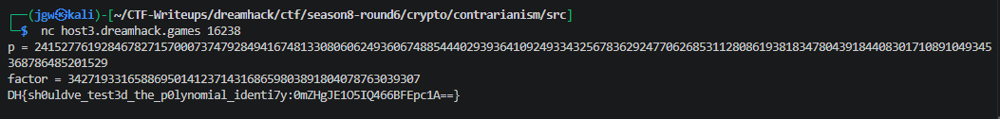

# [Dreamhack CTF] Contrarianism - Crypto

## 1. 문제 개요

* **문제 링크:** [Dreamhack CTF - Product Manager](https://dreamhack.io/wargame/challenges/2982)
(Dreamhack CTF Season 8 Round #6 출제)

* **티어:** Gold 4

* **분야:** Crypto

* **목표:** Agrawal–Biswas 소수판별 테스트를 캐마이클 수(Carmichael number)로 우회, 합성수를 소수로 오인시킨 뒤 자명하지 않은 소인수를 제출해 flag 획득

## 2. 취약점 분석
제공된 소스코드(`chal.py`) 분석 결과, `is_prime()`이 실제 소수 판별이 아닌 이항정리 기반의 확률적 성질 하나만을 256회 반복 검증하는 구조로 확인.

```python
# is_prime() - (1+z)^p ≡ 1+z^p (mod p)를 256회 랜덤 검증, Agrawal-Biswas 테스트의 축소판
def is_prime(p):
    for _ in range(256):
        z = randbelow(p)
        if pow(z + 1, p, p) != (pow(z, p, p) + 1) % p:
            return False
    return True
```

p가 실제 소수면 이항계수 C(p,k) (0<k<p)가 모두 p로 나누어떨어지므로 위 등식이 모든 z에 대해 항상 성립함. 그러나 이 조건은 소수의 충분조건이 아니라 필요조건에 불과하며, **캐마이클 수**(Korselt's criterion: n이 제곱인수를 갖지 않고, n을 나누는 모든 소수 p에 대해 (p-1) | (n-1))도 동일한 성질을 만족시킴을 확인.

캐마이클 수 n과 서로소인 모든 a에 대해 `a^n ≡ a (mod n)`이 성립하므로, z와 (1+z)가 각각 n과 서로소인 한 `(1+z)^n ≡ (1+z) ≡ 1+z^n (mod n)`이 정확히 성립함. n이 큰 소인수로만 구성되면 랜덤 z가 그 소인수의 배수일 확률은 무시 가능한 수준이므로, 256회 테스트를 사실상 100% 통과하는 구조로 확인.

* **분석 결론:** `p.bit_length() >= 512`와 `is_prime(p)` 두 조건만 통과하면 되고 p가 실제 소수인지는 검증하지 않으므로, 512비트 이상의 캐마이클 수를 직접 구성해 제출하면 `is_prime()`을 통과시키면서도 알고 있는 소인수를 `factor`로 제출해 `p % factor == 0` 조건까지 동시에 만족시킬 수 있는 구조로 확인. 캐마이클 수 구성에는 `6k+1`, `12k+1`, `18k+1`이 모두 소수가 되는 k에 대해 n = (6k+1)(12k+1)(18k+1)이 항상 Korselt 조건을 만족한다는 Chernick's formula를 사용.

## 3. 공격 수행

1. `6k+1`, `12k+1`, `18k+1`이 동시에 소수가 되는 k(약 170비트)를 랜덤 탐색.

```python
# Chernick's formula로 512비트 이상 캐마이클 수 탐색
from sympy import isprime
import random

def find_chernick(bits_k=172, tries=200000):
    for _ in range(tries):
        k = random.getrandbits(bits_k) | (1 << (bits_k - 1))
        m1, m2, m3 = 6*k+1, 12*k+1, 18*k+1
        if isprime(m1) and isprime(m2) and isprime(m3):
            return k, m1, m2, m3, m1*m2*m3
```

2. 생성된 n이 실제로 Korselt 조건을 만족하는지, 그리고 챌린지와 동일한 `is_prime()` 로직을 통과하는지 로컬에서 사전 검증 완료.

3. nc로 서버에 접속, 생성한 n을 `p`로, 알고 있는 소인수(6k+1)를 `factor`로 제출해 flag 획득.



## 4. 획득 결과
Agrawal–Biswas 테스트가 실제 소수 여부가 아닌 이항정리 성질 하나만 검증한다는 점을 이용, Chernick's formula로 직접 구성한 캐마이클 수를 제출해 `is_prime()`을 통과시키고 알고 있는 소인수를 `factor`로 제출해 flag 획득.

* **FLAG:** `DH{sh0uldve_test3d_the_p0lynomial_identi7y:0mZHgJE1O5IQ466BFEpc1A==}`

## 5. 대응 방안
단일 확률적 검증 기법에 대한 과신에서 비롯된 취약점이므로, 소수 판별 로직 자체의 구조 개선 필요.

* **다중 알고리즘 교차 검증:** Agrawal–Biswas류 단일 테스트에만 의존하지 않고, Miller–Rabin(서로 다른 다수의 base) 및 Lucas 테스트를 함께 통과해야 소수로 판정하도록 구성 (Baillie–PSW 방식처럼 서로 다른 계열의 위확률 조건을 결합하면 알려진 반례가 상호 배타적이라 동시 통과가 사실상 불가능).

* **구조적 반례 탐지:** 제출된 p에 대해 GCD 기반 소인수 스무딩 검사(작은 소수들로 시험 나눗셈)를 선행해, Chernick 형태와 같이 다수의 근접한 크기 소인수 곱으로 구성된 합성수를 조기에 걸러냄.

* **입력 신뢰 경계 재설정:** 사용자가 임의로 제출하는 p를 애초에 "소수임을 증명해야 하는 대상"이 아니라 "소수라고 주장하는 값"으로 취급, 서버가 자체적으로 결정론적 검증(예: 작은 범위에서는 AKS, 큰 범위에서는 검증된 라이브러리의 다중 테스트)을 수행한 뒤에만 다음 단계로 진행.

## 6. 블루팀 관점 요약
로컬 익스플로잇 성격이 강해 네트워크 시그니처 기반 탐지보다는 애플리케이션 레벨 로깅이 핵심.

* **서비스 로그 분석:** 동일 세션에서 제출된 p가 비정상적으로 규칙적인 구조(세 소인수의 비트 길이가 균등하고 6k+1/12k+1/18k+1 형태의 산술적 관계를 갖는 경우)를 갖는지 사후 분석으로 식별 가능. 정상적인 소수 생성기(random_prime 등)로 만든 p는 이런 균등 구조가 나타나지 않음.

* **침해사고 대응(IR) 시나리오:** 짧은 시간 내 동일 클라이언트가 `p =` 프롬프트에 반복적으로 다른 512비트 이상 값을 시도하는 패턴이 관측되면, 로컬에서 사전 계산한 캐마이클 수를 대입해보는 브루트포스성 시도로 판단 가능.

* **탐지 규칙 제안:** 네트워크 시그니처보다는 애플리케이션 단에서 제출된 p에 대해 `factor`로 즉시 자명한 소인수가 제시되는 케이스를 로깅 — 정상 사용자가 실제 소수를 시행착오 없이 제출하면서 그 소인수까지 아는 경우는 거의 없으므로, 첫 시도에 유효한 factor가 함께 제출되는 패턴 자체가 강한 이상 지표.