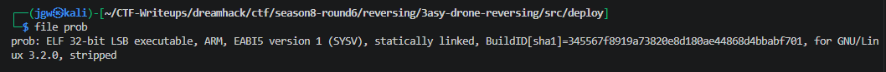
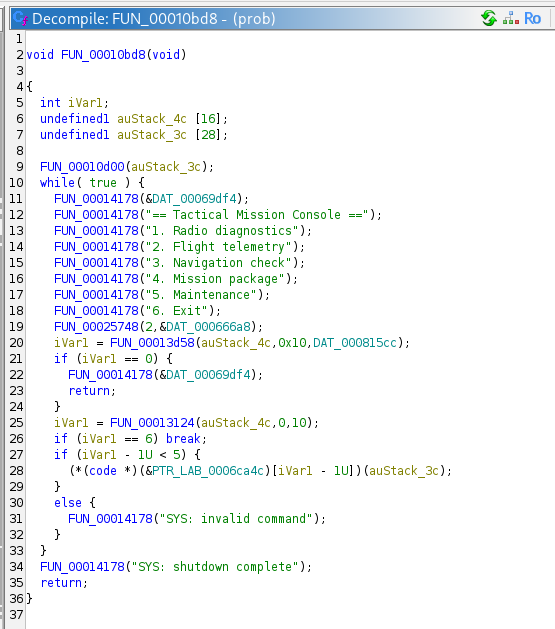
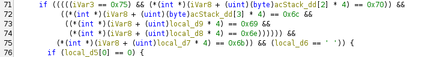
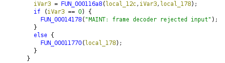
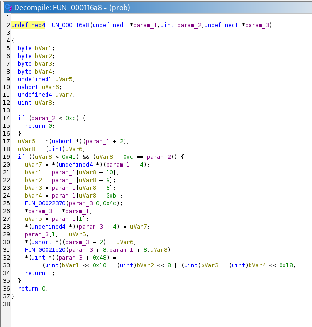
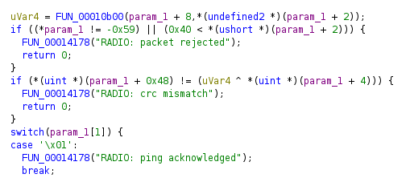
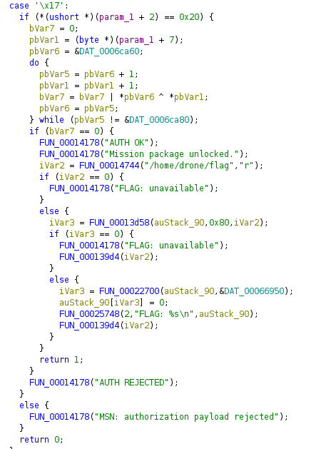
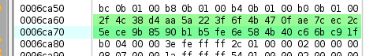
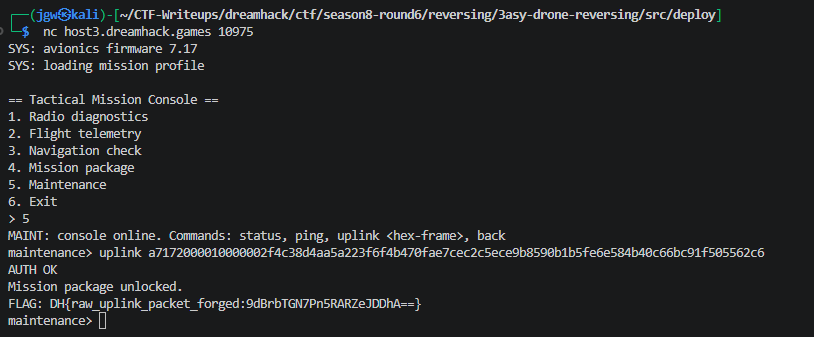

# [Dreamhack CTF] 3asy Drone Reversing - Reversing

## 1. 문제 개요

* **문제 링크:** [Dreamhack CTF - 3asy Drone Reversing](https://dreamhack.io/wargame/challenges/3160)
(Dreamhack CTF Season 8 Round #6 출제)

* **티어:** Silver 2

* **분야:** Reversing

* **목표:** 펌웨어에 남아있는 테스트용 `uplink` 백도어를 통해 command uplink packet의 통신 포맷과 인증 조건을 복원, 위조된 인증 패킷을 전송해 미션 패키지 잠금 해제 후 flag 획득

## 2. 취약점 분석
제공된 `prob`(ARM32, statically linked, stripped ELF) 정적분석 결과, 정상적인 지상국 통신 경로 외에 원시 프레임을 직접 주입할 수 있는 테스트용 Maintenance 콘솔이 펌웨어에 남아있으며, 해당 경로로 들어간 프레임은 다단계 검증을 거쳐 특정 타입일 때만 잠금 해제 로직으로 연결됨을 확인.

```c
// [FUN_00010fc8] uplink 명령 파싱 - 정상 지상국 통신을 거치지 않는 테스트 백도어 진입점
if ((((((iVar3 == 0x75) && (*(int *)(iVar8 + (uint)(byte)acStack_dd[2] * 4) == 0x70)) &&
     // ... (중략, "uplink " 8글자를 한 글자씩 개별 비교) ...
     (*(int *)(iVar8 + (uint)local_d7 * 4) == 0x6b)) && (local_d6 == ' ')) {
  // ... (중략, hex-string → byte 배열 디코딩 루프) ...
  iVar3 = FUN_000116a8(local_12c,iVar3,local_178);
  if (iVar3 == 0) {
    FUN_00014178("MAINT: frame decoder rejected input");
  }
  else {
    FUN_00011770(local_178);
  }
}
```

```c
// [FUN_000116a8] 프레임 파서 - hex 디코딩된 wire 바이트를 구조체로 매핑, wire 포맷 확정
undefined4 FUN_000116a8(undefined1 *param_1,uint param_2,undefined1 *param_3)
{
  if (param_2 < 0xc) {
    return 0;
  }
  uVar6 = *(ushort *)(param_1 + 2);        // length : wire offset 2~3, LE u16
  uVar8 = (uint)uVar6;
  if ((uVar8 < 0x41) && (uVar8 + 0xc == param_2)) {
    uVar7 = *(undefined4 *)(param_1 + 4);  // seq : wire offset 4~7, LE u32
    // ... (중략, wire offset 8+length 위치의 tag 4바이트 little-endian 조립) ...
    *param_3 = *param_1;                   // magic : wire offset 0
    param_3[1] = param_1[1];               // type  : wire offset 1
    *(ushort *)(param_3 + 2) = uVar6;
    *(undefined4 *)(param_3 + 4) = uVar7;
    FUN_00021e20(param_3 + 8,param_1 + 8,uVar8); // payload : wire offset 8 ~ 8+length-1
    *(uint *)(param_3 + 0x48) = tag;             // tag : 파싱 후 struct offset 0x48
    return 1;
  }
  return 0;
}
```

```c
// [FUN_00011770] 패킷 핸들러 - 3단계 검증 (매직바이트/길이 → CRC → 페이로드 바이트 비교)
undefined4 FUN_00011770(char *param_1)
{
  uVar4 = FUN_00010b00(param_1 + 8,*(undefined2 *)(param_1 + 2)); // CRC-32(payload, length)
  if ((*param_1 != -0x59) || (0x40 < *(ushort *)(param_1 + 2))) { // magic(0xa7) 및 길이 상한 체크
    FUN_00014178("RADIO: packet rejected");
    return 0;
  }
  if (*(uint *)(param_1 + 0x48) != (uVar4 ^ *(uint *)(param_1 + 4))) { // tag == seq XOR crc
    FUN_00014178("RADIO: crc mismatch");
    return 0;
  }
  switch(param_1[1]) {
  // ... (중략, type 0x01~0x03 정상 RADIO 패킷 처리 분기) ...
  case '\x17':
    if (*(ushort *)(param_1 + 2) == 0x20) {                       // 길이가 정확히 32바이트여야 함
      bVar7 = 0;
      pbVar1 = (byte *)(param_1 + 7);
      pbVar6 = &DAT_0006ca60;
      // ... (중략, 32바이트 XOR 누적 비교 루프) ...
      if (bVar7 == 0) {
        FUN_00014178("AUTH OK");
        FUN_00014178("Mission package unlocked.");
        iVar2 = FUN_00014744("/home/drone/flag","r");
        // ... (중략, flag 파일을 읽어 출력) ...
        return 1;
      }
      FUN_00014178("AUTH REJECTED");
    }
    else {
      FUN_00014178("MSN: authorization payload rejected");
    }
    return 0;
  }
  return 1;
}
```

* **분석 결론:** case `0x17` sink(`AUTH OK` → flag open)를 기준으로 역추적한 결과, `switch(param_1[1])`의 다른 분기들은 정상 RADIO 패킷 처리용이라 인증과 무관하고, 진입 전 매직바이트·길이·CRC 3단계가 먼저 걸려있어 구조적으로 하나라도 실패하면 case 진입 자체가 불가능함을 확인. case 내부의 길이 검사(`== 0x20`)와 32바이트 XOR 누적 비교 루프는 조작 가능한 분기 우회 지점이 없는 순수 바이트 일치 검증이라, 별도의 취약점(오버플로우, 정수 오류 등)을 통한 인증 우회는 불가능하다고 판단. 대신 비교 대상 상수(`DAT_0006ca60`)가 서버 측 비밀값이 아니라 바이너리 안에 그대로 하드코딩된 32바이트 리터럴이므로, 무차별대입이 아니라 정적분석으로 해당 상수를 추출하고 CRC-32(`FUN_00010b00`, poly `0xedb88320` 확인) 기반의 tag 필드를 계산해 프레임을 위조하는 것이 유일하고 결정적인 해법 경로임을 확인.

## 3. 공격 수행

### 3.1. 정적분석: 백도어 경로 및 wire 포맷 파악

1. `file` 명령으로 대상 바이너리의 아키텍처와 링크 방식을 식별.



2. Ghidra로 메인 메뉴 루프를 디컴파일, 함수 포인터 테이블을 통해 `5. Maintenance` 메뉴가 백도어 진입점임을 확인.



3. Maintenance 콘솔에서 `uplink` 명령 매칭 및 hex 프레임 디코딩 로직 확인.



4. 디코딩된 프레임이 프레임 파서로 전달되고, 파싱 성공 시 핸들러로 이어지는 흐름 확인.



5. 프레임 파서(`FUN_000116a8`) 디컴파일로 wire 포맷(offset 0 magic, 1 type, 2~3 length, 4~7 seq, 8~ payload, tag)을 확정.



6. 패킷 핸들러(`FUN_00011770`)의 매직바이트·길이·CRC 1차 검증 로직 확인.



7. 타입 `0x17` case의 32바이트 페이로드 비교 인증 로직 및 `/home/drone/flag` 오픈 코드 확인.



8. Bytes 창에서 하드코딩된 32바이트 인증 상수(`DAT_0006ca60`)를 hex dump로 직접 추출.



### 3.2. 익스플로잇 프레임 생성 및 검증

9. 확인된 wire 포맷·CRC 알고리즘(표준 CRC-32, poly `0xedb88320`)·페이로드 상수를 바탕으로 exploit 프레임 생성 스크립트를 작성, 원격 접속 전 `qemu-arm` 로컬 환경에서 `AUTH OK` 응답을 선검증.

```python
# [exploit.py] uplink 프레임 생성 스크립트
import struct, binascii

def crc32_standard(data: bytes) -> int:
    # FUN_00010b00 : poly 0xedb88320, init ~0, final NOT -> 표준 CRC-32(zlib)
    return binascii.crc32(data) & 0xFFFFFFFF

def build_frame(pkt_type: int, payload: bytes, seq: int) -> bytes:
    length = len(payload)
    magic = 0xa7
    crc = crc32_standard(payload)
    tag = (seq ^ crc) & 0xFFFFFFFF
    # wire: magic(1) type(1) length(2,LE) seq(4,LE) payload(len) tag(4,LE)
    return struct.pack('<BBHI', magic, pkt_type, length, seq) + payload + struct.pack('<I', tag)

# DAT_0006ca60 (Ghidra Bytes 창에서 추출한 32바이트 하드코딩 상수)
payload = bytes.fromhex('2f4c38d4aa5a223f6f4b470fae7cec2c5ece9b8590b1b5fe6e584b40c66bc91f')
frame = build_frame(0x17, payload, seq=1)
print(frame.hex())
```

10. 원격 서버 접속 후 Maintenance 메뉴에서 위조된 프레임을 `uplink` 명령으로 전송, `AUTH OK` 및 flag 획득 확인.

```bash
# Payload - Maintenance 콘솔 전송 명령
uplink a7172000010000002f4c38d4aa5a223f6f4b470fae7cec2c5ece9b8590b1b5fe6e584b40c66bc91f505562c6
```



## 4. 획득 결과
Maintenance 콘솔의 테스트용 `uplink` 백도어로 정상 지상국 통신 경로를 우회, 정적분석으로 복원한 wire 포맷과 하드코딩된 32바이트 인증 상수·CRC-32 기반 tag를 조합해 위조 프레임을 전송, `AUTH OK` 및 `Mission package unlocked.` 확인 후 flag 획득.

* **FLAG:** `DH{raw_uplink_packet_forged:9dBrbTGN7Pn5RARZeJDDhA==}`

* **검증 근거:** 원격 서버에 위조 프레임 전송 시 root/추가 인증 절차 없이 `AUTH OK` → `Mission package unlocked.` → `FLAG: DH{...}` 순으로 출력됨을 확인

## 5. 대응 방안
디버그용 백도어 명령이 릴리스 펌웨어에 그대로 남아있고, 인증 상수가 평문으로 하드코딩되어 있는 두 가지 결함이 결합되어 발생한 취약점이므로, 시큐어 코딩 관점에서 각 지점별 개별 수정 필요.

* **테스트 백도어 제거:** Maintenance 콘솔의 `uplink <hex-frame>` 명령은 `#ifdef DEBUG` 등 빌드 플래그로 분리해, 릴리스 펌웨어 빌드 시 코드 자체가 포함되지 않도록 조치.

* **하드코딩된 인증 상수 제거:** `DAT_0006ca60`와 같은 고정 32바이트 값을 바이너리에 평문 임베드하지 말고, HSM/보안 요소 등 외부 저장소에서 런타임에 안전하게 프로비저닝된 키를 사용하도록 재설계.

* **표준 인증 알고리즘 적용:** 단순 XOR-OR 바이트 비교 대신 HMAC-SHA256 등 검증된 MAC 알고리즘으로 명령 패킷 인증을 수행, CRC-32는 무결성 체크용으로만 사용하고 인증 목적으로 겸용하지 않도록 분리.

* **레이어 분리 강제:** raw 프레임을 직접 주입할 수 있는 진입점이 정상 RADIO 프로토콜 파서를 그대로 재사용하지 않도록, 테스트 인터페이스와 실운용 통신 인터페이스의 파서/핸들러를 완전히 분리.

* **펌웨어 무결성 검증:** 배포 전 정적분석 기반 시크릿 스캐닝(하드코딩된 키/상수 탐지)을 CI 파이프라인에 포함, 서명되지 않은 디버그 기능이 릴리스 이미지에 포함되는 것을 사전 차단.

## 6. 블루팀 관점 요약
본 바이너리는 네트워크(`nc`)를 통해 명령을 주고받는 구조라 트래픽 기반 관제 장비로도 일부 탐지가 가능하나, 백도어로 주입된 프레임이 정상 RADIO 프로토콜과 동일한 파서·핸들러를 그대로 거치므로 상위 프로토콜 로그만으로는 정상 텔레메트리 프레임과 구분이 어려운 근본적 탐지 한계 존재. 호스트(펌웨어 바이너리) 레벨의 정적 지표 기반 탐지가 별도로 필요.

* **탐지 한계점:** Maintenance 백도어를 통해 주입된 프레임은 정상 RADIO 패킷과 동일한 파서(`FUN_000116a8`)와 핸들러(`FUN_00011770`)를 그대로 거치므로, 세션 레벨 트래픽 모니터링만으로는 정상 프레임과 위조 프레임을 구분하기 어려움.

* **호스트 기반 단서:** 하드코딩된 32바이트 인증 상수(`DAT_0006ca60`), 표준 CRC-32 polynomial(`0xedb88320`), 매직바이트 `0xa7` + 타입 `0x17` 조합, `"uplink <hex-frame>"` 백도어 명령 문자열, `"AUTH OK"` / `"AUTH REJECTED"` / `"Mission package unlocked."` 상태 메시지.

* **위협 헌팅 시나리오:** 동일 계열 드론 펌웨어 전수 이미지에 대해 아래 YARA 룰을 스캔, `$payload_const` 매칭 시 릴리스 전 제거되었어야 할 디버그 백도어가 남아있는 것으로 간주해 우선순위 최고로 격리·재빌드 대상 지정. `$backdoor_cmd`만 매칭되고 `$payload_const`가 매칭되지 않는 경우, 유사 계열이지만 다른 인증 상수를 쓰는 변형 펌웨어로 판단해 별도 상수 추출 후 룰 갱신.

* **분석 자동화 아이디어:** ARM 스태틱 바이너리를 입력받아 `.rodata` 내 고정 길이(예: 16/32바이트) 상수 블록 전수 추출 후, 인접한 XOR/CRC 비교 루프 패턴(본 문제의 `FUN_00011770` 유사 구조)과 함께 나타나는지 자동 탐지하는 스크립트를 작성하면, "매직바이트+타입+길이 검증 뒤 고정 상수 비교"로 구성된 백도어 인증 패턴을 반자동으로 추출하는 페이로드 추출기(Decrypter)로 확장 가능.

### 6.1. YARA 탐지 룰 (IoC)
분석 과정에서 도출된 하드코딩 인증 상수, 표준 CRC-32 polynomial, 백도어 명령 문자열 및 상태 메시지를 기반으로 탐지하는 YARA 룰 제안.

```yara
rule Drone_Firmware_Backdoor_UplinkAuth
{
    strings:
        $payload_const = { 2f 4c 38 d4 aa 5a 22 3f 6f 4b 47 0f ae 7c ec 2c 5e ce 9b 85 90 b1 b5 fe 6e 58 4b 40 c6 6b c9 1f }
        $backdoor_cmd = "uplink <hex-frame>"
        $auth_ok = "AUTH OK"
        $auth_rejected = "AUTH REJECTED"
        $unlock_msg = "Mission package unlocked."

    condition:
        $payload_const or (2 of ($backdoor_cmd, $auth_ok, $auth_rejected, $unlock_msg))
}
```