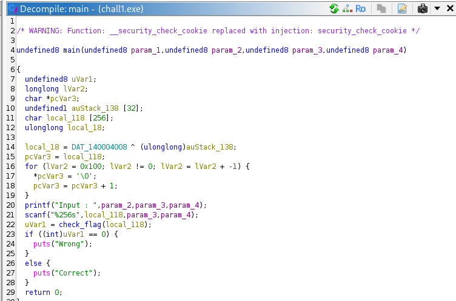
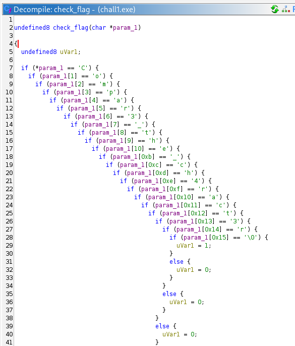
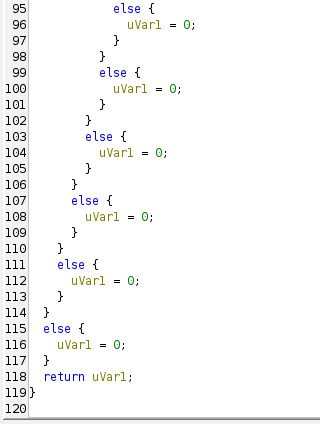

# [Dreamhack] Rev-Basic-1 - Reversing

## 1. 문제 개요

* **문제 링크:** [Dreamhack - rev-basic-1](https://dreamhack.io/wargame/challenges/15)

* **분야:** Reversing

* **목표:** Windows PE 바이너리를 역공학하여 정답 문자열(플래그) 검증 로직 파악 및 플래그 획득.

## 2. 취약점 분석
제공된 PE 바이너리(`chall1.exe`)를 Ghidra로 디컴파일하여 분석한 결과, 하드코딩된 정답 문자와 사용자의 입력값을 한 글자씩 인덱스별로 단순 비교하는 로직 확인.

```c
// [!] 보안 결함: 정답 플래그 문자열 평문 하드코딩 및 인덱스별 단항 비교
if (*param_1 == 'C') {
    if (param_1[1] == 'o') {
        if (param_1[2] == 'm') {
            // ... (중략: 한 글자씩 순차 검증) ...
            if (param_1[0x14] == 'r') {
                if (param_1[0x15] == '\0') {
                    uVar1 = 1;
                }
            }
        }
    }
}
```

* **분석 결론:** 사용자의 입력값을 검증하는 과정에서 암호화나 해시 과정 없이 하드코딩된 정답 문자열과 평문으로 직접 비교하므로, 단순 디컴파일만으로 정답 문자열 탈취가 가능한 구조.

## 3. 공격 수행

### 3.1. 주요 함수 식별 및 메인 로직 분석

**📌 주요 함수 식별 요약**
> 효율적인 코드 분석을 위해 기드라가 자동 생성한 임의의 함수명들을 로직 파악 후 아래와 같이 이름을 변경하여 분석 진행.

| 원래 이름 | 변경된 이름 | 식별 근거 |
| :--- | :--- | :--- |
| `FUN_140001350` | **`main`** | 프로그램 시작 시 주요 로직을 수행하는 실제 메인 루프. |
| `FUN_1400013e0` | **`printf`** | `"Input : "` 문자열을 인자로 받아 터미널에 출력하는 로직 식별. |
| `FUN_140001440` | **`scanf`** | `%256s` 포맷 스트링과 입력 버퍼를 통해 문자열을 입력받는 역할 확인. |
| `FUN_140001000` | **`check_flag`** | 입력값을 하드코딩된 정답 문자와 한 글자씩 비교하는 핵심 채점 로직. |

1. Ghidra를 통해 바이너리를 디컴파일하고 `main` 함수 내부에서 `printf` 및 `scanf`를 통한 문자열 입력 처리 흐름 파악.



2. 사용자의 입력 버퍼(`local_118`)를 인자로 받아 플래그 정답 여부를 판별하는 `check_flag` 내부의 핵심 채점 로직 확인.





3. 내부 로직 확인 결과, 입력된 문자열을 인덱스 `0`부터 `0x14`(20)까지 한 글자씩 하드코딩된 문자와 중첩 조건문으로 비교하여, 모두 일치할 때 `uVar1 = 1`을 반환하고 정답(`Correct`)으로 분기함을 파악.

## 4. 획득 결과
소스코드 분석을 통해 도출한 정답 문자열을 조합하여 드림핵 플래그 포맷(`DH{}`)에 맞추어 플래그 인증 완료.

* **FLAG:** `DH{Compar3_the_ch4ract3r}`

## 5. 대응 방안
리버싱을 통한 중요 로직 및 데이터 탈취를 방지하기 위해 프로그램에 대한 보안 조치 적용.

* **데이터 암호화 및 해싱:** 플래그 정답과 같은 중요 데이터를 소스코드 내부에 평문으로 하드코딩하지 않고, 단방향 해시 알고리즘을 사용하여 저장 및 검증.

* **바이너리 난독화 적용:** 문자열 난독화 및 코드 난독화 기법을 적용하여 디컴파일러를 통한 정적 분석 시 가독성 저하.