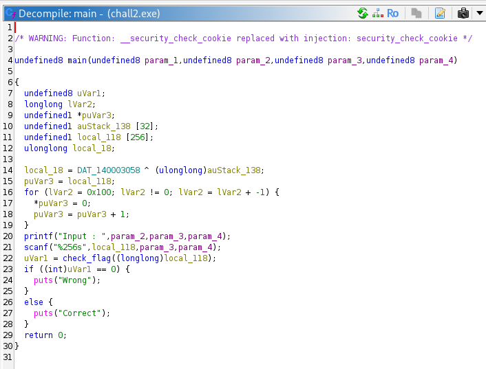
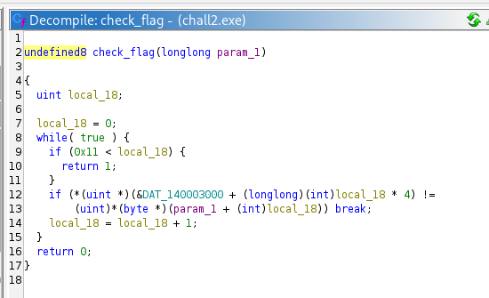
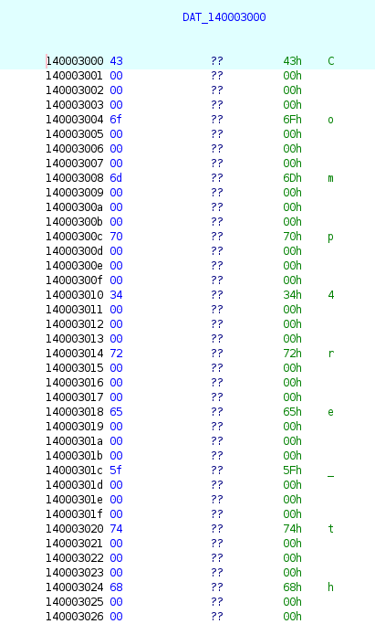
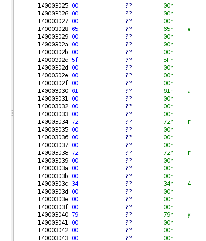

# [Dreamhack] Rev-Basic-2 - Reversing

## 1. 문제 개요

* **문제 링크:** [Dreamhack - rev-basic-2](https://dreamhack.io/wargame/challenges/16)

* **분야:** Reversing

* **목표:** Windows PE 바이너리를 역공학하여 정답 문자열(플래그) 검증 로직 파악 및 플래그 획득.

## 2. 취약점 분석
제공된 PE 바이너리(`chall2.exe`)를 Ghidra로 디컴파일하여 분석한 결과, 하드코딩된 정답 데이터 배열과 사용자의 입력값을 1바이트씩 비교하는 로직 확인. 정답 데이터가 4바이트(`int`) 간격으로 배열되어 있어 포인터 연산을 통해 주소를 4칸씩 건너뛰며 평문 문자를 1:1로 대조하는 구조.

```c
// [!] 보안 결함: 정답 플래그 평문 하드코딩 및 포인터 연산을 통한 1:1 비교
if (*(uint *)(&DAT_140003000 + (longlong)(int)local_18 * 4) !=
    (uint)*(byte *)(param_1 + (int)local_18)) break;
```

* **분석 결론:** 사용자의 입력값을 검증하는 과정에서 암호화나 해시 과정 없이 하드코딩된 정답 배열과 평문으로 직접 비교하므로, 단순 디컴파일 및 메모리 분석만으로 정답 문자열 탈취가 가능한 구조.


## 3. 공격 수행

### 3.1. 주요 함수 식별 및 메인 로직 분석

**📌 주요 함수 식별 요약**
> 효율적인 코드 분석을 위해 기드라가 자동 생성한 임의의 함수명들을 로직 파악 후 아래와 같이 이름을 변경하여 분석 진행.

| 원래 이름 | 변경된 이름 | 식별 근거 |
| :--- | :--- | :--- |
| `FUN_140001120` | `main` | 프로그램 시작 시 주요 로직을 수행하며 입력 버퍼를 할당하는 실제 메인 루프. |
| `FUN_140001000` | `check_flag` | 입력값을 하드코딩된 정답 문자열과 한 글자씩 비교하는 핵심 채점 로직. |

1. Ghidra를 통해 바이너리를 디컴파일하고 `main` 함수 내부에서 `printf` 및 `scanf`를 통한 문자열 입력 처리 흐름 파악.



2. 사용자의 입력 버퍼(`local_118`)를 인자로 받아 플래그 정답 여부를 판별하는 `check_flag` 내부의 핵심 채점 로직 확인. 사용자의 입력값(`param_1`)은 1바이트 단위(`byte *`)로 읽고, 하드코딩된 정답 배열(`DAT_140003000`)은 4바이트(`int`) 간격으로 읽어와 비교하는 1:1 매칭 구조 파악.



3. 비교 대상이 되는 기준 메모리 주소 `DAT_140003000`로 이동하여 저장된 하드코딩 데이터를 확인. 메모리상에 4바이트 간격(리틀 엔디언 방식)으로 유의미한 아스키코드(ASCII) 문자 데이터가 저장되어 있음을 확인하고, 연속된 메모리 주소(`DAT_140003025` 이후)를 추적하여 총 18자리의 문자열 데이터 추출 진행.






## 4. 획득 결과
메모리 뷰에서 4바이트 간격으로 추출한 문자들을 순서대로 조합하여(`C`, `o`, `m`, `p`, `4`, `r`, `e`, `_`, `t`, `h`, `e`, `_`, `a`, `r`, `r`, `4`, `y`) 드림핵 플래그 포맷(`DH{}`)에 맞추어 플래그 인증 완료.

* **FLAG:** `DH{Comp4re_the_arr4y}`


## 5. 대응 방안
리버싱을 통한 중요 로직 및 데이터 탈취를 방지하기 위해 프로그램에 대한 보안 조치 적용.

* **데이터 암호화 및 해싱:** 플래그 정답과 같은 중요 데이터를 소스코드 내부에 평문으로 하드코딩하지 않고, 단방향 해시 알고리즘을 사용하여 저장 및 검증.

* **바이너리 난독화 적용:** 문자열 난독화 및 코드 난독화 기법을 적용하여 디컴파일러를 통한 정적 분석 시 가독성 저하.