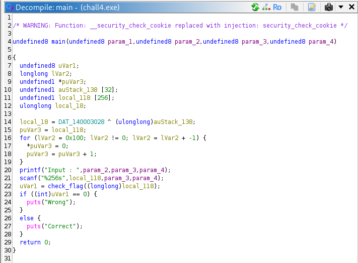
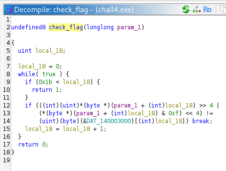
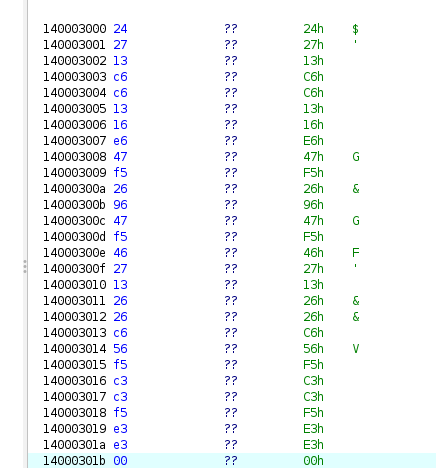
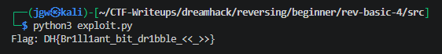

# [Dreamhack] Rev-Basic-4 - Reversing

## 1. 문제 개요

* **문제 링크:** [Dreamhack - rev-basic-4](https://dreamhack.io/wargame/challenges/18)

* **분야:** Reversing

* **목표:** Windows PE 바이너리를 역공학하여 정답 문자열(플래그) 검증 로직 파악 및 플래그 획득.

## 2. 취약점 분석
제공된 PE 바이너리(`chall4.exe`)를 Ghidra로 디컴파일하여 분석한 결과, 사용자의 입력값을 1바이트씩 상위 4비트와 하위 4비트를 스왑(Nibble Swap)하는 비트 연산을 거친 후 하드코딩된 정답 데이터 배열과 비교하는 로직 파악.

```c
// [!] 보안 결함: 단순 비트 스왑 연산 검증 및 데이터 하드코딩
if (((int)(uint)*(byte *)(param_1 + (int)local_18) >> 4 |
    (*(byte *)(param_1 + (int)local_18) & 0xf) << 4) !=
    (uint)(byte)(&DAT_140003000)[(int)local_18]) break;
```

* **분석 결론:** 사용자의 입력값을 검증하는 과정에서 단방향 암호화가 아닌 단순한 비트 시프트 및 논리 연산(Nibble Swap)을 수행하므로, 하드코딩된 데이터에서 동일한 역연산(4비트 스왑)을 수행하면 원래의 평문 플래그 문자열 도출이 가능한 구조.

## 3. 공격 수행

### 3.1. 주요 함수 식별 및 메인 로직 분석
효율적인 코드 분석을 위해 기드라가 자동 생성한 임의의 함수명을 로직 파악 후 아래와 같이 이름을 변경하여 분석 진행.

| 원래 이름 | 변경된 이름 | 식별 근거 |
| --- | --- | --- |
| `FUN_140001000` | `check_flag` | 입력값을 하드코딩된 문자열과 특정 연산을 통해 비교하는 핵심 채점 로직. |

### 3.2. 상세 분석 및 플래그 도출

1. Ghidra를 통해 바이너리를 디컴파일하고 `main` 함수 내부에서 `printf` 및 `scanf`를 통한 문자열 입력 처리 흐름 파악.



2. 사용자의 입력 버퍼를 인자로 받아 플래그 정답 여부를 판별하는 `check_flag` 내부의 핵심 채점 로직 확인. 사용자의 입력값(`param_1`)의 각 문자 인덱스(`local_18`)를 기준으로 1바이트씩 읽어 상위 4비트는 오른쪽으로 시프트(`>> 4`), 하위 4비트는 왼쪽으로 시프트(`<< 4`)한 뒤 OR(`|`) 연산하여 상/하위 비트를 스왑(Nibble Swap)한 결과가 하드코딩된 배열(`DAT_140003000`)의 값과 1바이트 단위로 일치하는지 비교하는 구조 파악.



3. 비교 대상이 되는 기준 메모리 주소 `DAT_140003000`로 이동하여 저장된 하드코딩 데이터를 확인. 메모리상에 1바이트 간격으로 16진수 데이터가 연속으로 저장되어 있음을 확인하고, 연산의 기준이 되는 타겟 데이터 추출.



4. 코드 분석을 통해 도출한 검증 식 `(Input[i] >> 4) | ((Input[i] & 0xF) << 4) == Target[i]`을 확인. 해당 비트 스왑 연산은 자기 자신을 대칭적으로 변환하므로, 동일한 식을 타겟 데이터에 적용하면 역연산이 성립됨을 파악. 추출한 메모리 데이터 값들의 상위/하위 4비트를 스왑하여 한 글자씩 평문 복원 진행.

## 4. 획득 결과

메모리 뷰에서 추출한 데이터 값들에 니블 스왑(Nibble Swap) 역연산을 적용해야 함. 데이터 복호화를 자동화하기 위해 파이썬 스크립트(`exploit.py`)를 작성하여 추출 과정을 진행.

```python
# exploit.py
hex_data = "24 27 13 c6 c6 13 16 e6 47 f5 26 96 47 f5 46 27 13 26 26 c6 56 f5 c3 c3 f5 e3 e3 00"

# 공백 제거 후 바이트 객체로 변환
target_bytes = bytes.fromhex(hex_data.replace(" ", ""))

flag = ""
for b in target_bytes:
    # 니블 스왑(Nibble Swap) 역연산
    swapped = ((b >> 4) | (b << 4)) & 0xFF
    flag += chr(swapped) # 아스키코드(숫자)를 문자로 변환

print(f"Flag: DH{{{flag}}}")
```

작성한 스크립트를 실행한 결과, 드림핵 플래그 포맷(`DH{}`)에 맞추어 복원된 평문 플래그를 성공적으로 획득함.



* **FLAG:** `DH{Br1ll1ant_bit_dr1bble_<<_>>}`

## 5. 대응 방안
리버싱을 통한 중요 로직 및 데이터 탈취를 방지하기 위해 프로그램에 대한 보안 조치 적용.

* **데이터 암호화 및 해싱:** 플래그 정답과 같은 중요 데이터를 소스코드 내부에 단순 비트 연산 형태로 하드코딩하지 않고, SHA-256과 같은 단방향 해시 알고리즘을 사용하여 저장 및 검증.

* **바이너리 난독화 적용:** 문자열 난독화 및 코드 난독화 기법을 적용하여 디컴파일러를 통한 정적 분석 시 가독성 저하 유도.