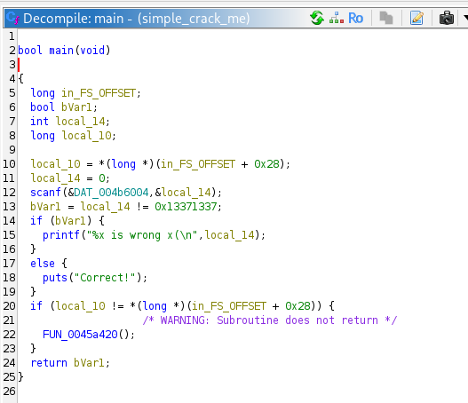
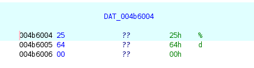
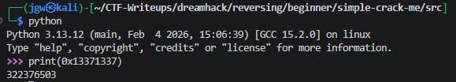

# [Dreamhack] Simple Crack Me - Reversing

## 1. 문제 개요

* **문제 링크:** [Dreamhack - Simple Crack Me](https://dreamhack.io/wargame/challenges/667)

* **분야:** Reversing

* **목표:** 프로그램의 입력값 검증 로직을 분석하여 'Correct!'를 출력하게 만드는 올바른 10진수 입력값 도출.

## 2. 취약점 분석
제공된 리눅스 ELF 바이너리(`simple_crack_me`)를 Ghidra로 디컴파일하여 분석한 결과, 사용자의 입력값을 특정 16진수 하드코딩 데이터와 평문으로 직접 비교하는 검증 로직 파악.

```c
// ... (중략) ...
  scanf(&DAT_004b6004, &local_14); // DAT_004b6004 데이터 영역 확인 결과 "%d"

  // [!] 보안 결함: 사용자의 입력값을 하드코딩된 평문(0x13371337)과 단순 비교
  bVar1 = local_14 != 0x13371337;
  if (bVar1) {
    printf("%x is wrong x(\n", local_14);
  }
  else {
    puts("Correct!");
  }
// ... (중략) ...
```

* **분석 결론:** 사용자의 입력값을 `scanf`를 통해 10진수 정수로 받은 후, 내부적으로 `0x13371337`과 비교. 별도의 복잡한 연산이나 암호화 과정 없이 단순 비교를 수행하므로, 해당 타겟 16진수 값을 10진수로 변환하여 입력하면 검증 로직 우회 가능.

## 3. 공격 수행

1. Ghidra를 통해 `entry` 함수에서 실제 `main` 함수 로직 파악 및 내부 주요 함수명(`scanf`, `printf`, `puts` 등) 가독성 개선.



2. 입력값을 받는 `scanf` 함수의 포맷 스트링 인자(`DAT_004b6004`) 메모리를 확인하여, 프로그램이 10진수 정수(`%d`) 형태의 입력을 대기하고 있음을 파악.



3. 분기문 검사 로직에서 입력 변수(`local_14`)와 하드코딩된 값 `0x13371337`을 비교함을 확인. 조건이 거짓(`==`)이어야 `puts("Correct!")`가 실행되므로 정답 목표값을 `0x13371337`로 특정.

4. 파이썬을 활용하여 타겟 16진수 값(`0x13371337`)을 요구사항에 맞는 10진수 값으로 변환(`322376503`)하여 최종 정답 도출.



## 4. 획득 결과
도출된 10진수 값을 프로그램에 입력하여 검증 로직 통과 및 'Correct!' 출력 확인.

* **FLAG:** `DH{322376503}`

## 5. 대응 방안
프로그램 검증 로직의 주요 타겟 데이터 노출을 방지하기 위해 프로그램에 대한 보안 조치 적용.

* **안전한 해시 알고리즘 적용:** 검증 로직에 평문 비교 대신, 역추적이 불가능한 SHA-256과 같은 단방향 해시 알고리즘을 사용하여 입력값 검증.

* **데이터 난독화 및 패킹 적용:** 하드코딩된 비교 값(`0x13371337`)을 쉽게 식별하지 못하도록 데이터 난독화 기법을 적용하거나 실행 압축을 통해 정적 분석 난이도 상승 유도.

## 6. 블루팀 관점 요약

### 6.1. 탐지 및 분석 한계
* **네트워크 행위 없음:** 외부 C2 통신이 없는 단독 실행형 파일이므로 네트워크 장비(IPS/WAF)로는 탐지 불가능.

* **대응 방향:** EDR이나 백신 등 엔드포인트(호스트) 단에서 내부 시그니처를 기반으로 탐지해야 함.

### 6.2. YARA 탐지 룰 (IoC)
* 분석으로 확보한 고유 바이트 배열 및 문자열을 활용한 탐지 룰:

```yara
rule Detect_Simple_CrackMe {
    strings:
        $hex_pattern = { 37 13 37 13 }
        $success_str = "Correct!"
    condition:
        any of them
}
```