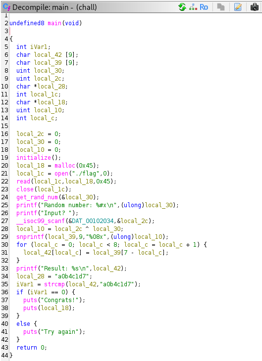
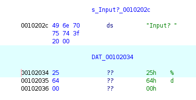
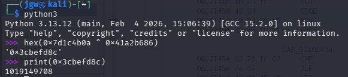
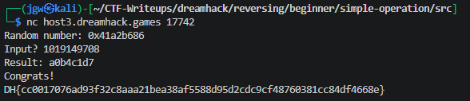

# [Dreamhack] Simple Operation - Reversing

## 1. 문제 개요

* **문제 링크:** [Dreamhack - simple-operation](https://dreamhack.io/wargame/challenges/836)

* **분야:** Reversing

* **목표:** 프로그램의 난수 생성 및 XOR 연산, 문자열 리버싱 로직을 역산하여 검증을 우회하고 메모리에 적재된 플래그 획득.

## 2. 취약점 분석
제공된 ELF 바이너리(`chall`)를 Ghidra로 디컴파일하여 분석한 결과, 사용자 입력값과 생성된 난수의 XOR 연산 결과를 16진수 문자열로 변환 후, 이를 뒤집어 하드코딩된 문자열과 비교하는 검증 로직 파악.

```c
  // [!] 보안 결함: 난수 노출, 단순 XOR 연산 및 비교 데이터 하드코딩
  get_rand_num(&local_30);
  printf("Random number: %#x\n", (ulong)local_30);
  printf("Input? ");
  __isoc99_scanf(&DAT_00102034, &local_2c);
  local_10 = local_2c ^ local_30;
  snprintf(local_39, 9, "%08x", (ulong)local_10);
  for (local_c = 0; local_c < 8; local_c = local_c + 1) {
    local_42[local_c] = local_39[7 - local_c];
  }
  // ...
  iVar1 = strcmp(local_42, "a0b4c1d7");
```

* **분석 결론:** 사용자의 입력값을 검증하는 과정에서 단방향 암호화가 아닌 단순 연산과 문자열 뒤집기가 사용됨. 비교 대상 데이터(`"a0b4c1d7"`)와 XOR 키(난수)가 모두 노출되므로, 역연산을 수행하면 원래의 정답 도출이 가능한 구조.

## 3. 공격 수행

### 3.1. 상세 분석 및 플래그 도출

1. Ghidra를 통해 `main` 함수 내부의 전반적인 검증 로직 파악.



2. 난수 출력 후 사용자 입력을 받는 `scanf` 함수의 포맷 스트링 확인. 데이터 영역(`DAT_00102034`) 확인 결과, 16진수(`%x`)가 아닌 10진수 정수(`%d`) 형태로 입력을 대기함 파악.



3. 최종 검증 문자열인 `"a0b4c1d7"`을 거꾸로 뒤집어 목표 연산값(`0x7d1c4b0a`) 도출. 이후 `입력값 ^ 난수 = 목표값` 공식을 `입력값 = 난수 ^ 목표값`으로 치환하여 역연산 공식 수립.

4. 원격 서버 접속 시 제공되는 난수(`0x41a2b686`)와 목표 연산값(`0x7d1c4b0a`)을 XOR 연산하여 정답 도출. 최초에는 입력 포맷이 `%x`일 것으로 오인하여 `hex()` 연산을 거쳤으나, 실제 포맷이 `%d`임을 확인하고 최종 정답을 10진수(`1019149708`)로 변환함.



5. 도출된 10진수 정답을 원격 서버(nc)에 전송하여 검증 로직 통과 및 메모리에 숨겨진 플래그 출력 확인.



## 4. 획득 결과
메모리 뷰와 역연산 공식을 활용하여 조합한 값을 10진수로 입력한 결과, 프로그램의 검증 로직 우회 및 플래그 인증 완료.

* **FLAG:** `DH{cc0017076ad93f32c8aaa21bea38af5588d95d2cdc9cf48760381cc84df4668e}`

## 5. 대응 방안
프로그램 검증 로직의 역추적 및 내부 데이터 탈취를 방지하기 위해 프로그램에 대한 보안 조치 적용.

* **안전한 해시 알고리즘 적용:** 검증 로직에 단순 XOR 연산 대신 역추적이 불가능한 SHA-256과 같은 단방향 해시 알고리즘을 사용하여 입력값 검증.

* **플래그 로드 시점 변경:** 프로그램 실행 초기에 미리 파일 내용을 메모리에 읽어두면 메모리 덤프에 취약하므로, 정답 검증이 완벽히 통과된 직후에만 플래그 파일을 열어서 출력하도록 로직 개선.

* **바이너리 난독화 적용:** 하드코딩된 문자열(`"a0b4c1d7"`)을 쉽게 식별하지 못하도록 문자열 난독화 및 코드 난독화 기법을 적용하여 정적 분석 난이도 상승 유도.