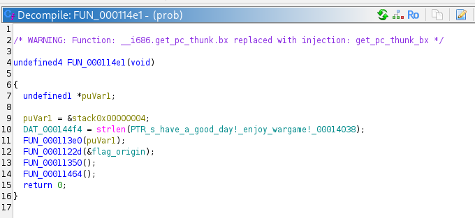
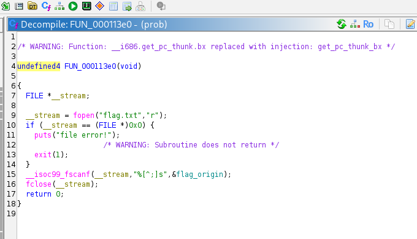
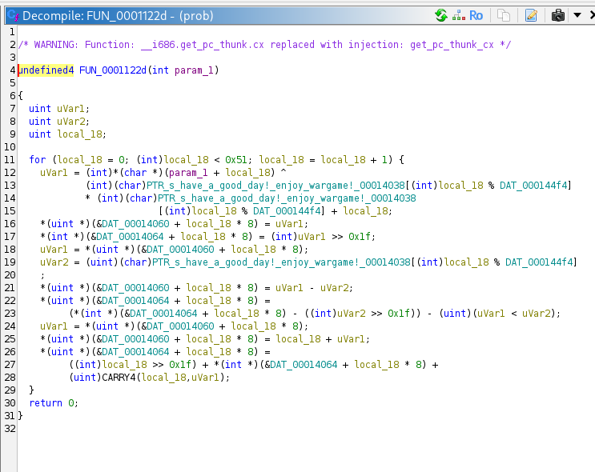
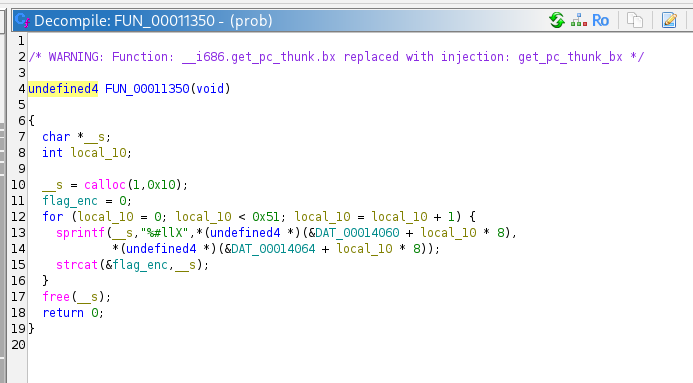
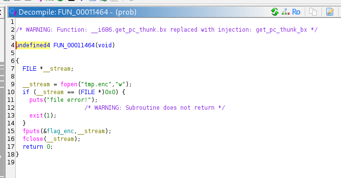
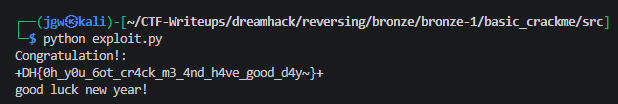

# [DreamHack] Basic_CrackMe - Reversing

## 1. 문제 개요

* **문제 링크:** [DreamHack - basic_CrackMe](https://dreamhack.io/wargame/challenges/869)

* **분야:** Reversing

* **목표:** 바이너리의 파일 읽기, 암호화 수식, 헥스 문자열 포맷팅, 파일 쓰기 흐름을 파악하고, SMT Solver(Z3)를 활용해 `flag.enc` 파일의 데이터를 역산하여 원본 플래그 도출.

## 2. 취약점 분석
제공된 ELF 바이너리 파일(`prob`)을 디컴파일하여 분석한 결과, 파일에서 문자열을 읽고 하드코딩된 키와 인덱스를 활용하여 XOR 및 사칙연산을 수행하는 커스텀 암호화 로직 파악.

```c
// [파일 읽기 함수] flag.txt를 열어 입력값을 버퍼(flag_origin)에 저장하는 로직
// ... (중략) ...
__stream = fopen("flag.txt","r");
if (__stream == (FILE *)0x0) {
  puts("file error!");
  exit(1);
}
__isoc99_fscanf(__stream,"%[^;]s",&flag_origin);
fclose(__stream);
// ... (중략) ...
```

```c
// [암호화 함수] 문자열 인덱스와 하드코딩된 키를 이용한 XOR 및 사칙연산 기반 암호화 로직
// ... (중략) ...
for (local_18 = 0; (int)local_18 < 0x51; local_18 = local_18 + 1) {
  uVar1 = (int)*(char *)(param_1 + local_18) ^
          (int)(char)PTR_s_have_a_good_day!_enjoy_wargame!_00014038[(int)local_18 % DAT_000144f4]
          * (int)(char)PTR_s_have_a_good_day!_enjoy_wargame!_00014038
            [(int)local_18 % DAT_000144f4] + local_18;
  *(uint *)(&DAT_00014060 + local_18 * 8) = uVar1;
  *(int *)(&DAT_00014064 + local_18 * 8) = (int)uVar1 >> 0x1f;
// ... (중략) ...
```

```c
// [포맷팅 및 문자열 결합 함수] 암호화된 64비트 정수를 16진수 문자열로 변환하여 이어붙이는 로직
// ... (중략) ...
__s = calloc(1,0x10);
flag_enc = 0;
for (local_10 = 0; local_10 < 0x51; local_10 = local_10 + 1) {
  sprintf(__s,"%#llX",*(undefined4 *)(&DAT_00014060 + local_10 * 8),
          *(undefined4 *)(&DAT_00014064 + local_10 * 8));
  strcat(&flag_enc,__s);
}
free(__s);
// ... (중략) ...
```

* **분석 결론:** 해당 프로그램은 표준 암호화 해시를 사용하지 않고, 1:1 역산이 가능한 XOR 연산과 사칙연산만으로 암호화를 수행함. 특히 `%#llX`(64비트 출력) 포맷 스트링에 두 개의 32비트 포인터(`...60`, `...64`)가 인자로 전달되는 것을 볼 수 있는데, 이는 32비트 프로그램에서 64비트 정수를 처리하기 위해 리틀 엔디안 방식에 따라 하위 32비트와 상위 32비트를 나누어 스택에 푸시한 결과임. 이렇게 변환된 결과물은 `0X` 접두사가 포함되므로, 이를 구분자로 활용하면 데이터 분할이 명확해져 Z3 Solver를 통한 역산이 용이함.

## 3. 공격 수행

1. 주어진 바이너리를 디컴파일하여 `main` 역할을 하는 함수 내부에서 `파일 읽기` -> `암호화` -> `헥스 문자열 변환` -> `파일 쓰기` 로 이어지는 전체적인 실행 흐름 파악.





2. 메인 암호화 함수(`FUN_0001122d`)를 분석하여, 입력값의 각 문자가 하드코딩된 키(`have a good day! enjoy wargame!`)와 인덱스 연산식을 거쳐 어떻게 64비트 정수로 변환되는지 수식 규칙 도출.



3. 헥스 문자열 변환 함수(`FUN_00011350`) 분석 결과, `%#llX` 옵션 사용으로 인해 각 암호화 값이 `0X`로 시작함을 확인. 이로 인해 뭉개진 긴 암호문 문자열을 쉽게 토큰 단위로 분할할 수 있는 힌트 획득.



4. 변환이 완료된 암호문 전체가 최종적으로 파일 쓰기 함수(`FUN_00011464`)를 통해 `tmp.enc` 파일에 저장됨을 확인. 우리가 가진 `flag.enc`가 이 과정을 거쳐 생성되었음을 인지.



5. 도출된 C언어 수식과 동일하게 64비트 확장을 모방하고, `0X`를 기준으로 분할하여 1:1 매칭 제약 조건을 부여하는 Z3 파이썬 스크립트 작성 및 실행을 통해 최종 원본 플래그 복원 완료.

> **Note:** 디컴파일 코드는 하위/상위 32비트를 나눠 연산 후 borrow·carry를 수동 보정하지만, 이는 64비트 뺄셈·덧셈을 저수준으로 흉내낸 것과 수학적으로 동일함. 따라서 Z3에서는 `SignExt(32, v1_32)`로 64비트 BitVec을 만들어 한 번에 연산하면 동일한 결과를 훨씬 간결하게 얻을 수 있음.

```python
from z3 import *

def solve_flag():
    with open("flag.enc", "r") as f:
        enc_str = f.read()

    hex_tokens = [token for token in enc_str.split("0X") if token]
    
    key = b"have a good day! enjoy wargame!"
    key_len = len(key)
    flag = ""

    for i, token in enumerate(hex_tokens):
        target_val = int(token, 16)
        k = key[i % key_len]

        s = Solver()

        x = BitVec('x', 32)

        v1_32 = x ^ ((k * k) + i)
        v1_64 = SignExt(32, v1_32)
        v3_64 = v1_64 - k + i

        s.add(v3_64 == target_val)

        if s.check() == sat:
            m = s.model()
            flag += chr(m[x].as_long())

    print(flag)

if __name__ == "__main__":
    solve_flag()
```



## 4. 획득 결과

* **FLAG:** `DH{0h_y0u_6ot_cr4ck_m3_4nd_h4ve_good_d4y~}`

## 5. 대응 방안
해당 프로그램은 단순 가역 연산을 조합하여 검증 로직을 구현하였고, 암호화 키와 로직이 바이너리에 평문으로 노출된 상태. 시큐어 코딩 및 소프트웨어 보호 관점에서 다음과 같은 개선 방안 적용 필요.

* **단방향 암호화(Hash) 적용:** 플래그나 패스워드 등 민감한 검증 데이터를 다룰 때는 복호화가 불가능한 SHA-256, bcrypt 등의 단방향 해시 알고리즘을 적용하여 평문 역산 원천 차단.

* **프로그램 난독화 및 안티 디버깅:** 현재 함수 호출 순서 및 내부 사칙연산 로직이 디컴파일러를 통해 쉽게 노출됨. 제어 흐름 평탄화(Control Flow Flattening) 및 연산 난독화를 도입하여 정적 분석 난이도 상승 유도.

* **중요 문자열 하드코딩 제거:** 암호화 키로 사용된 `"have a good day! enjoy wargame!"` 문자열이 Data 영역에 그대로 하드코딩 되어 분석의 치명적인 단서가 됨. 실행 중에만 키를 조합해 메모리에 잠시 적재하도록 동적 문자열 암호화 기법 적용.

## 6. 블루팀 관점 요약
해당 바이너리는 외부 네트워크(C2 서버 등) 통신 없이 로컬 환경 내에서 단독으로 파일(`flag.txt`)을 읽고 검증을 수행함. 따라서 방화벽이나 NIDS 등의 네트워크 통신 기반 탐지로는 분석 및 식별 불가.
대신 호스트 단(EDR, 백신)에서 정적 분석을 통해 식별된 프로그램 내 고유 하드코딩 문자열을 기반으로 시그니처(YARA) 룰을 작성하여 위협 헌팅 수행 필요. 향후 유사한 커스텀 암호화 패턴의 악성코드가 발견될 경우, 본 분석에서 도출된 Z3 Solver 역산 알고리즘을 분석 자동화(Decrypter) 도구로 편입하여 침해사고 대응(IR) 시 복호화 소요 시간 단축 가능.

### 6.1. YARA 탐지 룰 (IoC)
정적 분석 과정에서 확실하게 식별된 명시적인 하드코딩 텍스트 지표를 활용하여, 동일 계열의 프로그램을 식별하기 위한 YARA 탐지 룰 제안.

```yara
rule Detect_Basic_CrackMe {
    strings:
        // 프로그램 내 하드코딩된 주요 파일명 및 문자열 단서
        $str1 = "have a good day! enjoy wargame!" ascii wide
        $str2 = "flag.txt" ascii wide
        $str3 = "tmp.enc" ascii wide
        $str4 = "file error!" ascii wide

    condition:
        // 최소 3개 이상의 핵심 문자열이 발견될 경우 탐지
        3 of ($str*)
}
```