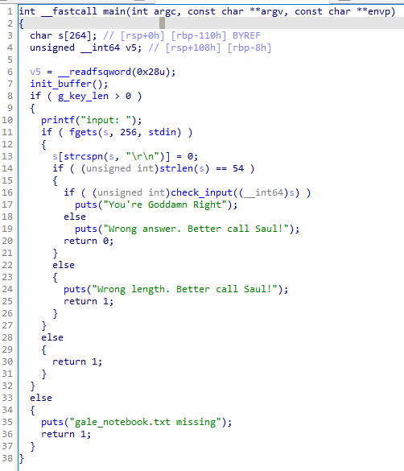
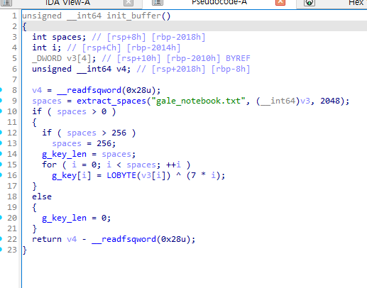
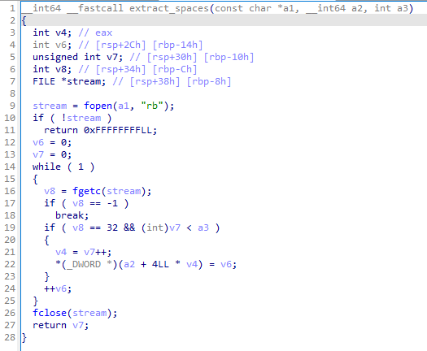
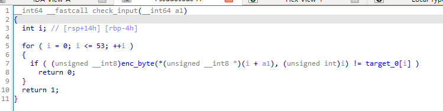
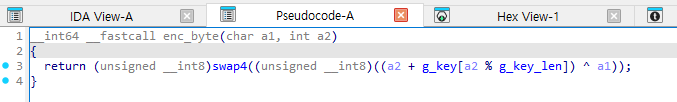
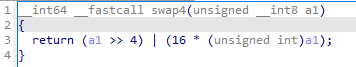
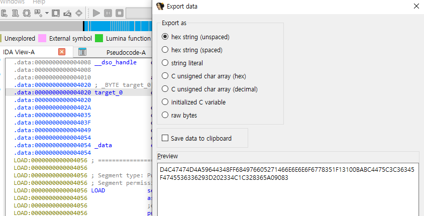
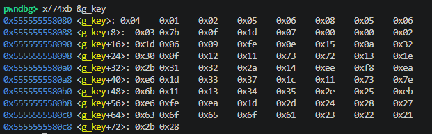
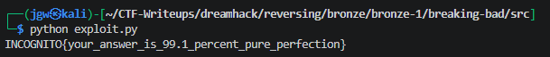

# [DreamHack] Breaking Bad - Reversing

## 1. 문제 개요

* **문제 링크:** [DreamHack - Breaking Bad](https://dreamhack.io/wargame/challenges/2701)

* **분야:** Reversing

* **목표:** 외부 텍스트 파일(`gale_notebook.txt`)에서 파생되는 키와 XOR·니블 스왑 연산으로 구성된 검증 로직을 파악하고, 하드코딩된 54바이트 비교 데이터를 기반으로 원본 입력값(플래그) 복원.

## 2. 취약점 분석

제공된 ELF 바이너리 파일(`breaking`)을 디컴파일하여 분석한 결과, 입력값 54바이트를 인덱스 기반 커스텀 암호화 후 `.data` 영역의 하드코딩 배열과 비교하는 구조 파악. 키 자체는 바이너리 내부에 없고, 동일 폴더의 시 텍스트 파일(`gale_notebook`)을 런타임에 읽어 파생되는 방식 확인.

```c
// [main 함수] 입력 길이 검증 및 check_input 호출부
// ... (중략) ...
init_buffer();
if ( g_key_len > 0 )
{
  fgets(s, 256, stdin);
  s[strcspn(s, "\r\n")] = 0;
  if ( strlen(s) == 54 )
  {
    if ( check_input(s) != 0 )
      puts("You're Goddamn Right");
    // ... (중략) ...
  }
}
```

```c
// [extract_spaces 함수] 파일 내 공백(0x20) 문자의 바이트 오프셋 기록
// ... (중략) ...
while ( 1 )
{
  v9 = fgetc(stream);
  if ( v9 == -1 ) break;
  if ( v9 == 32 && v8 < a3 )
  {
    *(_DWORD *)(a2 + 4LL * v8) = v7;   // v7: 현재까지 읽은 바이트 수(오프셋)
    ++v8;
  }
  ++v7;
}
```

```c
// [init_buffer / enc_byte / swap4] 오프셋 기반 키 생성 및 인코딩 함수
// ... (중략) ...
g_key[i] = LOBYTE(v3[i]) ^ (7 * i);
g_key_len = spaces;

enc_byte(a1, a2) = swap4( (unsigned __int8)((a2 + g_key[a2 % g_key_len]) ^ a1) );
swap4(x) = (x >> 4) | (16 * x);   // 니블 스왑
```

* **분석 결론:** 해당 프로그램은 별도의 암호 상수 없이, 외부 파일에서 "공백 문자의 위치값"을 뽑아 키로 사용하고, XOR·니블 스왑이라는 가역 연산만으로 검증 로직을 구현. swap4는 같은 연산을 두 번 적용하면 원래 값으로 돌아오는 함수라 정방향 수식만 파악하면 바로 역산 가능하나, 키 파생 함수가 **파일을 한 줄씩(텍스트)이 아니라 한 바이트씩(순수 바이트 스트림) 읽는다는 점**이 실질적인 함정으로 작용.

## 3. 공격 수행

1. `main` 함수 분석을 통해 입력 길이 54바이트 고정 조건과 `check_input` 호출 흐름 파악.



2. `init_buffer`와 `extract_spaces`를 분석하여, 키가 바이너리 내부 상수가 아닌 `gale_notebook.txt` 파일의 공백 위치 기반으로 런타임에 생성됨을 확인.





3. `check_input`과 `enc_byte`, `swap4`를 분석하여 바이트별 비교 로직(`enc_byte(input[i], i) == target_0[i]`)과 니블 스왑의 대합적 성질 확인.








4. `.data` 영역에서 54바이트 비교 대상 배열(`target_0`)을 직접 추출하고, gdb로 `g_key` 전역 배열의 런타임 값을 덤프하여 정적 계산값과 바이트 단위로 일치함을 검증.





5. 1차 계산 시 목표 문자열 시작 부분이 의미 있는 문자열(`INCOG`)로 도출되었으나 후반부가 비인쇄 문자로 깨지는 현상 발견. `gale_notebook.txt`가 파일 시스템 배포 과정에서 CRLF(`\r\n`)에서 LF(`\n`)로 변환되어, 바이트 단위로 오프셋을 세는 `extract_spaces` 특성상 공백 위치가 전부 어긋난 것이 원인으로 확인. 스크립트 내에서 줄바꿈을 CRLF로 통일하는 전처리를 추가한 뒤 재계산하여 완전한 ASCII 플래그 도출.

6. 도출한 연산 규칙을 정방향으로 재현하는 Z3 Solver 기반 파이썬 스크립트 작성 및 실행.

```python
from z3 import *

target = bytes.fromhex(
    "D4C47474D4A59644348FF684976605271466E6E6E6F6778351F13100BABC4475C3C36345F4745536336293D202334C1C328365A09083"
)

note = open("gale_notebook.txt", "rb").read()
note = note.replace(b"\r\n", b"\n").replace(b"\n", b"\r\n")  # LF -> CRLF 통일
pos = [i for i, b in enumerate(note) if b == 32]
# spaces = 32를 만난 횟수 len(pos)
spaces = len(pos)
if spaces > 256:
    spaces = 256

g_key = [0] * spaces
g_key_len = spaces
for i in range(len(pos)):
    g_key[i] = pos[i] ^ (7 * i)

def swap4(a1):
    return LShR(a1, 4) | (a1 << 4)

def enc_byte(a1, a2):
    return swap4((a2 + g_key[a2 % g_key_len]) ^ a1)

flag_bits = [BitVec(f"c{i}", 8) for i in range(54)]
s = Solver()

for i in range(54):
    s.add(enc_byte(flag_bits[i], i) == BitVecVal(target[i], 8))

if s.check() == sat:
    m = s.model()
    flag = bytes([m[c].as_long() for c in flag_bits])
    print(flag.decode())
```

7. 스크립트 구동 결과, 모든 수식 조건을 만족하는 원본 플래그 도출 완료.



## 4. 획득 결과

* **FLAG:** `INCOGNITO{your_answer_is_99.1_percent_pure_perfection}`

## 5. 대응 방안

해당 바이너리는 검증 키를 파일에서 파생시키는 과정에서 플랫폼 종속적인 줄바꿈 처리(CRLF/LF)에 대한 방어 코드가 없고, 가역 연산(XOR·니블 스왑)만으로 검증 로직을 구성하여 평문 역산이 용이. 시큐어 코딩 관점에서 다음과 같은 개선 방안 적용 필요.

* **줄바꿈 정규화 처리:** 외부 파일을 바이트 스트림으로 직접 파싱하기 전, `\r\n`을 `\n`으로 통일하는 전처리 단계를 추가하여 배포 환경(OS, 압축, 버전관리 도구)에 따른 파싱 결과 불일치 원천 차단.

* **단방향 해시 적용:** 최종 비교 대상 데이터를 평문 상수로 하드코딩하는 대신, SHA-256 등 복호화 불가능한 해시값으로 저장하여 정적 역산 자체를 무력화.

* **키 소스 무결성 검증:** 런타임에 외부 파일로부터 파생하는 키 값에 대해 별도의 체크섬(예: 파일 해시)을 검증하여, 파일 변조나 인코딩 손상 시 조기에 실행을 중단하도록 개선.

## 6. 블루팀 관점 요약

해당 바이너리는 외부 네트워크 통신 없이 로컬 환경에서 파일 입출력과 표준 입력만으로 동작하는 구조로, 방화벽·NIDS 등 네트워크 기반 탐지 장비로는 식별 불가. 호스트 단(EDR, 백신)에서 하드코딩된 문자열과 특정 파일 접근 패턴(`gale_notebook.txt` 오픈 시도)을 기반으로 한 위협 헌팅이 유효하며, 향후 유사한 "외부 파일 기반 키 파생 + 가역 연산" 계열 검증 프로그램 탐지 시 본 분석에서 도출한 Z3 역산 스크립트를 분석 자동화(Decrypter) 도구로 편입하여 침해사고 대응(IR) 소요 시간 단축 가능.

### 6.1. YARA 탐지 룰 (IoC)

정적 분석 과정에서 식별된 바이너리 내부 하드코딩 문자열과 ELF 매직 넘버를 조합하여, 동일 계열의 검증 프로그램을 식별하기 위한 YARA 룰 제안.

```yara
rule Detect_Breaking_Bad {
    strings:
        $str1 = "You're Goddamn Right" ascii
        $str2 = "Wrong answer. Better call Saul!" ascii
        $str3 = "Wrong length. Better call Saul!" ascii
        $str4 = "gale_notebook.txt" ascii
        $str5 = "input: " ascii

    condition:
        uint32(0) == 0x464C457F and
        all of ($str*)
}
```