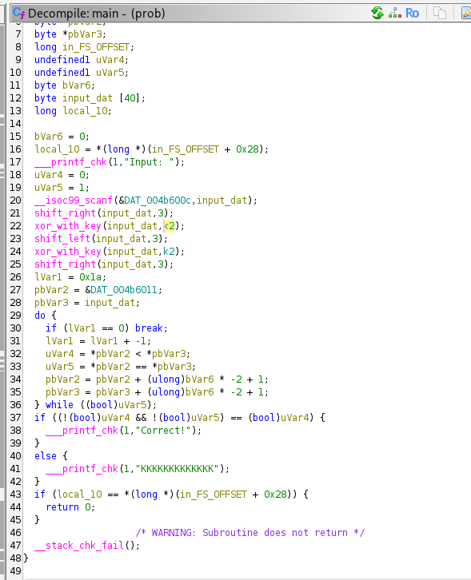
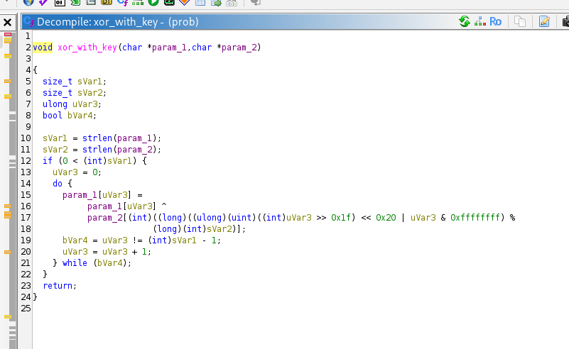
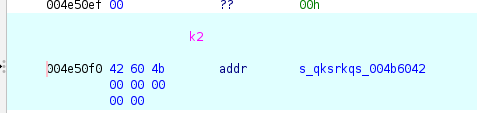
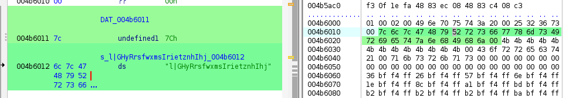
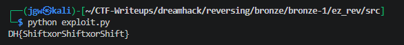

# [DreamHack] Ez_rev - Reversing

## 1. 문제 개요

* **문제 링크:** [DreamHack - ez_rev](https://dreamhack.io/wargame/challenges/1168)

* **분야:** Reversing

* **목표:** 제공된 바이너리의 다중 암호화(Shift, XOR) 흐름을 파악하고, Z3 Solver를 활용해 메모리에 하드코딩된 타겟 데이터를 바탕으로 원본 플래그 도출.

## 2. 취약점 분석
제공된 ELF 바이너리 파일(`prob`)을 디컴파일하여 분석한 결과, 입력된 문자열을 총 5단계에 걸쳐 커스텀 암호화(Shift, XOR 교차 수행)한 뒤 메모리의 특정 값과 비교하는 구조 파악.

```c
// [main 함수] 입력값 검증 및 5단계 커스텀 암호화 로직
// ... (중략) ...
__isoc99_scanf(&DAT_004b600c, input_dat);
shift_right(input_dat, 3);
xor_with_key(input_dat, k2);
shift_left(input_dat, 3);
xor_with_key(input_dat, k2);
shift_right(input_dat, 3);
// ... (중략) ...
```

```c
// [shift_right / shift_left 함수] 배열 인덱스 기반 문자열 회전 로직
// ... (중략) ...
do {
    while (cVar2 = param_1[lVar1], iVar3 < 2) {
        iVar5 = iVar5 + 1;
        *param_1 = cVar2;
        if (param_2 == iVar5) {
            return;
        }
    }
// ... (중략) ...
```

```c
// [xor_with_key 함수] 반복문을 이용한 XOR 연산 로직
// ... (중략) ...
do {
    param_1[uVar3] =
        param_1[uVar3] ^
        param_2[(int)((long)((ulong)(uint)((int)uVar3 >> 0x1f) << 0x20 | uVar3 & 0xffffffff) %
        (long)(int)sVar2)]; // 디컴파일러 노이즈 존재, 본질은 인덱스(%) 순환 접근
    bVar4 = uVar3 != (int)sVar1 - 1;
    uVar3 = uVar3 + 1;
} while (bVar4);
// ... (중략) ...
```

* **분석 결론:** 해당 프로그램은 표준 암호화 해시를 사용하지 않고, 정보 손실이 발생하지 않는 `Shift`와 `XOR` 연산만으로 검증 로직을 구현. 연산 과정이 명확히 노출되어 있으므로 SMT Solver(Z3)를 활용하여 순방향으로 수식을 누적시킨 후 최종 출력값과 비교하는 방식으로 쉽게 역산 복원 가능.

## 3. 공격 수행

1. 주어진 바이너리를 역어셈블러로 분석하여 `main` 함수의 전체적인 암호화 순서(`Right Shift` -> `XOR` -> `Left Shift` -> `XOR` -> `Right Shift`) 파악.



2. 서브 함수인 `xor_with_key`와 `shift` 계열 함수들의 동작 방식을 분석하여, 문자열 회전 및 길이 기반 키 반복(%) 연산 확인.



3. 메모리 덤프 분석을 통해 XOR 키로 사용되는 문자열(`"qksrkqs"`)과 최종 비교 대상인 25바이트의 하드코딩된 암호문 배열 추출.





4. 도출한 연산 규칙과 C언어 코드의 흐름을 동일하게 시뮬레이션하는 Z3 Solver 기반의 파이썬 스크립트 작성 및 실행.

```python
from z3 import *

target = [
    0x7c, 0x6c, 0x7c, 0x47, 0x48, 0x79, 0x52, 0x72, 
    0x73, 0x66, 0x77, 0x78, 0x6d, 0x73, 0x49, 0x72, 
    0x69, 0x65, 0x74, 0x7a, 0x6e, 0x68, 0x49, 0x68, 0x6a
]
key = b"qksrkqs"

flag = [BitVec(f'flag_{i}', 8) for i in range(25)]
s = Solver()

for i in range(25): 
    s.add(flag[i] >= 32, flag[i] <= 126) # ascii 범위 제한

state = flag[:]

state = state[-3:] + state[:-3]

state = [state[i] ^ key[i % len(key)] for i in range(25)]

state = state[3:] + state[:3]

state = [state[i] ^ key[i % len(key)] for i in range(25)]

state = state[-3:] + state[:-3]

for i in range(25):
    s.add(state[i] == target[i])

if s.check() == sat:
    model = s.model()
    result = "".join(chr(model[flag[i]].as_long()) for i in range(25))
    print(result)
else:
    print("x")
```

5. 스크립트 구동 결과, 모든 수식 조건을 만족하는 원본 플래그 도출 완료.



## 4. 획득 결과

* **FLAG:** `DH{ShiftxorShiftxorShift}`

## 5. 대응 방안
해당 바이너리는 입력 데이터를 검증하는 과정에서 보안성이 떨어지는 단순 가역 연산을 조합하여 구현하였고, 비교 대상 데이터와 키가 평문으로 노출된 상태. 시큐어 코딩 및 소프트웨어 보호 관점에서 다음과 같은 개선 방안 적용 필요.

* **단방향 암호화(Hash) 적용:** 패스워드나 플래그와 같은 중요 검증 데이터를 다룰 때는 복호화가 불가능한 SHA-256 등의 단방향 해시 알고리즘을 적용하여 평문 역산 원천 차단.

* **프로그램 난독화 및 안티 디버깅:** 현재 함수 호출 순서 및 내부 로직이 디컴파일러에 평문 C 코드로 명확히 노출. Control Flow Flattening 등의 난독화 기법을 도입하고, ptrace 기반의 디버거 탐지 로직을 추가하여 동적/정적 분석 난이도 상승 유도.

* **중요 문자열 하드코딩 제거:** "Correct!", "KKKKKKKKKKKK" 및 XOR 키 `"qksrkqs"` 등의 고유 문자열이 하드코딩되어 분석의 시작점이 됨. 실행 중에만 복호화되어 메모리에 적재되도록 동적 문자열 암호화 기법 적용.

## 6. 블루팀 관점 요약
해당 바이너리는 외부 네트워크(C2 서버 등)와의 통신 없이 로컬 환경 내에서 단독으로 입력값 검증을 수행함. 따라서 방화벽이나 NIDS 등의 네트워크 통신 기반 탐지로는 분석 및 식별 불가.
대신 호스트 단(EDR, 백신)에서 정적 분석을 통해 도출한 프로그램 내 고유 하드코딩 문자열을 기반으로 시그니처(YARA) 룰을 작성하여 위협 헌팅 수행 필요. 향후 유사한 커스텀 암호화 패턴이 발견될 경우, 본 분석에서 도출된 Z3 Solver 기반 연산 스크립트를 분석 자동화(Decrypter) 도구로 편입하여 침해사고 대응(IR) 소요 시간 단축 가능.

### 6.1. YARA 탐지 룰 (IoC)
정적 분석 과정에서 식별된 바이너리 내부의 명시적인 하드코딩 문자열 지표와 ELF 매직 넘버를 조합하여, 동일 계열의 검증 프로그램을 식별하기 위한 YARA 룰 제안.

```yara
rule Detect_EzRev {
    strings:
        // 프로그램 내 하드코딩된 주요 문자열 (성공/실패 메세지 및 암호화 키)
        $str1 = "Correct!" ascii
        $str2 = "KKKKKKKKKKKK" ascii
        $str3 = "qksrkqs" ascii
        $str4 = "Input: " ascii
        
    condition:
        // ELF 파일 매직 넘버 검증 및 식별 문자열 일치 조건
        uint32(0) == 0x464C457F and
        all of ($str*)
}
```