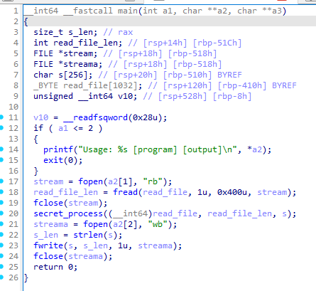
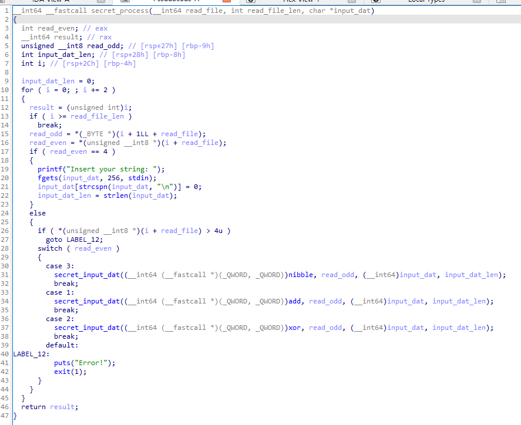
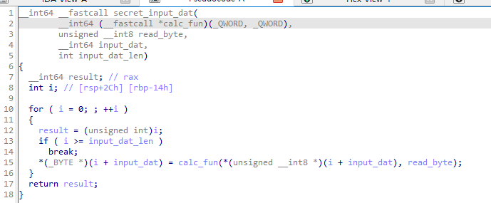
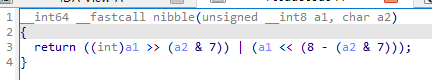
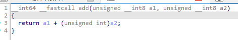
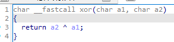
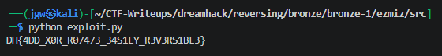

# [DreamHack] Ezmix - Reversing

## 1. 문제 개요

* **문제 링크:** [DreamHack - ezmix](https://dreamhack.io/wargame/challenges/1815)

* **분야:** Reversing

* **목표:** 제공된 소형 가상 머신(VM) 기반 바이너리의 구조를 파악하고, 명령어 파일(`program.bin`)에 정의된 단순 가역 연산 로직을 분석하여 Z3 Solver를 통해 출력 파일(`output.bin`)의 원본 플래그 복원.

## 2. 취약점 분석
제공된 ELF 바이너리 파일(`main`)을 디컴파일하여 분석한 결과, `program.bin` 파일의 데이터를 2바이트 단위의 Opcode와 Value로 해석하여 입력된 문자열을 암호화하는 커스텀 VM 구조의 취약점 파악.

```c
// [main 함수] 프로그램 초기화 및 명령어 파일(program.bin) 리딩 로직 발췌
// ... (중략) ...
  stream = fopen(a2[1], "rb");
  read_file_len = fread(read_file, 1u, 0x400u, stream);
  fclose(stream);
  secret_process((__int64)read_file, read_file_len, s);
  streama = fopen(a2[2], "wb");
  s_len = strlen(s);
  fwrite(s, s_len, 1u, streama);
// ... (중략) ...
```

```c
// [secret_process 함수] 2바이트 단위 Opcode 해석 및 분기 처리 로직 발췌
// ... (중략) ...
  for ( i = 0 ; ; i += 2 ) {
    // ... (중략) ...
    read_odd = *(_BYTE *)(i + 1LL + read_file);
    read_even = *(unsigned __int8 *)(i + read_file);
    if ( read_even == 4 ) {
      printf("Insert your string: ");
      fgets(input_dat, 256, stdin);
      // ... (중략) ...
    } else {
      if ( *(unsigned __int8 *)(i + read_file) > 4u ) goto LABEL_12;
      switch ( read_even ) {
        case 3:
          secret_input_dat((__int64 (__fastcall *)(_QWORD, _QWORD))nibble, read_odd, (__int64)input_dat, input_dat_len);
          break;
        case 1:
          secret_input_dat((__int64 (__fastcall *)(_QWORD, _QWORD))add, read_odd, (__int64)input_dat, input_dat_len);
          break;
        case 2:
          secret_input_dat((__int64 (__fastcall *)(_QWORD, _QWORD))xor, read_odd, (__int64)input_dat, input_dat_len);
          break;
// ... (중략) ...
```

```c
// [secret_input_dat 함수] 플래그 문자열 전체에 대한 일괄 연산 루프 발췌
// ... (중략) ...
  for ( i = 0; ; ++i ) {
    result = (unsigned int)i;
    if ( i >= input_dat_len )
      break;
    *(_BYTE *)(i + input_dat) = calc_fun(*(unsigned __int8 *)(i + input_dat), read_byte);
  }
  return result;
}
// ... (중략) ...
```

* **분석 결론:** 해당 프로그램은 표준 암호화 방식이 아닌 `Add`, `XOR`, `Nibble(Shift)` 등 단순 연산을 조합한 자체 가상 머신(VM)으로 동작. 연산 과정 중 데이터의 손실이 없는 가역 연산들로만 이루어져 있으므로, SMT Solver(Z3)를 활용하여 정방향으로 수식을 누적시킨 후 최종 출력값과 비교하는 방식으로 쉽게 역산 복원 가능.

## 3. 공격 수행

1. 주어진 바이너리를 IDA로 디컴파일하여 `main` 함수의 전체적인 파일 입출력(`program.bin` -> `output.bin`) 흐름 확인.



2. `secret_process` 함수 분석을 통해 `program.bin`의 데이터를 2바이트(`[Opcode, Value]`)씩 순차적으로 읽어들이며 `Switch-Case`문으로 분기하는 커스텀 VM 로직 파악. `Opcode 4`에서 플래그를 입력받음 확인.



3. `secret_input_dat` 함수 내부 루프를 분석하여, 특정 Opcode가 실행될 때마다 입력된 문자열(플래그) 배열 전체 인덱스에 대해 일괄적으로 동일한 수식(`calc_fun`)이 적용됨을 확인.



4. 각 연산을 수행하는 `nibble`(Opcode 3), `add`(Opcode 1), `xor`(Opcode 2) 서브 함수의 구체적인 비트 연산 및 사칙연산 수식 도출.







5. 앞서 도출한 연산 규칙과 C언어 코드의 흐름을 동일하게 시뮬레이션하는 Z3 Solver 기반의 파이썬 역연산 스크립트 작성 및 실행.

```python
from z3 import *

def solve_ezmix():
    with open('program.bin', 'rb') as f:
        prog_data = f.read()
        
    with open('output.bin', 'rb') as f:
        output_data = f.read()
        
    flag_len = len(output_data)  # 36바이트

    flag_vars = [BitVec(f'flag_{i}', 8) for i in range(flag_len)]
    
    state = flag_vars[:]

    for i in range(0, len(prog_data), 2):
        opcode = prog_data[i]
        val = prog_data[i+1]
        
        if opcode == 4:
            continue
            
        elif opcode == 1:
            # Add 연산
            for j in range(flag_len):
                state[j] = state[j] + val
                
        elif opcode == 2:
            # Xor 연산
            for j in range(flag_len):
                state[j] = state[j] ^ val
                
        elif opcode == 3:
            # Nibble 연산
            shift = val & 7
            for j in range(flag_len):
                state[j] = RotateRight(state[j], shift)

    s = Solver()
    
    for j in range(flag_len):
        s.add(state[j] == output_data[j])
    
    if s.check() == sat:
        m = s.model()
        
        flag = ''.join(chr(m[flag_vars[i]].as_long()) for i in range(flag_len))
        print(flag)
    else:
        print('wrong')

if __name__ == '__main__':
    solve_ezmix()
```

6. 스크립트 구동 결과, 수식 조건을 만족하는 원본 플래그 도출 완료.



## 4. 획득 결과

* **FLAG:** `DH{4DD_X0R_R07473_34S1LY_R3V3RS1BL3}`

## 5. 대응 방안
해당 프로그램은 입력 데이터를 암호화하는 과정에서 보안성이 검증되지 않은 단순 가역 연산 조합을 커스텀 VM 형태로 구현하여 리버싱 및 역산이 매우 쉬운 상태. 시큐어 코딩 및 소프트웨어 보호 관점에서 다음과 같은 개선 방안 적용 필요.

* **강력한 표준 암호화 알고리즘 도입:** 단순 `XOR`나 `Shift` 연산을 직접 구현하는 대신, AES 같은 산업 표준 대칭키 알고리즘을 사용하여 수학적 역산을 원천 차단.

* **프로그램 난독화 적용:** 가상 머신(VM) 기반 보호 기법 자체는 유효하나, 현재 Opcode 해석 및 분기 로직이 디컴파일러에 평문 코드로 명확히 노출. Control Flow Flattening 등의 난독화 기법을 도입하여 `switch-case` 구조 파악 난이도 상승 유도.

* **중요 문자열 암호화:** 사용자에게 입력을 유도하는 `"Insert your string: "` 등 주요 문자열이 하드코딩되어 있어 분석의 실마리를 제공하므로, 실행 중에 복호화하여 사용하는 동적 문자열 암호화 적용.

## 6. 블루팀 관점 요약
해당 바이너리는 외부 네트워크(C2 서버 등)와의 통신 없이 로컬 환경 내에서 단독으로 파일(`program.bin`, `output.bin`) 입출력 및 데이터 변환을 수행함. 따라서 방화벽이나 NIDS 등의 네트워크 단 관제 장비로는 악성 행위 및 침해 시도 탐지 불가.
대신 호스트 단(EDR, 백신)에서 정적 분석을 통해 도출한 프로그램 내 고유 하드코딩 문자열을 기반으로 시그니처 룰을 작성하여 위협 헌팅 수행 필요. 향후 유사한 커스텀 VM 패턴이 식별될 시, 이번 분석에서 도출된 Z3 역연산 스크립트를 파이썬 기반의 분석 자동화 도구로 활용하여 침해사고 대응(IR) 시간 단축 가능.

### 6.1. YARA 탐지 룰 (IoC)
정적 분석 과정에서 식별된 바이너리 내부의 고유 하드코딩 문자열 지표와 ELF 매직 넘버를 조합하여, 동일 계열의 프로그램을 식별하기 위한 YARA 룰 제안.

```yara
rule Detect_Ezmix_CustomVM {
    strings:
        // 프로그램 실행 방식 및 사용자 입력 안내와 관련된 고유 문자열
        $str1 = "Usage: %s [program] [output]\n" ascii
        $str2 = "Insert your string: " ascii
        $str3 = "Error!" ascii

    condition:
        // ELF 파일 매직 넘버 검증
        uint32(0) == 0x464C457F and // ELF "\x7FELF"
        all of ($str*)
}
```