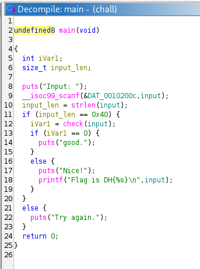
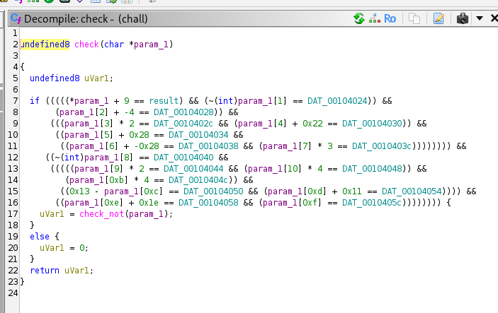
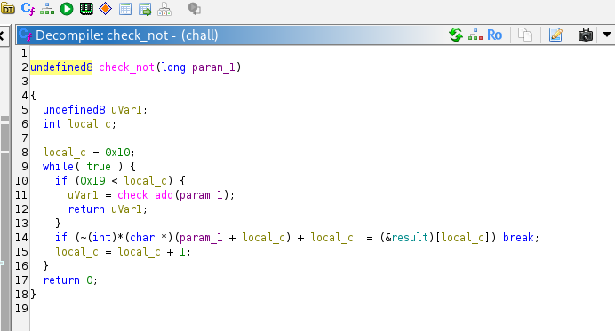
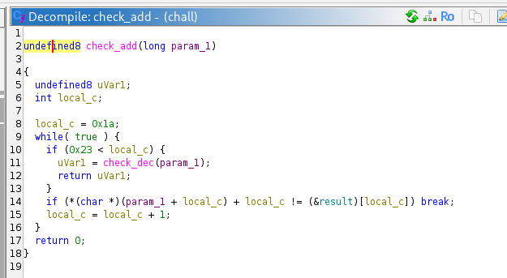
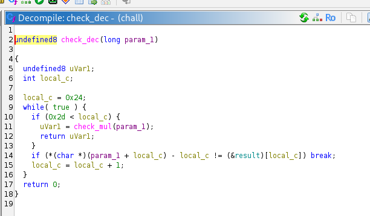
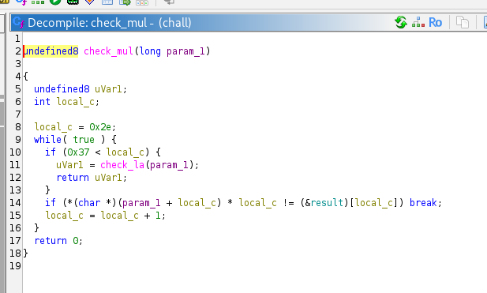
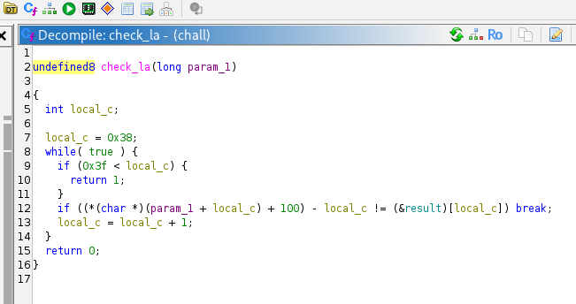
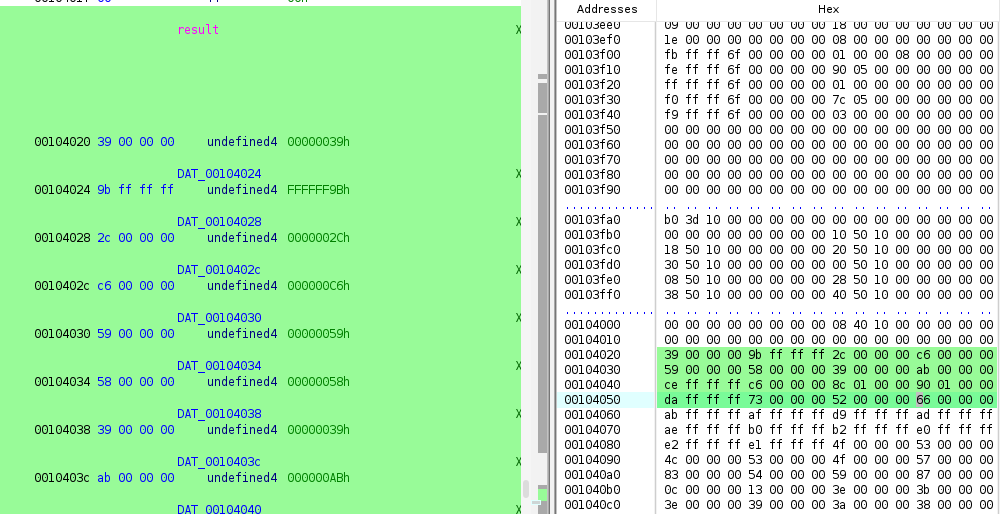
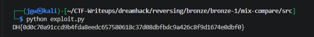

# [DreamHack] Mix-Compare - Reversing

## 1. 문제 개요

* **문제 링크:** [DreamHack - mix-compare](https://dreamhack.io/wargame/challenges/961)

* **분야:** Reversing

* **목표:** 제공된 바이너리를 디컴파일하여 64바이트 입력값에 대한 다단계 검증 로직(사칙연산 및 비트 반전)을 분석하고, Z3 Solver를 이용해 역산 스크립트를 작성하여 플래그 획득.

## 2. 취약점 분석
제공된 ELF 바이너리 파일(`chall`)을 디컴파일하여 분석한 결과, 64글자의 입력값을 순차적으로 여러 함수(`check`, `check_not`, `check_add` 등)에 넘기며 하드코딩된 전역 변수(데이터 배열)와 단순 가역 연산으로 검증하는 취약점 파악.

```c
// [main 함수] 입력값 길이 검증 및 check 함수 호출 로직
// ... (중략) ...
  puts("Input: ");
  __isoc99_scanf(&DAT_0010200c,input);
  input_len = strlen(input);
  if (input_len == 0x40) {
    iVar1 = check(input);
    if (iVar1 == 0) {
      puts("good.");
// ... (중략) ...
```

```c
// [check 함수] 0~15번째 입력값에 대한 하드코딩 수식 비교 취약 로직 발췌
// ... (중략) ...
  if (((((*param_1 + 9 == result) && (~(int)param_1[1] == DAT_00104024)) &&
       (param_1[2] + -4 == DAT_00104028)) &&
      (((param_1[3] * 2 == DAT_0010402c && (param_1[4] + 0x22 == DAT_00104030)) &&
// ... (중략) ...
      ((param_1[0xe] + 0x1e == DAT_00104058 && (param_1[0xf] == DAT_0010405c)))))))) {
    uVar1 = check_not(param_1);
  }
// ... (중략) ...
```

```c
// [check_not 함수] 16~25번째 입력값에 대한 반복문 기반 연산 취약 로직 발췌
// ... (중략) ...
  local_c = 0x10;
  while( true ) {
    if (0x19 < local_c) {
      uVar1 = check_add(param_1);
      return uVar1;
    }
    if (~(int)*(char *)(param_1 + local_c) + local_c != (&result)[local_c]) break;
    local_c = local_c + 1;
  }
// ... (중략) ...
```

* **분석 결론:** 바이너리는 64바이트의 사용자 입력을 받아 각 인덱스마다 덧셈, 뺄셈, 곱셈, 비트 반전(`~`)을 적용한 뒤, `.rodata` 영역에 하드코딩된 `result` 데이터 배열과 비교함. 단방향 암호화가 아닌 단순 가역 수식이므로, SMT Solver(Z3)를 활용해 조건을 만족하는 원본 입력값 복원 가능.

## 3. 공격 수행

1. 주어진 바이너리를 Ghidra로 디컴파일하여 `main` 함수 구조 확인. 스크립트 코드를 분석하여 프로그램 구동 시 64바이트(`0x40`)의 입력값이 필요함을 파악.



2. 함께 제공된 첫 번째 검증 함수인 `check`의 내부 로직 분석. 입력값의 0번부터 15번 인덱스까지 개별적인 사칙연산과 비트 반전 조건이 걸려있는 정적 방정식 규칙 식별.



3. 16번 인덱스부터는 `check_not`, `check_add`, `check_dec`, `check_mul`, `check_la` 함수로 이어지며 10글자 단위로 반복문(`while`)을 돌면서 수식 검증을 수행하는 패턴 파악.











4. Ghidra의 Bytes/Listing 뷰를 통해 검증의 기준이 되는 `result` 전역 변수의 메모리 주소(`0x00104020`)로 이동. 총 64개의 4바이트(int) 리틀 엔디언(Little-Endian) 데이터 배열 값 추출.



5. 추출한 리틀 엔디언 Hex 데이터와 디컴파일러에서 확인한 함수별 연산 수식들을 조합하여 파이썬 Z3 Solver 기반의 복호화 스크립트 작성 및 실행. 성공적으로 모든 제약 조건을 충족하는 정답 문자열 도출 완료.

```python
import struct
from z3 import *

raw = "39 00 00 00 9b ff ff  ...(중략)... 00 00 00 24 00 00 00"

data = bytes.fromhex(raw)
result = list(struct.unpack(f"<{len(data)//4}i", data))

c = [Int(f"c{i}") for i in range(64)]

s = Solver()
for x in c:
    s.add(x >= 0x20, x <= 0x7e)  

NOT = lambda x: -x - 1   # ~ 대신

s.add(c[0] + 9 == result[0])
s.add(NOT(c[1]) == result[1])
s.add(c[2] + -4 == result[2])
s.add(c[3] * 2 == result[3])
s.add(c[4] + 0x22 == result[4])
s.add(c[5] + 0x28 == result[5])
s.add(c[6] + -0x28 == result[6])
s.add(c[7] * 3 == result[7])
s.add(NOT(c[8]) == result[8])
s.add(c[9] * 2 == result[9])
s.add(c[10] * 4 == result[10])
s.add(c[11] * 4 == result[11])
s.add(0x13 - c[12] == result[12])
s.add(c[13] + 0x11 == result[13])
s.add(c[14] + 0x1e == result[14])
s.add(c[15] == result[15])

for i in range(16, 26):   # check_not
    s.add(NOT(c[i]) + i == result[i])
for i in range(26, 36):   # check_add
    s.add(c[i] + i == result[i])
for i in range(36, 46):   # check_dec
    s.add(c[i] - i == result[i])
for i in range(46, 56):   # check_mul
    s.add(c[i] * i == result[i])
for i in range(56, 64):   # check_la
    s.add((c[i] + 100) - i == result[i])

if s.check() == sat:
    m = s.model()
    flag = bytes([m[c[i]].as_long() for i in range(64)])
    print(f"DH{{{flag.decode()}}}")
else:
    print("wrong")
```

## 4. 획득 결과

* **FLAG:** `DH{0d0c70a91ccd9b4fda8eedc657580618c37d08dbfbdc9a426c8f9d1674e0dbf0}`



## 5. 대응 방안
본 문제는 하드코딩된 데이터 배열과 단순 사칙/비트 연산을 통해 입력값을 검증하므로, SMT Solver(Z3) 등 수학적 제약 조건 해결기를 통한 정적 분석 역산에 매우 취약함. 시큐어 코딩 관점에서 보안 강화를 위한 아키텍처 재설계 필요.

* **표준 해시 알고리즘 도입:** 입력값 검증 시 역산이 매우 쉬운 자체 가역 연산 방식 지양. 민감한 데이터 및 인증 값 비교 시 단방향 검증이 가능한 업계 표준 해시 알고리즘(SHA-256 등)과 솔트(Salt)를 결합하여 원본 입력값 유추 원천 차단.

* **동적 검증 로직 구현:** 비교 대상이 되는 데이터 배열을 `.rodata`와 같은 정적 메모리 영역에 하드코딩하지 않고, 런타임 환경에서 난수 기반 동적 키를 생성하여 검증하도록 설계해 손쉬운 데이터 추출 방지.

* **안티 디버깅 및 난독화 적용:** 리버싱 도구를 활용한 코드 흐름 추적을 방해하기 위해 바이너리 패킹(UPX 등)이나 Control Flow Flattening 기법 적용. 중요 검증 로직과 문자열(String)에 난독화를 적용하여 디컴파일 가독성 저하 유도.

## 6. 블루팀 관점 요약
해당 바이너리는 외부 네트워크(C2 서버 등)와의 통신 없이 로컬 환경 내에서 단독으로 수식 연산 및 입력값 검증을 수행함. 따라서 방화벽이나 NIDS 등의 네트워크 단 관제 장비로는 악성 행위 및 침해 시도 탐지 불가.
대신 호스트 단(EDR, 백신)에서 정적 분석을 통해 도출한 프로그램 내 고유 문자열('Input: ', 'Flag is DH{%s}', 'Try again.')을 기반으로 시그니처 위협 헌팅 수행. 향후 유사한 연산 로직을 가진 페이로드(난독화 해제기 등) 식별 시, 리버싱으로 도출한 Z3 역연산 스크립트를 파이썬 기반의 분석 자동화 Decrypter 도구로 활용하여 침해사고 대응(IR) 시간 단축 가능.

### 6.1. YARA 탐지 룰 (IoC)
정적 분석 과정에서 식별된 검증 바이너리 내부의 고유 하드코딩 문자열 지표와 ELF 파일 구조를 조합하여, 동일 계열의 검증 루틴을 식별하기 위한 YARA 룰 제안.

```yara
rule Detect_Mix_Compare {
    strings:
        // 프로그램 실행 및 검증 결과 출력 관련 하드코딩 문자열
        $str1 = "Input: " ascii
        $str2 = "good." ascii
        $str3 = "Nice!" ascii
        $str4 = "Flag is DH{%s}\n" ascii
        $str5 = "Try again." ascii

    condition:
        // ELF 파일 매직 넘버 검증
        uint32(0) == 0x464C457F and // ELF "\x7FELF"
        2 of ($str*)
}
```