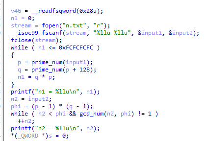
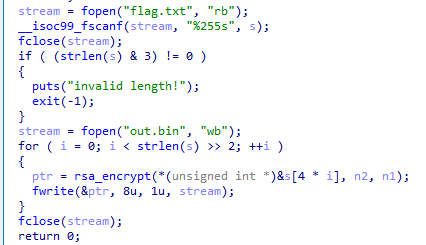
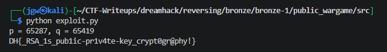

# [DreamHack] Public - Reversing

## 1. 문제 개요

* **문제 링크:** [DreamHack - public](https://dreamhack.io/wargame/challenges/91)

* **분야:** Reversing

* **목표:** 제공된 바이너리를 역분석하여 커스텀 RSA 암호화 로직을 파악하고, 노출된 취약한 공개키 값을 소인수분해하여 개인키를 도출한 뒤 암호문(`out.bin`) 복호화 및 플래그 획득.

## 2. 취약점 분석
제공된 ELF 바이너리 파일(`public`)을 디컴파일하여 분석한 결과, 자체 구현된 RSA 암호화 로직 식별. 암호화에 사용되는 모듈러스 값인 $N$(`n1`)의 크기가 매우 작아(약 42.7억, 32비트 수준) 단순 반복문으로 즉시 소인수분해($p, q$)가 가능한 구조적 취약점 파악.

```c
// [main 함수] 소수 p, q 생성 및 모듈러스(n1) 계산 로직
// ... (중략) ...
stream = fopen("n.txt", "r");
__isoc99_fscanf(stream, "%llu %llu", &input1, &input2);
fclose(stream);
while ( n1 <= 0xFCFCFCFC )
{
  p = prime_num(input1);
  q = prime_num(p + 128);
  n1 = q * p;
}
printf("n1 = %llu\n", n1);
// ... (중략) ...
```

```c
// [main 함수] 오일러 피 함수(phi) 및 공개키 지수(n2) 계산 로직
// ... (중략) ...
n2 = input2;
phi = (p - 1) * (q - 1);
while ( n2 < phi && gcd_num(n2, phi) != 1 )
  ++n2;
printf("n2 = %llu\n", n2);
// ... (중략) ...
```

```c
// [main 함수] 평문 4바이트 분할 및 RSA 암호화 후 8바이트 파일 쓰기 로직
// ... (중략) ...
stream = fopen("flag.txt", "rb");
__isoc99_fscanf(stream, "%255s", s);
fclose(stream);
if ( (strlen(s) & 3) != 0 )
{
  puts("invalid length!");
  exit(-1);
}
stream = fopen("out.bin", "wb");
for ( i = 0; i < strlen(s) >> 2; ++i )
{
  ptr = rsa_encrypt(*(_DWORD *)&s[4 * i], n2, n1);
  fwrite(&ptr, 8u, 1u, stream);
}
fclose(stream);
return 0;
// ... (중략) ...
```

* **분석 결론:** 텍스트 파일에 출력된 $N$(`n1`)과 $e$(`n2`)가 공개되어 있으며, $N$의 크기가 현저히 작아 단일 PC 환경에서도 수 밀리초 내에 $p, q$로 소인수분해 가능. 이를 통해 $\phi(N)$과 모듈로 역원을 이용해 복호화 키 $d$를 역산하여 `out.bin` 복호화 가능.

## 3. 공격 수행

1. 문제에서 제공된 결과 파일(`out.txt`)을 확인하여 암호화에 사용된 공개키 값인 모듈러스 $N$(`n1`)과 공개 지수 $e$(`n2`) 식별.


2. 바이너리 파일(`public`)을 디컴파일하여 `main` 함수 구조 분석. `n.txt`를 읽어 두 소수를 곱한 모듈러스 `n1`과 오일러 피 함수와 서로소인 공개 지수 `n2`를 생성하는 키 생성 로직 파악.



3. `flag.txt`를 4바이트 단위로 읽어 `rsa_encrypt` 함수로 암호화 후 `out.bin` 파일에 8바이트 단위로 기록하는 암호화 로직 파악.



4. 식별된 취약점(작은 $N$ 값)과 RSA 복호화 원리($m = c^d \pmod N$)를 바탕으로, $N$을 소인수분해하여 $p, q$를 구하고 개인키 $d$를 계산하여 `out.bin`을 복호화하는 Python 스크립트(`exploit.py`) 작성.

```python
n1 = 4271010253
n2 = 201326609

p = 0
q = 0
for i in range(2, int(n1**0.5) + 1):
    if n1 % i == 0:
        p = i
        q = n1 // i
        break

print(f"p = {p}, q = {q}")

phi = (p - 1) * (q - 1)
d = pow(n2, -1, phi)  # e(n2) * d mod phi = 1. d = e^-1 mod phi  / e = 공개키, d = 개인키

flag = ""
with open("out.bin", "rb") as f:
    data = f.read()

for i in range(0, len(data), 8):
    qword = data[i:i+8]

    c = int.from_bytes(qword, byteorder='little')

    m = pow(c, d, n1) # 복호화 : m = c^d mod N

    flag += m.to_bytes(4, byteorder='little').decode('latin-1')

print(flag)
```

5. 작성한 복호화 파이썬 스크립트(`exploit.py`)를 실행하여 최종 원본 플래그 문자열 복원 및 획득.



## 4. 획득 결과

* **FLAG:** `DH{_RSA_1s_pub1ic-pr1v4te-key_crypt0gr@phy!}`

## 5. 대응 방안
본 문제는 RSA 암호화의 수학적 취약점(작은 모듈러스)을 이용한 공격이므로, 시큐어 코딩 관점에서 암호화 알고리즘의 안전성 강화를 위한 로직 재설계 필요.

* **안전한 키 길이 사용:** RSA 암호화 적용 시, 현대 컴퓨팅 파워를 이용한 소인수분해 공격을 방지하기 위해 최소 2048비트 이상의 안전한 길이를 가진 모듈러스($N$) 변수 구조 설계.

* **검증된 표준 라이브러리 활용:** 자체적인 소수 생성 함수 및 수학식 구현 지양. 보안성 검증이 완료된 업계 표준 암호화 라이브러리(OpenSSL, Crypto++ 등)를 사용하여 구현 결함에 의한 취약점 원천 차단.

* **안전한 패딩 기법 적용:** 입력값의 패턴 유추가 가능한 Raw RSA(Textbook RSA) 대신 RSA-OAEP(Optimal Asymmetric Encryption Padding)와 같은 난수화 기반 패딩 기법을 적용하여 암호학적 기밀성 확보.

## 6. 블루팀 관점 요약
해당 암호화 바이너리는 외부 네트워크(C2 서버 등)와의 통신 없이 로컬 환경 내에서 단독으로 기초 파일(`n.txt`, `flag.txt`)을 읽고 자체적인 수학 연산 후 암호문(`out.bin`)만 생성. 방화벽이나 NIDS 등의 네트워크 단 관제 장비로는 탐지 불가.
랜섬웨어 혹은 파일 훼손형 악성코드의 오프라인 암호화 행위와 유사성을 지니므로, 호스트 단(EDR, 백신)에서 정적 분석으로 도출된 하드코딩 문자열(대상 입출력 파일명)을 활용한 시그니처 기반 위협 헌팅 수행. 침해사고 대응(IR) 시, 도출된 취약점(작은 $N$ 값)을 기반으로 파이썬 복호화 도구(`exploit.py`)를 구축하여 파일 자동 복구 수단으로 활용 가능.

### 6.1. YARA 탐지 룰 (IoC)
정적 분석 과정에서 식별된 커스텀 인코더 내부의 고유 하드코딩 파일명 지표와 ELF 파일 구조를 조합하여, 동일 계열의 악성 파일 훼손 행위를 식별하기 위한 YARA 룰 제안.

```yara
rule Detect_Public_RSA {
    strings:
        // 프로그램 실행 및 암호화 파일 관련 하드코딩 문자열
        $str1 = "n.txt" ascii wide
        $str2 = "flag.txt" ascii wide
        $str3 = "out.bin" ascii wide
        $str4 = "invalid length!" ascii wide

    condition:
        // ELF 파일 매직 넘버 검증
        uint32(0) == 0x464c457f and // ELF "\x7FELF"
        all of ($str*)
}
```