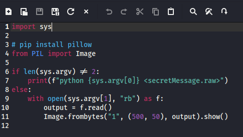
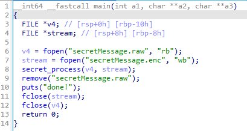
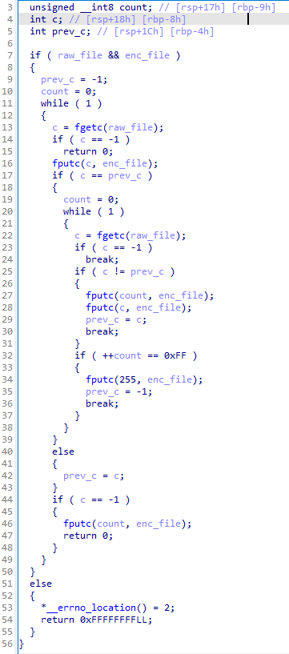
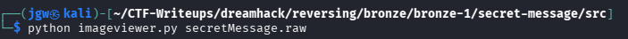
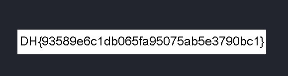

# [DreamHack] Secret Message - Reversing

## 1. 문제 개요

* **문제 링크:** [DreamHack - secret message](https://dreamhack.io/wargame/challenges/235)

* **분야:** Reversing

* **목표:** 제공된 인코더 바이너리를 역분석하여 데이터 압축(RLE) 알고리즘을 파악하고, 이를 역산하는 파이썬 디코더를 작성하여 원본 이미지 파일(.raw)을 복구한 뒤 플래그 획득.

## 2. 취약점 분석
제공된 ELF 바이너리 파일(`prob`)을 디컴파일하여 분석한 결과, 원본 이미지를 읽어들여 단순한 가역적 데이터 압축 알고리즘(Run-Length Encoding 변형)을 적용한 뒤 원본을 삭제하는 구조 취약점 파악.

```python
# [imageviewer.py] 복구 대상 원본 파일 및 출력 로직 확인
import sys
# ... (중략) ...
if len(sys.argv) != 2:
    print(f"python {sys.argv[0]} <secretMessage.raw>")
else:
    with open(sys.argv[1], "rb") as f:
        output = f.read()
        Image.frombytes("1", (500, 50), output).show()
```

```c
// [main 함수] 파일 입출력 및 원본 파일 삭제 로직
// ... (중략) ...
v4 = fopen("secretMessage.raw", "rb");
stream = fopen("secretMessage.enc", "wb");
secret_process(v4, stream);
remove("secretMessage.raw");
puts("done!");
// ... (중략) ...
```

```c
// [secret_process 함수] RLE 기반 인코딩 취약 로직 발췌
// ... (중략) ...
c = fgetc(raw_file);
if ( c == -1 ) return 0;
fputc(c, enc_file);
if ( c == prev_c )
{
    count = 0;
    while ( 1 )
    {
        c = fgetc(raw_file);
        // ... (중략) ...
        if ( c != prev_c )
        {
            fputc(count, enc_file);
            fputc(c, enc_file);
            prev_c = c;
            break;
        }
// ... (중략) ...
```

* **분석 결론:** 바이너리는 원본 이미지(`.raw`)를 읽어 동일한 바이트가 연속 2번 등장할 경우 그 다음 1바이트에 추가 반복 횟수를 기록하는 방식으로 데이터를 압축 인코딩함. 단방향 암호화가 아닌 단순 가역 알고리즘이므로, 인코딩 규칙을 거꾸로 역산하는 디코딩 스크립트를 작성하여 원본 데이터 복원 가능.

## 3. 공격 수행

1. 주어진 압축 파일을 해제하여 `secretMessage.enc` 암호문과 `imageviewer.py` 코드를 확인. 스크립트 코드를 분석하여 프로그램 구동 시 원본 바이너리인 `<secretMessage.raw>` 파일이 인자로 필요함을 파악.



2. 함께 제공된 인코더 실행 파일을 IDA로 디컴파일하여 `main` 함수 구조 분석. `secretMessage.raw`를 읽어 `.enc`로 생성하고 기존 `raw` 원본 파일을 삭제(`remove`)하는 전체적인 동작 흐름 파악.



3. 핵심 인코딩 함수인 `secret_process` 내부 로직 분석. 파일에서 1바이트씩 읽으면서 이전 바이트와 같을 경우 카운터를 증가시키고, 다른 바이트가 나오면 "누적된 횟수 + 새로운 바이트" 순서로 기록하는 RLE(Run-Length Encoding) 기반의 알고리즘 규칙 식별.



4. 식별된 RLE 인코딩 규칙을 역산하여, `.enc` 파일을 바이트 단위로 읽으면서 동일한 연속 문자를 발견하면 횟수만큼 리스트에 추가하는 Python 복호화 스크립트(`exploit.py`) 작성 및 실행. 성공적으로 `secretMessage.raw` 파일 복구 완료.

```python
with open("secretMessage.enc", "rb") as f:
    data = f.read()

output = []
i = 0

while i < len(data):
    output.append(data[i])

    if len(output) >= 2 and output[-1] == output[-2]:
        count = data[i+1]
        output.extend([data[i]] * count)
        i += 2
        
    else:
        i += 1

result_bytes = bytes(output)

with open("secretMessage.raw", "wb") as f:
    f.write(result_bytes)
```

5. 터미널 환경에서 복구된 `.raw` 원본 파일을 인자로 넘겨 `python imageviewer.py secretMessage.raw` 명령어 실행.



6. 뷰어를 통해 화면에 출력된 1-bit 흑백 이미지에서 정상적인 플래그 문자열 확인 및 획득.



## 4. 획득 결과

* **FLAG:** `DH{93589e6c1db065fa95075ab5e3790bc1}`

## 5. 대응 방안
본 문제는 단방향 및 표준 암호화 방식이 아닌 단순 압축 알고리즘(RLE)을 자체 구현하여 중요 데이터를 인코딩한 데 취약점이 존재함. 시큐어 코딩 관점에서 보안 강화를 위한 아키텍처 재설계 필요.

* **표준 암호화 알고리즘 도입:** 역산이 매우 쉬운 가역적 자체 인코딩 방식 지양. 민감한 데이터 은닉 시 AES 등 수학적으로 검증된 업계 표준 대칭키/비대칭키 암호화 알고리즘을 사용하여 기밀성 확보.

* **원본 파일 보안 삭제 적용:** 표준 C 라이브러리의 `remove()` 함수는 파일 시스템의 포인터 메타데이터만 삭제하므로 디스크 포렌식을 통해 원본 복구가 가능함. 원본 데이터 파기 시 랜덤한 가비지 데이터로 여러 번 덮어쓰기를 수행하는 보안 삭제 로직 구현.

* **무결성 검증 로직 추가:** 인코딩 대상 파일의 입출력 전후 과정에 SHA-256 등의 해시 검증을 도입하여 비정상적인 파일 변조나 임의 실행을 차단하도록 설계.

## 6. 블루팀 관점 요약
해당 바이너리는 외부 네트워크(C2 서버 등)와의 통신 없이 로컬 환경 내에서 단독으로 파일 암호화(RLE 압축) 및 원본 파일 삭제 행위만 수행함. 따라서 방화벽이나 NIDS 등의 네트워크 단 관제 장비로는 탐지가 불가. 
랜섬웨어 혹은 정보 유출형 악성코드의 초기 페이로드(파일 변조 후 삭제)와 유사한 행위 패턴을 띄므로, 호스트 단(EDR, 백신)에서 파일 시스템 I/O 모니터링 및 정적 분석(하드코딩 문자열)을 활용한 시그니처 기반 위협 헌팅 수행. 향후 대량의 침해 단말에서 암호화된(`.enc`) 파일 복구를 위해 리버싱으로 도출한 역연산 로직을 활용한 파이썬 자동화 Decrypter 도구(`exploit.py`)를 침해사고 대응(IR)에 적용 가능.

### 6.1. YARA 탐지 룰 (IoC)
정적 분석 과정에서 식별된 인코더 바이너리 내부의 고유 하드코딩 문자열 지표와 ELF 파일 구조를 조합하여, 동일 계열의 악성 파일 생성 행위를 식별하기 위한 YARA 룰 제안.

```yara
rule Detect_SecretMessage {
    strings:
        // 프로그램 실행 및 암호화 파일 관련 하드코딩 문자열
        $str1 = "secretMessage.raw" ascii wide
        $str2 = "secretMessage.enc" ascii wide
        $str3 = "done!" ascii wide
        
    condition:
        // ELF 파일 매직 넘버 검증
        uint32(0) == 0x464C457F and // ELF "\x7FELF"
        all of ($str*)
}
```