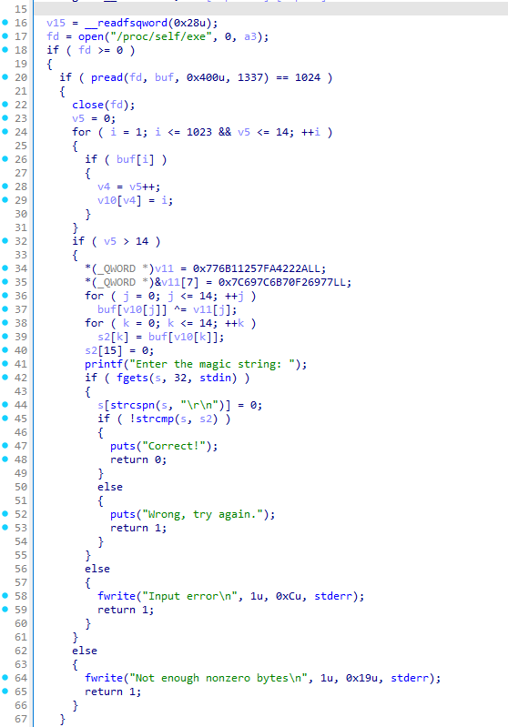
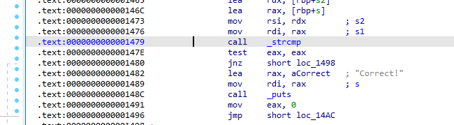
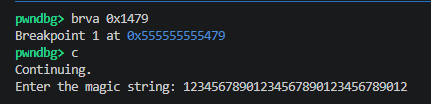
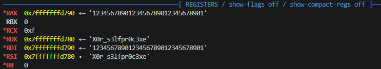

# [DreamHack] SelfRead - Reversing

## 1. 문제 개요

* **문제 링크:** [DreamHack - SelfRead](https://dreamhack.io/wargame/challenges/1981)

* **분야:** Reversing

* **목표:** 바이너리가 자기 자신(`/proc/self/exe`)을 읽어와 특정 연산을 수행하여 정답 문자열을 동적으로 생성하는 원리 파악. 이후 동적 디버깅(GDB)을 통해 비교 함수 실행 시점의 레지스터 메모리를 확인하여 평문 정답 탈취.

## 2. 취약점 분석
제공된 ELF 바이너리 파일(`prob`)을 IDA로 디컴파일 및 어셈블리 뷰로 교차 분석한 결과, 자체 파일을 읽어와 동적으로 문자열을 생성한 뒤 `strcmp`를 통해 사용자 입력값과 평문으로 비교하는 취약점 파악.

```c
// [C 코드 1] 자기 자신의 바이너리 읽기 및 연산
// ... (중략) ...
  fd = open("/proc/self/exe", 0, a3);
  if ( fd >= 0 )
  {
    if ( pread(fd, buf, 0x400u, 1337) == 1024 )
    {
      close(fd);
// ... (중략) ...
```

```c
// [C 코드 2] 사용자 입력과 동적 생성된 문자열 평문 비교
// ... (중략) ...
      printf("Enter the magic string: ");
      if ( fgets(s, 32, stdin) )
      {
        s[strcspn(s, "\r\n")] = 0;
        if ( !strcmp(s, s2) ) // (취약점) 평문 비교 수행
        {
          puts("Correct!");
          return 0;
// ... (중략) ...
```

```assembly
; [어셈블리 3] strcmp 함수 호출 및 인자 전달 확인
; ... (중략) ...
.text:000000000000146C                 lea     rax, [rbp+s]
.text:0000000000001473                 mov     rsi, rdx        ; s2 (정답 문자열)
.text:0000000000001476                 mov     rdi, rax        ; s1 (사용자 입력)
.text:0000000000001479                 call    _strcmp
.text:000000000000147E                 test    eax, eax
.text:0000000000001480                 jnz     short loc_1498
.text:0000000000001482                 lea     rax, aCorrect   ; "Correct!"
; ... (중략) ...
```

* **분석 결론:** 런타임에 동적으로 플래그 값을 계산하더라도 최종 검증을 `strcmp` 함수로 수행하여 원본 문자열이 평문으로 메모리에 노출됨. 디버거를 활용하여 `strcmp` 호출 직전에 중단점을 설정하면 `RSI` 레지스터에서 실제 플래그 값을 쉽게 확인 가능.

## 3. 공격 수행

1. IDA 디컴파일 뷰를 통해 프로그램의 전체적인 동작 흐름 및 플래그 검증 로직 파악.



2. 어셈블리어를 분석하여 사용자 입력값과 정답이 비교되는 `strcmp` 함수의 호출 위치(`0x1479`) 식별.



3. GDB를 통해 바이너리를 로드한 후, 식별한 비교문 지점(`brva 0x1479`)에 브레이크포인트를 설정하고 프로그램을 실행. 이후 비교를 위해 입력 길이인 32바이트의 임의 더미 문자열(예: `12345678901234567890123456789012`) 삽입.



4. 브레이크포인트에서 프로그램이 멈췄을 때 레지스터 상태를 확인하여 `strcmp`의 두 번째 인자인 `RSI` 레지스터에 평문으로 로드된 실제 플래그 문자열(`X0r_s3lfpr0c3xe`) 획득.



## 4. 획득 결과

* **FLAG:** `DH{X0r_s3lfpr0c3xe}`

## 5. 대응 방안
본 문제는 메모리 상에 중요 데이터(플래그)가 평문으로 노출되는 취약점과 동적 디버깅에 대한 방어 기재 부재가 원인. 시큐어 코딩 과정에서 중요 문자열 노출을 방지하는 아키텍처 설계 필요.

* **안전한 문자열 비교 로직 구현:** 검증용 패스워드나 플래그는 메모리에 평문 상태로 유지 및 비교(`strcmp`)해서는 안 됨. 사용자의 입력값에 SHA-256 등의 일방향 해시 알고리즘을 적용한 후, 바이너리 내부에 하드코딩된 해시값과 대조하는 방식으로 해시 비교 구현.

* **안티 디버깅 기법 적용:** 외부 디버거를 통한 동적 메모리 열람을 방지하기 위해 `ptrace(PTRACE_TRACEME, 0, 1, 0)` API 등을 사용하여 프로세스 추적을 사전에 탐지하고 차단하는 방어 로직 추가.

* **바이너리 난독화 및 패킹:** 프로그램이 `/proc/self/exe`를 참조하여 연산하는 주요 논리 및 평문 문자열 노출을 숨기기 위해, 난독화(Obfuscation) 및 상용 패커를 적용하여 분석가의 정적/동적 분석 난이도 상향.

## 6. 블루팀 관점 요약
해당 바이너리는 외부 네트워크(C2 서버 등)와의 통신 없이 로컬 환경 내에서 단독으로 파일 시스템 접근 및 문자열 검증을 수행함. 따라서 방화벽, IDS/IPS 등의 네트워크 기반 장비로는 악성 행위 탐지 불가. 호스트 기반(EDR) 환경에서 바이너리 내부의 고유 문자열 시그니처 및 특정 시스템 경로 접근 행위를 식별하는 형태의 위협 헌팅 수행.

### 6.1. YARA 탐지 룰 (IoC)
정적 분석을 통해 식별된 바이너리 내부의 고유 출력 메시지와 파일 접근(`/proc/self/exe`) 단서를 바탕으로 위협 및 크랙 의심 파일을 분류하기 위한 YARA 룰 제안.

```yara
rule Detect_SelfRead {
    strings:
        // 프로그램 실행 및 검증 관련 하드코딩 문자열
        $str1 = "Enter the magic string:" ascii
        $str2 = "Wrong, try again." ascii
        $str3 = "Not enough nonzero bytes" ascii
        
        // 중요 의심 행위 (자신 프로세스 바이너리 직접 읽기)
        $proc_read = "/proc/self/exe" ascii

    condition:
        // ELF 파일 매직 넘버 검증
        uint32(0) == 0x464C457F and 
        $proc_read and 
        2 of ($str*)
}
```