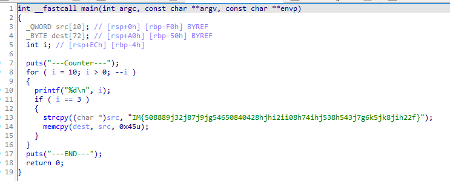
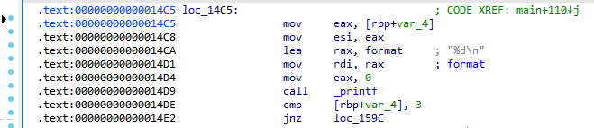
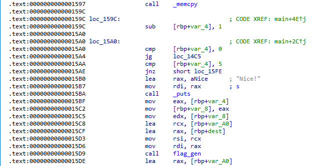
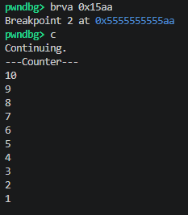
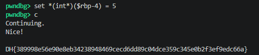

# [DreamHack] Small Counter - Reversing

## 1. 문제 개요

* **문제 링크:** [DreamHack - Small Counter](https://dreamhack.io/wargame/challenges/851)

* **분야:** Reversing

* **목표:** 디컴파일러의 데드 코드 제거(Dead Code Elimination) 최적화 과정에서 숨겨진 분기점을 식별하고, 동적 디버깅을 통한 스택 메모리 조작으로 우회 조건을 충족하여 실제 정답 획득.

## 2. 취약점 분석
제공된 ELF 바이너리 파일(`chall`)을 IDA로 디컴파일 및 어셈블리 뷰로 교차 분석한 결과, 루프 종료 직후 논리적으로 도달할 수 없는 분기점(데드 코드)에 진짜 플래그 생성 함수(`flag_gen`) 호출 로직이 숨겨져 있는 취약한 구조 파악.

```c
// [main 함수] 출제자가 의도한 더미(가짜) 플래그 함정 로직
// ... (중략) ...
for ( i = 10; i > 0; --i )
{
  printf("%d\n", i);
  if ( i == 3 )
  {
    strcpy((char *)src, "IM{508889j32j87j9jg54650840428hjhi2ii08h74ihj538h543j7g6k5jk8jih22f}");
    memcpy(dest, src, 0x45u);
  }
}
// ... (중략) ...
```

```assembly
; [main 함수] 루프 카운터 변수 위치 식별 (i = [rbp+var_4])
; ... (중략) ...
.text:00000000000014C5 loc_14C5:
.text:00000000000014C5     mov eax, [rbp+var_4]
.text:00000000000014C8     mov esi, eax
.text:00000000000014CA     lea rax, format        ; "%d\n"
; ... (중략) ...
```

```assembly
; [main 함수] 디컴파일러가 삭제한 숨겨진 분기문 및 flag_gen 호출
; ... (중략) ...
.text:00000000000015A0     cmp [rbp+var_4], 0     ; 루프 종료 조건 확인
.text:00000000000015A4     jg loc_14C5            ; 0보다 크면 루프 반복
.text:00000000000015AA     cmp [rbp+var_4], 5     ; (취약점) 정상 흐름으로 도달 불가능한 조건
.text:00000000000015AE     jnz short loc_15FE
.text:00000000000015B0     lea rax, aNice         ; "Nice!"
; ... (중략) ...
.text:00000000000015D9     call flag_gen          ; 실제 플래그 출력 함수
; ... (중략) ...
```

* **분석 결론:** 디컴파일러가 누락시킨 로직을 실제 어셈블리어 분석으로 파악. GDB를 활용해 반복문 종료 직후의 루프 카운터 변수를 강제로 변조하여 도달 불가능한 함수를 실행함으로써 취약점 공략 성공.

## 3. 공격 수행

1. IDA 디컴파일 뷰를 통해 프로그램의 전체적인 동작 흐름 및 페이크 플래그 생성 더미 로직 파악.



2. 어셈블리어를 분석하여 함수 호출 규약에 따라 카운터 변수 `i`가 스택 메모리 상의 `[rbp+var_4]`에 위치함을 확인.



3. 반복문 종료 지점을 추적하여 정상적인 흐름으로는 도달 불가능한 숨겨진 비교 분기점(`cmp [rbp+var_4], 5`)과 핵심 함수(`flag_gen`) 호출 지점 파악.



4. GDB를 통해 바이너리를 로드한 후, 숨겨진 비교문 지점(`0x15aa`)에 브레이크포인트를 설정하고 프로그램을 실행하여 루프가 완전히 끝날 때까지 대기.



5. 루프 종료 후 브레이크포인트에서 프로그램이 멈추었을 때, 메모리 변조 명령어(`set *(int*)($rbp-4) = 5`)를 입력하여 스택의 카운터 변수를 강제로 `5`로 덮어쓰고 실행을 재개하여 우회 조건 달성.



## 4. 획득 결과

* **FLAG:** `DH{389998e56e90e8eb34238948469cecd6dd89c04dce359c345e0b2f3ef9edc66a}`

## 5. 대응 방안
본 문제는 실제 실행 불가능한 데드 코드를 악용하여 숨겨진 분기를 만들어 냈으며, 이는 동적 분석을 통한 메모리 변조 공격에 매우 취약함. 시큐어 코딩 관점에서 불필요한 잉여 코드를 제거하고 메모리 무결성을 보장하는 아키텍처 재설계 필요.

* **불필요한 데드 코드 원천 제거:** 의도적으로 도달 불가능한 분기를 만들어 주요 로직을 숨기는 보안 방식 지양. 배포 시 컴파일러 최적화 옵션을 점검하여 실행 경로에 포함되지 않는 디버깅용 더미 함수 및 잉여 코드를 바이너리 단계에서 완전히 제거.

* **중요 로컬 변수 무결성 검증 추가:** 제어 흐름에 결정적인 영향을 미치는 주요 변수(카운터 루프 등)가 외부 디버거를 통해 변조되는 것을 방지하기 위해 섀도우 변수 기반 체크섬 로직 결합. 런타임에 메모리가 비정상적으로 변경되었을 경우 즉시 프로세스를 강제 종료하도록 설계.

## 6. 블루팀 관점 요약
해당 바이너리는 외부 네트워크(C2 서버 등)와의 통신이나 추가 페이로드 다운로드 행위 없이 로컬 환경 내에서 단독으로 검증 연산만 수행. 따라서 방화벽, IDS/IPS 등의 네트워크 기반 보안 장비로는 탐지 불가. 호스트 단(EDR, 백신)에서 파일 시스템에 유입된 정적 파일의 고유 로직 및 하드코딩된 문자열을 분석하는 시그니처 기반 위협 헌팅 수행.

### 6.1. YARA 탐지 룰 (IoC)
정적 분석을 통해 식별된 바이너리 내부의 하드코딩된 상태 알림 문자열 데이터와 ELF 파일 기본 구조를 조합하여 리버싱 과제 및 크랙 툴로 분류하기 위한 YARA 룰 제안.

```yara
rule Detect_Small_Counter {
    strings:
        // 프로그램 실행 및 인증 관련 하드코딩 메시지
        $str1 = "---Counter---" ascii wide
        $str2 = "Nice!" ascii wide
        $str3 = "---END---" ascii wide
        
        // 출제자가 의도한 더미(Fake) 플래그 시그니처
        $fake_flag = "IM{508889j32j87j9jg54650840428hjhi2ii08h74ihj538h543j7g6k5jk8jih22f}" ascii wide

    condition:
        // ELF 파일 매직 넘버 검증
        uint32(0) == 0x464C457F and // ELF "\x7FELF"
        all of ($str*) and $fake_flag
}
```