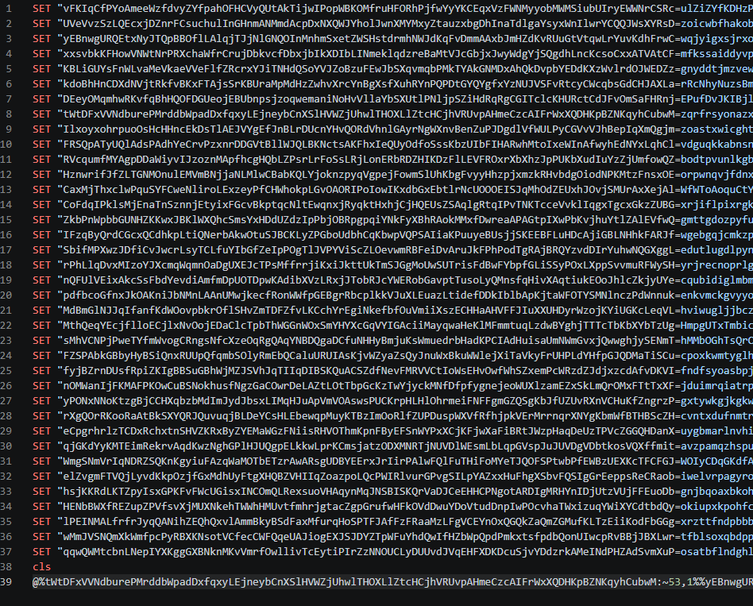
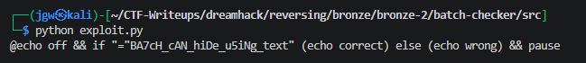

# [DreamHack] Batch Checker - Reversing

## 1. 문제 개요

* **문제 링크:** [DreamHack - Batch Checker](https://dreamhack.io/wargame/challenges/1072)

* **분야:** Reversing

* **목표:** 환경 변수 치환 문법으로 작성된 윈도우 배치 스크립트(`.bat`)의 텍스트 난독화 메커니즘을 분석하고, 자동화 파싱 스크립트를 통해 숨겨진 플래그 복호화.

## 2. 취약점 분석
제공된 배치 파일(`prob.bat`)을 분석한 결과, 윈도우 환경 변수의 부분 문자열 추출 기능을 악용하여 실제 실행될 명령어를 잘게 쪼개어 조합하는 난독화 기법 식별.

```dos
SET "vFKIqCfPYoAmeeWzfdvyZYfpahOFHCVyQUtAkTiJwIPopWBKOMfRUHFORhPjfWYyYKCEqxVzFWNMyyobMWMsiubUIryEWWNrCSRc=ulZiZYfKDHZP"
SET "UVeVvzSzLQEcxjDZnrfCsuchulInGhNMAnMMdAcpDxNXQWJYholJwnXMYMxyZtauzxbgDhInaTdlgaYsyxWnIlwrYCQqJWsXYRSD=zoicwbfhakob"
:: ... (중략) ...
SET "qjwQWMtcbnLNepIYXKggGXBNknMKvVmrfOwlIivTcEytiPIrZzNNOUCLyDUUvdJvQEHFXDKDcuSjvYDDzrkAMeINdPHZAdSvmXuP=osatbflndgh"
cls
@%twtDFxVVndburePMrddbWpadDxfqxyLejneybCnXSlHVwZjuhwLThOXLlZtCHCJhVRUvpAHmeCzcAIFrWxXQDHKpBZNKqyhCubWM:~53,1%%yEBnwgUR...
```

* **분석 결론:** 파일 상단에 무의미한 길이의 더미 변수(SET) 수백 개를 선언한 뒤, 최하단에서 `%변수명:~시작인덱스,길이%` 형태의 슬라이싱 문법을 수없이 이어 붙여 실제 명령어(페이로드)를 동적으로 런타임에 재구성. 해당 난독화 패턴은 정규표현식을 활용한 파이썬 스크립트를 통해 변수 매핑 및 치환 역연산 자동화 가능.

## 3. 공격 수행

1. 문제 파일(`prob.bat`) 소스코드를 확인하여 `SET` 키워드로 선언된 환경 변수 매핑 테이블 및 최하단의 난독화된 실행 명령어 묶음 파악.



2. 파이썬의 정규표현식(`re`) 라이브러리를 활용하여 배치 파일 내의 `변수명`과 `문자열 값`을 딕셔너리로 파싱하고, 슬라이싱 문법(`:~`)을 감지하여 실제 문자로 치환해 주는 자동화 익스플로잇 스크립트(`exploit.py`) 작성.

```python
import re

with open("prob.bat", "r", encoding="utf-8", errors="ignore") as f:
    content = f.read()

env_vars = {}

for var, val in re.findall(r'SET\s+"([^=]+)=([^"]+)"', content):
    env_vars[var] = val

def decrypt(text):
    def replace_var(match):
        var_expr = match.group(1)
        if ":" in var_expr: 
            name, slice_info = var_expr.split(":")
            start, length = map(int, slice_info.replace("~", "").split(","))
            return env_vars.get(name, "")[start:start+length]
        return env_vars.get(var_expr, "") 
    
    return re.sub(r'%([^%]+)%', replace_var, text)

lines = content.splitlines()
target_line = max(lines, key=len)

step1 = decrypt(target_line)
final_result = decrypt(step1)

print(final_result)
```

3. 작성한 익스플로잇 스크립트를 실행하여 중첩된 난독화 치환 로직을 우회하고, 복원된 최종 내부 명령어(`if`문 조건식)에서 원본 플래그 문자열 획득.



## 4. 획득 결과
환경 변수 슬라이싱 난독화 구조에 맞춘 파이썬 복호화 파서를 작성 및 실행하여 원본 플래그 획득 성공.

* **FLAG:** `DH{BA7cH_CAN_hIDe_u5iNg_tExt}`

## 5. 대응 방안
배치 파일의 환경 변수 치환 문법을 남용하여 주요 페이로드나 인증 로직을 숨기는 텍스트 기반 난독화 취약점을 방지하기 위해, 개발 및 설계 단계에서 다음의 시큐어 코딩 조치 적용.

* **스크립트 언어 고도화 및 서명 적용:** 단순 텍스트 기반의 `.bat` 스크립트는 자체적인 코드 무결성 보호 및 암호화 메커니즘이 전무함. 민감한 로직이 포함될 경우, PowerShell 등 고도화된 스크립트로 전환하고 실행 정책 설정 및 디지털 서명 적용.

* **인증 로직 분리 및 하드코딩 지양:** 클라이언트 사이드 스크립트 내부에 정답 문자열(플래그)을 난독화하여 배치하는 것은 정적 파싱만으로 쉽게 우회됨. 주요 인증 데이터는 해시 알고리즘으로 암호화하여 저장하거나, 서버 측 API 검증으로 로직 분리.

## 6. 블루팀 관점 요약

### 6.1. 탐지 및 분석 한계
* **네트워크 행위 부재:** 해당 악성 스크립트는 로컬 환경 내에서 단일 텍스트 치환 연산만을 수행하고 C&C 통신을 맺지 않음. 따라서 방화벽, IDS/IPS 등의 트래픽 기반 네트워크 보안 장비로는 위협 행위 식별 불가.

* **대응 방향:** EDR 및 호스트 단말 관제 환경에서 `cmd.exe` 자식 프로세스의 비정상적인 커맨드라인 매개변수(과도한 환경 변수 치환 문자)를 모니터링(Event ID 4688)하고, 해당 파일 수집 후 정적 분석을 통해 로컬 시그니처 위협 헌팅 수행.

### 6.2. YARA 탐지 룰 (IoC)
분석 단계에서 도출된 `SET` 더미 변수의 대량 선언 패턴과 윈도우 배치 스크립트 특유의 부분 문자열 치환(`:~`) 문법 특징을 결합하여, 유사한 형태의 악성 드로퍼(Dropper) 난독화 스크립트를 식별하는 YARA 룰 제안.

```yara
rule Detect_Batch_Checker {
    strings:
        // SET 변수 선언 정규식 패턴 (대량 생성 식별용)
        $set_pattern = /SET\s+"[^=]+=[^"]+"/ ascii wide
        
        // 환경 변수 문자열 슬라이싱 난독화 기법 (%VAR:~start,len%)
        $slice_pattern = /%[^%]+:~\d+,\d+%/ ascii wide
        
        // 은닉 및 화면 출력 억제 키워드
        $cmd_hide1 = "@echo off" nocase ascii wide
        $cmd_hide2 = "cls" nocase ascii wide

    condition:
        // PE 포맷 제외 (스크립트 파일 타겟팅)
        uint16(0) != 0x5A4D and
        
        // 대규모 난독화 기법의 임계치 조건 설정
        #set_pattern > 30 and 
        #slice_pattern > 10 and 
        any of ($cmd_hide*)
}
```