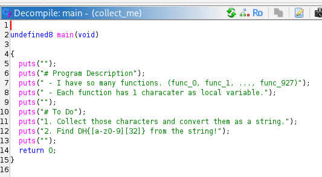
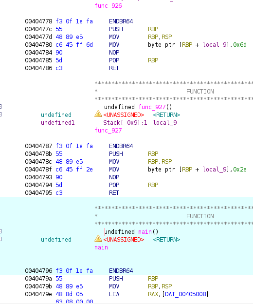
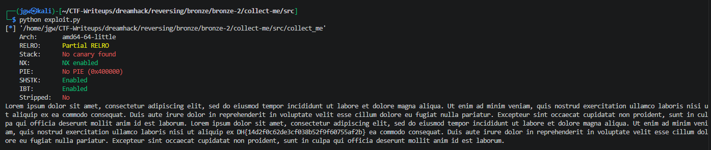

# [DreamHack] Collect Me - Reversing

## 1. 문제 개요

* **문제 링크:** [DreamHack - Collect Me](https://dreamhack.io/wargame/challenges/672)

* **분야:** Reversing

* **목표:** 바이너리 내부에 존재하는 수백 개의 더미 함수(`func_0` ~ `func_927`)를 분석하고, 자동화 스크립트를 작성하여 각 함수에 은닉된 문자를 추출 및 병합하여 플래그 획득.

## 2. 취약점 분석
제공된 ELF 바이너리 파일(`collect_me`)을 Ghidra로 디컴파일하여 분석한 결과, `main` 함수는 실질적인 연산을 수행하지 않고 안내문만 출력하며, 실제 데이터는 `func_0`부터 `func_927`까지 총 928개의 함수에 1바이트씩 분산되어 하드코딩된 상태.
모든 더미 함수는 동일한 어셈블리 구조를 띠고 있으며, 오프셋 `11` 바이트 위치(`MOV byte ptr ...`)에 문자 데이터가 대입되는 규칙성 확인.

```assembly
// ... (중략) ...
// func_926 함수 내부 바이트 대입 명령어
00404780 c6 45 ff 6d    MOV    byte ptr [RBP + local_9],0x6d 
// ... (중략) ...
// func_927 함수 내부 바이트 대입 명령어
0040478f c6 45 ff 2e    MOV    byte ptr [RBP + local_9],0x2e 
// ... (중략) ...
```

* **분석 결론:** 정적 분석을 통해 문자가 대입되는 기계어 바이트 패턴(`\xc6\x45`)을 파악하고, `pwntools`를 이용해 928개의 함수 주소를 순회하며 특정 오프셋을 기준으로 문자를 추출해 내는 자동화 스크립트 작성 필요.

## 3. 공격 수행

1. Ghidra를 통해 진입점인 `main` 함수를 확인한 결과, 실제 플래그 연산 없이 특정 문자열 안내문만 존재하는 것을 확인.



2. 이에 따라 `main`이 아닌 `func_0`부터 `func_927`까지의 함수를 분석하여 플래그 데이터가 1바이트씩 은닉되어 있음을 파악하고, 문자를 변수에 대입하는 명령어(`MOV byte ptr [RBP + local_9], 0x...`)의 기계어 바이트 시작 패턴(`c6 45`) 식별.



3. 파이썬 `pwntools` 라이브러리를 활용하여 바이너리를 로드하고, 모든 `func_n` 함수의 심볼 주소를 찾아 1바이트씩 추출 및 병합하는 `exploit.py` 스크립트 작성.

```python
from pwn import *

elf = ELF("./collect_me")

flag = ""

for i in range(928):
    func_name = f"func_{i}"

    func_addr = elf.symbols[func_name]

    func_bytes = elf.read(func_addr, 15)

    idx = func_bytes.find(b'\xc6\x45')

    char_byte = func_bytes[idx + 3]

    flag += chr(char_byte)

print(flag)
```

4. 작성한 스크립트를 실행하여 전체 문자열을 복원하고, 그 안에 포함된 플래그 식별.



## 4. 획득 결과
파이썬 자동화 스크립트를 통한 더미 함수 순회 및 데이터 추출 완료.

* **FLAG:** `DH{14d2f0c62de3cf038b52f9f60755af2b}`

## 5. 대응 방안
중요한 민감 정보(플래그 등)를 바이너리 내부에 하드코딩하거나 평문 형태로 분산 저장하여 정적 분석(패턴 매칭)에 노출되는 것을 방지하기 위한 시큐어 코딩 및 보호 기법 적용.

* **데이터 암호화 저장:** 플래그나 중요 문자열을 바이너리에 분산 하드코딩할 때, 평문이 아닌 암호화된 텍스트로 저장하고 실행 시점에 동적으로 복호화하여 메모리에 적재.

* **난독화 적용:** 유사한 구조의 함수 수백 개를 나열하는 방식은 스크립트를 통한 패턴 매칭에 취약하므로, 제어 흐름 난독화 기법을 적용하여 정적 분석 시 흐름 파악을 방해.

* **바이너리 패킹:** 실행 압축 또는 커스텀 패커를 사용하여 디컴파일 시 원본 코드 및 데이터(기계어 바이트)가 직관적으로 노출되지 않도록 바이너리 외형 보호.

## 6. 블루팀 관점 요약

### 6.1. 탐지 및 분석 한계
* **네트워크 행위 없음:** 해당 바이너리는 로컬 메모리에서 단독으로 연산을 수행하고 종료되므로, 방화벽이나 WAF, IDS/IPS 등의 네트워크 기반 탐지 장비로는 위협 식별 불가.

* **대응 방향:** EDR 및 호스트 단에서 정적 분석으로 도출된 파일 내부의 특정 바이트 시퀀스(연속된 함수 패턴) 및 하드코딩된 더미 텍스트를 기반으로 로컬 시그니처를 생성하여 위협 헌팅 수행.

### 6.2. YARA 탐지 룰 (IoC)
분석 단계에서 확인된 특유의 안내 문자열, 더미 텍스트, 그리고 다수의 더미 함수에서 공통으로 사용되는 바이트 대입 패턴(`MOV byte ptr...`)의 비정상적인 반복 횟수를 활용하여 유사한 형태의 데이터 은닉 바이너리를 탐지하는 YARA 룰 제안.

```yara
rule Detect_Collect_Me {
    strings:
        // 다수의 더미 함수에서 발견되는 문자열 초기화 어셈블리 패턴 (MOV byte ptr [RBP-0x9], imm8)
        $byte_mov_pattern = { c6 45 ff ?? } 
        
        // 바이너리에 삽입된 Lorem Ipsum 더미 문자열의 일부 식별
        $lorem_ipsum = "Lorem ipsum dolor sit amet" ascii wide
        
        // 문제 환경 특유의 안내 문자열
        $msg_desc = "# Program Description" ascii wide
    
    condition:
        uint32(0) == 0x464c457f and // ELF 바이너리(Magic Number) 검증
        $lorem_ipsum and 
        $msg_desc and
        // 동일한 함수 패턴이 100회 이상 비정상적으로 반복되는 기형적인 파일 탐지
        #byte_mov_pattern > 100 
}
```