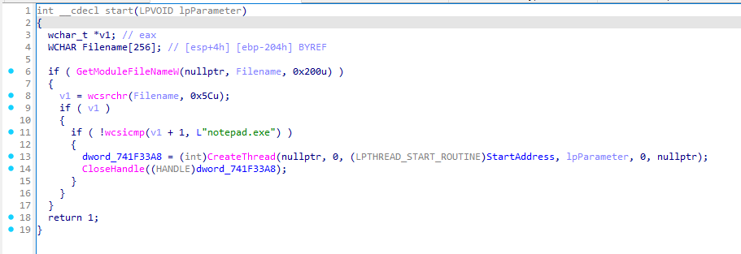
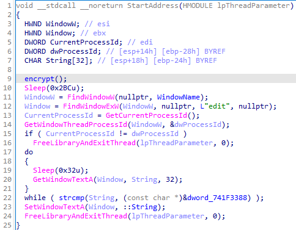
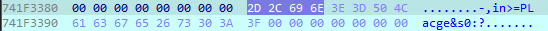
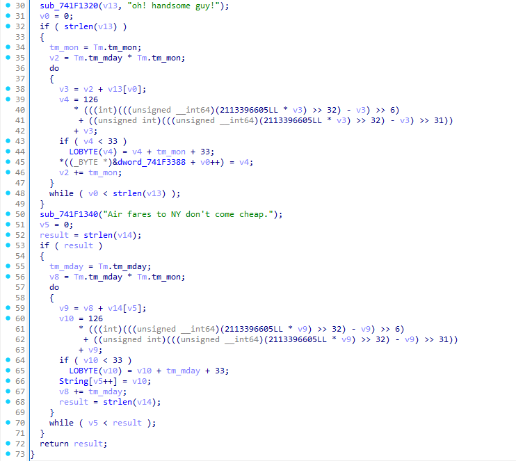
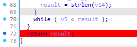
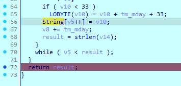
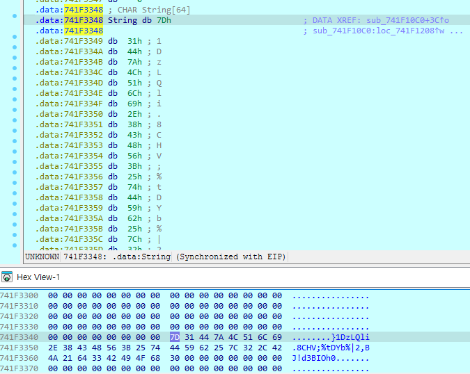
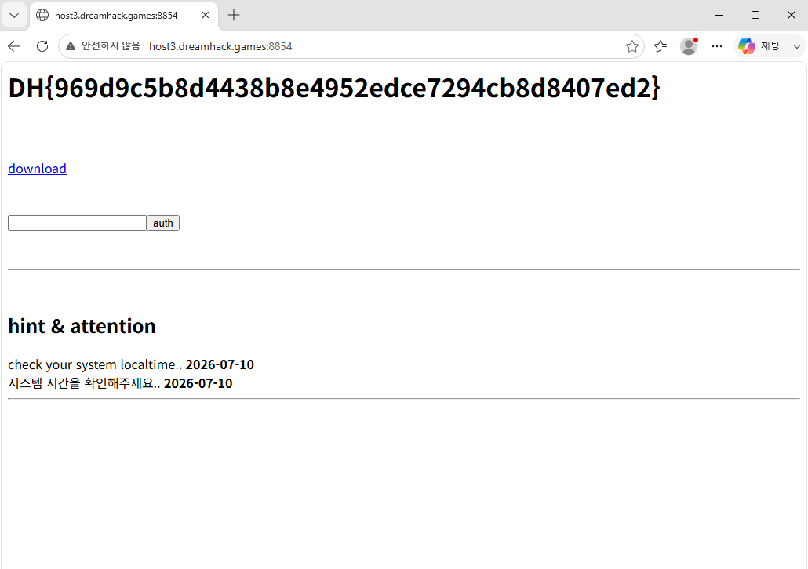

# [DreamHack] DLL with Notepad - Reversing

## 1. 문제 개요

* **문제 링크:** [DreamHack - DLL with notepad](https://dreamhack.io/wargame/challenges/331)

* **분야:** Reversing

* **목표:** 윈도우 `notepad.exe` 실행 시 인젝션되는 DLL(`blueh4g13.dll`)을 분석하고, 시스템 시간을 조작하여 동적 디버깅(IDA)을 통해 메모리에 생성되는 인증 키를 탈취. 이후 로컬 가상 서버에 인증하여 최종 플래그 획득.

## 2. 취약점 분석
웹 브라우저를 통해 제공된 DLL 바이너리를 IDA로 디컴파일하여 분석한 결과, 특정 조건(`notepad.exe`)에서 동작하며 로컬 시스템 시간을 기반으로 비밀번호 및 플래그를 생성하는 로직 식별.

```c
// [start 함수] 타겟 프로세스 검증 및 스레드 생성
// ... (중략) ...
if ( !wcsicmp(v1 + 1, L"notepad.exe") )
{
    dword_741F33A8 = (int)CreateThread(nullptr, 0, (LPTHREAD_START_ROUTINE)StartAddress, lpParameter, 0, nullptr);
    CloseHandle((HANDLE)dword_741F33A8);
}
// ... (중략) ...
```

```c
// [StartAddress 함수] 메모장 타이틀 검사 및 입력 비교 루프
// ... (중략) ...
sub_741F10C0(); // 비밀번호 및 플래그 생성 함수
Sleep(0x2BCu);
WindowW = FindWindowW(nullptr, WindowName); // "blueh4g.txt - " 창 검색
Window = FindWindowExW(WindowW, nullptr, L"edit", nullptr);
// ... (중략) ...
do
{
    Sleep(0x32u);
    GetWindowTextA(Window, String, 32);
}
while ( strcmp(String, (const char *)&dword_741F3388) );
SetWindowTextA(Window, &::String);
// ... (중략) ...
```

```c
// [encrypt 함수] 시스템 시간 기반 플래그 연산
// ... (중략) ...
Time = time64(nullptr);
localtime64_s(&Tm, &Time);
// ... (중략) ...
tm_mon = Tm.tm_mon;
v2 = Tm.tm_mday * Tm.tm_mon;
// ... (중략) ...
do
{
    // ... (중략) ... 난수 연산 후 패스워드 바이트 할당 ...
    *((_BYTE *)&dword_10003388 + v0++) = v4; 
}
while ( v0 < strlen(v13) );
// ... (중략) ...
do
{
    // ... (중략) ... 최종 플래그 연산 ...
    String[v5++] = v10; 
}
while ( v5 < result );
return result;
```

* **분석 결론:** 플래그 및 패스워드 생성 로직은 사용자 입력이 아닌 시스템의 현재 시간(년/월/일)을 기반으로 실행 시점에 평문으로 메모리에 적재됨. 한글 윈도우 환경의 메모장 창 이름(`Windows 메모장`)이 하드코딩된 영문 타이틀과 일치하지 않아 로직이 중간에 강제 종료되는 버그가 존재하나, 동적 디버깅을 통한 특정 반환 시점 브레이크포인트 설정으로 메모리 내 플래그 데이터 강탈 가능.

## 3. 공격 수행

## 3. 공격 수행

1. IDA를 통한 `start` 함수 진입점 디컴파일 및 스레드 생성 로직 식별.



2. 생성된 스레드의 `StartAddress` 함수에서 창 제목을 검증하고 텍스트를 비교하는 메인 로직 파악.



3. 가상 머신의 현재 시스템 날짜(`2026-07-10`)가 프로그램의 암호 키 연산 조건과 일치함을 확인.

4. `StartAddress`의 `strcmp` 검증 로직을 확인한 뒤, 동적 디버깅을 통해 메모리(`dword_741F3388`)에 평문으로 생성된 정답 패스워드(`-,in>=PLacge&s0:?`) 추출.



5. 추출한 패스워드를 메모장에 입력하여 인증을 시도했으나, 한글 윈도우 환경의 창 제목 불일치(`blueh4g.txt - Windows 메모장`)로 인해 `FindWindow` API가 창을 찾지 못하고 스레드가 강제 종료되는 환경적 버그 식별.

6. 정상적인 패스워드 입력이 불가능함을 파악하고, 우회 루트를 찾기 위해 패스워드 검증 이전에 호출되는 `encrypt` 함수 내부로 진입. 특정 문자열(`oh! handsome guy!`, `Air fares to NY...`)과 시스템 시간을 활용하여 전역 변수(`::String`)에 최종 플래그를 생성하는 로직 확인.



7. 패스워드 검증 루프를 무시한 채 연산이 끝난 최종 플래그를 메모리에서 직접 탈취하는 우회 공격으로 선회. `encrypt` 함수의 모든 연산이 종료되는 `return result;` 지점에 브레이크포인트 설정.



8. 디버거 실행 후, 완성된 플래그가 담기는 `::String` (전역 변수)의 메모리 위치 추적.



9. Hex View 기능을 활용하여 연산이 완료된 33바이트의 최종 인증 키 문자열 추출.



## 4. 획득 결과
추출한 33바이트 인증 키(`}1DzLQli.8CHV;%tDYb%|2,BJ!d3BIOh0`)를 가상 머신 내부의 로컬 웹 서버(`host3.dreamhack.games:8854`)에 인증하여 최종 플래그 획득.



* **FLAG:** `DH{969d9c5b8d4438b8e4952edce7294cb8d8407ed2}`

## 5. 대응 방안
본 문제는 클라이언트(로컬) 단에 중요 정보(정답 및 플래그)를 생성하는 로직이 평문으로 노출된 것이 취약점의 핵심 원인. 인증 및 주요 연산은 클라이언트 환경에 의존하지 않고 보호된 영역에서 처리되어야 함.

* **서버 사이드 검증 도입:** 클라이언트의 로컬 시스템 시간이나 자체 연산 결과에 의존하지 않고, 난수 검증 및 플래그 발급 로직을 신뢰할 수 있는 서버 단에서 처리하도록 아키텍처 변경.

* **메모리 보호 및 난독화 적용:** 불가피하게 로컬에서 연산해야 할 경우, 중요 변수(String, 패스워드 등)를 메모리에 평문으로 유지하는 시간을 최소화하고, 스트링 난독화 및 안티 디버깅 기법을 적용하여 동적 분석 방해.

* **하드코딩된 환경 의존성 제거:** `FindWindowW` 사용 시 특정 언어권의 고정된 문자열(`blueh4g.txt - `)을 하드코딩하여 비교하는 방식 대신, OS API를 통한 프로세스 ID 추적 등을 활용하여 다국어 환경(한글 윈도우 등)에서도 강제 종료되지 않도록 예외 처리 적용.

## 6. 블루팀 관점 요약

해당 악성 DLL 바이너리는 외부 네트워크 통신 없이 로컬 프로세스(`notepad.exe`)에 단독으로 인젝션되어 동작하므로, 방화벽이나 IDS/IPS 등 네트워크 트래픽 기반의 관제 장비로는 위협 탐지 불가.

* **대응 방향:** EDR 및 호스트 단에서 특정 정상 프로세스(메모장)에 인젝션되는 비정상적인 DLL 모듈 로드 행위를 정밀 모니터링. 또한, 바이너리 내부에 하드코딩된 특이 문자열(`oh! handsome guy!`, `blueh4g.txt`) 등을 정적 분석으로 식별하여 시그니처 기반의 위협 헌팅 수행.

### 6.1. YARA 탐지 룰 (IoC)
정적 분석을 통해 확인된 하드코딩 스트링 및 타겟 프로세스 명칭을 시그니처로 활용하여, 해당 DLL 인젝터를 식별할 수 있는 YARA 룰 제안.

```yara
rule Detect_DLL_With_Notepad {
    strings:
        // 타겟 프로세스 및 파일명 시그니처
        $target_proc = "notepad.exe" ascii wide
        $target_window = "blueh4g.txt - " ascii wide
        
        // 플래그 연산에 사용된 하드코딩 스트링 시그니처
        $str_key1 = "oh! handsome guy!" ascii wide
        $str_key2 = "Air fares to NY don't come cheap." ascii wide

    condition:
        // PE 파일 매직 넘버 검증 (\x4D\x5A)
        uint16(0) == 0x5a4d and 
        3 of ($target_proc, $target_window, $str_key1, $str_key2)
}
```