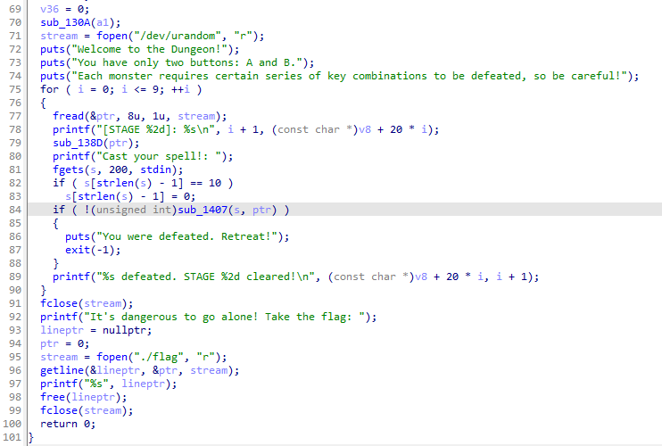
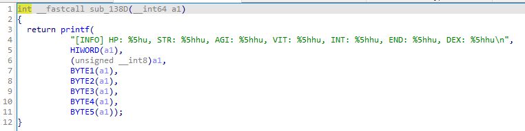
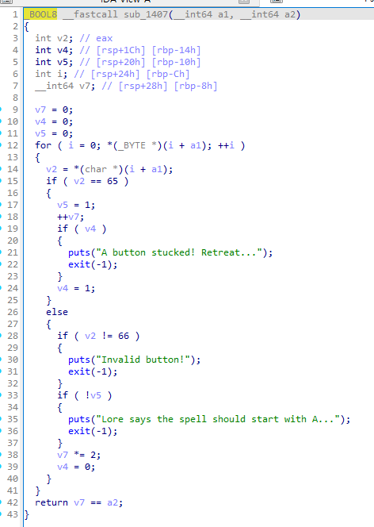
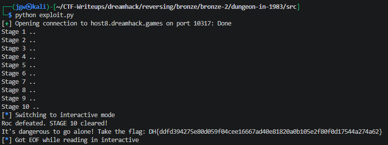

# [DreamHack] Dungeon In 1983 - Reversing

## 1. 문제 개요

* **문제 링크:** [DreamHack - dungeon-in-1983](https://dreamhack.io/wargame/challenges/1212)

* **분야:** Reversing

* **목표:** 서버에서 `/dev/urandom`으로 생성한 64비트 난수를 몬스터의 스탯으로 분할 출력하는 로직을 분석하고, 이를 역산하여 타임아웃(5초) 내에 10회 스테이지를 통과하는 마법 주문('A', 'B' 조합) 자동 전송.

## 2. 취약점 분석
제공된 ELF 바이너리 파일(`prob`)을 IDA로 디컴파일하여 분석한 결과, 몬스터 스탯 파싱을 통한 시드 값 유출 및 연산식(덧셈, 곱셈)의 가역성을 활용한 역연산 취약점 식별. 타임아웃이 5초로 제한되어 있어 파이썬 기반의 통신 자동화 스크립트 작성 필수.

```c
// ... (중략) ...
fread(&ptr, 8u, 1u, stream);
printf("[STAGE %2d]: %s\n", i + 1, (const char *)v8 + 20 * i);
sub_138D(ptr);
// ... (중략) ...
fgets(s, 200, stdin);
// ... (중략) ...
if ( !(unsigned int)sub_1407(s, ptr) )
{
  puts("You were defeated. Retreat!");
  exit(-1);
}
// ... (중략) ...
```

화면에 출력되는 몬스터 스탯은 `sub_138D` 함수 내부에서 난수 `ptr`을 비트 단위로 쪼개어 출력한 결과. 비트 시프트 연산을 통해 원본 64비트 정수 복원 가능.

```c
// ... (중략) ...
return printf(
    "[INFO] HP: %5hu, STR: %5hhu, AGI: %5hhu, VIT: %5hhu, INT: %5hhu, END: %5hhu, DEX: %5hhu\n",
    HIWORD(a1),
    (unsigned __int8)a1,
    BYTE1(a1),
    // ... (중략) ...
    BYTE5(a1));
// ... (중략) ...
```

마법 주문 검증을 담당하는 `sub_1407` 함수는 'A'(65) 입력 시 +1, 'B'(66) 입력 시 *2 연산을 수행. 결과값이 복원한 난수 `ptr`과 동일해질 때까지 홀수/짝수 분기를 통한 역산 우회 가능.

```c
// ... (중략) ...
for ( i = 0; *(_BYTE *)(i + a1); ++i )
{
  v2 = *(char *)(i + a1);
  if ( v2 == 65 )
  {
    v5 = 1;
    ++v7;
// ... (중략) ...
  else
  {
// ... (중략) ...
    v7 *= 2;
    v4 = 0;
  }
}
return v7 == a2;
// ... (중략) ...
```

* **분석 결론:** 화면에 출력되는 몬스터 스탯 데이터를 취합하여 원본 검증 난수 복원이 가능하며, 덧셈과 곱셈만으로 이루어진 단순 검증 로직 특성상 완전한 역연산을 통한 정답 문자열 생성 취약점 존재.

## 3. 공격 수행

1. IDA를 통한 `main` 함수 진입점 디컴파일 및 `/dev/urandom` 기반의 난수(`ptr`) 생성 후 10번 반복되는 메인 루프 검증 로직 확인.



2. 몬스터 스탯을 출력하는 `sub_138D` 함수 분석을 통해 `ptr` 변수가 각 1~2바이트 단위의 스탯(HP, STR, AGI 등)으로 쪼개져 포맷 스트링으로 출력되는 부분 식별.



3. 사용자의 마법 주문 입력을 검증하는 `sub_1407` 함수 분석. 'A' 입력 시 1 증가, 'B' 입력 시 2배 증가하는 로직을 거친 최종 변수(`v7`)가 난수(`ptr`)와 일치해야 통과됨을 파악.



4. Pwntools를 활용하여 서버 출력값 내부의 스탯 정규식 파싱, 비트 시프트 연산을 통한 원본 난수 복원, 이후 홀수/짝수 분기를 통한 주문 역추적 자동화 스크립트(`exploit.py`) 작성.

```python
from pwn import *
import re

r = remote("host8.dreamhack.games", 10317)

for stage in range(10):
    print(f"Stage {stage + 1} ..")

    data = r.recvuntil(b"Cast your spell!: ").decode()
    
    info_line = re.search(r'\[INFO\].*', data).group()
    
    stats = list(map(int, re.findall(r'\d+', info_line)))
    HP, STR, AGI, VIT, INT, END, DEX = stats

    ptr = (HP << 48) | (DEX << 40) | (END << 32) | (INT << 24) | (VIT << 16) | (AGI << 8) | STR

    cmd = ""
    while ptr > 0:
        if ptr % 2 == 1:  
            cmd += 'A'
            ptr -= 1
        else:             
            cmd += 'B'
            ptr //= 2
            
    spell = cmd[::-1]     
    
    r.sendline(spell.encode())

r.interactive()
```

5. 완성된 파이썬 스크립트 실행을 통해 제한 시간 내 10개의 스테이지를 자동 우회 통과 후 최종 플래그 획득.



## 4. 획득 결과
비트 시프트 연산 복원 및 역연산 자동화 스크립트를 통한 타임아웃 검증 우회 및 플래그 획득 성공.

* **FLAG:** `DH{ddfd394275e80d059f04cee16667ad40e81820a0b105e2f80f0d17544a274a62}`

## 5. 대응 방안
단순 사칙연산으로 검증을 수행하여 목표 난수 값이 유출될 경우 역연산이 가능해지는 로직 결함 방지를 위한 시큐어 코딩 적용.

* **난수 검증 방식 변경:** 사용자의 입력값 누적 연산(덧셈, 곱셈) 결과와 난수를 평문 그대로 비교하는 방식을 지양하고, 입력 시퀀스와 임의의 Salt를 결합하여 단방향 해시(SHA-256 등) 처리 후 검증하여 원본 값을 역추적할 수 없도록 로직 수정.

* **민감 정보 노출 제한:** 시스템 내부에서 중요 검증 목적으로 사용되는 난수를 몬스터 스탯과 같은 형태로 화면에 분할 출력하여 시드 정보가 직접적으로 유출되지 않도록 화면 표시 로직 변경.

## 6. 블루팀 관점 요약

### 6.1. 탐지 및 분석 한계
* **네트워크 행위 없음:** 해당 바이너리는 외부 C&C 서버 통신 없이 로컬 환경 내에서 단독으로 난수 생성 및 연산 우회를 수행하므로, 방화벽이나 IPS 등 네트워크 트래픽 기반의 위협 탐지 불가.

* **대응 방향:** EDR 및 호스트 단에서 바이너리의 특정 스트링 및 `/dev/urandom` 같은 시스템 자원 호출 패턴을 정적 분석하여 식별. 이를 통해 내부 논리 구조상 가역적 난수 연산 취약점이 포함된 형태의 파일을 탐지하는 로컬 위협 헌팅 수행.

### 6.2. YARA 탐지 룰 (IoC)
정적 분석을 통해 확인된 하드코딩 메시지(에러 구문, 게임 안내) 및 주요 난수 디바이스 경로를 활용하여, 유사한 형태의 논리 결함 바이너리를 탐지할 수 있는 YARA 룰 제안.

```yara
rule Detect_Dungeon_In_1983 {
    strings:
        // 게임 텍스트 및 에러 시그니처
        $msg_welcome = "Welcome to the Dungeon!" ascii wide
        $msg_buttons = "You have only two buttons: A and B." ascii wide
        $msg_defeat = "You were defeated. Retreat!" ascii wide
        $msg_invalid = "Invalid button!" ascii wide
        $msg_lore = "Lore says the spell should start with A..." ascii wide
        
        // 플래그 문자열 및 스탯 출력 포맷
        $msg_flag = "It's dangerous to go alone! Take the flag: " ascii wide
        $format_info = "[INFO] HP:" ascii wide
        
        // 주요 난수 생성 디바이스
        $dev_urandom = "/dev/urandom" ascii wide
        
    condition:
        uint32(0) == 0x464c457f and // ELF 헤더 매직 넘버 검증 (\x7F ELF)
        $dev_urandom and $format_info and 3 of ($msg_*)
}
```