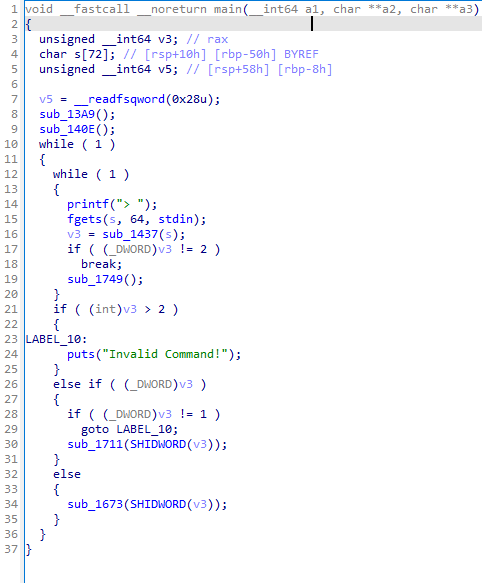
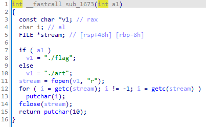
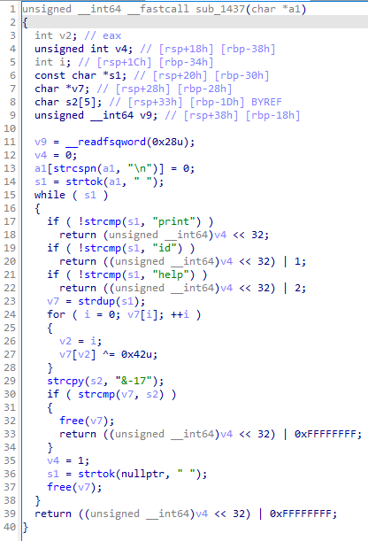
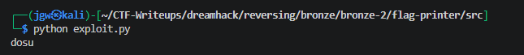
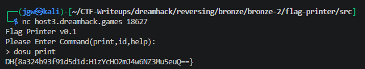

# [DreamHack] Flag Printer - Reversing

## 1. 문제 개요

* **문제 링크:** [DreamHack - flag printer](https://dreamhack.io/wargame/challenges/1867)

* **분야:** Reversing

* **목표:** C로 작성된 리눅스 ELF 바이너리의 명령어 파싱 로직을 분석하여, 플래그 출력 함수 조건 달성 및 숨겨진 명령어를 복호화해 권한 상승 후 플래그 획득.

## 2. 취약점 분석
제공된 ELF 바이너리 파일(`flag-printer`)을 IDA로 디컴파일하여 분석한 결과, 최종적으로 플래그를 출력하는 `sub_1673` 함수를 실행하기 위해 `main` 함수의 조건문 분기 파악. 플래그를 읽기 위해서는 `v3`의 하위 32비트가 `0`이어야 하며, `sub_1673`의 인자(상위 32비트)로 `1`이 전달되어야 정상적으로 파일 조회 가능.

```c
// ... (중략) ...
    v3 = sub_1437(s);
    if ( (_DWORD)v3 != 2 )
      break;
    sub_1749();
  }
  if ( (int)v3 > 2 )
  {
// ... (중략) ...
  else if ( (_DWORD)v3 )
  {
// ... (중략) ...
  }
  else
  {
    sub_1673(SHIDWORD(v3));
  }
```

명령어 파싱을 담당하는 `sub_1437`에서 단순 `print` 입력 시 하위 32비트와 상위 32비트가 모두 `0`으로 반환됨. 상위 32비트(`v4`)를 `1`로 세팅하기 위해 내부에 하드코딩된 문자열(`&-17`)과 `0x42` XOR 연산 검증을 통과하는 백도어성 취약점 존재. 

```c
// ... (중략) ...
    if ( !strcmp(s1, "print") )
      return (unsigned __int64)v4 << 32;
// ... (중략) ...
    v7 = strdup(s1);
    for ( i = 0; v7[i]; ++i )
    {
      v2 = i;
      v7[v2] ^= 0x42u;
    }
    strcpy(s2, "&-17");
    if ( strcmp(v7, s2) )
// ... (중략) ...
    v4 = 1;
    s1 = strtok(nullptr, " ");
// ... (중략) ...
```

```c
// ... (중략) ...
int __fastcall sub_1673(int a1)
{
// ... (중략) ...
  if ( a1 )
    v1 = "./flag";
  else
    v1 = "./art";
// ... (중략) ...
```

* **분석 결론:** 사용자의 입력값을 파싱하는 `sub_1437` 함수에서 특정 명령어 입력 시 검증 로직을 거쳐 `v4` 변수가 `1`로 활성화됨. 이후 C언어의 `strtok` 특성에 따라 두 번째 단어인 `print`가 처리되며 반환값을 통해 `sub_1673` 함수로 `1`이 전달되어 `./flag` 파일 조회 가능.

## 3. 공격 수행

1. IDA를 통한 `main` 함수 진입점 디컴파일 및 `v3` 변수 기반의 분기문 확인.



2. 플래그를 출력하는 `sub_1673` 함수 내부 확인. 인자 `a1`이 `1`일 경우 `./flag`를 읽어오는 로직 파악.



3. 입력값 검증을 수행하는 `sub_1437` 함수 분석. 인자값을 조작하여 상위 32비트(`v4`)를 `1`로 만들기 위해 숨겨진 하드코딩 문자열(`&-17`) 검증 로직 발견.



4. `0x42`와 XOR 연산된 하드코딩 바이트 배열(`&-17`)을 평문으로 복호화하기 위해 파이썬 자동화 스크립트 작성.

```python
key = "&-17"
key_dec = "".join(chr(ord(c) ^ 0x42) for c in key)
print(key_dec)
```

5. 스크립트 실행 결과, 관리자 권한을 획득하기 위한 숨겨진 첫 번째 단어명(`dosu`) 획득.



6. 원격 워게임 서버(`nc`) 환경에 접속하여, 조건 분기(`v3` 하위 비트 `0`)를 통과하기 위한 `print` 명령어와 결합. 최종적으로 `dosu print` 입력 후 플래그 획득.



## 4. 획득 결과
도출된 로직 취약점과 하드코딩 문자열 복호화를 활용하여 권한 상승 및 플래그 획득 성공.

* **FLAG:** `DH{8a324b93f91d5d1d:H1zYcHO2mJ4w6NZ3Mu5euQ==}`

## 5. 대응 방안
프로그램 내부에 관리자/Godmode 권한을 활성화하는 분기문이 하드코딩된 암호화 평문 비교로 노출됨에 따라 발생하는 우회 취약점 방지를 위해 시큐어 코딩 조치 적용.

* **백도어 분기문 제거:** 디버깅이나 관리 편의성을 위해 삽입된 숨겨진 명령어(`dosu`) 처리 로직 및 `v4` 상태 변환 코드를 프로덕션 배포 전에 완전히 제거.

* **인증 및 인가 검증 분리:** 단순 `strcmp`를 통한 입력값 확인을 지양하고, 시스템 주요 파일(`./flag` 등) 접근 시에는 안전한 해시(SHA-256) 알고리즘을 활용한 인증된 세션 기반의 권한 통제 시스템 적용.

## 6. 블루팀 관점 요약

### 6.1. 탐지 및 분석 한계
* **네트워크 행위 없음:** 해당 바이너리는 외부 C&C 서버와의 통신 없이 로컬 환경 내에서 단독으로 입력값 검증 및 분기를 수행하므로, 방화벽이나 IPS 장비의 트래픽 기반 탐지 불가.

* **대응 방향:** EDR 및 호스트 단에서 바이너리 내부의 특정 Hex 시그니처나 인코딩된 의심 문자열(`&-17`)을 정적 분석을 통해 식별하고, 이와 유사한 형태의 백도어 로직이 포함된 바이너리를 탐지하는 로컬 위협 헌팅 수행.

### 6.2. YARA 탐지 룰 (IoC)
정적 분석을 통해 확인된 하드코딩 문자열(플래그 형식, 에러 구문, 특정 XOR 비교값 등) 특징을 활용하여, 유사한 형태의 ELF 백도어 바이너리를 탐지할 수 있는 YARA 룰 제안.

```yara
rule Detect_Flag_Printer {
    strings:
        // 하드코딩된 암호화 비교 문자열
        $enc_str = "&-17" ascii wide
        
        // 플래그 경로 및 내부 명령어 시그니처
        $path_flag = "./flag" ascii wide
        $path_art = "./art" ascii wide
        $cmd_print = "print" ascii wide
        
        // 출력되는 오류 및 안내 메시지
        $msg_err = "Invalid Command!" ascii wide
        $msg_prompt = "Please Enter Command(print,id,help):" ascii wide

    condition:
        uint32(0) == 0x464c457f and // ELF 헤더 매직 넘버 검증 (\x7F ELF)
        $enc_str and $path_flag and $path_art and $cmd_print and 2 of ($msg_*)
}
```