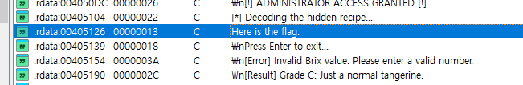
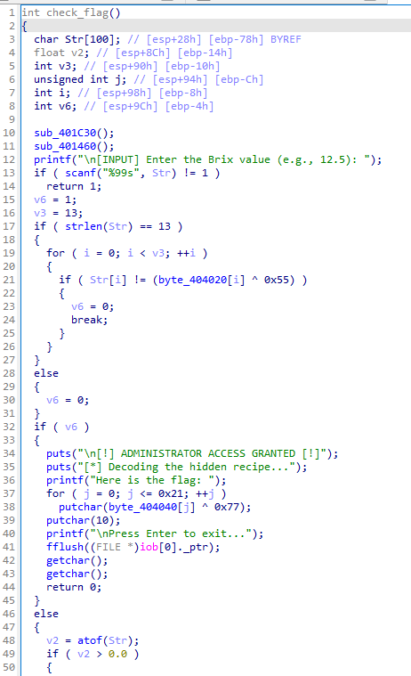
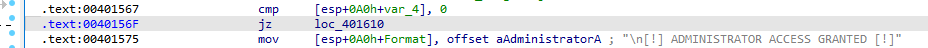
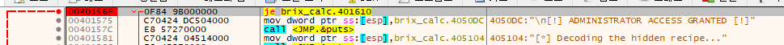
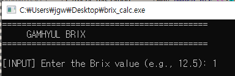
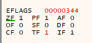
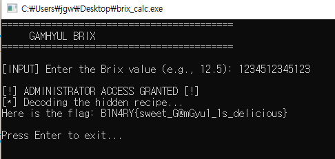

# [DreamHack] Gyul Brix Calculator - Reversing

## 1. 문제 개요

* **문제 링크:** [DreamHack - Gyul Brix Calculator](https://dreamhack.io/wargame/challenges/2554)

* **분야:** Reversing

* **목표:** 바이너리를 정적 분석하여 핵심 검증 로직을 파악하고, 동적 디버깅(x32dbg)을 통해 조건 분기점(ZF)을 강제 조작하여 패스워드 복호화 없이 원본 평문 플래그 획득.

## 2. 취약점 분석
제공된 PE 바이너리 파일(`brix_calc.exe`)을 IDA로 디컴파일하여 분석한 결과, 사용자 입력을 XOR 연산으로 검증한 후 성공 여부를 단일 변수(`v6`)에 저장하여 최종 플래그 출력 분기를 결정하는 취약한 구조 식별.

```c
// [check_flag 함수] 사용자 입력 검증 루틴
// ... (중략) ...
if ( strlen(Str) == 13 )
{
  for ( i = 0; i < v3; ++i )
  {
    if ( Str[i] != (byte_404020[i] ^ 0x55) )
    {
      v6 = 0;
      break;
    }
  }
}
else
// ... (중략) ...
```

```c
// [check_flag 함수] 플래그 출력 조건 분기 루틴
// ... (중략) ...
if ( v6 )
{
  puts("\n[!] ADMINISTRATOR ACCESS GRANTED [!]");
  puts("[*] Decoding the hidden recipe...");
  printf("Here is the flag: ");
  for ( j = 0; j <= 0x21; ++j )
    putchar(byte_404040[j] ^ 0x77);
// ... (중략) ...
```

* **분석 결론:** 사용자 입력 문자열(`Str`)의 길이를 확인(13자리)하고, 특정 배열(`byte_404020`)을 `0x55`로 XOR 연산한 값과 비교하여 인증. 하지만 최종 플래그 복호화 및 출력 여부를 제어하는 것은 단일 조건문 `if ( v6 )`임. 이를 어셈블리로 확인 시 `cmp` 및 `je (jz)` 명령어로 구현되어 있으므로, 동적 디버깅을 통해 분기 지점의 Zero Flag(ZF)를 조작하면 패스워드 검증 로직을 무력화하고 플래그 획득 가능.

## 3. 공격 수행

1. IDA에서 `Strings`를 통해 "Here is the flag:" 문자열을 발견하고 XREF를 통해 핵심 로직이 담긴 검증 함수로 이동.



2. 검증 함수 내부의 디컴파일 코드를 분석하여, 플래그를 출력하는 최종 관문인 `if ( v6 )` 조건문 위치 확인.



3. 어셈블리 뷰(Hex View)로 전환하여 `if ( v6 )` 조건문에 해당하는 메모리 주소(`0040156F`)와 분기 명령어(`jz loc_401610`) 파악.



4. x32dbg 디버거로 바이너리를 로드한 후, 확인한 주소(`0040156F`)로 이동하여 브레이크포인트 설정.



5. 프로그램 실행 후 아무 더미 문자열(`1`) 입력 후 엔터.



6. 브레이크포인트(`je brix_calc.401610`)에서 프로그램이 멈추면, 우측 레지스터 창에서 Zero Flag(`ZF`) 값을 `1`에서 `0`으로 강제 변조하여 분기(실패 구역으로 점프) 무력화.



7. 다시 프로그램 실행하여 강제로 우회된 성공 분기(ADMINISTRATOR ACCESS GRANTED)를 타고 콘솔에 출력되는 최종 플래그 확인.



## 4. 획득 결과

* **FLAG:** `B1N4RY{sweet_G@mGyu1_1s_delicious}`

## 5. 대응 방안
본 문제는 핵심 인증 성공 여부를 단일 상태 변수(`v6`)에 의존하고 있어, 동적 분석을 통한 플래그 레지스터 조작(Control Flow Hijacking)에 매우 취약함. 정적 분석 및 메모리 조작을 방지하기 위한 시큐어 코딩 및 아키텍처 재설계 필요.

* **단일 검증 변수 지양 및 인라인 연산 결합:** 인증 성공 여부를 `v6`와 같은 단일 플래그 변수에 저장해두고 나중에 평가하는 로직 지양. 대신, 올바른 사용자 입력값 자체가 최종 플래그를 복호화하는 암호학적 키로 직접 사용되도록 로직을 결합하여, 단순 분기 우회(Zero Flag 조작)만으로는 원본 평문을 복구할 수 없도록 재설계.

* **안티 디버깅 기술 적용:** `IsDebuggerPresent()`, `CheckRemoteDebuggerPresent()` 등 Windows API를 호출하거나 PEB(Process Environment Block) 구조체를 직접 참조하여 디버거의 부착 여부를 탐지. 탐지 시 플래그 연산 배열을 망가뜨리거나 프로그램을 임의의 에러와 함께 강제 종료하도록 방어 코드 삽입.

## 6. 블루팀 관점 요약

해당 바이너리는 외부 C2 서버와의 통신이나 추가 페이로드 다운로드 행위 없이 로컬 환경에서 단독으로 검증 연산만 수행하므로, 방화벽이나 IDS/IPS 등 네트워크 기반의 관제 장비로는 탐지 불가.

* **대응 방향:** 호스트 단(EDR, 백신)에서 파일 시스템에 유입되는 정적 파일에 대한 시그니처 분석이 유효함. 바이너리 내부에 하드코딩된 특정 알림 문자열과 특정 키(`0x77`, `0x55`)를 활용한 반복적인 XOR 암호화 루프 패턴을 정적 분석으로 도출하여, 리버싱 챌린지 또는 크랙 툴로 분류하기 위한 시그니처 기반 위협 헌팅 수행.

### 6.1. YARA 탐지 룰 (IoC)
정적 분석을 통해 확인된 하드코딩 문자열 데이터와 XOR 복호화 어셈블리 명령어의 특정 바이트 시퀀스를 고유 시그니처로 활용하여 식별할 수 있는 YARA 룰 제안.

```yara
rule Detect_Gyul_Brix_Calculator {
    strings:
        // 타겟 문자열 생성을 위해 하드코딩된 인증 관련 메시지
        $str1 = "ADMINISTRATOR ACCESS GRANTED" ascii wide
        $str2 = "Decoding the hidden recipe..." ascii wide
        $str3 = "Here is the flag:" ascii wide
        
        // 플래그 출력을 위한 핵심 XOR(0x77) 복호화 로직 시그니처
        // xor eax, 77h ; movzx eax, al
        $xor_op = { 83 F0 77 0F B6 C0 } 

    condition:
        // PE 파일 매직 넘버 검증 (\x4D\x5A)
        uint16(0) == 0x5a4d and
        2 of ($str*) and $xor_op
}
```