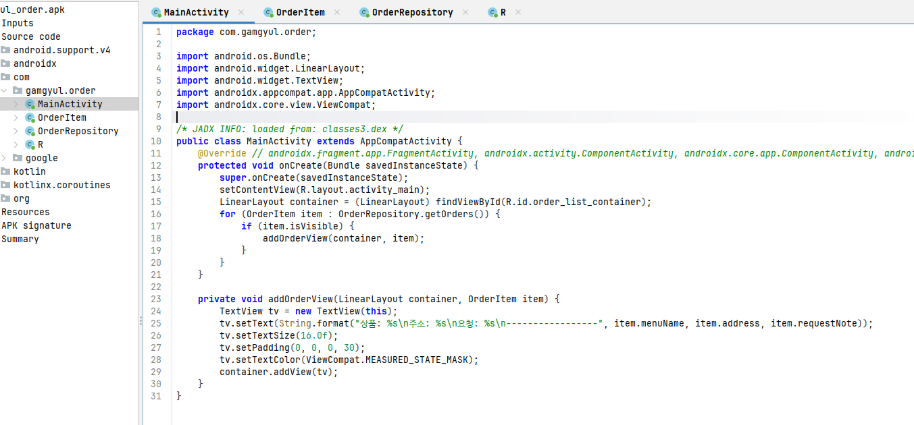
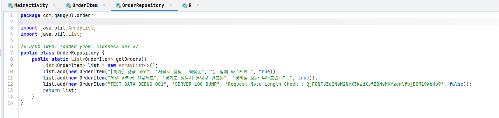
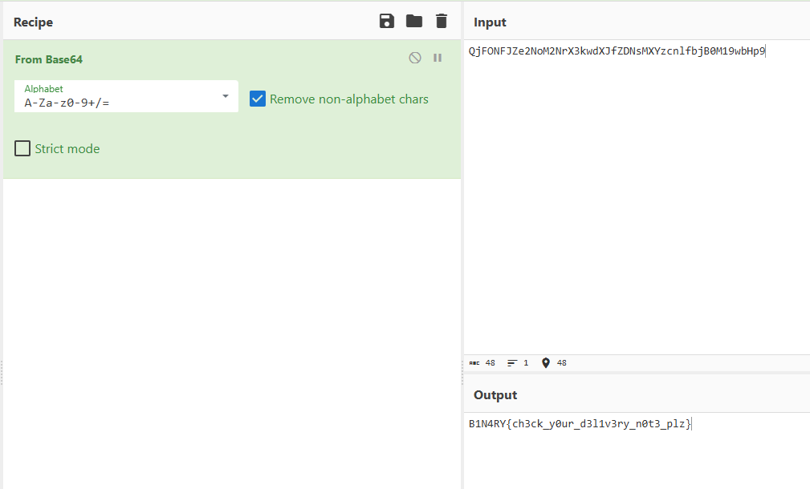

# [DreamHack] Gyul Order - Reversing

## 1. 문제 개요

* **문제 링크:** [DreamHack - Gyul Order](https://dreamhack.io/wargame/challenges/2556)

* **분야:** Reversing, Mobile

* **목표:** 안드로이드 애플리케이션(APK)을 디컴파일하여 소스 코드를 분석하고, UI 화면에 노출되지 않는 디버그용 하드코딩 데이터(주문 요청 사항)에서 인코딩된 플래그 문자열을 찾아 복호화.

## 2. 취약점 분석
제공된 APK 파일(`gyul_order.apk`)을 JADX를 통해 디컴파일하여 소스 코드를 분석한 결과, `OrderRepository` 클래스 내에 테스트용 더미 데이터가 하드코딩되어 있으며, 해당 데이터의 `requestNote` 필드에 주요 정보(플래그)가 Base64로 인코딩된 채 방치된 정보 노출 취약점 식별.

```java
// MainActivity.java: 주문 목록 UI 출력 루틴
// ... (중략) ...
for (OrderItem item : OrderRepository.getOrders()) {
    if (item.isVisible) {
        addOrderView(container, item);
    }
}
// ... (중략) ...
```

```java
// OrderItem.java: 주문 항목 클래스 구조
// ... (중략) ...
public class OrderItem {
    public String address;
    public boolean isVisible;
    public String menuName;
    public String requestNote;
// ... (중략) ...
```

```java
// OrderRepository.java: 하드코딩된 테스트 데이터 노출 취약점
// ... (중략) ...
public static List<OrderItem> getOrders() {
    List<OrderItem> list = new ArrayList<>();
    list.add(new OrderItem("[특가] 감귤 5kg", "서울시 강남구 역삼동", "문 앞에 놔주세요.", true));
    list.add(new OrderItem("제주 한라봉 선물세트", "경기도 성남시 분당구 판교동", "경비실 보관 부탁드립니다.", true));
    list.add(new OrderItem("TEST_DATA_DEBUG_001", "SERVER_LOG_DUMP", "Request Note Length Check : QjFONFJZe2NoM2NrX3kwdXJfZDNsMXYzcnlfbjB0M19wbHp9", false));
    return list;
}
// ... (중략) ...
```

* **분석 결론:** UI 화면에 주문 목록을 렌더링하는 `MainActivity`는 `item.isVisible`이 참(true)인 경우에만 뷰에 추가함. `OrderRepository` 내에 하드코딩된 `TEST_DATA_DEBUG_001` 항목은 `isVisible`이 거짓(false)으로 설정되어 일반 사용자의 앱 화면에는 보이지 않지만, 앱 패키지(소스 코드) 내부에 고스란히 남아있어 정적 분석 시 Base64로 인코딩된 플래그 정보가 노출됨.

## 3. 공격 수행

1. JADX-GUI 안드로이드 역어셈블리 도구를 사용하여 제공된 앱 파일(`gyul_order.apk`) 디컴파일 진행.



2. `MainActivity`의 `onCreate` 메서드에서 주문 리스트를 불러오는 `OrderRepository.getOrders()` 호출 흐름 파악.

3. `OrderRepository` 소스 코드를 확인하여 리스트에 추가되는 데이터 분석. UI에 표시되지 않는 숨겨진 주문 항목(`isVisible == false`) 발견.



4. 해당 항목의 요청 사항(`requestNote`) 필드에 삽입된 의심스러운 인코딩 문자열 `QjFONFJZe2NoM2NrX3kwdXJfZDNsMXYzcnlfbjB0M19wbHp9` 추출. 알파벳 대소문자와 숫자의 조합으로 미루어보아 Base64 인코딩으로 추정.

5. CyberChef 디코더 도구를 활용하여 추출한 문자열을 Base64 디코딩 수행. 디코딩 결과 원본 문자열(`B1N4RY{ch3ck_y0ur_d3l1v3ry_n0t3_plz}`) 획득.



## 4. 획득 결과

* **FLAG:** `B1N4RY{ch3ck_y0ur_d3l1v3ry_n0t3_plz}`

## 5. 대응 방안
본 문제는 개발 과정 중 임시로 삽입한 디버그용 테스트 데이터(Dummy Data)를 제거하지 않고 프로덕션 빌드에 포함시켜 발생한 하드코딩 취약점임. 시큐어 코딩 및 릴리스 파이프라인 정비를 통한 개선 필요.

* **테스트 및 디버그 코드 제거:** 프로덕션(배포용) 환경으로 앱을 빌드하기 전, 소스 코드 내부에 존재하는 테스트용 하드코딩 데이터, 디버깅 로그(`Log.d()`, 콘솔 출력 등)를 철저히 제거. 조건부 컴파일(Build Variants)을 활용하여 Release 빌드에서는 디버그 코드가 포함되지 않도록 빌드 스크립트(build.gradle) 구성.

* **중요 정보 하드코딩 금지 및 난독화 적용:** API 키, 플래그, 암호문 등의 민감한 데이터를 소스 코드에 단순 문자열 형태로 포함하는 것을 지양. 부득이하게 앱 내부에 저장해야 할 경우 Android Keystore 시스템을 활용하거나 보안 저장소에 암호화하여 보관. 추가로 ProGuard 또는 R8 도구를 적용하여 소스 코드 난독화(Obfuscation)를 수행함으로써 역공학 분석의 난이도 상승 도모.

## 6. 블루팀 관점 요약

해당 안드로이드 애플리케이션은 서버와의 외부 네트워크 통신 없이 로컬 환경 내에 하드코딩된 클래스를 통해 취약점이 발현되므로, 방화벽이나 IDS/IPS 등 네트워크 관제 장비로는 정보 유출 탐지가 불가능. 

* **대응 방향:** 모바일 백신(Mobile EDR/Anti-Virus) 및 앱 스토어 심사 단에서 정적 분석(Static Analysis)을 활용한 위협 헌팅 수행. 앱 내부 클래스 파일(DEX) 내에 디버깅 흔적으로 강하게 의심되는 특정 문자열(`TEST_DATA_DEBUG_001`, `SERVER_LOG_DUMP`) 및 Base64 패턴을 시그니처로 도출하여, 사내 보안 정책을 위반한 디버그용 찌꺼기 파일이나 테스트 코드가 릴리스 버전에 섞여 들어왔는지 식별하기 위한 YARA 룰 제안.

### 6.1. YARA 탐지 룰 (IoC)
정적 분석을 통해 소스코드에서 확정적으로 발견된 디버그/테스트 식별용 특수 문자열을 고유 시그니처로 활용하여 탐지.

```yara
rule Detect_Gyul_Order {
    strings:
        // 개발자 디버그 및 테스트 용도로 삽입된 명백한 하드코딩 문자열
        $debug_str1 = "TEST_DATA_DEBUG_001" ascii wide
        $debug_str2 = "SERVER_LOG_DUMP" ascii wide
        $debug_str3 = "Request Note Length Check :" ascii wide
        
        // 플래그로 추정되는 Base64 인코딩 데이터의 정확한 시퀀스
        $base64_leak = "QjFONFJZe2NoM2NrX3kwdXJfZDNsMXYzcnlfbjB0M19wbHp9" ascii wide

    condition:
        // APK 파일 포맷(ZIP 포맷) 매직 넘버 검증 (PK\x03\x04 -> 0x04034b50)
        uint32(0) == 0x04034b50 and
        all of ($debug_str*) and $base64_leak
}
```