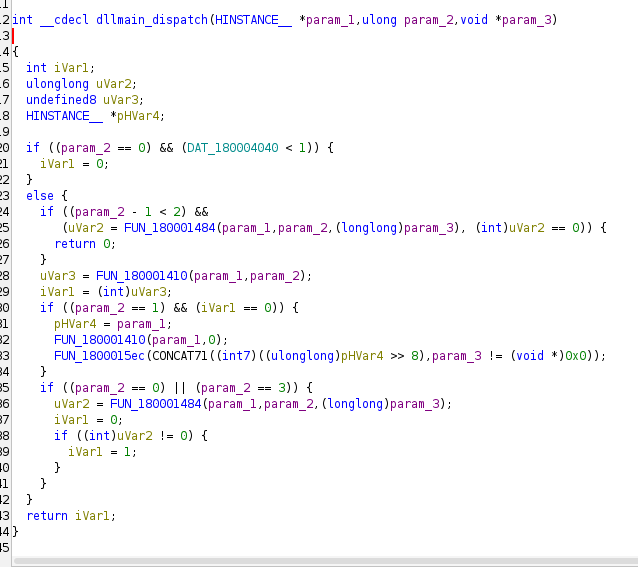
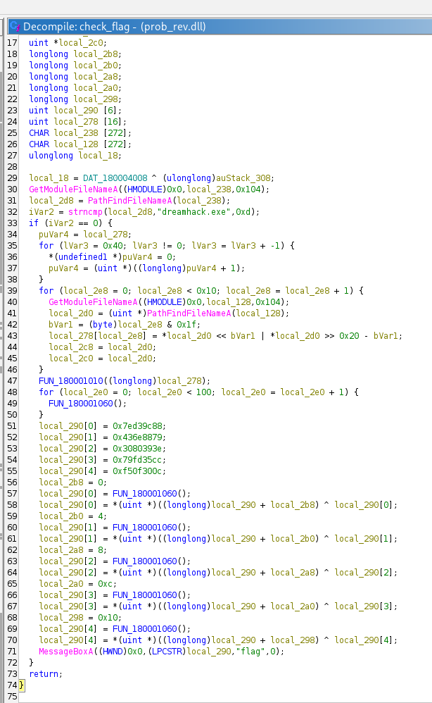
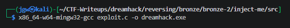
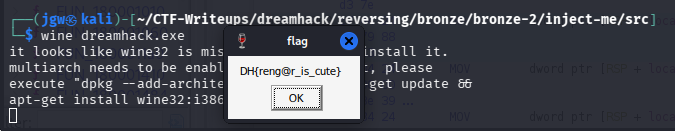

# [DreamHack] Inject ME!!! - Reversing

## 1. 문제 개요

* **문제 링크:** [DreamHack - Inject ME!!!](https://dreamhack.io/wargame/challenges/119)

* **분야:** Reversing

* **목표:** DLL 파일의 `DllMain`에 구현된 호스트 프로세스명 검증 로직을 분석하고, 이를 우회하여 해당 DLL을 로드하는 전용 로더(Loader)를 제작해 플래그 획득.

## 2. 취약점 분석
제공된 PE 바이너리(`prob_rev.dll`)를 Ghidra로 디컴파일하여 분석한 결과, DLL 로드 시 호출되는 진입점 내부(`check_flag` 함수)에서 특정 실행 파일명(`dreamhack.exe`)을 평문으로 하드코딩하여 비교하는 취약한 검증 로직 파악.

```c
// ... (중략) ...
void check_flag(void)
{
  // ... (중략) ...
  local_18 = DAT_180004008 ^ (ulonglong)auStack_308;
  GetModuleFileNameA((HMODULE)0x0,local_238,0x104);
  local_2d8 = PathFindFileNameA(local_238);
  iVar2 = strncmp(local_2d8,"dreamhack.exe",0xd);
  
  if (iVar2 == 0) {
    // ... (중략) 플래그 복호화 연산 ...
    MessageBoxA((HWND)0x0,(LPCSTR)local_290,"flag",0);
  }
  return;
}
```

* **분석 결론:** DLL 로드 시 `GetModuleFileNameA` API를 통해 현재 실행 중인 프로세스의 경로를 얻고, 파일명이 `dreamhack.exe`와 일치할 경우에만 내부 플래그 복호화 연산을 수행한 뒤 `MessageBoxA`로 출력. 단순 문자열 비교에 의존하므로, 동일한 이름의 로더(exe) 프로그램을 제작하여 DLL을 인젝션(로드)하면 조건문 우회 가능.

## 3. 공격 수행

1. Ghidra를 통해 DLL의 진입점(`dllmain_dispatch`) 확인. `param_2 == 1` (`DLL_PROCESS_ATTACH`)일 때 특정 로직으로 분기하는 구조 파악.



2. 내부 함수(`check_flag`)로 진입하여, 프로세스명 검증 로직 및 조건 통과 시 실행되는 `MessageBoxA` 호출 흐름 확인.



3. 해당 DLL을 로컬 메모리에 적재하기 위해 `windows.h`의 `LoadLibraryA` API를 호출하는 C언어 기반의 Loader 소스코드(`exploit.c`) 작성.

```c
#include <windows.h>

int main() {
    LoadLibraryA("prob_rev.dll"); 
    return 0;
}
```

4. 리눅스 환경 제약을 우회하기 위해 `MinGW` 크로스 컴파일러를 사용하여, 작성한 소스코드를 윈도우용 타겟 PE 파일(`dreamhack.exe`)로 빌드 수행.



5. 호환성 계층 도구인 `Wine`을 통해 컴파일된 `dreamhack.exe`를 실행하여 DLL의 검증 로직 통과 및 복호화된 플래그 팝업창 호출.



## 4. 획득 결과
도출된 조건에 맞춰 로더 프로그램을 빌드 및 실행하여 원본 플래그 획득 성공.

* **FLAG:** `DH{reng@r_is_cute}`

## 5. 대응 방안
프로그램 실행 흐름을 제어하는 중요 조건에 대해 단순 문자열 비교를 적용함에 따라 발생하는 우회 취약점 방지를 위해 시큐어 코딩 조치 적용.

* **인증 대상 검증 강화:** 단순 파일명(`dreamhack.exe`) 비교는 공격자가 실행 파일의 이름만 변경하여 쉽게 우회할 수 있음. 따라서 호출하는 프로세스의 디지털 서명 유효성을 검증하거나, 사전에 인가된 호스트 프로세스의 바이너리 해시(SHA-256 등)를 비교하는 방식으로 인증 절차 강화.

* **주요 문자열 난독화:** 공격자가 정적 분석을 통해 검증 조건을 직관적으로 파악하지 못하도록, 비교 대상이 되는 문자열("dreamhack.exe") 및 팝업 텍스트("flag")에 대해 평문 하드코딩을 지양하고 문자열 난독화 또는 암호화 기법 적용.

## 6. 블루팀 관점 요약

### 6.1. 탐지 및 분석 한계
* **네트워크 행위 없음:** 해당 DLL은 외부 C&C 통신 없이 로컬 메모리에서 호스트 프로세스에 의해 로드되어 내부 로직(복호화 및 메시지 박스 출력)만 단독으로 수행하므로, 네트워크 장비(IPS/WAF)의 트래픽 기반 탐지 불가.

* **대응 방향:** EDR 및 호스트 단에서 비정상적인 프로세스(알려지지 않은 해시를 가진 dreamhack.exe)가 특정 DLL을 `LoadLibrary`로 호출하는 프로세스 실행 흐름 기반의 정적/동적 분석을 수행하고, 로컬 시그니처를 바탕으로 위협 헌팅 수행.

### 6.2. YARA 탐지 룰 (IoC)
분석 단계에서 확인된 프로세스명 비교 로직의 하드코딩 문자열 및 플래그 출력 API 특징을 활용하여, 유사한 인젝션 검증 로직을 포함한 바이너리를 탐지할 수 있는 YARA 룰 제안.

```yara
rule Detect_Inject_ME {
    strings:
        // 하드코딩된 타겟 프로세스 문자열 시그니처
        $target_proc = "dreamhack.exe" ascii wide

        // 팝업창 타이틀 문자열
        $msg_title = "flag" ascii wide

    condition:
        uint16(0) == 0x5a4d and // MZ Header (PE file 검증)
        pe.characteristics & pe.DLL and // 파일 포맷이 DLL인지 확인
        $target_proc and $msg_title
}
```