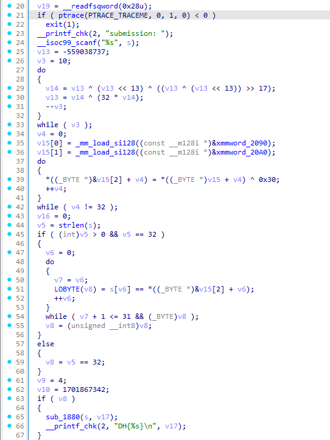
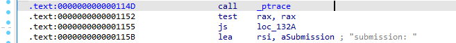
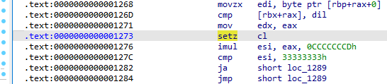
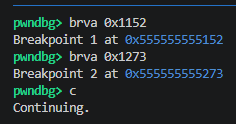
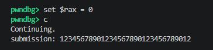
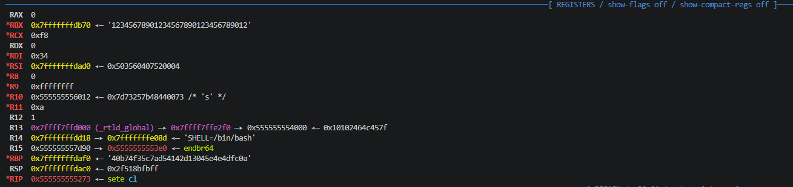
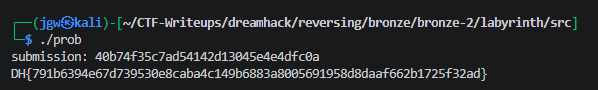

# [DreamHack] Labyrinth - Reversing

## 1. 문제 개요

* **문제 링크:** [DreamHack - Labyrinth](https://dreamhack.io/wargame/challenges/2307)

* **분야:** Reversing

* **목표:** ptrace 안티 디버깅 로직을 우회하고, 동적 디버깅을 통해 정답이 생성되어 비교되는 루프 직전의 메모리(RBP 레지스터)를 조회하여 진짜 정답(Key) 획득.

## 2. 취약점 분석
제공된 ELF 바이너리 파일(`prob`)을 IDA로 디컴파일하여 분석한 결과, 프로그램 시작 시 `ptrace`를 통해 디버깅을 탐지. 이후 사용자 입력을 받고, 내부적으로 특정 데이터를 XOR 연산하여 진짜 정답을 생성한 뒤, 사용자의 입력값과 1바이트씩 평문 비교하는 취약한 구조 파악.

```c
// [main 함수] 디버깅 탐지 및 사용자 입력 로직
// ... (중략) ...
if ( ptrace(PTRACE_TRACEME, 0, 1, 0) < 0 )
  exit(1);
__printf_chk(2, "submission: ");
__isoc99_scanf("%s", s);
// ... (중략) ...
```

```c
// [main 함수] 내부 데이터 XOR 연산 및 진짜 정답 배열(v15) 생성
// ... (중략) ...
v15[0] = _mm_load_si128((const __m128i *)&xmmword_2090);
v15[1] = _mm_load_si128((const __m128i *)&xmmword_20A0);
do
{
  *((_BYTE *)&v15[2] + v4) = *((_BYTE *)v15 + v4) ^ 0x30;
  ++v4;
}
while ( v4 != 32 );
// ... (중략) ...
```

```c
// [main 함수] 생성된 정답과 사용자 입력값 1바이트씩 평문 비교
// ... (중략) ...
if ( (int)v5 > 0 && v5 == 32 )
{
  v6 = 0;
  do
  {
    v7 = v6;
    LOBYTE(v8) = s[v6] == *((_BYTE *)&v15[2] + v6);
    ++v6;
  }
  while ( v7 + 1 <= 31 && (_BYTE)v8 );
// ... (중략) ...
```

* **분석 결론:** 프로그램은 실행 직후 `ptrace`로 디버깅을 탐지하므로, 해당 분기점의 반환값(RAX)을 조작하여 우회 가능. 이후 루프 내에서 사용자의 입력값(`s`)과 완성된 진짜 정답(`v15[2]`)을 1바이트씩 순차 비교하므로, 해당 루프 초입에 브레이크포인트를 걸고 정답이 적재된 주소(`RBP` 레지스터)를 조회하면 평문 플래그 재료 획득 가능.

## 3. 공격 수행

1. IDA 디컴파일 뷰를 통해 프로그램의 전체적인 동작 흐름(안티 디버깅, 정답 생성 로직, 비교 루프 등)을 파악.



2. IDA를 통해 `ptrace` 안티 디버깅 함수 호출부 및 조건부 점프(`js`) 지점 파악.



3. 사용자 입력값(`[rbx+rax]`)과 내부 생성 정답(`[rbp+rax]`)이 1바이트씩 비교(`cmp`)되는 어셈블리 루프 지점 파악.



4. GDB(pwndbg)를 통해 바이너리를 로드한 후, 안티 디버깅 검사 직후(`0x1152`)와 비교문 내부(`0x1273`)에 각각 브레이크포인트 설정 후 실행.



5. 첫 번째 브레이크포인트(안티 디버깅 우회 지점)에서 프로그램이 멈추면, 반환값 레지스터(`RAX`)를 0으로 강제 변조하여 우회. 이후 길이 조건을 만족시키기 위해 32바이트의 더미 문자열 입력 후 논리 진행.



6. 입력 완료 후 두 번째 브레이크포인트(비교 루프 내부)에서 정지 시, 레지스터 창에서 기준 주소를 담고 있는 `RBP` 레지스터에 평문으로 적재된 32바이트 정답 문자열 확인.



7. 바이너리를 단독으로 재실행하여, 메모리에서 훔쳐낸 정답 문자열을 그대로 입력하여 최종 플래그 획득 확인.



## 4. 획득 결과

* **FLAG:** `DH{791b6394e67d739530e8caba4c149b6883a8005691958d8daaf662b1725f32ad}`

## 5. 대응 방안
본 문제는 암호화 연산이 수행된 후 메모리상에 정답이 평문으로 남아 단순 문자열 비교(`cmp`)를 수행하므로, 동적 분석을 통한 레지스터 값 추출에 취약함. 정적 분석 우회 및 메모리 탈취를 방지하기 위한 시큐어 코딩 관점의 아키텍처 재설계 필요.

* **메모리 내 평문 노출 지양:** 최종 인증 시 생성된 평문 정답과의 단순 비교 로직 사용 지양. 사용자의 입력값을 내부 암호화 알고리즘으로 동적 처리한 뒤, 미리 저장된 해시 결과값끼리 비교하는 구조로 변경하여 원본 정답을 메모리에서 알 수 없도록 설계.

* **안티 디버깅 로직 다각화 및 강제 결합:** `ptrace` 반환값 확인과 같은 단순 분기문은 디버거에서 레지스터 조작 한 번으로 우회 가능. 타이밍 체크 등 탐지 로직을 다각화하고, 탐지 시 즉시 종료가 아닌 내부 복호화 키 배열에 임의의 오프셋을 더하여 연산 자체를 망가뜨리는 구조로 결합.

## 6. 블루팀 관점 요약
해당 바이너리는 외부 네트워크(C2 서버 등)와의 통신이나 추가 페이로드 다운로드 행위 없이 로컬 환경 내에서 단독으로 검증 연산만 수행. 따라서 방화벽, IDS/IPS 등의 네트워크 기반 보안 장비로는 탐지 불가. 호스트 단(EDR, 백신)에서 파일 시스템에 유입된 정적 파일의 고유 로직 및 하드코딩된 문자열을 분석하는 시그니처 기반 위협 헌팅 수행.

### 6.1. YARA 탐지 룰 (IoC)
정적 분석을 통해 식별된 바이너리 내부의 하드코딩된 상태 알림 문자열 데이터와 ELF 파일 기본 구조를 조합하여 리버싱 과제 및 크랙 툴로 분류하기 위한 YARA 룰 제안.

```yara
rule Detect_Labyrinth {
    strings:
        // 프로그램 실행 및 인증 관련 하드코딩 메시지
        $str1 = "submission: " ascii wide
        $str2 = "DH{%s}\n" ascii wide
        
    condition:
        // ELF 파일 매직 넘버 검증
        uint32(0) == 0x464C457F and // ELF "\x7FELF"
        all of ($str*)
}
```