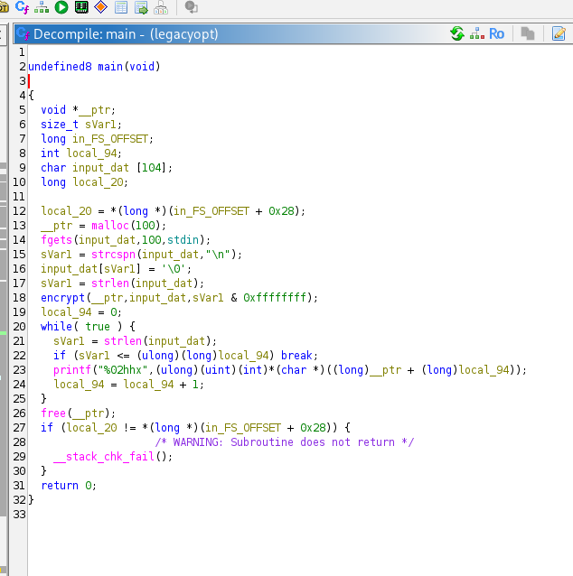
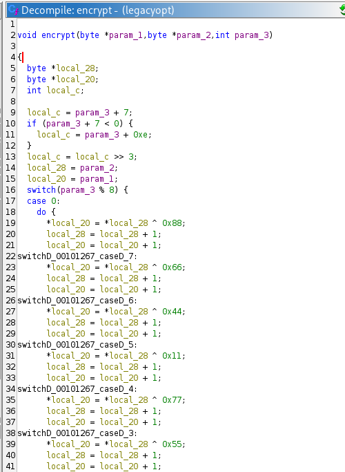
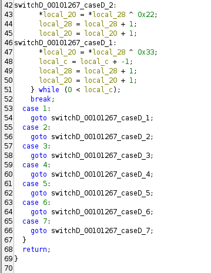
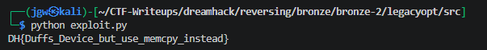

# [DreamHack] LegacyOpt - Reversing

## 1. 문제 개요

* **문제 링크:** [DreamHack - legacyopt](https://dreamhack.io/wargame/challenges/1532)

* **분야:** Reversing

* **목표:** 제공된 바이너리의 암호화 로직(Duff's Device)을 역분석하여, 암호화된 `output.txt` 파일로부터 원본 플래그 복호화.

## 2. 취약점 분석
제공된 PE 바이너리 파일(`legacyopt`)을 Ghidra로 디컴파일하여 분석한 결과, `encrypt` 함수 내부에서 '더프의 장치(Duff's Device)' 형태의 제어 흐름 구조를 활용한 단순 반복 XOR 연산 로직 파악.

```c
// ... (중략) ...
void encrypt(byte *param_1,byte *param_2,int param_3)
{
  // ... (중략) ...
  switch(param_3 % 8) {
  case 0:
    do {
      *local_20 = *local_28 ^ 0x88;
      // ... (중략) ...
switchD_00101267_caseD_7:
      *local_20 = *local_28 ^ 0x66;
      // ... (중략) ...
switchD_00101267_caseD_1:
      *local_20 = *local_28 ^ 0x33;
      local_c = local_c + -1;
      // ... (중략) ...
    } while (0 < local_c);
  break;
  // ... (중략) ...
}
```

* **분석 결론:** 입력 문자열의 길이를 8로 나눈 나머지를 기준으로 switch문의 시작 위치를 결정하며, 8바이트의 고정된 키 배열(0x88, 0x66, 0x44, 0x11, 0x77, 0x55, 0x22, 0x33)과 순차적으로 XOR 연산 수행. XOR 연산의 특성을 활용하여, 추출한 암호문(`output.txt`)에 동일한 로직을 적용해 복호화 연산 수행 가능.

## 3. 공격 수행

1. Ghidra를 통해 바이너리의 진입점(`main`)을 확인하고, 사용자 입력 데이터가 `encrypt` 함수로 인가되는 흐름 파악.



2. 내부 함수(`encrypt`)로 진입하여, 루프 횟수 계산식과 `do-while`, `goto` 문이 혼합된 8바이트 단위 반복 XOR 연산의 키 시퀀스 규칙 식별.





3. 파이썬의 `bytearray`를 활용하여 제공된 16진수 암호문(`output.txt`)을 읽고, 길이의 나머지 역순 점프를 처리하는 수식(`(8 - (input_len % 8)) % 8`)을 적용한 복호화 익스플로잇 스크립트(`exploit.py`) 작성.

```python
with open("output.txt", "r") as f:
    hex_data = f.read().strip()

enc_data = bytes.fromhex(hex_data)
input_len = len(enc_data)

xor_keys = [0x88, 0x66, 0x44, 0x11, 0x77, 0x55, 0x22, 0x33]

start_idx = (8 - (input_len % 8)) % 8

flag = bytearray()
for i in range(input_len):
    current_key = xor_keys[(start_idx + i) % 8]
    flag.append(enc_data[i] ^ current_key)

print(flag.decode())
```

4. 작성한 익스플로잇 스크립트를 실행하여 복호화 루틴 통과 및 원본 플래그 문자열 출력 확인.



## 4. 획득 결과
로직에 맞춰 파이썬 복호화 프로그램을 작성 및 실행하여 원본 플래그 획득 성공.

* **FLAG:** `DH{Duffs_Device_but_use_memcpy_instead}`

## 5. 대응 방안
프로그램 내부에 데이터를 숨기거나 난독화하는 중요 로직에 대해 단순 XOR 비트 연산을 적용함에 따라 발생하는 취약점 방지를 위해 시큐어 코딩 조치 적용.

* **표준 암호화 알고리즘 적용:** 단순 하드코딩된 키 기반의 XOR 연산은 정적 분석을 통해 알고리즘과 키가 쉽게 노출되어 우회 가능. 따라서 민감한 데이터를 보호해야 할 경우, AES와 같이 검증된 안전한 표준 대칭키 암호화 알고리즘 적용.

* **비표준 최적화 기법 지양:** 과거의 CPU 성능 한계를 극복하기 위해 사용된 더프의 장치(Duff's Device) 구조는 코드의 가독성을 해치고 분석을 어렵게 함. 현대의 환경에서는 컴파일러 최적화를 방해할 수 있으므로, 의도적인 난독화 목적이 아니라면 표준 라이브러리 함수(`memcpy` 등) 적용 권장.

## 6. 블루팀 관점 요약

### 6.1. 탐지 및 분석 한계
* **네트워크 행위 없음:** 해당 바이너리는 오프라인 로컬 환경에서 단일 암호화 기능만 수행하므로, 방화벽이나 IDS/IPS 등의 트래픽 기반 네트워크 보안 장비로는 위협 탐지 불가.

* **대응 방향:** EDR 및 호스트 단에서 의심스러운 파일 수집 시, 정적 분석을 통한 함수 내부의 비정상적인 제어 흐름 구조 및 하드코딩된 연산 상수 패턴을 기반으로 악성 행위 여부를 판별하고 로컬 시그니처 헌팅 수행.

### 6.2. YARA 탐지 룰 (IoC)
분석 단계에서 확인된 반복적인 8바이트 커스텀 XOR 키 배열의 특징을 활용하여, 유사한 형태의 데이터 난독화 로직이 포함된 바이너리를 탐지할 수 있는 YARA 룰 제안.

```yara
rule Detect_Legacyopt_Custom_XOR {
    strings:
        // 하드코딩된 8바이트 연속 XOR 키 시그니처
        $xor_key = { 88 66 44 11 77 55 22 33 }
        
        // 플래그 힌트로 사용될 수 있는 문자열
        $msg_hint = "output.txt" ascii wide
        
    condition:
        uint32(0) == 0x464c457f and // ELF 포맷 검증 (리눅스 바이너리)
        ($xor_key or $msg_hint)
}
```