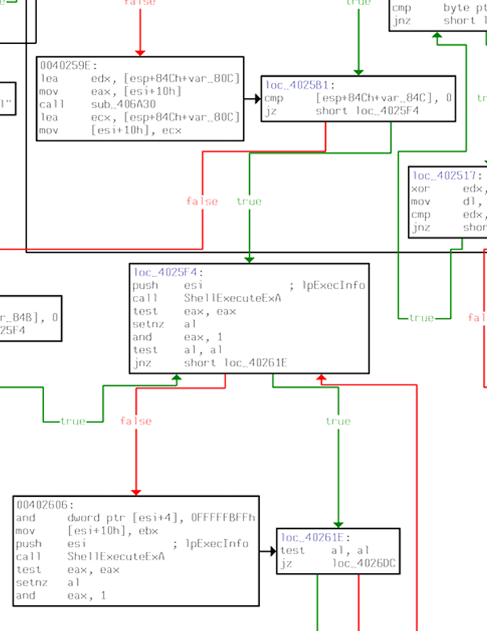

# [Dreamhack] Malware L08 - Reversing

## 1. 문제 개요

* **문제 링크:** [Dreamhack - Malware L08](https://dreamhack.io/wargame/challenges/375)

* **분야:** Reversing

* **목표:** 제공된 악성코드 제어 흐름 그래프(CFG)를 분석하여 다른 악성코드를 실행(추가 감염)시키는 분기점의 주소 탐색

## 2. 취약점 분석
제공된 파일은 실제 실행 가능한 바이너리가 아닌, IDA의 제어 흐름도를 캡처한 문서. 해당 악성코드는 시스템 내부에서 다른 실행 파일(`.exe`)을 은밀하게 구동하기 위해 Windows API를 호출. 디스어셈블리 흐름을 따라가며 인자 세팅, 함수 호출, 반환값 검증 단계를 분석.


```assembly
; ... (중략) ...
loc_40259E:
lea     edx, [esp+84Ch+var_80C]
mov     eax, [esi+10h]
call    sub_406A30
; ... (중략) ...
```

```assembly
; ... (중략) ...
loc_4025F4:
push    esi                 ; lpExecInfo
call    ShellExecuteExA     ; 추가 악성코드 페이로드 실행
; ... (중략) ...
```

```assembly
; ... (중략) ...
test    eax, eax            ; ShellExecuteExA 함수의 반환값(성공 여부) 확인
setnz   al
and     eax, 1
test    al, al
jnz     short loc_40261E    ; 성공 시 특정 로직으로 분기
; ... (중략) ...
```

* **분석 결론:** 32비트 Windows 환경의 악성코드로, 구조체 포인터(`esi`)를 활용하여 `ShellExecuteExA` API를 호출하는 `loc_4025F4` 블록이 추가 감염을 유발하는 핵심 지점임을 식별.

## 3. 공격 수행

1. 주어진 제어 흐름 그래프(CFG)를 분석하여 악성코드의 전체적인 분기 구조 파악.

2. "다른 악성코드를 실행하여 추가 감염을 일으킨다"는 목표에 맞추어, 프로세스 생성 및 실행에 관여하는 Windows API(`WinExec`, `CreateProcess`, `ShellExecuteExA` 등)의 호출 지점 탐색.

3. 분석 결과, 하단 분기에서 `SHELLEXECUTEINFO` 구조체의 주소가 담긴 `esi` 레지스터를 스택에 푸시(Push)하고 `ShellExecuteExA` API를 호출하는 구간 식별.



4. 해당 동작이 일어나는 특정 코드 블록의 시작 라벨이 `loc_4025F4`임을 확인.

5. 명령어 기반이 아닌 해당 분기를 담당하는 시작 주소를 요구하므로, `004025F4`를 최종 플래그 주소로 확정.

## 4. 획득 결과
추가 감염 로직의 핵심이 되는 `ShellExecuteExA` API 호출 블록을 식별하여 목표 분기점 주소 획득 성공.

* **FLAG:** `004025F4`

## 5. 대응 방안
프로세스 실행 및 외부 프로그램 호출 로직을 구현할 때 발생할 수 있는 보안 위협을 방지하기 위한 시큐어 코딩 및 개발자 관점의 조치.

* **실행 경로 및 무결성 검증 로직 구현:** `ShellExecuteExA`나 `CreateProcess` 등을 통해 외부 바이너리를 실행해야 할 경우, 대상 파일의 절대 경로를 화이트리스트 기반으로 관리하고 사전 해시(SHA-256) 검증 루틴을 적용하여 임의 파일 실행 차단.

* **최소 권한의 원칙 적용:** 불필요한 관리자 권한으로 자식 프로세스가 구동되지 않도록 `SHELLEXECUTEINFO` 구조체 속성을 튜닝하고, 제한된 사용자 토큰 환경에서 외부 프로그램을 구동하도록 로직을 설계하여 침해 발생 시 피해 범위 최소화.

## 6. 블루팀 관점 요약
바이너리 정적 분석을 통해 확보한 호스트 기반 단서(API 호출 및 분기점)를 활용한 위협 탐지 및 침해 대응 시나리오 제안.

### 6.1. 탐지 및 분석 한계
* **동적 분석의 부재:** 제공된 CFG(제어 흐름 그래프) 이미지 기반의 정적 분석만 진행되었으므로, `ShellExecuteExA`를 통해 실제로 어떤 파일명이 어느 경로에서 실행되는지, C2 서버와의 네트워크 통신 여부 등은 파악 불가.

### 6.2. YARA 탐지 룰 (IoC)
바이너리 정적 분석을 통해 도출된 핵심 식별자(실행 관련 Windows API 및 문자열 단서)를 바탕으로 위협 헌팅을 위한 YARA 룰 제안.

```yara
rule Detect_Malware_L08 {
    strings:
        // 프로세스 실행 관련 핵심 API 시그니처
        $api_exec = "ShellExecuteExA" ascii fullword
        
        // 악성코드 추가 감염 관련 설치 문자열 단서
        $str_exe = ".exe" ascii
        $str_install = "Install" ascii
        $str_inf = ".inf" ascii

    condition:
        $api_exec and (1 of ($str_*))
}
```