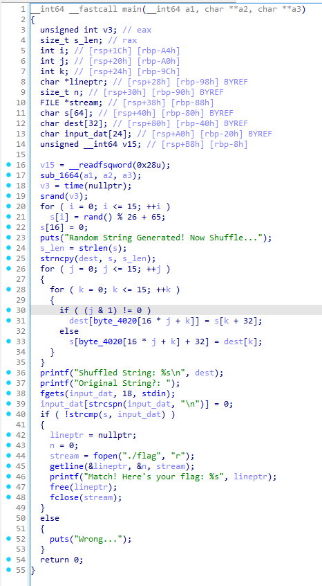
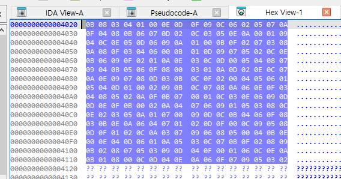
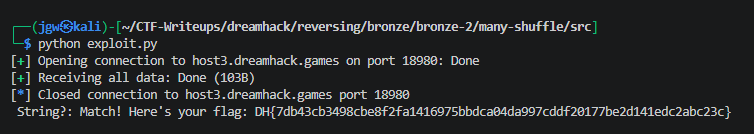

# [DreamHack] Many Shuffle - Reversing

## 1. 문제 개요

* **문제 링크:** [DreamHack - many-shuffle](https://dreamhack.io/wargame/challenges/1618)

* **분야:** Reversing

* **목표:** `time(nullptr)`를 시드로 사용하는 C 표준 난수 생성기(`rand()`)의 취약점을 이용해, 원본 무작위 16자리 문자열을 예측하여 비교 검증 우회 및 플래그 획득.

## 2. 취약점 분석
제공된 ELF 바이너리 파일(`many-shuffle`)을 IDA로 디컴파일하여 분석한 결과, 난수 생성의 시드(Seed) 값으로 현재 시간(`time(nullptr)`)을 사용하는 로직 식별. 또한 복잡한 셔플(Shuffle) 과정을 거친 문자열(`dest`)이 아닌, 초기 생성된 원본 문자열(`s`)을 사용자 입력과 비교하는 논리적 취약점 존재.

```c
// [main 함수] 난수 시드 초기화 및 원본 문자열 생성 로직
// ... (중략) ...
v15 = __readfsqword(0x28u);
sub_1664(a1, a2, a3);
v3 = time(nullptr);
srand(v3);
for ( i = 0; i <= 15; ++i )
  s[i] = rand() % 26 + 65;
s[16] = 0;
// ... (중략) ...
```

```c
// [main 함수] 셔플 로직 및 입력값 검증 로직
// ... (중략) ...
// 셔플 루프 생략 (결과물 검증과 무관함)
printf("Shuffled String: %s\n", dest);
printf("Original String?: ");
fgets(input_dat, 18, stdin);
input_dat[strcspn(input_dat, "\n")] = 0;
if ( !strcmp(s, input_dat) )
{
// ... (중략) ...
```

* **분석 결론:** 바이너리가 `srand(time(nullptr))`를 사용하므로 공격자의 로컬 스크립트 실행 시간과 동기화가 가능하며, 셔플 로직과 무관하게 최초 생성된 16바이트 문자열(`s`)만 예측하여 전송하면 검증 우회 가능.

## 3. 공격 수행

1. IDA를 통한 `main` 함수 진입점 디컴파일 및 취약한 난수 시드 설정 로직 식별. 셔플 로직의 결과(`dest`)가 아닌 원본 배열(`s`)을 비교하는 부분 확인.



2. IDA의 Hex View 기능을 활용하여 난수 연산 및 셔플의 기초가 되는 `byte_4020` 배열의 원본 데이터 추출. (실제 익스플로잇에서는 원본 `s` 배열만 요구되므로 셔플 로직은 더미 코드로 작용)



3. Pwntools와 `ctypes`를 활용하여 C 표준 라이브러리(`libc.so.6`)를 로드. 타임스탬프 기반으로 원본 문자열을 동일하게 생성하여 전송하는 자동화 익스플로잇 스크립트(`exploit.py`) 작성. (최초 실행 시 네트워크 딜레이로 인한 실패를 확인하고, 시드 값에 `+1`을 주어 오차 범위 보정 적용)

```python
from pwn import *
import time
import ctypes

# p = process('./many-shuffle') 로컬
p = remote('host3.dreamhack.games', 18980) # 실제 서버

hex_data = "0B08030401000E0D0F09 ... (중략) ... 0C060205070A0F0302"
data = list(bytearray.fromhex(hex_data))

libc = ctypes.CDLL('libc.so.6')

v3 = int(time.time()) + 1  # 실제 서버일때는 시간 오차 + - 1 조절
libc.srand(v3)

s = [0] * 64
for i in range(16):
    s[i] = (libc.rand() % 26) + 65
s[16] = 0

s_len = len(s)
dest = [0] * 32

for i in range(16):
    dest[i] = s[i]

# for j in range(16):                 # 없어도 됨
#     for k in range(16):
#         if((j & 1) != 0):
#             dest[data[16 * j + k]] = s[k + 32]
#         else :
#             s[data[16 * j + k] + 32] = dest[k]

input_dat = bytes(s[:16])
p.sendlineafter(b"Original", input_dat)
print(p.recvall().decode())
```

## 4. 획득 결과
작성한 파이썬 익스플로잇 스크립트 실행을 통해 서버 환경의 네트워크 지연(+1초)을 보정한 난수 예측에 성공하여 최종 플래그 획득.



* **FLAG:** `DH{7db43cb3498cbe8f2fa1416975bbdca04da997cddf20177be2d141edc2abc23c}`

## 5. 대응 방안
시간 기반의 예측 가능한 난수 생성 로직을 제거하고, 안전한 난수 생성을 보장하기 위한 시큐어 코딩 적용.

* **안전한 난수 생성기 도입:** `time()`과 같이 외부에서 유추 가능한 값을 시드로 사용하는 `srand()` 사용을 지양하고, 보안성이 검증된 OS 레벨의 난수 생성 시스템(예: 리눅스의 `/dev/urandom`, 윈도우의 `BCryptGenRandom` 등) 활용.

* **불필요한 더미 로직 및 정보 노출 제거:** 프로그램 로직 상 사용되지 않는 셔플 로직을 제거하여 코드의 복잡성을 줄이고, 사용자에게 셔플된 문자열을 출력(`printf`)해주는 등 불필요한 힌트 제공 방지.

## 6. 블루팀 관점 요약

### 6.1. 탐지 및 분석 한계
* **네트워크 통신 행위 없음:** 해당 바이너리는 외부 악성 C&C 서버 통신 없이 로컬 환경 내에서 단독으로 난수 배열 생성 및 문자열 비교 연산을 수행하므로, 방화벽이나 IPS 등 네트워크 트래픽 기반의 보안 장비로는 위협 탐지 불가.

* **대응 방향:** EDR 및 호스트 단에서 바이너리 내부의 특정 스트링(게임 프롬프트 메시지 등)과 비표준 커스텀 배열 셔플 로직 및 하드코딩된 전역 데이터(`byte_4020`)를 정적 분석하여 식별. 이를 통해 로직 결함을 내포한 형태의 파일을 탐지하는 로컬 위협 헌팅 수행.

### 6.2. YARA 탐지 룰 (IoC)
정적 분석을 통해 확인된 하드코딩 게임 메시지와 셔플 연산에 사용된 전역 배열(`byte_4020`)의 특징적인 Hex 시그니처를 활용하여, 유사한 취약점을 가진 바이너리를 탐지할 수 있는 YARA 룰 제안.

```yara
rule Detect_Many_Shuffle {
    strings:
        // 게임 진행 및 안내 스트링 시그니처
        $msg_gen = "Random String Generated! Now Shuffle..." ascii wide
        $msg_shuffle = "Shuffled String: %s\n" ascii wide
        $msg_input = "Original String?: " ascii wide
        $msg_win = "Match! Here's your flag: %s" ascii wide
        $msg_fail = "Wrong..." ascii wide

        // byte_4020 전역 배열 초기 바이트 시그니처 (Hex)
        $hex_array = { 0B 08 03 04 01 00 0E 0D 0F 09 0C 06 02 05 07 0A }

    condition:
        uint32(0) == 0x464c457f and // ELF 헤더 매직 넘버 검증 (\x7F ELF)
        $hex_array and 3 of ($msg_*)
}
```