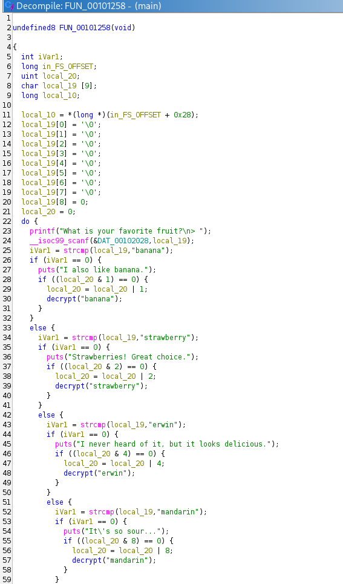
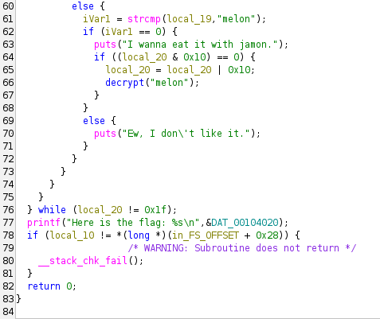
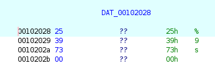
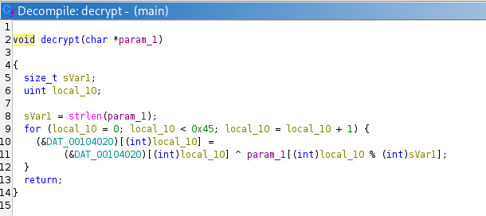
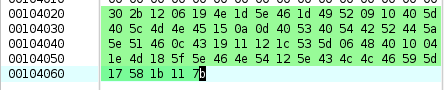
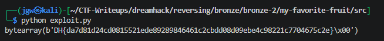

# [DreamHack] My Favorite Fruit - Reversing

## 1. 문제 개요

* **문제 링크:** [DreamHack - My Favorite Fruit](https://dreamhack.io/wargame/challenges/1921)

* **분야:** Reversing

* **목표:** `scanf("%9s")` 포맷 스트링 제한으로 인한 1바이트 오버플로우(Off-by-one) 및 입력 잘림 현상 파악. 바이너리 실행 대신 하드코딩된 데이터와 XOR 연산 로직을 분석하여 오프라인 복호화 파이썬 스크립트 작성 및 플래그 획득.

## 2. 취약점 분석
제공된 PE 바이너리 파일(`main`)을 Ghidra로 디컴파일하여 분석한 결과, `scanf` 입력 제한으로 인한 논리적 함정 및 XOR 기반의 단순 복호화 루틴 식별.

```c
char local_19 [9];
// ... (중략) ...
do {
    printf("What is your favorite fruit?\n> ");
    // DAT_00102028에는 "%9s"가 저장됨. 10글자인 "strawberry" 입력 시 "strawberr"만 저장되고 "\0"이 붙어 1바이트 오버플로우 발생. 잔류 버퍼로 인해 루프 에러 유발.
    __isoc99_scanf(&DAT_00102028, local_19); 
    
    iVar1 = strcmp(local_19, "banana");
    // ... (중략) ...
    else {
        // "strawberry"는 10글자이므로 위 scanf 제한에 걸려 영원히 참(0)이 될 수 없는 함정 로직.
        iVar1 = strcmp(local_19, "strawberry");
// ... (중략) ...
```

```c
void decrypt(char *param_1)
{
    // ... (중략) ...
    sVar1 = strlen(param_1);
    // 암호화된 전역 데이터(DAT_00104020) 0x45(69) 바이트를 반복 순회하며 사용자의 입력값과 XOR 연산(^)으로 누적 덮어쓰기 수행
    for (local_10 = 0; local_10 < 0x45; local_10 = local_10 + 1) {
        (&DAT_00104020)[(int)local_10] =
             (&DAT_00104020)[(int)local_10] ^ param_1[(int)local_10 % (int)sVar1];
    }
// ... (중략) ...
```

* **분석 결론:** "%9s" 제한으로 인해 정상적인 바이너리 실행 및 키보드 입력만으로는 모든 과일 조건을 만족하여 `do-while` 문을 탈출하는 것이 원천적으로 불가. 그러나 5개의 과일 이름 문자열("banana", "strawberry", "erwin", "mandarin", "melon")이 다중 XOR 복호화의 키(Key)로 사용된다는 점을 파악. 하드코딩된 암호화 데이터를 추출한 뒤, 파이썬 기반의 커스텀 스크립트를 작성하여 오프라인 복호화 진행 필요.

## 3. 공격 수행

1. Ghidra를 통해 바이너리의 진입점(`main`)을 확인하고, 사용자 입력 데이터가 루프 조건문과 `decrypt` 함수로 인가되는 전체 흐름 파악.





2. `scanf` 포맷 스트링 제한(`%9s`) 변수 값과 내부 함수(`decrypt`)로 진입하여 69바이트 단위 반복 XOR 연산의 키 시퀀스 규칙 식별.





3. 기드라의 데이터 섹션 뷰를 이용하여 `DAT_00104020` 주소에 하드코딩된 암호화 바이너리 데이터(Hex) 블록 통째로 추출.



4. 파이썬의 `bytearray`를 활용하여 제공된 16진수 암호문을 읽고, 5개의 과일 문자열을 배열 인덱스 나머지(`%`) 연산에 맞춰 누적 덮어쓰기하는 복호화 익스플로잇 스크립트(`exploit.py`) 작성.

```python
hex_data = "302b1206194e1d5e461d49520910405d405c4d4e45150a0d405340544252445a5e51460c431911121c535d06484010041e4d185f5e464e54125e434c4c46595d17581b117b"
flag = bytearray.fromhex(hex_data)

input_dat = ["banana", "strawberry", "erwin", "mandarin", "melon"]

for fruit in input_dat:
    for i in range(69):
        flag[i] = flag[i] ^ ord(fruit[i % len(fruit)])

print(flag)
```

5. 작성한 익스플로잇 스크립트를 실행하여 5중 XOR 복호화 루틴 우회 및 원본 플래그 문자열 획득 성공.



## 4. 획득 결과
바이너리의 논리적 입력 함정을 우회하고, 추출된 데이터와 암호화 로직을 파이썬 스크립트를 이용해 성공적인 플래그 획득.

* **FLAG:** `DH{da7d81d24cd0815521ede89289846461c2cbdd08d09ebe4c98221c7704675c2e}`

## 5. 대응 방안
포맷 스트링 제한으로 발생한 입력 버퍼 잔류 문제와 클라이언트 사이드 하드코딩 암호화 로직을 보호하기 위해, 개발 및 설계 단계에서 다음의 시큐어 코딩 조치 적용.

* **입력 버퍼 및 포맷 스트링 검증:** `scanf("%9s", ...)` 사용 시 입력된 문자열에 자동으로 붙는 널 바이트(`\0`)를 고려하여, 배열 크기를 최소 요구량보다 크게 선언. 입력 잔류물 처리(fflush 기능 대체 구현) 및 길이를 명시적으로 제한하는 안전한 `fgets` 함수로 대체 사용.

* **민감 데이터 하드코딩 및 얕은 암호화 지양:** 플래그나 인증 우회에 사용될 수 있는 중요 데이터는 소스 코드 내부에 하드코딩 금지. 단순한 XOR 다중 연산은 정적 분석 및 키 추출을 통해 쉽게 파훼되므로, AES-256과 같은 강력한 표준 대칭키 알고리즘 도입. 가장 이상적으로는 주요 인증 및 복호화 과정을 서버 측 API 연동으로 분리 설계.

## 6. 블루팀 관점 요약

### 6.1. 탐지 및 분석 한계
* **네트워크 위협 시그니처 부재:** 해당 프로그램은 철저하게 로컬 메모리와 표준 입출력 영역 내에서만 동작. 외부 C&C 서버와의 통신이나 소켓 개방 행위가 없으므로 IDS, IPS, 방화벽 등 트래픽 기반 네트워크 관제 장비로는 탐지 원천 불가.

* **샌드박스 기반 동적 분석의 한계:** 정해진 순서와 로직 트랩(`%9s` 길이 초과 불가)으로 인해 자동화된 샌드박스의 무작위 입력 테스트 시, 조건문을 통과하지 못하고 무한 에러 루프에 빠지게 되어 내부 복호화 루틴 발현 실패 및 악성 행위 미탐지 가능성 높음.

### 6.2. 위협 헌팅 시나리오 및 YARA 탐지 룰 (IoC)
단순 동적 분석을 넘어선 정밀한 정적 분석을 통해, 특정 바이트 시그니처와 하드코딩된 문자열 배열 패턴을 식별. 이러한 오프라인 복호화 로직 및 안티 애널리시스(Anti-Analysis) 트랩을 내포한 유사 악성 파일을 식별하기 위한 YARA 룰 제안. 추가로 침해사고 대응(IR) 시, 파이썬 기반의 오토 디크립터 스크립트를 작성하여 내부 헥스 덤프를 자동으로 추출해 내는 분석 자동화 파이프라인 도입 검토.

```yara
rule Detect_ My_Favorite_Fruit {     
    strings:
        // 하드코딩된 복호화 키워드 그룹 (오탐을 줄이기 위해 밀접하게 위치한 키워드들을 연계 식별)
        $key1 = "banana" ascii
        $key2 = "strawberry" ascii
        $key3 = "erwin" ascii
        $key4 = "mandarin" ascii
        $key5 = "melon" ascii
        
        // 포맷 스트링 입력 제한(트랩) 및 스택 체킹 함수 심볼
        $format_limit = "%9s" ascii
        $stack_chk = "__stack_chk_fail" ascii

        // 루프 기반 XOR 연산을 수행하는 대표적인 어셈블리 바이트 시그니처 (예시)
        $xor_loop = { 31 ?? ?? ?? 83 ?? 01 83 ?? 45 } 
        
    condition:
        // 실행 파일 조건 확인 및 지정된 규칙 다중 일치 시 탐지
        (uint16(0) == 0x5A4D or uint32(0) == 0x464c457f) and 
        4 of ($key*) and 
        $format_limit and 
        $stack_chk
}
```