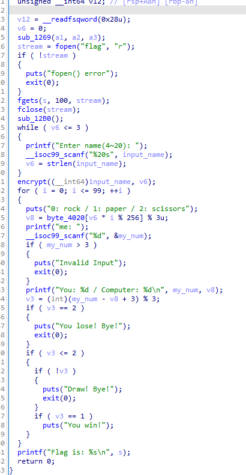
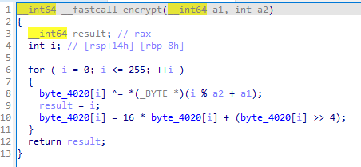
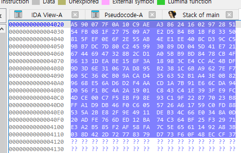
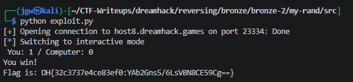

# [DreamHack] My Rand - Reversing

## 1. 문제 개요

* **문제 링크:** [DreamHack - my rand](https://dreamhack.io/wargame/challenges/2104)

* **분야:** Reversing

* **목표:** C 표준 난수 함수 대신 자체적으로 구현된 커스텀 난수 생성 로직을 분석하고, 연산 과정을 파이썬으로 동일하게 구현하여 100번의 가위바위보 게임을 모두 통과하는 예측 스크립트 작성.

## 2. 취약점 분석
제공된 ELF 바이너리 파일(`chall`)을 IDA로 디컴파일하여 분석한 결과, 사용자 입력값을 시드로 사용하는 커스텀 난수 생성 함수(`encrypt`)와 결과값을 통해 가위바위보 승패를 결정짓는 메인 로직 식별. 난수 생성 알고리즘과 초기 상태 배열이 노출되어 있어 예측 가능한 취약점 존재.

```c
// [main 함수] 가위바위보 비교 및 루프 로직
// ... (중략) ...
stream = fopen("flag", "r");
// ... (중략) ...
encrypt((__int64)input_name, v6);
for ( i = 0; i <= 99; ++i )
{
  puts("0: rock / 1: paper / 2: scissors");
  v8 = byte_4020[v6 * i % 256] % 3u;
  // ... (중략) ...
  v3 = (int)(my_num - v8 + 3) % 3;
  if ( v3 == 2 )
// ... (중략) ...
```

난수 생성에 관여하는 `encrypt` 함수 내부에서 사용자의 입력 이름(`a1`)과 초기 전역 배열(`byte_4020`)을 비트 단위로 연산하는 로직 확인. XOR 연산 및 상위/하위 4비트(니블) 스왑을 통한 단순 난독화 수행.

```c
// [encrypt 함수] 커스텀 난수 배열 변조 알고리즘
// ... (중략) ...
for ( i = 0; i <= 255; ++i )
{
  byte_4020[i] ^= *(_BYTE *)(i % a2 + a1);
  result = i;
  byte_4020[i] = 16 * byte_4020[i] + (byte_4020[i] >> 4);
}
// ... (중략) ...
```

연산의 바탕이 되는 전역 배열 `byte_4020`은 `.data` 섹션에 하드코딩되어 있어 Hex View를 통해 전체 초기값 데이터 획득 가능.

```c
// [전역 변수 초기 데이터] 
.data:0000000000004020 byte_4020 db 0A5h, 90h, 7, 7Fh, 0Ah, 10h, 0C9h, 0AEh 
.data:0000000000004028           db 0A3h, 86h, 24h, 16h, 2, 97h, 28h, 51h
// ... (중략) ...
```

* **분석 결론:** 커스텀 난수 배열의 초기 데이터가 바이너리 내부에 하드코딩되어 있고, 사용자의 입력값을 조합하는 XOR 및 비트 시프트 연산 알고리즘이 노출되어 있어 컴퓨터가 낼 패(`v8`)를 정방향으로 예측할 수 있는 논리적 결함 존재.

## 3. 공격 수행

1. IDA를 통한 `main` 함수 진입점 디컴파일 및 100회 반복되는 가위바위보 메인 루프 로직 식별.



2. `encrypt` 함수를 분석하여 `byte_4020` 전역 배열에 사용자 입력을 XOR하고 비트 연산을 적용하는 커스텀 난수화(배열 셔플) 알고리즘 파악.



3. IDA의 Hex View 기능을 활용하여 난수 연산의 기초가 되는 `byte_4020` 배열의 256바이트 원본 데이터 추출.



4. Pwntools를 활용하여 추출한 원본 배열과 `encrypt` 알고리즘을 파이썬으로 구현. 컴퓨터가 낼 난수 패를 계산한 뒤, 무조건 승리하는 수(`my_num = (v8 + 1) % 3`)를 산출하여 서버로 전송하는 자동화 익스플로잇 스크립트(`exploit.py`) 작성.

```python
from pwn import *

hex_data = "A590077F0A10C9AEA38624160297285154FB081 ... (중략) ... 5611492A83B038D422D72778379D773F60F48ECCF37"
data = list(bytearray.fromhex(hex_data))

def encrypt(name):
    name_len = len(name)
    for i in range(256):
        data[i] ^= ord(name[i % name_len])
        result = i
        data[i] = (16 * data[i] + (data[i] >> 4)) & 0xFF
    return data

data = encrypt("wanja")
name_len = len("wanja")

p = remote('host8.dreamhack.games', 23334)
p.sendlineafter(b": ", "wanja".encode())

for i in range(100):
    v8 = data[name_len * i % 256] % 3
    # v3 = (my_num - v8 +3) % 3  v3이 무조건 1이어야함
    my_num = (v8 + 1) % 3

    p.sendlineafter(b"me:", str(my_num).encode())

p.interactive()
```

## 4. 획득 결과
작성한 파이썬 익스플로잇 스크립트 실행을 통해 난수 예측 검증 우회 및 100회의 가위바위보 자동 승리로 최종 플래그 획득.



* **FLAG:** `DH{32c3737e4ce83ef0:YAb2Gns5/6LsVBN8CE59Cg==}`

## 5. 대응 방안
자체 구현한 예측 가능한 난수 생성 로직을 제거하고, 안전한 난수 생성을 보장하기 위한 시큐어 코딩 적용.

* **안전한 난수 생성기 도입:** 로직이 노출될 경우 예측이 가능한 커스텀 시프트 및 XOR 셔플 연산을 지양하고, 보안성이 검증된 난수 생성 시스템(예: OS 레벨의 `/dev/urandom`, `BCryptGenRandom` 등) 활용.

* **초기 시드 및 상태 값 노출 방지:** 난수 생성의 바탕이 되는 초기 배열 데이터 등 중요 시크릿 값을 바이너리의 `.data` 섹션에 평문으로 하드코딩하는 방식 제한.

## 6. 블루팀 관점 요약

### 6.1. 탐지 및 분석 한계
* **네트워크 통신 행위 없음:** 해당 바이너리는 외부 악성 C&C 서버 통신 없이 로컬 환경 내에서 단독으로 난수 배열 생성 및 게임 연산을 수행하므로, 방화벽이나 IPS 등 네트워크 트래픽 기반의 보안 장비로는 위협 탐지 불가.

* **대응 방향:** EDR 및 호스트 단에서 바이너리 내부의 특정 스트링(게임 프롬프트 메시지 등)과 비표준 커스텀 암호화 로직(특정 루프 내 XOR 및 니블 스왑 패턴)을 정적 분석하여 식별. 이를 통해 로직 결함을 내포한 형태의 파일을 탐지하는 로컬 위협 헌팅 수행.

### 6.2. YARA 탐지 룰 (IoC)
정적 분석을 통해 확인된 하드코딩 게임 메시지와 난수 초기화 전역 배열(`byte_4020`)의 특징적인 Hex 시그니처를 활용하여, 유사한 커스텀 PRNG(의사 난수 생성기)를 가진 바이너리를 탐지할 수 있는 YARA 룰 제안.

```yara
rule Detect_My_Rand {
    strings:
        // 게임 진행 및 안내 스트링 시그니처
        $msg_name = "Enter name(4~20): " ascii wide
        $msg_rsp = "0: rock / 1: paper / 2: scissors" ascii wide
        $msg_win = "You win!" ascii wide
        $msg_lose = "You lose! Bye!" ascii wide
        
        // byte_4020 전역 배열 초기 바이트 시그니처 (Hex)
        $hex_array = { A5 90 07 7F 0A 10 C9 AE A3 86 24 16 02 97 28 51 }

    condition:
        uint32(0) == 0x464c457f and // ELF 헤더 매직 넘버 검증 (\x7F ELF)
        $hex_array and 3 of ($msg_*)
}
```