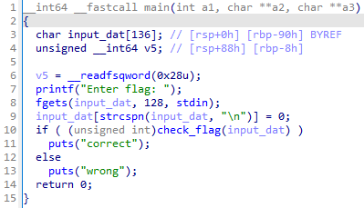
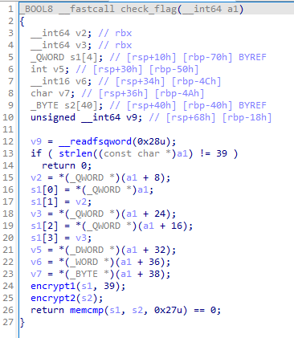
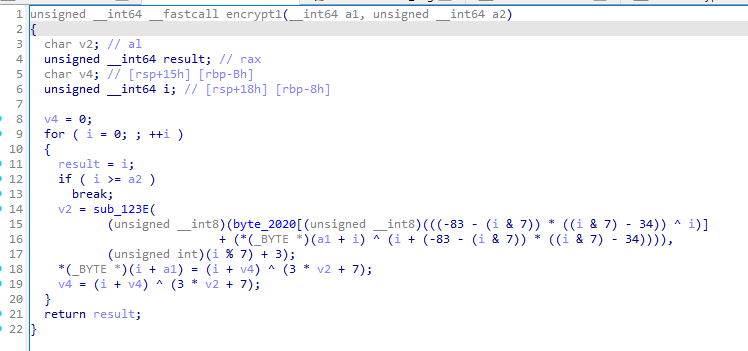
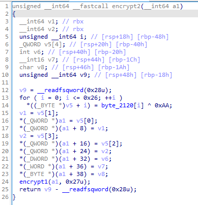
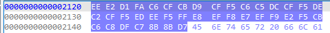
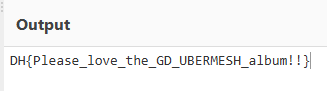

# [DreamHack] No Problem (아 문제 이름 뭘로하지) - Reversing

## 1. 문제 개요

* **문제 링크:** [DreamHack - 아 문제 이름 뭘로하지](https://dreamhack.io/wargame/challenges/1825)

* **분야:** Reversing

* **목표:** 리눅스 ELF 바이너리의 검증 및 암호화 로직을 정적 분석하고, 비교 대상 문자열이 생성되는 취약점을 파악하여 역연산 스크립트 작성 없이 원본 평문 플래그 획득.

## 2. 취약점 분석
제공된 ELF 바이너리 파일(`chall`)을 IDA로 디컴파일하여 분석한 결과, 사용자 입력값을 복잡하게 암호화하는 함수와 동일한 함수를 정답(타겟) 문자열 생성 후에도 씌워 비교하는 로직 식별.

```c
// [check_flag 함수] 사용자 입력(s1) 및 생성된 타겟(s2) 비교 검증
// ... (중략) ...
if ( strlen((const char *)a1) != 39 )
    return 0;
// ... (중략) ...
encrypt1(s1, 39);
encrypt2(s2);
return memcmp(s1, s2, 0x27u) == 0;
```

```c
// [encrypt2 함수] 비교 타겟 문자열 생성 및 동일 암호화 로직 호출
// ... (중략) ...
for ( i = 0; i <= 0x26; ++i )
    *((_BYTE *)v5 + i) = byte_2120[i] ^ 0xAA;
// ... (중략) ...
encrypt1(a1, 0x27u); // 타겟 문자열(s2)에도 encrypt1을 동일하게 적용
return v9 - __readfsqword(0x28u);
```

```c
// [encrypt1 함수] 데이터 난독화를 위한 복잡한 산술 및 비트 연산 루프
// ... (중략) ...
for ( i = 0; ; ++i )
{
    // ... (중략) ...
    v2 = sub_123E(
            (unsigned __int8)(byte_2020[(unsigned __int8)(((-83 - (i & 7)) * ((i & 7) - 34)) ^ i)]
            + (*(_BYTE *)(a1 + i) ^ (i + (-83 - (i & 7)) * ((i & 7) - 34)))),
            (unsigned int)(i % 7) + 3);
    *(_BYTE *)(i + a1) = (i + v4) ^ (3 * v2 + 7);
    // ... (중략) ...
}
// ... (중략) ...
```

* **분석 결론:** 최종 비교(`memcmp`) 시 사용자의 입력값(`s1`)과 프로그램이 자체 생성한 타겟 값(`s2`) 양쪽에 동일한 `encrypt1` 암호화 함수가 적용됨. 즉, 복잡한 `encrypt1`을 굳이 역연산할 필요 없이, `encrypt2` 함수 내부에서 `s2`의 평문을 생성할 때 사용된 식(`byte_2120` 배열 ^ `0xAA`)을 그대로 계산하면 그것이 곧 정답 플래그 평문임.

## 3. 공격 수행

1. IDA를 통해 `main` 함수 진입점 디컴파일 및 플래그 입력 기반의 전반적인 프로그램 흐름 파악.



2. 입력값을 검증하는 `check_flag` 함수 내부에서 사용자의 입력(`s1`)과 타겟 문자열(`s2`)이 각각 `encrypt1`, `encrypt2` 함수를 거친 뒤 비교되는 메인 검증 로직 식별.



3. 사용자 입력을 난독화하는 `encrypt1` 함수로 진입하여, 복잡한 비트 연산 및 수학적 연산이 포함된 암호화 알고리즘 확인.



4. 타겟 문자열을 생성하는 `encrypt2` 함수 내부 확인. 하드코딩된 배열(`byte_2120`)을 `0xAA`와 XOR 한 후, 사용자 입력값과 동일하게 `encrypt1` 함수를 한 번 더 거치도록 유도한 취약점 파악.



5. Hex View 기능을 활용하여 평문 연산의 핵심 재료인 `byte_2120` 배열의 길이(39바이트)만큼 Hex 데이터 추출.



6. 추출한 Hex 데이터를 CyberChef에 입력하고 파악한 로직에 맞춰 `0xAA` 값으로 XOR 연산을 수행하여 최종 플래그 복호화 완료.



## 4. 획득 결과

* **FLAG:** `DH{Please_love_the_GD_UBERMESH_album!!}`

## 5. 대응 방안
본 문제는 암호화 로직의 강도와 무관하게, 비교할 타겟 평문을 생성하는 로직과 입력값을 암호화하는 로직이 1:1 대칭 형태로 노출되어 정적 분석만으로 평문 유추가 가능한 것이 취약점의 핵심 원인. 따라서 검증 아키텍처 재설계 및 데이터 은닉 적용 필요.

* **비대칭 단방향 해시 검증 도입:** 클라이언트 단에서 평문을 직접 메모리에 올리고 암호화하는 양방향 구조를 벗어나야 함. 입력값을 SHA-256 등의 단방향 해시로 변환한 뒤, 바이너리 내부에 하드코딩된 정답 해시값과 단순 비교하도록 소스코드 아키텍처 수정.

* **주요 상수 및 데이터 난독화 적용:** 리버싱을 통한 원본 데이터 탈취를 막기 위해 `0xAA`와 같은 XOR 키값과 `byte_2120` 배열 데이터를 평문 형태로 하드코딩하는 것을 지양. 더미 코드를 혼합하거나 패커(Packer), OLLVM 등을 활용하여 정적 분석 방해.

* **로직 은닉 및 실행 흐름 난독화:** `encrypt1`과 `encrypt2`의 명시적인 함수 호출 흐름을 숨기기 위해, SMC(Self Modifying Code)를 적용하거나 인라인 함수 처리로 메모리에 노출되는 검증 분기점 최소화.

## 6. 블루팀 관점 요약

해당 악성 ELF 바이너리는 외부 C2 서버와의 통신이나 추가 페이로드 다운로드 행위 없이 로컬 환경에서 단독으로 검증 연산만 수행하므로, 방화벽이나 IDS/IPS 등 네트워크 기반의 관제 장비로는 탐지 불가.

* **대응 방향:** 호스트 단(EDR, 백신)에서 파일 시스템에 유입되는 정적 파일에 대한 시그니처 분석이 유효함. 해당 바이너리 내부에 하드코딩된 특정 Hex 배열(`byte_2120`)과 특정 키(`0xAA`)를 활용한 반복적인 XOR 암호화 루프 패턴을 정적 분석으로 도출하여 악성/크랙 파일로 분류하기 위한 시그니처 기반 위협 헌팅 수행.

### 6.1. YARA 탐지 룰 (IoC)
정적 분석을 통해 확인된 플래그 원본 Hex 데이터 배열을 고유 시그니처로 활용하여, 동일한 난독화가 적용되거나 파생된 형태의 ELF 바이너리를 식별할 수 있는 YARA 룰 제안.

```yara
rule Detect_Reversing_Challenge_Binary {
    strings:
        // 타겟 문자열 생성을 위해 하드코딩된 byte_2120 배열의 시작 부분 시그니처
        $hex_array_sig = { EE E2 D1 FA C6 CF CB D9 CF F5 C6 C5 DC CF F5 DE }
        
    condition:
        // ELF 파일 매직 넘버 검증 (\x7FELF)
        uint16(0) == 0x457f and
        $hex_array_sig
}
```