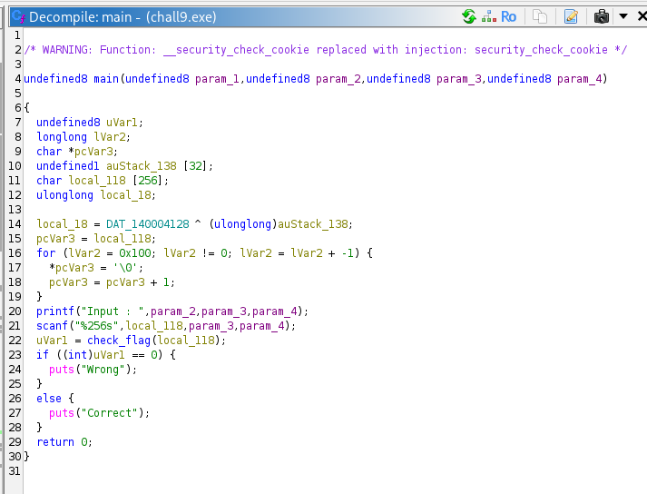
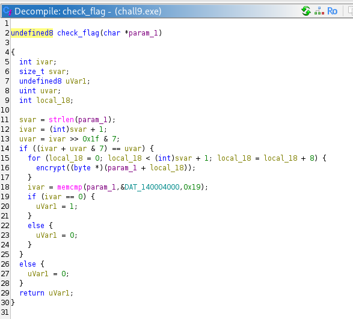
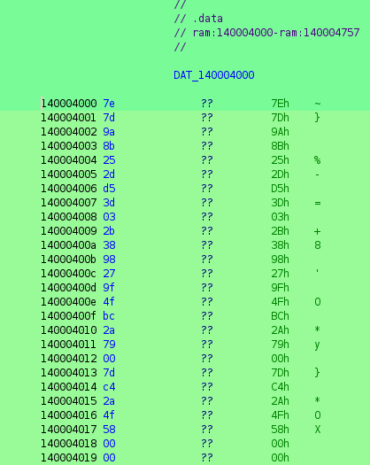
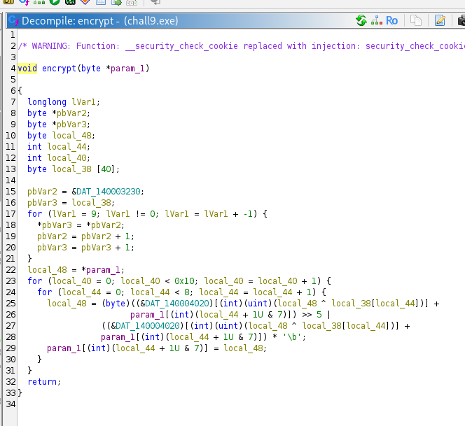
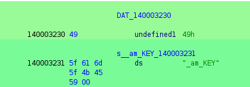
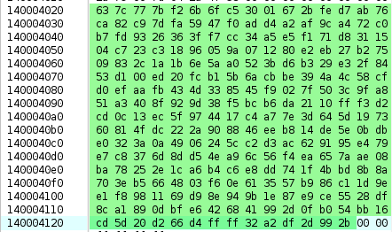
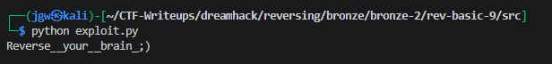

# [DreamHack] Rev-Basic-9 - Reversing

## 1. 문제 개요

* **문제 링크:** [DreamHack - rev-basic-9](https://dreamhack.io/wargame/challenges/23)

* **분야:** Reversing

* **목표:** 프로그램의 블록 암호화 로직(S-box 치환, 비트 회전 및 XOR 연산 등)을 파악하고 역연산 스크립트를 작성하여 원본 플래그 도출.

## 2. 취약점 분석
제공된 PE 바이너리(`chall9.exe`)를 Ghidra로 디컴파일하여 분석한 결과, 사용자의 입력값을 8바이트 단위 블록으로 쪼개어 커스텀 암호화 함수(`encrypt`)를 거친 뒤 하드코딩된 타겟 배열과 비교하는 로직 파악.

```c
// ... (중략) ...
void encrypt(byte *param_1)
{
  // ... (중략) ...
  pbVar2 = &DAT_140003230; // "I_am_KEY\x00" 키 데이터 로드
  pbVar3 = local_38;
  for (lVar1 = 9; lVar1 != 0; lVar1 = lVar1 + -1) {
    *pbVar3 = *pbVar2;
    pbVar2 = pbVar2 + 1;
    pbVar3 = pbVar3 + 1;
  }
  
  local_48 = *param_1;
  for (local_40 = 0; local_40 < 0x10; local_40 = local_40 + 1) {
    for (local_44 = 0; local_44 < 8; local_44 = local_44 + 1) {
      // 256바이트 S-box 테이블(&DAT_140004020) 치환 및 비트 회전(Shift) 연산 수행
      local_48 = (byte)((&DAT_140004020)[(int)(uint)(local_48 ^ local_38[local_44])] +
                 param_1[(int)(local_44 + 1U & 7)]) >> 5 |
                 ((&DAT_140004020)[(int)(uint)(local_48 ^ local_38[local_44])] +
                 param_1[(int)(local_44 + 1U & 7)]) * '\b';
      param_1[(int)(local_44 + 1U & 7)] = local_48;
    }
  }
  return;
}
// ... (중략) ...
```

* **분석 결론:** 8바이트 단위 내부 루프에서 각 문자가 이전 문자의 연산 결과(`local_48`)에 종속되어 암호화가 진행되는 블록 암호화 구조 파악. 메모리에 존재하는 고정 키 배열(`I_am_KEY\x00`)과 256바이트 S-box 배열을 추출한 뒤, 시프트 연산과 덧셈 연산을 역으로 수행하는 복호화 파이썬 스크립트를 작성하여 플래그 복원 가능.

## 3. 공격 수행

1. Ghidra를 통해 `main` 함수 확인. 사용자로부터 256바이트의 입력을 받아 `check_flag` 함수로 전달하는 구조 파악.



2. `check_flag` 검증 로직 확인. 입력값 길이를 검사하고, 데이터를 8바이트씩 나누어 `encrypt` 함수를 호출한 뒤 결과값을 비교.



3. 최종 검증에 사용되는 메모리에 하드코딩된 25바이트 길이의 타겟 데이터(`DAT_140004000`) 추출 및 기록.



4. 핵심 로직인 `encrypt` 함수 분석. 특정 키 값 및 S-box를 이용해 XOR, 비트 이동 연산을 16회 반복하는 커스텀 암호화 원리 확인.



5. 암호화 로직 연산에 필수적으로 요구되는 9바이트 키 데이터(`DAT_140003230`, "I_am_KEY\x00") 및 256바이트의 S-box 치환 테이블(`DAT_140004020`) 추출.





6. 분석된 정방향 암호화 수식을 바탕으로, 배열과 비트 연산을 역으로 거슬러 올라가는 복호화(decrypt) 파이썬 익스플로잇 스크립트 작성 및 실행.

```python
# ... (중략) ...
def decrypt(param1, offset):
    local38 = list(bytes.fromhex("495f616d5f4b455900"))
    hex_data = bytes.fromhex("637c777bf26b6f ... (중략) ... a2df2d992b")
    for i in range(15, -1, -1):
        for j in range(7, -1, -1):
            idx = offset + ((j + 1) & 7)
            shifted = param1[idx]
            temp = ((shifted << 5) | (shifted >> 3)) & 0xFF

            prev_idx = offset + (j & 7)
            param1[idx] = (temp - hex_data[param1[prev_idx] ^ local38[j]]) & 0xFF
    return param1

encrypted_flag = bytes.fromhex("7e7d9a8b252dd53d032b3898279f4fbc2a79007dc42a4f5800")
param1 = list(encrypted_flag)

for i in range(0, 24, 8):
    decrypt(param1, i)

print("".join(chr(i) for i in param1))
```

## 4. 획득 결과
도출된 복호화 로직을 바탕으로 파이썬 스크립트를 실행하여 원본 플래그 복원 성공 확인.



* **FLAG:** `DH{Reverse__your__brain_;)}`

## 5. 대응 방안
프로그램 검증 로직에 존재하는 직접적인 암호화 테이블 노출 및 커스텀 암호화 연산의 가역적 취약점을 방지하기 위해 프로그램 소스코드 단에 대한 시큐어 코딩 조치 적용.

* **표준 암호화 알고리즘 사용:** 자체 구현한 커스텀 비트 연산 블록 암호화는 리버싱을 통한 식 도출이 가능함. 중요 입력값 검증에는 AES, SHA-256 등 역연산이 불가능하거나 안전성이 보장된 표준 해시/암호화 알고리즘 도입.

* **데이터 난독화 및 패킹 적용:** 메모리에 고정으로 하드코딩된 주요 키 문자열("I_am_KEY") 및 S-box 테이블 데이터가 디스어셈블러 환경에서 직관적으로 노출됨. 데이터 난독화 기법 또는 실행 압축을 적용하여 정적 분석 난이도 상승 유도.

## 6. 블루팀 관점 요약

### 6.1. 탐지 및 분석 한계
* **네트워크 행위 없음:** 해당 바이너리는 내부 로직으로만 동작하는 단독 실행형 파일이므로, 네트워크 장비(IPS/WAF)의 트래픽 기반 탐지 불가.

* **대응 방향:** EDR 및 호스트 단에서 프로세스 실행 흐름 기반의 정적/동적 분석을 수행하고, 로컬 시그니처를 바탕으로 위협 헌팅 수행.

### 6.2. YARA 탐지 룰 (IoC)
분석 단계에서 확보한 고유의 암호화 키 문자열 및 커스텀 S-box 16진수 배열을 활용하여 유사한 암호화 로직을 포함한 바이너리를 탐지할 수 있는 YARA 룰 제안.

```yara
rule Detect_Rev_Basic_9 {
    strings:
        // 하드코딩된 256바이트 S-box 배열의 앞부분 16바이트 고유 시그니처
        $sbox_signature = { 63 7C 77 7B F2 6B 6F C5 30 01 67 2B FE D7 AB 76 }
        
        // 암호화 루프에 사용되는 키 문자열 식별
        $key_string = "I_am_KEY"
        
    condition:
        all of them
}
```