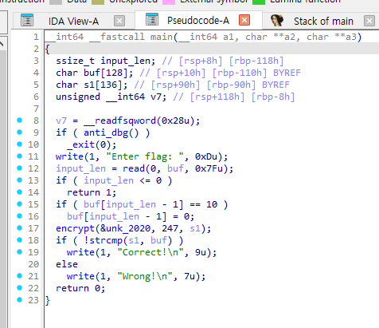
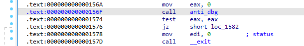
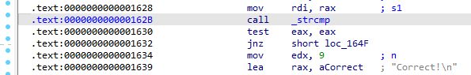
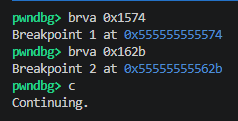
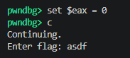
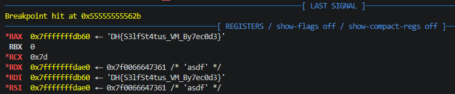

# [DreamHack] SelfStatus - Reversing

## 1. 문제 개요

* **문제 링크:** [DreamHack - SelfStatus](https://dreamhack.io/wargame/challenges/1983)

* **분야:** Reversing

* **목표:** 바이너리를 정적 분석하여 안티 디버깅 로직 및 암호화 검증 과정을 파악하고, 동적 디버깅(pwndbg)을 통해 안티 디버깅 분기점을 우회한 후 메모리에 적재된 평문 플래그 획득.

## 2. 취약점 분석
제공된 ELF 바이너리 파일(`prob`)을 IDA로 디컴파일하여 분석한 결과, 프로그램 시작과 동시에 안티 디버깅 함수(`anti_dbg`)를 호출하여 탐지 시 즉시 종료(`_exit`)하는 방어 기법 식별. 또한, 최종 검증 시 입력값과 내부 연산(`encrypt`)을 거친 정답 플래그를 `strcmp` 함수로 단순 비교하는 취약한 구조 파악.

```c
// [main 함수] 디버깅 탐지 및 사용자 입력 로직
// ... (중략) ...
if ( anti_dbg() )
  _exit(0);
write(1, "Enter flag: ", 0xDu);
input_len = read(0, buf, 0x7Fu);
// ... (중략) ...
```

```c
// [main 함수] 플래그 복호화 및 최종 검증 분기
// ... (중략) ...
encrypt(&unk_2020, 247, s1);
if ( !strcmp(s1, buf) )
  write(1, "Correct!\n", 9u);
else
  write(1, "Wrong!\n", 7u);
return 0;
// ... (중략) ...
```

* **분석 결론:** 단일 조건문 `if ( anti_dbg() )`에 의해 디버깅 억제가 결정되므로, 반환값을 담는 레지스터(`EAX/RAX`)를 변조하여 우회 가능. 검증 우회 후, 컴퓨터가 자체적으로 생성한 플래그 문자열(`s1`)을 `strcmp`를 통해 평문 비교하므로 해당 함수 호출 시점에 `RDI` 레지스터를 조회하여 원본 플래그 획득 가능.

## 3. 공격 수행

1. IDA 디컴파일 및 어셈블리 뷰를 통해 핵심 검증 로직과 안티 디버깅 함수의 호출 흐름 파악.



2. 안티 디버깅 검사 직후의 분기점(`0x1574`)과 플래그를 비교하는 `_strcmp` 호출 지점(`0x162B`)의 메모리 오프셋 주소 확인.





3. GDB(pwndbg)를 통해 바이너리를 로드(`start`)한 후, 확인한 두 오프셋 주소에 브레이크포인트(`brva`) 설정 후 실행(`c`).



4. 첫 번째 브레이크포인트(안티 디버깅 우회 지점)에서 프로그램이 멈추면, 반환값 레지스터(`EAX`)를 `0`으로 강제 변조(`set $eax = 0`)하여 종료 로직(`_exit`) 무력화. 이후 임의의 더미 문자열(`asdf`)을 입력하여 로직 진행.



5. 입력 완료 후 두 번째 브레이크포인트(`strcmp` 호출 지점)에서 정지 시, 우측 레지스터 창에서 첫 번째 인자(`RDI`)에 평문으로 적재된 최종 원본 플래그 확인.



## 4. 획득 결과

* **FLAG:** `DH{S3lfSt4tus_VM_By7ec0d3}`

## 5. 대응 방안
본 문제는 암호화 연산이 수행된 후에도 메모리상에 플래그가 평문으로 남아 단순 문자열 비교(`strcmp`)를 수행하므로, 동적 분석을 통한 레지스터 값 추출에 취약함. 정적 분석 우회 및 메모리 탈취를 방지하기 위한 시큐어 코딩 관점의 아키텍처 재설계 필요.

* **메모리 내 평문 노출 지양:** 최종 인증 시 `strcmp`와 같은 평문 비교 함수의 사용 지양. 사용자의 입력값을 내부 암호화 알고리즘으로 동적 처리한 뒤, 해시화된 결과값끼리 비교하는 구조로 변경하여 원본 암호화 키를 알 수 없도록 설계.

* **안티 디버깅 로직 다각화 및 강제 결합:** `if (anti_dbg())`와 같은 단순 분기문은 디버거에서의 레지스터 조작 한 번으로 우회 가능. 디버거 탐지 로직을 별도의 스레드로 지속 모니터링하고, 탐지 시 암호화 복호화 배열에 임의의 오프셋을 더하여 플래그 값을 훼손시키는 구조로 결합.

## 6. 블루팀 관점 요약
해당 바이너리는 외부 네트워크(C2 서버 등)와의 통신이나 추가 페이로드 다운로드 행위 없이 로컬 환경 내에서 단독으로 검증 연산만 수행. 따라서 방화벽, IDS/IPS 등의 네트워크 기반 보안 장비로는 탐지 불가. 호스트 단(EDR, 백신)에서 파일 시스템에 유입된 정적 파일의 문자열 및 고유 로직을 분석하는 시그니처 기반 위협 헌팅 수행.

### 6.1. YARA 탐지 룰 (IoC)
정적 분석을 통해 식별된 바이너리 내부의 하드코딩된 상태 알림 문자열 데이터와 ELF 파일 기본 구조를 조합하여 리버싱 과제 및 크랙 툴로 분류하기 위한 YARA 룰 제안.

```yara
rule Detect_SelfStatus {
    strings:
        // 프로그램 실행 및 인증 관련 하드코딩 메시지
        $str1 = "Enter flag: " ascii wide
        $str2 = "Correct!\n" ascii wide
        $str3 = "Wrong!\n" ascii wide
        
    condition:
        // ELF 파일 매직 넘버 검증
        uint32(0) == 0x464C457F and // ELF "\x7FELF"
        all of ($str*)
}
```