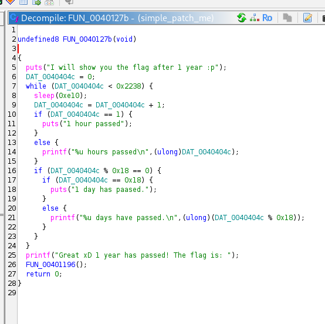
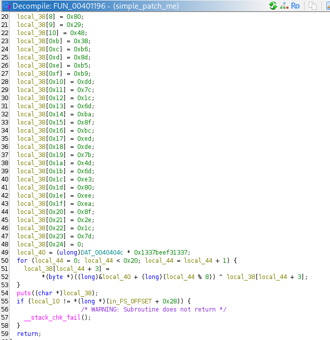
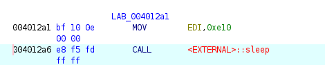
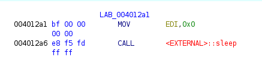
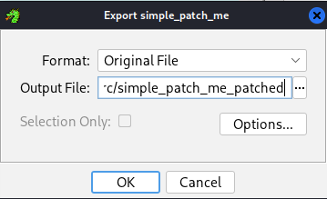
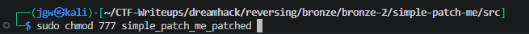
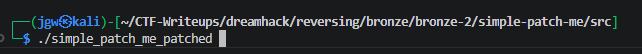
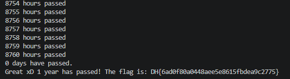

# [DreamHack] Simple Patch Me - Reversing

## 1. 문제 개요

* **문제 링크:** [DreamHack - Simple Patch Me](https://dreamhack.io/wargame/challenges/669)

* **분야:** Reversing

* **목표:** 바이너리 내부에 존재하는 1년(8760시간) 대기 루프 로직을 분석하고, 이를 무력화하도록 바이너리를 패치하여 플래그 획득.

## 2. 취약점 분석
제공된 ELF 바이너리 파일(`simple_patch_me`)을 Ghidra로 디컴파일하여 분석한 결과, 루프문 내에서 `sleep(0xe10)`(3600초 = 1시간) 함수를 호출하여 총 0x2238(8760)번 대기하는 로직 확인. 플래그 복호화 연산에 사용되는 키가 루프의 인덱스 카운트 변수(`DAT_0040404c`)에 의존하므로, 분기문 자체를 우회하면 올바른 플래그 획득 불가.

```c
// ... (중략) ...
void FUN_0040127b(void)
{
  puts("I will show you the flag after 1 year :p");
  DAT_0040404c = 0;
  while (DAT_0040404c < 0x2238) { // 0x2238 = 8760 (1년)
    sleep(0xe10); // 1시간(3600초) 대기
    DAT_0040404c = DAT_0040404c + 1;
// ... (중략) ...
```



플래그를 출력하는 내부 함수(`FUN_00401196`)를 추가 분석한 결과, 아래와 같이 루프 카운트 변수(`DAT_0040404c`)가 플래그 복호화 연산의 핵심 키(`local_40`)를 생성하는 데 직접적으로 사용됨을 확인.



* **분석 결론:** 루프 탈출 조건이나 카운트 변수를 조작하는 대신, `sleep` 함수에 전달되는 인자값(`0xe10`)을 `0x0`으로 변조(바이너리 패치)하여 대기 시간 없이 즉시 8760번의 루프를 수행하도록 유도 가능.

## 3. 공격 수행

1. Ghidra의 어셈블리 뷰에서 `sleep` 함수의 인자를 설정하는 `MOV EDI, 0xe10` 명령어 위치 확인.



2. 어셈블리 명령어를 직접 수정(Patch Instruction)하여 인자값을 0초로 변경(`MOV EDI, 0x0`).



3. 수정된 프로그램을 원본 형식으로 유지한 채 `simple_patch_me_patched` 이름으로 바이너리 익스포트.



4. 리눅스 환경에서 `chmod` 명령어를 이용하여 저장된 패치 파일에 모든 실행 권한(`777`) 부여.



5. 패치된 바이너리 실행 시, 대기 시간 없이 루프를 고속으로 통과하는 흐름을 확인하고 원본 플래그 출력





## 4. 획득 결과
바이너리 패치를 통해 대기 시간을 무력화하고 프로그램의 복호화 루틴을 정상 실행시켜 플래그 획득 완료.

* **FLAG:** `DH{6ad0f80a0448aee5e815fbdea9c2775}`

## 5. 대응 방안
프로그램의 실행 흐름을 통제하는 주요 지연 및 검증 로직이 클라이언트 측에 존재하여 바이너리 변조에 취약함. 이를 방지하기 위해 로컬 환경을 신뢰하지 않는 시큐어 코딩 설계 적용.

* **서버 사이드 검증 도입:** 플래그 복호화에 필요한 핵심 상수나 연산 과정을 로컬에 하드코딩하지 않고, 원격 서버와 통신하여 실제 시간이 경과한 사용자에게만 서버 측에서 플래그를 발급하는 구조로 변경.

* **무결성 검증:** 로컬 환경 구동이 불가피할 경우, 프로그램 실행 시 자신의 바이너리 해시를 검증하거나 코드 섹션의 위변조 여부를 체크하여 패치된 상태에서는 복호화 연산을 강제 종료하는 자가 보호 기법 적용.

## 6. 블루팀 관점 요약

### 6.1. 탐지 및 분석 한계
* **네트워크 행위 없음:** 해당 바이너리는 외부 C&C 통신이나 원격지와의 상호작용 없이 로컬 메모리에서 단독으로 연산을 수행하므로, 방화벽이나 WAF, IPS 등의 네트워크 장비 트래픽으로는 탐지 불가.

* **대응 방향:** EDR 및 호스트 단에서 알려지지 않은 해시를 가진 바이너리의 실행 흐름을 모니터링하고, 정적/동적 분석으로 도출된 호스트 기반 단서(하드코딩된 문자열, 고유 암호화 상수 등)를 활용하여 로컬 시그니처 바탕으로 위협 헌팅 수행.

### 6.2. YARA 탐지 룰 (IoC)
분석 단계에서 확인된 특유의 하드코딩 안내 문자열 및 플래그 복호화 과정에 사용되는 특정 상수 바이트(Hex) 특징을 활용하여, 유사한 지연 루틴이 포함된 바이너리를 탐지할 수 있는 YARA 룰 제안.

```yara
rule Detect_Simple_Patch_Me {
    strings:
        // 하드코딩된 타겟 프로세스 문자열 시그니처
        $msg_start = "I will show you the flag after 1 year :p" ascii wide
        $msg_end = "Great xD 1 year has passed! The flag is:" ascii wide
        
        // 플래그 복호화에 사용되는 특정 키 상수 시그니처 (0x1337beef31337의 Little Endian 배열)
        $decrypt_key = { 37 13 f3 ee 0b 37 13 00 }

    condition:
        uint32(0) == 0x464c457f and // ELF 바이너리 (Magic Number) 검증
        (any of ($msg_*)) and $decrypt_key
}
```