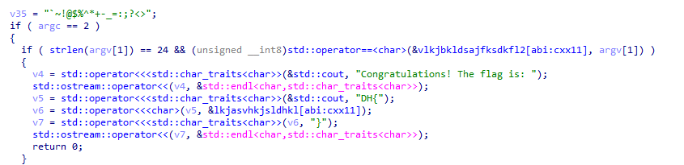
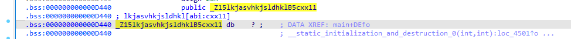
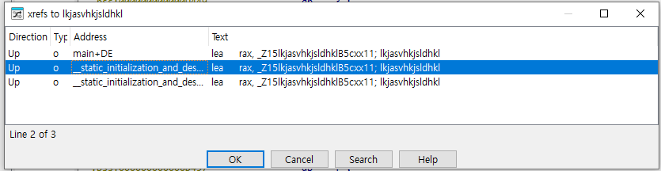
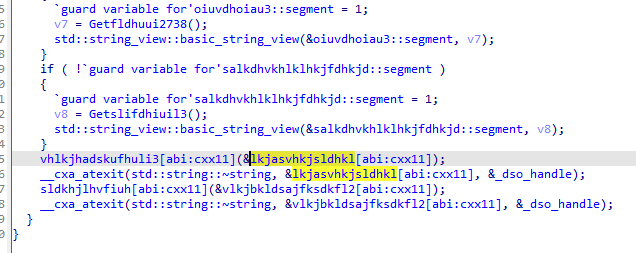
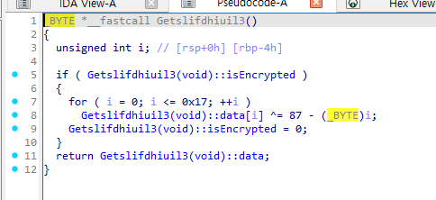
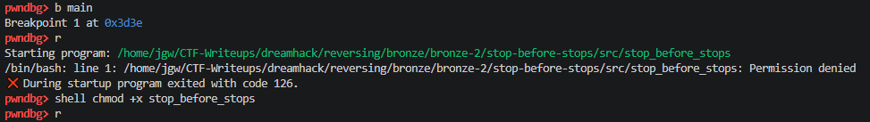
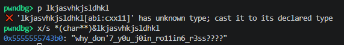

# [DreamHack] Stop before stops! - Reversing

## 1. 문제 개요

* **문제 링크:** [DreamHack - Stop before stops!](https://dreamhack.io/wargame/challenges/822)

* **분야:** Reversing

* **목표:** C++로 작성된 리눅스 ELF 바이너리의 전역 변수 초기화 과정을 분석하고, 동적 디버깅(GDB)을 통해 메모리에 복호화된 플래그 문자열 획득.

## 2. 취약점 분석
정적 분석 결과, `main` 함수 진입 전 `.bss` 영역의 전역 변수를 초기화하는 함수(`__static_initialization_and_destruction_0`)에서 플래그 문자열이 조각나서 XOR 암호화된 상태로 삽입됨을 파악. 플래그가 프로그램 시작 시점에 메모리에서 우선적으로 복호화되므로, 복잡한 역연산 로직을 직접 스크립트로 작성할 필요 없이 동적 분석을 통해 우회 가능.

```cpp
// ... (중략) ...
if ( strlen(argv[1]) == 24 && (unsigned __int8)std::operator==<char>(&vlkjbkldsajfksdkfl2[abi:cxx11], argv[1]) )
{
  v4 = std::operator<<<std::char_traits<char>>(&std::cout, "Congratulations! The flag is: ");
  std::ostream::operator<<(v4, &std::endl<char,std::char_traits<char>>);
  v5 = std::operator<<<std::char_traits<char>>(&std::cout, "DH{");
  v6 = std::operator<<<char>(v5, &lkjasvhkjsldhkl[abi:cxx11]);
  v7 = std::operator<<<std::char_traits<char>>(&std::cout, "}");
  // ... (중략) ...
}
// ... (중략) ...
```

* **분석 결론:** 사용자의 입력값과 특정 조건 로직을 통과하지 않아도, `main` 함수 실행 전 전역 변수 초기화 단계에서 플래그가 메모리에 조립 및 복호화됨. GDB를 활용해 `main` 진입 시점에 멈춘 후, 해당 전역 변수 메모리를 직접 읽어 들이는 동적 분석 방식으로 조건문 검증 우회 가능.

## 3. 공격 수행

1. IDA를 통한 `main` 함수 진입점 디컴파일 및 플래그 출력 로직 확인.



2. 실제 정답 문자열이 저장되는 `lkjasvhkjsldhkl` 변수가 `.bss` 영역에 빈 공간으로 선언되어 있음을 파악.



3. 해당 변수에 교차 참조(XREF)를 수행하여, `main` 함수 실행 이전에 데이터를 조립하는 `__static_initialization_and_destruction_0` 함수 로직 확인.



4. 데이터를 생성하는 내부 조각 함수 진입 시, 하드코딩된 바이트 배열을 XOR 연산(`87 - i` 등)으로 복호화하는 로직 확인.





5. 모든 복호화 로직을 손으로 계산하는 정적 분석의 번거로움을 피하기 위해 GDB 동적 분석 수행. 파일 실행 권한(`chmod +x`) 부여 후 `main` 함수에 중단점(Breakpoint) 설정 및 실행.



6. `main` 함수 도달 시 이미 전역 변수 복호화가 완료되었으므로, C++ `std::string` 객체의 메모리 구조 특징을 활용해 직접 포인터 캐스팅(`x/s *(char**)&lkjasvhkjsldhkl`)하여 최종 플래그 획득.



## 4. 획득 결과
도출된 취약점과 동적 분석 기법을 활용하여 메모리에 복호화된 원본 플래그 획득 성공.

* **FLAG:** `DH{why_don'7_y0u_j0in_ro11in6_r3ss????}`

## 5. 대응 방안
프로그램 실행 흐름을 제어하는 중요 데이터(플래그 등)가 초기화 단계에서 평문으로 복호화되어 메모리에 상주함에 따라 발생하는 우회 취약점 방지를 위해 시큐어 코딩 조치 적용.

* **변수 생명주기 제어:** 전역 변수에 중요 데이터를 장시간 저장하지 않고, 필요한 시점(지역 변수 등)에만 동적으로 복호화하여 사용한 뒤 `memset` 등을 통해 즉시 메모리에서 삭제 수행.

* **안티 디버깅 기법 적용:** 공격자가 디버거(GDB)를 붙여서 메모리를 덤프하는 것을 방지하기 위해 `ptrace(PTRACE_TRACEME, 0, 1, 0)` 등 디버깅 탐지 방어 로직 추가.

## 6. 블루팀 관점 요약

### 6.1. 탐지 및 분석 한계
* **네트워크 행위 없음:** 해당 바이너리는 외부 C&C 서버 통신 없이 로컬 호스트 프로세스 메모리 내에서 단독으로 복호화 및 검증 로직을 수행하므로, 네트워크 보안 장비(IPS/FW)의 트래픽 기반 탐지 불가.

* **대응 방향:** EDR 및 호스트 단에서 인가되지 않은 ELF 바이너리 실행 흔적을 수집하고, `ptrace` API 등을 이용한 비정상적인 디버거 접근 행위 기반의 정적/동적 분석을 통해 로컬 위협 헌팅 수행.

### 6.2. YARA 탐지 룰 (IoC)
정적 분석을 통해 확인된 하드코딩 문자열(플래그 형식, 출력문) 특징을 활용하여, 유사한 형태의 ELF 바이너리를 탐지할 수 있는 YARA 룰 제안.

```yara
rule Detect_StopBeforeStops {
    strings:
        // 하드코딩된 특정 메시지 및 플래그 시그니처
        $msg_congrats = "Congratulations! The flag is: " ascii wide
        $msg_dh = "DH{" ascii wide
        $msg_err = "Argument error occured! Aborting..." ascii wide

    condition:
        uint32(0) == 0x464c457f and // ELF 헤더 매직 넘버 검증 (\x7F ELF)
        2 of ($msg_*)
}
```