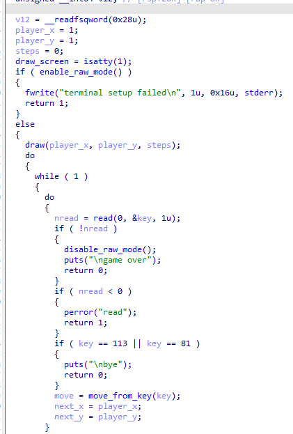
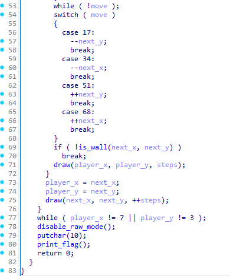
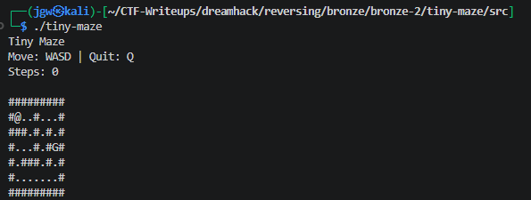
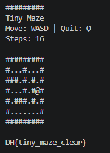

# [DreamHack] Tiny Maze - Reversing

## 1. 문제 개요

* **문제 링크:** [DreamHack - Tiny Maze](https://dreamhack.io/wargame/challenges/3053)

* **분야:** Reversing

* **목표:** 바이너리를 분석하여 미로 게임의 승리 조건을 파악하고, 목표 지점에 도달하여 플래그 획득.

## 2. 취약점 분석
제공된 ELF 바이너리 파일(`tiny-maze`)을 IDA로 디컴파일하여 분석한 결과, 키보드 입력을 통해 캐릭터의 좌표를 이동시키는 전형적인 미로 찾기 게임 로직 식별. 특정 좌표에 도달 시 무한 루프를 탈출하고 내장된 `print_flag` 함수를 호출하여 플래그를 출력하는 구조 파악.

```c
// [main 함수] 화면 렌더링 및 사용자 입력 로직
// ... (중략) ...
draw(player_x, player_y, steps);
do
{
  while ( 1 )
  {
    do
    {
      nread = read(0, &key, 1u);
      if ( !nread )
      {
// ... (중략) ...
```

```c
// [main 함수] 입력 키에 따른 좌표 이동 로직
// ... (중략) ...
  switch ( move )
  {
    case 17:
      --next_y;
      break;
    case 34:
      --next_x;
      break;
    case 51:
      ++next_y;
      break;
// ... (중략) ...
```

```c
// [main 함수] 루프 탈출 조건 및 플래그 출력 분기
// ... (중략) ...
    if ( !is_wall(next_x, next_y) )
      break;
    draw(player_x, player_y, steps);
  }
  player_x = next_x;
  player_y = next_y;
  draw(next_x, next_y, ++steps);
}
while ( player_x != 7 || player_y != 3 );
disable_raw_mode();
putchar(10);
print_flag();
return 0;
// ... (중략) ...
```

* **분석 결론:** `read` 함수로 키보드 입력을 받아 `player_x`, `player_y` 좌표를 연산하는 구조. 하단 `while` 문의 조건(`player_x != 7 || player_y != 3`)을 통해 루프 종료 조건이 명시되어 있으므로, 맵 상의 (7, 3) 좌표에 해당하는 `G` 위치에 도달하면 `print_flag`가 실행되어 플래그 획득 가능.

## 3. 공격 수행

1. IDA 디컴파일을 통해 사용자 입력 함수(`read`) 파악.



2. 하단의 `switch` 문을 통한 방향키 이동 로직 및 `while` 루프 조건을 검토하여 게임 클리어 조건(`player_x == 7` 및 `player_y == 3`) 확인.



3. 프로그램을 실행하여 콘솔 화면에 출력되는 맵 구조를 확인. 앞서 파악한 종료 조건의 좌표(7, 3)가 맵 상의 `G` 타일 위치와 일치함을 확인.



4. 방향키(`W, A, S, D`)를 조작해 수동으로 목표 지점(`G`)까지 캐릭터(`@`) 이동.

5. 목표 지점 도달과 동시에 루프가 종료되며 내장된 `print_flag` 함수가 실행되어 최종 평문 플래그 출력 확인.



## 4. 획득 결과

* **FLAG:** `DH{tiny_maze_clear}`

## 5. 대응 방안
본 문제는 정상적인 로직 수행(미로 찾기)을 통해 플래그를 획득하는 구조이나, 로컬 환경에서 단독 실행되므로 리버싱을 통한 조건 분기문(jnz/jz) 패치나 메모리 조작에 취약. 이를 방지하기 위한 시큐어 코딩 관점의 아키텍처 재설계 필요.

* **서버사이드 검증 도입:** 클라이언트(바이너리) 내부에 `print_flag` 함수나 평문 플래그를 적재하는 방식 지양. 사용자의 이동 기록이나 클리어 상태를 서버로 전송하여 서버 측에서 유효성 검증 후 플래그를 반환하는 구조로 설계.

* **안티 디버깅 및 무결성 검증:** `print_flag` 함수로의 강제 점프(EIP/RIP 조작)나 `while` 루프 탈출 조건문 패치를 방지하기 위해, 프로그램 코드 영역의 무결성을 검증하는 체크섬 검사 로직 및 ptrace 등 디버거 부착 여부를 탐지하는 방어 기법 추가.

## 6. 블루팀 관점 요약
해당 바이너리는 외부 네트워크(C2 서버 등)와의 통신이나 추가 페이로드 다운로드 행위 없이 로컬 환경 내에서 단독으로 실행되는 구조. 따라서 네트워크 관제 장비(IDS/IPS, WAF)로는 탐지 불가. 호스트 단(EDR, 백신)에서 파일 시스템에 유입된 정적 파일의 고유 문자열 및 구조를 분석하는 시그니처 기반 위협 헌팅 수행.

### 6.1. YARA 탐지 룰 (IoC)
정적 분석을 통해 식별된 바이너리 내부의 하드코딩된 게임 상태 알림 문자열과 ELF 파일 기본 매직 넘버를 조합하여 리버싱 과제 및 특정 바이너리를 분류하기 위한 YARA 룰 제안.

```yara
rule Detect_Tiny_Maze {
    strings:
        // 프로그램 실행 및 조작 관련 하드코딩 메시지
        $str1 = "Tiny Maze" ascii wide
        $str2 = "Move: WASD | Quit: Q" ascii wide
        $str3 = "game over" ascii wide
        $str4 = "terminal setup failed" ascii wide
        
    condition:
        // ELF 파일 매직 넘버 검증
        uint32(0) == 0x464C457F and // ELF "\x7FELF"
        all of ($str*)
}
```