# [DreamHack] ToyPacked - Reversing

## 1. 문제 개요

* **문제 링크:** [DreamHack - ToyPacked](https://dreamhack.io/wargame/challenges/2361)

* **분야:** Reversing

* **목표:** 다중 패킹(Packing) 구조를 동적 분석을 통해 우회 및 해제하고, 내부 메모리에 평문으로 적재되는 원본 암호문과 가짜 암호문을 추출. 이후 XOR 연산의 대칭성을 활용하여 알고리즘 역산 및 원본 플래그 복구.

## 2. 취약점 분석
제공된 ELF 바이너리 파일(`chall`)을 Ghidra로 디컴파일 분석한 결과, 1차적으로 `uncompress` 함수를 이용해 악성 페이로드(2차 ELF)를 메모리에 압축 해제하고 `memfd_create` 시스템 콜을 통해 파일리스(Fileless) 형태로 실행. 
이후 실행된 2차 원본 바이너리에서는 사용자 입력값을 검증한 뒤, 입력값 길이에 의존적인 암호 키를 생성하여 평문과 XOR 연산 후 하드코딩된 원본 암호문과 `memcmp`로 단순 비교하는 취약한 암호화 구조 파악.

```c
// [1차 패커] 압축 해제 및 메모리 파일(memfd) 생성 후 실행
// ... (중략) ...
if ((pvVar3 != (void *)0x0) &&
    (iVar1 = uncompress(pvVar3, &DAT_00405020, pbVar2, 0xfa9), iVar1 == 0)) {
    syscall(); // sys_memfd_create 호출 준비
    syscall();
    // ... (중략) ...
```

```c
// [2차 바이너리] 사용자 입력 및 길이(0x1d) / 형식 검증 로직
// ... (중략) ...
printf(s_Enter_flag:_0040401b);
pcVar3 = fgets((char *)local_198, 0x100, stdin);
// ... (중략) ...
input_len = strcspn((char *)input_dat, &DAT_00404019); // '\n' 기준 길이 측정
input_dat[input_len] = 0;
if ((input_len == 0x1d) && (input_dat[0] == 0x44)) {
// ... (중략) ...
```

```c
// [2차 바이너리] 내부 암호 키(key) 생성 및 입력값 XOR 연산 후 정답(C)과 비교
// ... (중략) ...
while (local_18[0] < local_20) {
    local_88[local_68[0] + local_18[0]] =
        input_dat[local_68[0] + local_18[0]] ^ key[local_18[0]];
}
iVar2 = memcmp(local_88, C, 0x1d);
// ... (중략) ...
```

* **분석 결론:** 1차 패킹은 동적 디버거(GDB)를 통해 `syscall` 직전에 메모리를 덤프하여 해제 가능. 2차 검증 로직은 암호화 키 생성 과정이 입력값 내용이 아닌 길이에만 의존하므로, 동일한 길이의 더미 평문을 입력한 후 메모리에 생성된 가짜 암호문(`local_88`)과 진짜 암호문(`C`)을 추출하여 XOR 연산(`진짜 플래그 = C ^ local_88 ^ 더미 평문`)으로 원래의 키 및 플래그 복구 가능.

## 3. 공격 수행

1. Ghidra를 통한 1차 패커 코드 분석 및 압축 해제(`uncompress`) 이후 시스템 콜 제어권 전환 로직 파악.

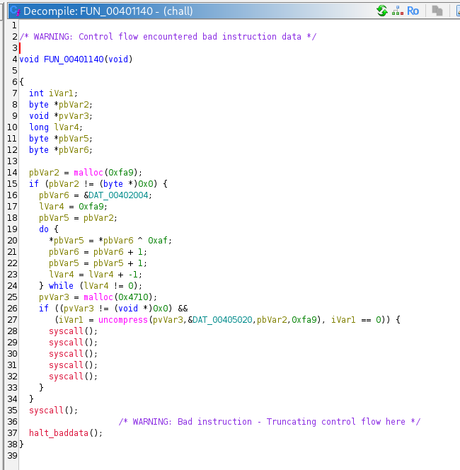

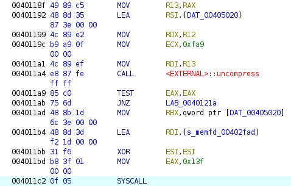

2. GDB(pwndbg)를 이용해 1차 패킹이 해제되는 지점(`syscall`, `*0x4011c2`)에 브레이크포인트 설정 및 실행.

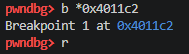

3. 브레이크포인트 도달 시 레지스터 조회를 통해 압축 해제된 원본 ELF 파일의 메모리 주소가 `R13` 레지스터(`0x406fd0`)에 보존되어 있음을 확인.

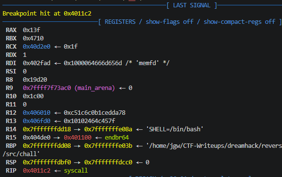

4. `dump memory` 명령어를 사용하여 메모리에 적재된 2차 ELF 원본 바이너리를 파일(`extracted.elf`)로 추출.

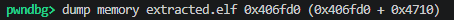

5. 추출된 바이너리를 Ghidra로 2차 분석하여 입력값 길이(`0x1d`) 및 시작 형식(`DH{...}`) 검증 로직 확인.

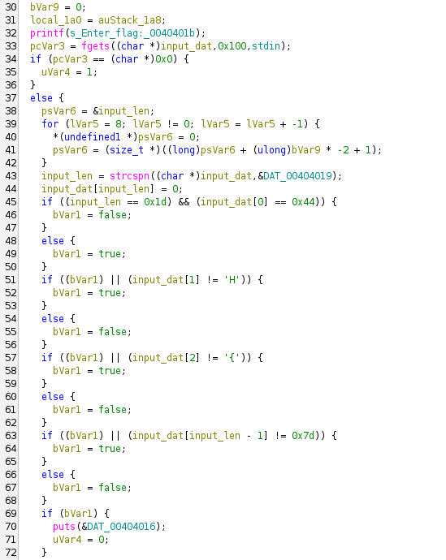

6. 내부 연산 로직 분석 결과, 암호 키와 입력값을 XOR 연산하여 `memcmp`로 하드코딩된 정답(`C`)과 비교하는 암호화 로직 취약점 파악.

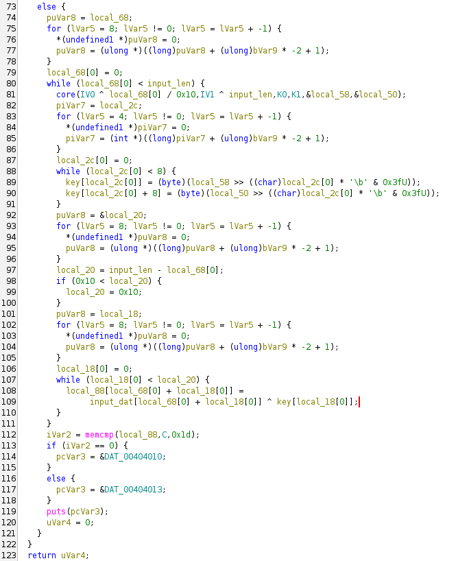

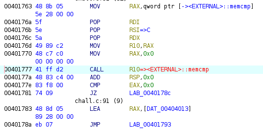

7. GDB로 추출된 2차 바이너리를 로드하고 `memcmp` 호출 지점(`*0x401777`)에 브레이크포인트 설정 후, 검증 조건을 만족하는 29바이트의 더미 값(`DH{1234567890123456789012345}`) 입력.

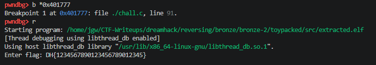

8. `memcmp` 직전 정지 시, 호출 규약에 따라 가짜 입력값의 암호문 주소가 `RDI`에, 진짜 정답 암호문 주소가 `RSI`에 적재되어 있음을 확인.

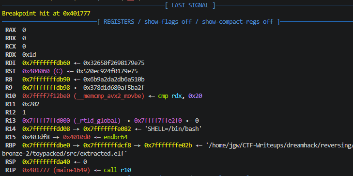

9. 메모리 조회 명령어(`x/29xb`)를 사용하여 알고리즘 역산에 필요한 각 암호문 데이터 블록(29바이트) 덤프 수행.

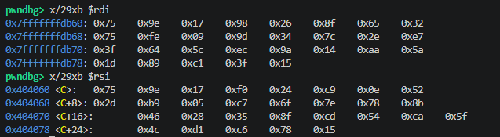

10. XOR 연산의 대칭성 수식을 이용한 파이썬 복호화 스크립트 작성 및 실행하여 최종 플래그 획득.

```python
c = [
    0x75, 0x9e, 0x17, 0xf0, 0x24, 0xc9, 0x0e, 0x52,
    0x2d, 0xb9, 0x05, 0xc7, 0x6f, 0x7e, 0x78, 0x8b,
    0x46, 0x28, 0x35, 0x8f, 0xcd, 0x54, 0xca, 0x5f,
    0x4c, 0xd1, 0xc6, 0x78, 0x15
]

local88 = [
    0x75, 0x9e, 0x17, 0x98, 0x26, 0x8f, 0x65, 0x32,
    0x75, 0xfe, 0x09, 0x9d, 0x34, 0x7c, 0x2e, 0xe7,
    0x3f, 0x64, 0x5c, 0xec, 0x9a, 0x14, 0xaa, 0x5a,
    0x1d, 0x89, 0xc1, 0x3f, 0x15
]

input_data = list(b"DH{1234567890123456789012345}")

# 진짜 입력값(플래그) = C(RSI) ^ local_88(RDI) ^ 가짜 입력값
flag = ""
for c, enc, dum in zip(c, local88, input_data):
    flag += chr(c ^ enc ^ dum)

print(flag)
```

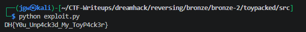

## 4. 획득 결과

* **FLAG:** `DH{Y0u_Unp4ck3d_My_ToyP4ck3r}`

## 5. 대응 방안
본 문제는 파일리스 기법의 1차 패킹과 XOR 연산 대칭성의 논리적 결함에 취약함. 메모리상에 비교 대상이 노출되어 식 추출이 가능하므로, 정적/동적 분석 우회 및 메모리 탈취 방지를 위한 시큐어 코딩 관점의 아키텍처 재설계 필요.

* **메모리 내 평문/단순 해시 노출 지양:** `memcmp`를 통해 하드코딩된 최종 정답 암호문과 직접 비교하는 로직 사용 지양. 사용자의 입력값을 단방향 해싱(SHA-256 등) 처리한 뒤, 내부 해시값과 비교하는 구조로 변경하여 메모리 덤프 시에도 원본 정답을 알 수 없도록 설계.

* **동적 키 생성 알고리즘 강화:** 암호 키 생성 시 단순히 입력값의 길이나 고정된 루프 변수에 의존하지 않고, 입력 데이터 자체의 엔트로피나 무작위 런타임 난수(Salt)를 혼합하여 XOR 연산의 대칭적 역산을 원천 차단.

* **안티 디버깅 및 난독화 로직 결합:** 1차 패커에서 `memfd_create`를 호출하기 전 `ptrace` 등을 활용한 디버깅 탐지 로직 추가. 또한 제어 흐름 난독화를 통해 `memcmp` 위치를 쉽게 식별하여 브레이크포인트를 설정하지 못하도록 방어 로직 다각화.

## 6. 블루팀 관점 요약
해당 바이너리는 외부 네트워크(C2 서버 등)와의 통신이나 추가 페이로드 다운로드 행위 없이 로컬 환경의 메모리 내에서 단독으로 파일리스(Fileless) 실행 및 암호화 연산만 수행. 따라서 네트워크 보안 장비로는 탐지 불가. 호스트 단(EDR, 백신)에서 파일 시스템에 유입된 정적 파일의 패킹 고유 로직(`memfd_create` 시스템 콜) 및 검증 프롬프트 문자열을 분석하는 시그니처 기반 위협 헌팅 수행.

### 6.1. YARA 탐지 룰 (IoC)
정적 분석을 통해 식별된 1차 언패킹의 특정 시스템 콜 구조 및 2차 바이너리의 사용자 입력 유도 하드코딩 데이터를 조합하여 악성 패커 및 관련 툴로 분류하기 위한 YARA 룰 제안.

```yara
rule Detect_ToyPacked {
    strings:
        // 프로그램 실행 및 인증 관련 하드코딩 메시지 (2차 페이로드)
        $str_prompt = "Enter flag:" ascii
        
        // memfd_create 시스템 콜 및 초기화 어셈블리 시그니처 (1차 페이로드)
        // xor esi, esi ; mov eax, 0x13f ; syscall
        $syscall_memfd = { 31 f6 b8 3f 01 00 00 0f 05 }

    condition:
        // ELF 파일 매직 넘버 검증
        uint32(0) == 0x464C457F and // ELF "\x7FELF"
        all of them
}
```