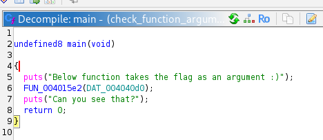
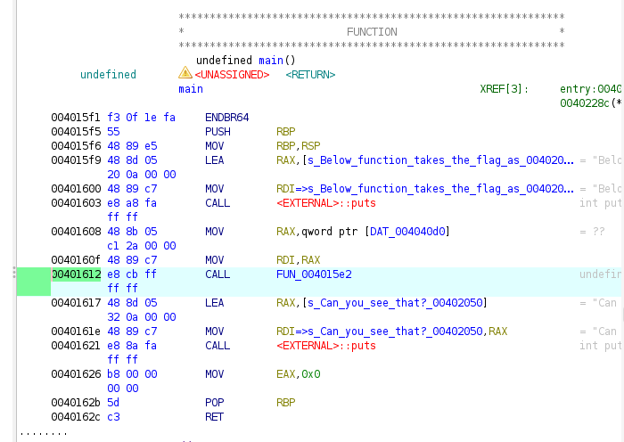
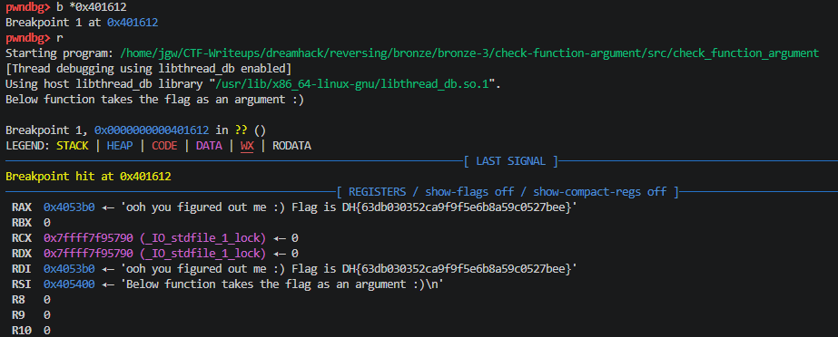

# [DreamHack] Check Function Argument - Reversing

## 1. 문제 개요

* **문제 링크:** [DreamHack - Check Function Argument](https://dreamhack.io/wargame/challenges/671)

* **분야:** Reversing

* **목표:** 프로그램 내에서 특정 함수가 호출될 때 인자로 전달되는 플래그의 메모리 주소를 파악하고, 동적 디버깅을 통해 레지스터 값을 가로채어 원본 플래그 도출.

## 2. 취약점 분석
제공된 ELF 바이너리(`check_function_argument`)를 Ghidra로 디컴파일하여 분석한 결과, 메인 함수에서 플래그가 담긴 메모리 주소(`DAT_004040d0`)를 타겟 함수(`FUN_004015e2`)의 인자로 전달하지만 화면에 출력하지 않는 로직 확인.

```c
undefined8 main(void)
{
  puts("Below function takes the flag as an argument :)");
  // ... (중략) ...
  FUN_004015e2(DAT_004040d0);
  // ... (중략) ...
  return 0;
}
```

* **분석 결론:** 프로그램 구동 시 플래그 문자열이 메모리에 적재되고 특정 함수의 인자로 전달됨. `x86-64` 리눅스 함수 호출 규약(Calling Convention)에 따라 함수의 첫 번째 인자는 `RDI` 레지스터에 저장되므로, `CALL` 명령어 실행 직전에 동적 디버거로 흐름을 제어하여 `RDI` 값을 확인하는 방식이 요구됨.

## 3. 공격 수행

1. Ghidra를 통해 `main` 함수 디컴파일 코드 확인 및 타겟 함수(`FUN_004015e2`)가 호출되는 흐름 파악.



2. 어셈블리 뷰를 통해 타겟 함수를 호출하는 명령어(`CALL FUN_004015e2`)의 실제 메모리 주소(`0x00401612`) 확인.



3. GDB를 활용하여 확보한 타겟 주소에 브레이크포인트(`b *0x401612`) 설정 및 바이너리 실행(`r`).

4. 함수 호출 직전 브레이크포인트에서 실행이 일시 정지된 순간, 첫 번째 인자를 담고 있는 `RDI` 레지스터의 메모리 주소 및 자동 출력된 평문 데이터 확인.



## 4. 획득 결과
도출된 호출 규약을 바탕으로 동적 디버깅을 수행하여, 함수 호출 직전 인자가 세팅된 `RDI` 레지스터를 추적해 메모리에 생성된 원본 플래그 식별 성공.

* **FLAG:** `DH{63db030352ca9f9f5e6b8a59c0527bee}`

## 5. 대응 방안
프로그램 내에서 보안상 민감한 데이터(플래그, 암호화 키 등)를 처리할 때, 메모리에 평문 형태로 잔존하거나 레지스터를 통해 외부에 노출되는 것을 방지하기 위해 프로그램 소스코드 단에 대한 시큐어 코딩 조치 적용.

* **메모리 즉각 초기화 (Zero-out) 적용:** 민감한 연산이나 함수 호출이 끝난 직후 `memset_s` 또는 `SecureZeroMemory` 등의 보안 함수를 활용하여, 플래그 데이터가 담겼던 전역 변수나 버퍼 메모리 영역을 0으로 덮어써서 메모리 포렌식 및 덤프 방지.

* **안전한 데이터 처리 로직 설계:** 민감한 문자열을 원본 그대로 외부 함수의 인자로 넘기거나 평문으로 메모리에 무방비하게 유지하는 아키텍처 지양. 메모리 내에서 난독화/암호화된 상태로만 유지하고, 검증이 필요한 순간에만 안전한 비교 연산 내부에서만 제한적으로 활용하도록 로직 변경.

## 6. 블루팀 관점 요약

### 6.1. 탐지 및 분석 한계
* **네트워크 행위 없음:** 외부 C2 통신이나 네트워크 I/O가 발생하지 않는 단독 실행형 리눅스 바이너리(ELF)이므로 기존 관제 장비(NTA/IPS)로는 행위 탐지 불가.

* **대응 방향:** EDR 및 리눅스 호스트 보안 모니터링 체계를 통해, 분석가의 불법적인 동적 디버깅 시도(비정상적인 `ptrace` 시스템 콜 호출)를 탐지하거나 프로세스 메모리 덤프 행위를 차단하는 안티 디버깅(Anti-Debugging) 기술 적용 필요.

### 6.2. YARA 탐지 룰 (IoC)
분석으로 확보한 바이너리 내 하드코딩된 특정 안내 문자열 시그니처를 활용한 탐지 룰 제안.

```yara
rule Detect_Check_Function_Argument {
    strings:
        // 프로그램 실행 시 노출되는 특징적인 하드코딩 문자열
        $str1 = "Below function takes the flag as an argument :)"
        $str2 = "Can you see that?"
    condition:
        all of them
}
```