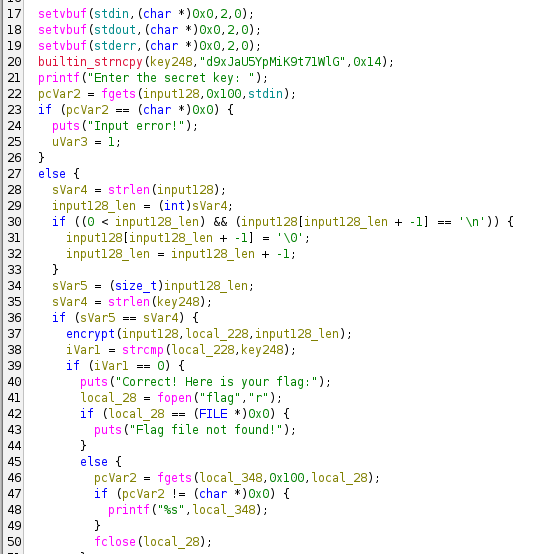
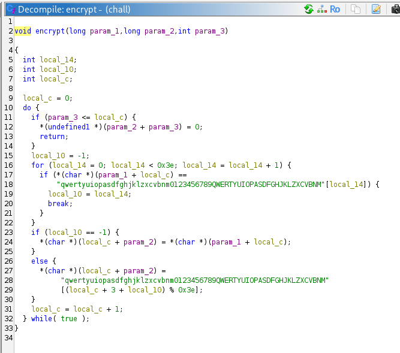
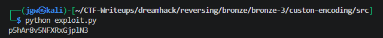
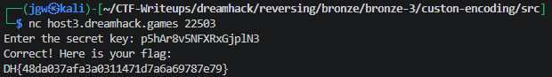

# [DreamHack] Custom Encoding - Reversing

## 1. 문제 개요

* **문제 링크:** [Dreamhack - Custom Encoding](https://dreamhack.io/wargame/challenges/2904)

* **분야:** Reversing

* **목표:** 제공된 바이너리의 커스텀 암호화 로직을 리버싱하여 역연산 공식을 도출하고, 하드코딩된 암호문을 평문으로 복원하여 원격 서버에서 원본 플래그 추출.

## 2. 취약점 분석
제공된 ELF 바이너리 파일(`chall`)를 Ghidra를 통해 디컴파일하여 `main` 함수와 `encrypt` 함수의 흐름 및 커스텀 암호화 수식 파악.

```c
// ... (중략) ...

builtin_strncpy(key248,"d9xJaU5YpMiK9t71WlG",0x14);
printf("Enter the secret key: ");
pcVar2 = fgets(input128,0x100,stdin);

// ... (중략) ...

sVar5 = (size_t)input128_len;
sVar4 = strlen(key248);
if (sVar5 == sVar4) {
  encrypt(input128,local_228,input128_len);
  iVar1 = strcmp(local_228,key248);
  if (iVar1 == 0) {
    puts("Correct! Here is your flag:");

// ... (중략) ...
```

```c
// ... (중략) ...

local_10 = -1;
for (local_14 = 0; local_14 < 0x3e; local_14 = local_14 + 1) {
  if (*(char *)(param_1 + local_c) ==
      "qwertyuiopasdfghjklzxcvbnm0123456789QWERTYUIOPASDFGHJKLZXCVBNM"[local_14]) {
    local_10 = local_14;
    break;
  }
}
if (local_10 == -1) {
  *(char *)(local_c + param_2) = *(char *)(param_1 + local_c);
}
else {
  *(char *)(local_c + param_2) =
       "qwertyuiopasdfghjklzxcvbnm0123456789QWERTYUIOPASDFGHJKLZXCVBNM"
       [(local_c + 3 + local_10) % 0x3e];
}

// ... (중략) ...
```

* **분석 결론:** 올바른 입력값 길이는 `key248`과 동일한 19바이트이며, 특정 문자열 세트(charset) 기반의 `(c + 3 + 인덱스) % 62` 공식을 통해 인코딩이 수행됨. 무차별 대입 없이 해당 수식의 이항 정리를 통한 역연산 복호화 가능.

## 3. 공격 수행

1. Ghidra를 통해 `main` 함수의 로직과 최종적으로 비교되는 대상 문자열(`key248`) 식별.



2. `encrypt` 함수의 내부 루프를 분석하여 커스텀 인코딩에 사용된 연산식 파악.



3. 파악한 암호화 연산식을 이항 정리하여 원본 인덱스를 구하는 복호화 공식(`var1 = (result_idx - c - 3) % 62`)을 도출하고 파이썬 익스플로잇 스크립트 작성.

```python
key248 = "d9xJaU5YpMiK9t71WlG"
charset = "qwertyuiopasdfghjklzxcvbnm0123456789QWERTYUIOPASDFGHJKLZXCVBNM"

def decrypt(enc_str):
    original_input = ""
    for c in range(len(enc_str)):
        result_idx = charset.index(enc_str[c])  # result_idx = (c + 3 + var1) % 62
        var1 = (result_idx -c -3) % 62
        original_input += charset[var1]
    return original_input

print(decrypt(key248))
```

4. 작성한 파이썬 스크립트를 로컬에서 실행하여 암호화 전의 원본 비밀키(Secret Key) 획득.



5. 도출된 원본 비밀키를 원격 서버에 입력하여 최종 플래그 획득.



## 4. 획득 결과
정적 분석으로 파악한 암호화 로직을 수학적으로 역연산하는 익스플로잇 스크립트를 작성하여, 올바른 키 식별 및 원본 플래그 획득

* **FLAG:** ``DH{48da037afa3a0311471d7a6a69787e79}``

## 5. 대응 방안
커스텀 암호화 알고리즘의 노출을 막고 데이터를 보호하기 위한 시큐어 코딩 및 보호 기법 적용.

* **표준 암호화 알고리즘 사용:** 자체 개발한 커스텀 로직은 구조 노출 시 수학적 역연산을 통해 원본 데이터가 쉽게 복원될 위험이 큼. 민감한 키 데이터 보호 시 AES, SHA-256 등 검증된 표준 암호화 및 해시 알고리즘 적용.

* **안티 디버깅 및 난독화 적용:** 리버서를 통한 알고리즘 정적/동적 탈취를 지연시키기 위해 바이너리 빌드 시 안티 디버깅 기술과 제어 흐름 난독화 기술 적용 요구.

## 6. 블루팀 관점 요약
해당 문제는 네트워크 기반 통신보다 호스트 내부에서의 암호화 연산이 주를 이루므로, 엔드포인트 단에서의 정적 분석 단서를 활용한 탐지 및 위협 헌팅 전략 수립.

* **YARA 탐지 룰 적용 (IoC):** 바이너리 정적 분석 과정에서 식별된 하드코딩된 키 문자열 및 커스텀 인코딩용 Charset 딕셔너리 시그니처를 활용하여, 유사한 형태의 데이터 은닉을 시도하는 변종 악성 파일 유입 탐지.

```yara
rule Detect_Custom_Encoding {
    strings:
        // 하드코딩된 타겟 비교 문자열
        $key248 = "d9xJaU5YpMiK9t71WlG" ascii
        // 커스텀 인코딩에 사용된 Charset 시그니처
        $charset = "qwertyuiopasdfghjklzxcvbnm0123456789QWERTYUIOPASDFGHJKLZXCVBNM" ascii
        // 성공 검증 문자열
        $success = "Correct! Here is your flag:" ascii

    condition:
        // ELF 바이너리 포맷 검증 및 대상 문자열 2개 이상 매칭 시 탐지
        uint32(0) == 0x464C457F and 2 of ($*)
}
```