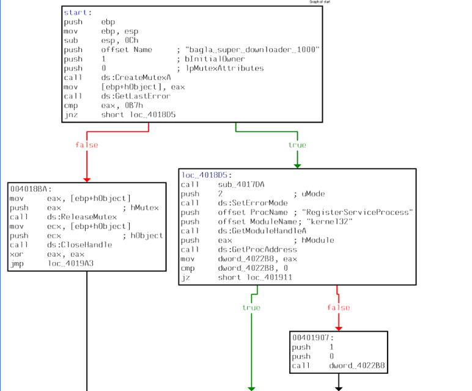
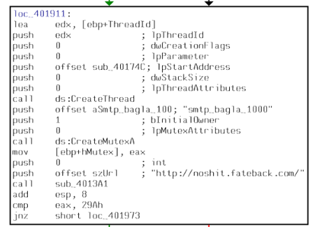

# [Dreamhack] Malware L06 - Reversing

## 1. 문제 개요

* **문제 링크:** [Dreamhack - Malware L06](https://dreamhack.io/wargame/challenges/373)

* **분야:** Reversing

* **목표:** 제공된 악성코드 어셈블리어 Flow의 일부를 분석하여, 멀티 스레드(Thread) 동작 시점에 생성되는 스레드 뮤텍스(Thread Mutex) 명 도출.

### 1.1. 악성코드 식별 정보

* **식별 단서:** `CreateMutexA` API 반복 호출, `RegisterServiceProcess` 함수를 통한 구형 Windows OS 환경에서의 프로세스 은폐 시도 식별.

* **분석 결과:** Bagle 웜 변종 계열 등에서 흔히 발견되는 다중 뮤텍스(프로세스용/스레드용 분리) 구조의 악성코드로 판단.

## 2. 취약점 분석
제공된 파일은 실제 실행 가능한 바이너리가 아닌, IDA의 제어 흐름도를 캡처한 문서. 어셈블리어 명령어 흐름을 따라가며 프로세스 초기화, 은폐, 그리고 스레드 생성 시점의 동기화 객체(Mutex) 이름 파악.

```assembly
; ... (중략) ...

start:
; ... (중략) ...
push    offset Name             ; "bagla_super_downloader_1000"
push    1                       ; bInitialOwner
push    0                       ; lpMutexAttributes
call    ds:CreateMutexA         ; 첫 번째 뮤텍스 (프로세스 중복 실행 방지용) 생성
call    ds:GetLastError
cmp     eax, 0B7h               ; 이미 존재하는지(ERROR_ALREADY_EXISTS) 확인
jnz     short loc_4018D5

; ... (중략) ...

loc_401911:
; ... (중략) ...
call    ds:CreateThread         ; 악성 행위를 수행할 새로운 스레드 생성
push    offset aSmtp_bagla_100  ; "smtp_bagla_1000"
push    1                       ; bInitialOwner
push    0                       ; lpMutexAttributes
call    ds:CreateMutexA         ; 두 번째 뮤텍스 (스레드 전용) 생성

; ... (중략) ...
```

* **분석 결론:** 악성코드는 프로세스 구동 직후 중복 실행 방지를 위한 메인 프로세스 뮤텍스(`bagla_super_downloader_1000`)를 생성. 이후 자기 자신을 은닉한 뒤 백그라운드 작업을 위해 스레드를 생성하며, 이때 스레드 내부 통제 및 동기화를 위한 별도의 스레드 뮤텍스(`smtp_bagla_1000`)를 추가로 생성.

## 3. 공격 수행

1. 파일 탐색기를 통해 제공된 내부의 어셈블리 제어 흐름 그래프 상단 `start` 블록 확인. 첫 번째 `CreateMutexA` 호출을 통해 프로세스 중복 실행 방지용 뮤텍스(`bagla_super_downloader_1000`) 식별.

   

2. `cmp eax, 0B7h` 분기점에서 에러가 아닐 경우(초록색 화살표) `RegisterServiceProcess` 함수를 호출하여 프로세스를 숨기는 로직 추적.

3. 제어 흐름을 따라 하단 `loc_401911` 블록 도달. `CreateThread` API를 통해 스레드가 생성되는 핵심 구간 도출.

   

4. 문제에서 요구하는 'Thread Mutex'를 찾기 위해, `CreateThread` 호출 직후 실행되는 두 번째 `CreateMutexA` 함수의 스택 Push 인자 확인. 해당 메모리 주소(`aSmtp_bagla_100`)가 가리키는 문자열 값이 `"smtp_bagla_1000"` 임을 확인하여 최종 플래그 계산.

## 4. 획득 결과
어셈블리어 분기문 분석을 통해 메인 뮤텍스와 스레드 뮤텍스를 구분해 내고, 스레드 생성 직후 할당되는 뮤텍스 문자열 확보 성공.

* **FLAG:** `smtp_bagla_1000`

## 5. 대응 방안
프로세스 은폐 기법 및 뮤텍스를 활용하는 악성코드에 대한 분석가/개발자 관점의 방어 및 시큐어 코딩 조치.

* **뮤텍스 선점을 통한 악성코드 무력화:** 방어 시스템 또는 악성코드 분석(백신) 환경에서 해당 악성코드의 메인 뮤텍스 명(`bagla_super_downloader_1000`)을 시스템에 사전 생성. 악성코드 실행 시 이미 감염된 것으로 오판하여 스스로 종료(ExitProcess)되도록 유도(Kill-Switch 활용).

* **프로세스 은폐 API 사용 지양:** 개발자 관점에서 백그라운드 구동이 필요할 경우, `RegisterServiceProcess`와 같은 비정상적인 구식 숨김 API 사용 금지. 최신 OS 환경(Windows NT 계열)의 보안 정책에 부합하는 정식 윈도우 서비스(Windows Service) 등록 구조 채택.

## 6. 블루팀 관점 요약
바이너리 정적 분석 화면을 통해 확보한 호스트 기반 단서(하드코딩된 이중 뮤텍스 이름 및 주요 API)를 활용한 위협 탐지 룰 제안.

### 6.1. 탐지 및 분석 한계
* **단편적 정보의 한계:** 원본 바이너리가 아닌 제어 흐름의 캡처 이미지로만 분석을 진행하였으므로, `CreateThread` 이후 이어지는 `szUrl`(`http://noshit.fateback.com/`) 통신을 통한 추가 페이로드 다운로드 행위나 시스템 권한 상승 시도 등 동적 분석에 한계 존재.

### 6.2. YARA 탐지 룰 (IoC)
바이너리 정적 분석을 통해 도출된 핵심 식별자(프로세스/스레드 뮤텍스 및 네트워크 단서)를 바탕으로 위협 헌팅을 위한 YARA 룰 제안.

```yara
rule Detect_Malware_L06 {
    strings:
        // 하드코딩된 악성 C2 도메인 시그니처
        $c2_url = "http://noshit.fateback.com/" ascii

        // 첫 번째: 프로세스 중복 실행 방지용 메인 뮤텍스
        $mutex_main = "bagla_super_downloader_1000" ascii
        
        // 두 번째: 스레드 동기화/관리용 서브 뮤텍스
        $mutex_thread = "smtp_bagla_1000" ascii

        // 구형 OS 타겟의 프로세스 은폐 API
        $api_hide = "RegisterServiceProcess" ascii

    condition:
        ($mutex_main and $mutex_thread) or ($api_hide and $c2_url)
}