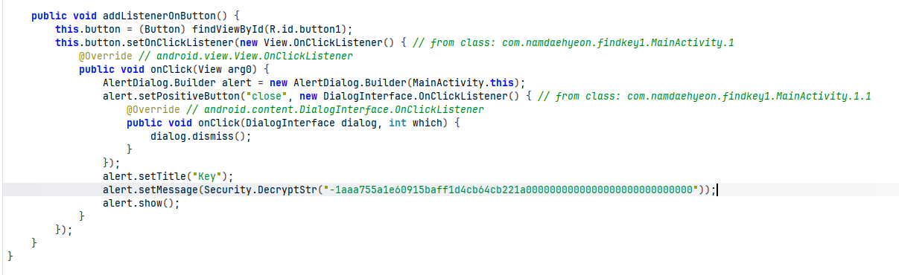
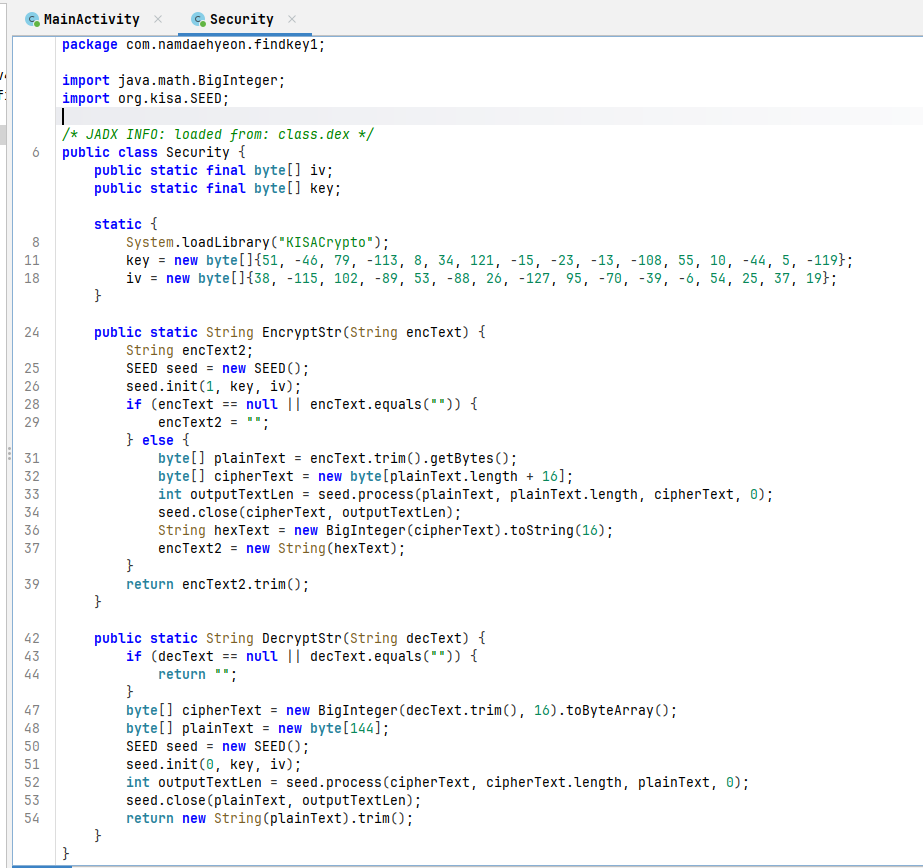
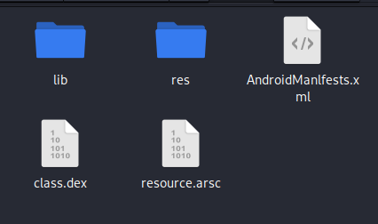
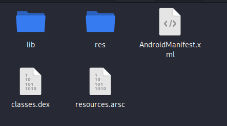
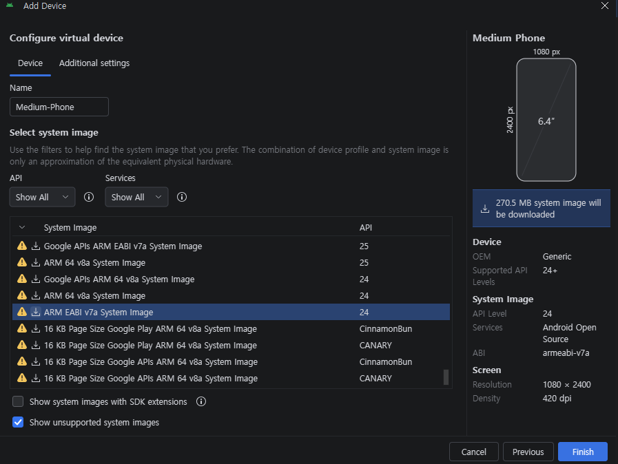
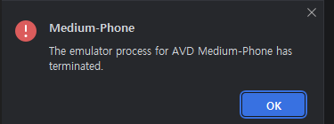
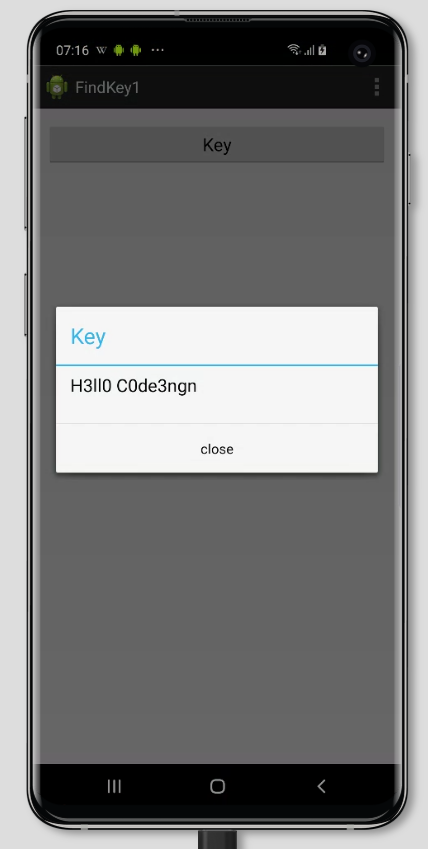

# [Dreamhack] MobileApp L01 - Reversing

## 1. 문제 개요

* **문제 링크:** [Dreamhack - MobileApp L01](https://dreamhack.io/wargame/challenges/376)

* **분야:** Reversing

* **목표:** APK 파일 내부 구조 변조 및 아키텍처 종속성(ARM 32-bit)으로 인한 실행 환경 제약을 파악하고, 리패키징(Repackaging) 기법과 클라우드 물리 기기(BrowserStack)를 활용하여 플래그 복구.

## 2. 취약점 분석
제공된 APK 파일(`SmartApp L01`)을 JADX-GUI 도구로 정적 분석한 결과, `MainActivity` 내부에서 하드코딩된 암호문을 `Security` 클래스로 전달하여 복호화하는 구조 파악.

```java
// ... (중략) ...
public class MainActivity {
    // ... (중략) ...
    public void onClick(View arg0) {
        // ... (중략) ...
        alert.setMessage(Security.DecryptStr("1aaa755e1e50915baef1d4cb04cb221a000000000000000000000000"));
        // ... (중략) ...
    }
}
```

해당 `Security` 클래스는 네이티브 라이브러리(`libKISACrypto.so`)를 로드하며, 내부에 SEED-CBC 알고리즘 구동을 위한 고정 Key 및 IV 배열 존재 확인.

```java
// ... (중략) ...
public class Security {
    static {
        System.loadLibrary("KISACrypto");
        key = new byte[]{51, -46, 79, -113, 8, 34, 121, -15, -23, -13, -108, 55, 10, -44, 5, -119};
        iv = new byte[]{38, -115, 102, -89, 53, -88, 26, -127, 95, -70, -39, -6, 54, 25, 37, 19};
    }
    // ... (중략) ...
}
```

* **분석 결론:** 주요 암복호화 데이터가 평문으로 노출되어 있으나, 내부 JNI 라이브러리가 구형 ARM 32비트 전용으로 빌드되어 최신 x86 기반 PC 에뮬레이터에서 런타임 크래시 유발. 또한 `AndroidManIfests.xml`과 같이 고의로 변조된 파일명으로 인해 정상적인 파싱 및 설치 불가.

## 3. 공격 수행

### 3.1. 정적 분석 및 안티 리버싱 기법 식별
1. JADX를 통해 APK 파일의 전반적인 구조 및 핵심 로직이 구현된 `MainActivity` 클래스 식별.



2. `Security` 클래스에서 네이티브 라이브러리 호출 구조 및 SEED 복호화에 사용되는 Key, IV 데이터 배열 파악.



### 3.2. 설치 오류 발생 및 리패키징 (파일 구조 복구)
3. 에뮬레이터 환경에 앱 설치를 시도했으나, 설치 오류(`INSTALL_PARSE_FAILED`)가 발생하여 파일 구조를 확인한 결과 고의로 변조된 파일명(`AndroidManIfests.xml` 등) 식별.



4. 파일명을 안드로이드 표준 패키징 구조에 맞게 원상 복구(`AndroidManifest.xml`, `classes.dex`, `resources.arsc`).



5. 수정된 폴더를 다시 `zip` 명령어로 압축(`fixed_app.apk`)하고, `uber-apk-signer` 도구를 활용하여 정식 디버그 서명 주입 완료.

```shell
zip -r ../fixed_app.apk *
wget https://github.com/patrickfav/uber-apk-signer/releases/download/v1.3.0/uber-apk-signer-1.3.0.jar
java -jar uber-apk-signer-1.3.0.jar -a fixed_app.apk
```

### 3.3. 동적 분석 환경 구축 시도 및 실패 (아키텍처 한계)
6. 파일 구조가 정상화된 APK를 실행하기 위해, 안드로이드 스튜디오 장치 관리자에서 ARM 아키텍처 전용 `armeabi-v7a` 시스템 이미지 다운로드 및 가상 기기(AVD) 세팅 시도.



7. 하지만 x86_64 기반 호스트 PC 가상화 엔진과의 충돌 및 호환성 한계로 인해, 앱 구동 시 내부 네이티브 라이브러리(`.so`)를 해석하지 못하고 AVD 프로세스가 지속적으로 강제 종료(`terminated`)되는 문제 발생.



### 3.4. 클라우드 기기를 활용한 우회 실행 및 플래그 획득
8. PC 가상화 에뮬레이터의 한계를 벗어나기 위해 물리적 ARM 스마트폰을 제공하는 브라우저스택(BrowserStack) 클라우드 환경 구성.

9. 리패키징이 완료된 APK를 해당 기기에 업로드 후 앱을 실행하여 버튼 터치. 아키텍처 충돌 없이 정상적으로 네이티브 라이브러리가 로드되어 복호화된 플래그 식별 성공.



## 4. 획득 결과
정상적인 동적 분석 환경 우회 구축 및 앱 실행을 통해 복호화된 플래그 획득.

* **FLAG:** `H3ll0 C0de3ngn`

## 5. 대응 방안
모바일 앱 환경에서 중요 로직 및 데이터 보호를 위해 소스코드 단에 다음과 같은 시큐어 코딩 조치 적용.

* **하드코딩된 중요 정보 제거:** 암호화 Key, IV 및 타겟 암호문을 소스코드 내부에 평문 형태로 하드코딩하는 것을 금지. 중요 암호화 키는 Android Keystore 시스템을 활용하여 하드웨어 지원 보안 구역(TEE)에 안전하게 보관.

* **표준 아키텍처 라이브러리 지원:** JNI 기반 네이티브 라이브러리(`.so`) 사용 시, 파편화된 모바일 환경을 고려하여 단일 아키텍처(ARM 32-bit)뿐만 아니라 최신 64-bit(arm64-v8a, x86_64) 등 다중 아키텍처 NDK 빌드를 지원하도록 최신화 유지.

* **동적 분석 및 리버싱 방지 기법 적용:** ProGuard/R8과 같은 난독화 솔루션을 적용하여 소스코드의 가독성을 저하시키고, 런타임 시 앱 위변조(서명 해시 불일치) 여부를 자체 검증하는 로직을 추가하여 리패키징 공격 방어.

## 6. 블루팀 관점 요약

### 6.1. 탐지 및 분석 한계
* **네트워크 행위 없음:** 해당 검증 앱은 외부 C2 서버와의 통신 없이 오프라인(로컬 메모리) 환경에서 단독으로 라이브러리를 로드하고 SEED 복호화를 수행. 따라서 기존 네트워크 관제 장비(NTA/IDS)로는 비정상 행위 및 데이터 유출 시도 탐지 불가.

* **대응 방향:** 모바일 엔드포인트 보안 솔루션(MTD)을 통해 출처를 알 수 없는 APK의 설치(사이드로딩) 이력을 모니터링해야 함. 또한, 분석을 통해 확보된 호스트 기반 단서(특정 패키지명, 하드코딩된 Hex 값, 특정 라이브러리 모듈 적재 행위)를 바탕으로 파일 기반 매칭 탐지 규칙 구성 필요.

### 6.2. YARA 탐지 룰 (IoC)
바이너리 정적 분석 과정에서 식별된 하드코딩 데이터 및 특정 라이브러리 명을 활용한 정적 탐지 룰 제안.

```yara
rule Detect_MobileApp_L01 {
    strings:
        // 하드코딩된 특징적인 암호문 Hex 문자열 식별
        $enc_str = "1aaa755e1e50915baef1d4cb04cb221a000000000000000000000000" ascii wide
        
        // 특정 네이티브 라이브러리 로드 패턴
        $lib_name = "KISACrypto" ascii wide
        
        // JADX 디컴파일 시 노출되는 핵심 클래스 및 함수명
        $class_name = "Lcom/namdaehyeon/findkey1/Security;" ascii wide
        $func_name = "DecryptStr" ascii fullword

    condition:
        // APK 압축 파일 매직 넘버(ZIP 헤더) 식별을 통한 파일 포맷 한정
        uint32(0) == 0x04034b50
        and $enc_str
        and $lib_name
        and ($class_name or $func_name)
}
```