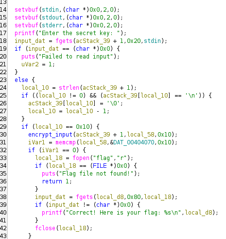
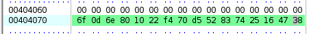
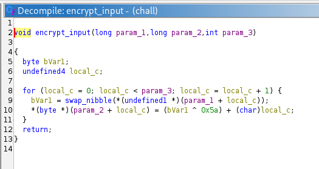
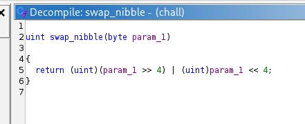
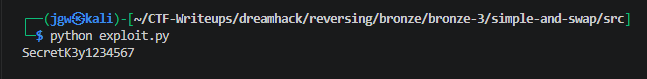
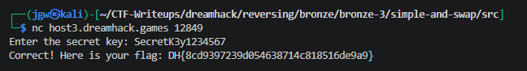

# [Dreamhack] Simple and Swap - Reversing

## 1. 문제 개요

* **문제 링크:** [Dreamhack - Simple and Swap](https://dreamhack.io/wargame/challenges/2501)

* **분야:** Reversing

* **목표:** 제공된 ELF 바이너리의 비트 스왑(Nibble Swap) 및 XOR, 인덱스 덧셈 연산 기반의 커스텀 암호화 로직을 정적 분석하고, 도출한 알고리즘을 바탕으로 역연산 파이썬 스크립트를 작성하여 원본 입력값(Secret Key) 복구.

## 2. 취약점 분석
제공된 ELF 바이너리 파일(`chall`)을 Ghidra로 디컴파일하여 분석한 결과, 16바이트의 사용자 입력값을 받은 후 `encrypt_input` 함수를 거쳐 데이터 영역의 하드코딩된 값과 비교하는 구조 파악.

```c
// ... (중략) ...
  input_dat = fgets(acStack_39 + 1, 0x20, stdin);
// ... (중략) ...
  if (local_10 == 0x10) {
    encrypt_input(acStack_39 + 1, local_58, 0x10);
    iVar1 = memcmp(local_58, &DAT_00404070, 0x10);
// ... (중략) ...
```

`encrypt_input` 함수 내부 및 하위 `swap_nibble` 함수의 구체적인 연산 흐름 확인.

```c
void encrypt_input(long param_1, long param_2, int param_3) {
// ... (중략) ...
  for (local_c = 0; local_c < param_3; local_c = local_c + 1) {
    bVar1 = swap_nibble(*(undefined1 *)(param_1 + local_c));
    *(byte *)(param_2 + local_c) = (bVar1 ^ 0x5a) + (char)local_c;
  }
  return;
}

uint swap_nibble(byte param_1) {
  return (uint)(param_1 >> 4) | (uint)param_1 << 4;
}
```

* **분석 결론:** 16바이트 길이의 입력값에 대해 4비트 단위의 위치를 바꾸는 니블 스왑(Nibble Swap), XOR(`0x5a`), 그리고 인덱스 덧셈 연산을 순차적으로 수행. 연산에 사용되는 기댓값(`&DAT_00404070`)이 메모리 영역에 평문으로 하드코딩되어 있으므로, 연산의 역순을 취해 파이썬 복호화 스크립트 작성 가능.

## 3. 공격 수행

1. Ghidra를 통한 `main` 함수의 전체적인 검증 흐름을 확인하고, 비교 대상인 하드코딩된 데이터 주소(`&DAT_00404070`) 영역의 값을 추출.





2. `encrypt_input` 및 `swap_nibble` 함수 분석을 통한 암호화 로직(니블 스왑 -> XOR 0x5a -> 인덱스 덧셈) 구조 파악.





3. 파이썬을 활용하여 분석한 정방향 암호화 함수의 연산 순서를 거꾸로 뒤집어(인덱스 뺄셈 -> XOR 0x5a -> 니블 스왑) 복호화 로직을 수행하는 익스플로잇 스크립트 작성.

```python
final_data = "6f0d6e801022f470d552837425164738"
final_data = bytes.fromhex(final_data)

def swap_nibble(param_1):
    result = (param_1 >> 4 | param_1 << 4) & 0xFF
    return result

X = []
flag = ""

for i in range(16):
    bVar1 = (final_data[i] - i) ^ 0x5a
    #X[i] = swap_nibble(bVar1)
    X.append(swap_nibble(bVar1))
    flag += chr(X[i])

print(flag)
```

4. 작성한 파이썬 스크립트 실행 후 터미널 콘솔을 통해 원본 Secret Key(`SecretK3y1234567`) 출력 확인.



5. 획득한 키를 원격 서버(`nc host3.dreamhack.games 12849`)에 전송하여 검증 통과 및 플래그 획득 성공.



## 4. 획득 결과
도출된 역연산 스크립트를 통해 생성된 바이트 값을 문자열로 디코딩하여 원본 키를 복구하고, 최종 플래그 식별 성공.

* **FLAG:** `DH{8cd9397239d054638714c818516de9a9}`

## 5. 대응 방안
프로그램 내에서 중요한 인증 키나 라이선스 데이터를 검증할 때, 데이터가 손쉽게 역추적되는 것을 방지하기 위해 프로그램 소스코드 단에 다음과 같은 시큐어 코딩 조치 적용.

* **하드코딩된 타겟 문자열 지양:** 비교 대상이 되는 최종 암호문 데이터를 바이너리의 데이터 영역에 평문 형태로 하드코딩하는 것을 금지. 사용자 입력값을 검증할 때 SHA-256과 같은 단방향 해시 함수를 통해 평문 노출을 막고 해시값 자체를 비교하는 구조로 설계.

* **강력한 표준 암호화 알고리즘 도입:** 단순한 니블 스왑, 비트 마스킹, XOR, 인덱스 덧셈의 조합은 정적 분석 및 파이썬을 통한 솔버(Solver)를 이용해 역추적이 매우 쉬움. 검증 로직 구현 시 AES-256과 같이 보안성이 검증된 산업 표준 대칭키 암호화 알고리즘(OpenSSL 라이브러리 등) 활용 권장.

## 6. 블루팀 관점 요약

### 6.1. 탐지 및 분석 한계
* **네트워크 행위 없음:** 해당 프로그램은 오프라인에서 검증 로직을 수행하는 단독 실행형 바이너리로 동작하므로, 외부 C2(명령 및 제어) 서버와의 통신이 일절 발생하지 않음. 따라서 기존의 네트워크 관제 장비(NTA/IPS)로는 침해 시도 및 행위 탐지 불가.

* **대응 방향:** EDR 및 호스트 엔드포인트 보안 모니터링 체계를 통해 의심스러운 실행 파일의 메모리 덤프 행위나 디버깅 툴의 프로세스 접근 이력 모니터링 필요. 또한 역공학 분석을 통해 확보된 정적 정보(시그니처, 문자열)를 바탕으로 파일 기반의 패턴 매칭 규칙 생성 요구.

### 6.2. YARA 탐지 룰 (IoC)
바이너리 정적 분석 과정에서 식별된 하드코딩 타겟 데이터 및 성공/실패 시 출력되는 주요 문자열을 활용한 정적 탐지 룰 제안.

```yara
rule Detect_Simple_Swap {
    strings:
        // 하드코딩된 비교 타겟 데이터 (Hex 시그니처)
        $target_hex = { 6f 0d 6e 80 10 22 f4 70 d5 52 83 74 25 16 47 38 }
        
        // 대상 파일의 주요 출력 문자열
        $s1 = "Enter the secret key: " ascii
        $s2 = "Correct! Here is your flag: %s\n" ascii
        $s3 = "Failed to read input" ascii

    condition:
        // 타겟 데이터가 존재하거나 텍스트 조합 시 탐지
        $target_hex or 2 of ($s*)
}
```