# [Dreamhack] Simple Crack Me 2 - Reversing

## 1. 문제 개요

* **문제 링크:** [Dreamhack - Simple Crack Me 2](https://dreamhack.io/wargame/challenges/668)

* **분야:** Reversing

* **목표:** 제공된 ELF 바이너리의 다중 암호화(XOR, ADD, SUB) 로직을 정적 분석하고, 도출한 알고리즘과 메모리 키 값을 바탕으로 역연산 파이썬 스크립트를 작성하여 최종 `memcmp` 비교 대상으로부터 원본 입력값(FLAG)을 복구.

## 2. 취약점 분석
제공된 ELF 바이너리 파일(`simple_crack_me_2`)를 Ghidra로 디컴파일하여 분석한 결과, 32바이트의 사용자 입력값을 받은 후 7단계에 걸친 단순 연산을 수행하고 데이터 영역의 값과 비교하는 구조 파악.

```c
// ... (중략) ...

  local_10 = *(long *)(in_FS_OFFSET + 0x28);
  __isoc99_scanf(&DAT_00402045, input_str32);
  lVar2 = custom_strlen(input_str32);
  
  if (lVar2 == 0x20) {
    encrypt_xor(input_str32, &DAT_00402068);
    encrypt_add(input_str32, 0x1f);
    encrypt_minus(input_str32, 0x5a);
    encrypt_xor(input_str32, &DAT_0040206d);
    encrypt_minus(input_str32, 0x4d);
    encrypt_add(input_str32, 0xf3);
    encrypt_xor(input_str32, &DAT_00402072);
    
    iVar1 = memcmp(input_str32, PTR_DAT_00404050, 0x20);
    if (iVar1 == 0) {
      puts("Correct!");
      uVar3 = 0;
    }

// ... (중략) ...
```

* **분석 결론:** 32바이트 고정 길이의 입력값에 대해 단순 1바이트 단위 사칙연산(덧셈, 뺄셈) 및 XOR 연산을 순차적으로 수행. 연산에 사용되는 모든 키 값이 바이너리 메모리 영역에 평문(Hex)으로 하드코딩되어 있으므로, 연산의 역순을 취해 역연산(복호화) 스크립트 작성 가능.

## 3. 공격 수행

### 3.1. 주요 식별 심볼 및 네이밍 요약

**📌 주요 식별 요소 및 네이밍 요약**
> 효율적인 코드 분석을 위해 기드라가 자동 생성한 임의의 명칭들을 로직 파악 후 아래와 같이 이름을 변경하여 분석 진행.

| 원래 이름 | 변경된 이름 | 식별 근거 |
| --- | --- | --- |
| `FUN_004011b6` | `custom_strlen` | 널 문자(`\0`) 전까지 루프를 돌며 입력 문자열 길이 계산 및 반환. |
| `FUN_004011ef` | `encrypt_xor` | 하드코딩 키 값 주소를 참조하여 1바이트 반복 비트 XOR 암호화 진행. |
| `FUN_00401263` | `encrypt_add` | 인자로 전달된 정수 값을 32바이트 입력 배열에 각각 더하는 암호화 진행. |
| `FUN_004012b0` | `encrypt_minus` | 인자로 전달된 정수 값을 32바이트 입력 배열에서 각각 빼는 암호화 진행. |
| `local_118` | `input_str32` | `scanf`를 통해 사용자의 플래그 입력값이 저장되는 32바이트 버퍼 공간. |

### 3.2. 세부 역공학 및 익스플로잇 단계

1. Ghidra를 통해 `main` 함수의 전체적인 7단계 암호화 흐름 및 최종 타겟 데이터 주소(`PTR_DAT_00404050`) 확인.

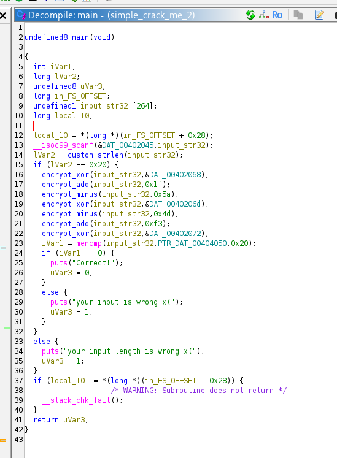

2. 내부에서 사용된 사용자 정의 문자열 길이 측정 함수(`custom_strlen`) 로직 분석.

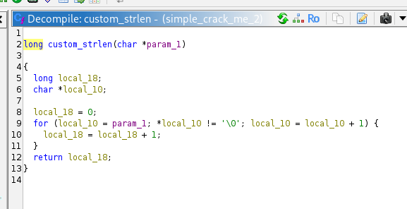

3. 1바이트 단위의 XOR 연산을 수행하는 `encrypt_xor` 함수 로직 분석.

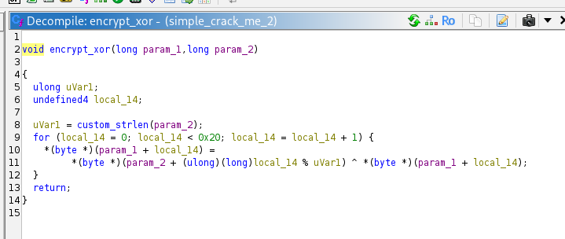

4. 1바이트 단위의 덧셈 및 뺄셈 연산을 수행하는 `encrypt_add`, `encrypt_minus` 함수 구조 파악. 하드웨어 메모리 제약을 흉내 내기 위한 `& 0xFF` 파이썬 변환 전략 수립.

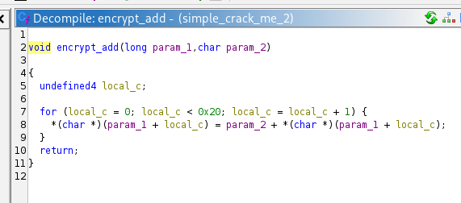

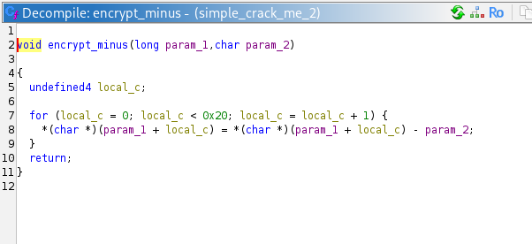

5. 메모리 데이터 참조를 통해 XOR 연산에 사용된 3개의 하드코딩 키 값 식별.
   - Key 1 (`DAT_00402068`): `de ad be ef 00`
   - Key 2 (`DAT_0040206d`): `ef be ad de 00`
   - Key 3 (`DAT_00402072`): `11 33 55 77 99 bb dd 00`

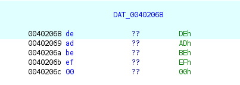

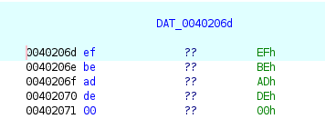

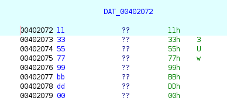

6. 최종 비교 대상인 암호화된 정답 데이터 포인터 주소(`PTR_DAT_00404050`) 및 매핑된 실제 데이터 영역(`DAT_00402008`)의 Hex 바이트 배열 추출.

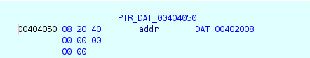

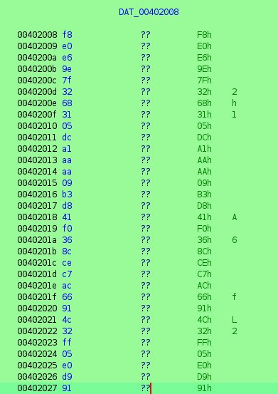

7. 파이썬을 활용하여 분석한 정방향 암호화 함수를 재조합. 별도의 복호화 함수를 짜지 않고 역연산 관계(ADD ↔ MINUS)를 교차 적용한 익스플로잇 스크립트 작성.

```python
def to_byte(val):
    return val & 0xFF

def encrypt_xor(input_str32, key_hex):
    key = bytes.fromhex(key_hex)
    key_len = len(key)
    
    input_str32 = list(input_str32)

    for i in range(32):
        input_str32[i] ^= key[i % key_len]

    return input_str32

def encrypt_add(input_str32, key_val):
    input_str32 = list(input_str32)

    for i in range(32):
        input_str32[i] = to_byte(input_str32[i] + key_val)
    return input_str32

def encrypt_minus(input_str32, key_val):
    input_str32 = list(input_str32)

    for i in range(32):
        input_str32[i] = to_byte(input_str32[i] - key_val)
    return input_str32

# 최종 비교 타겟 데이터
hex_code = "f8e0e69e7f32683105dca1aaaa09b3d841f0368ccec7ac66914c32ff05e0d991"
target_bytes = bytes.fromhex(hex_code)

# 실행 순서의 역순으로 복호화 (ADD <-> MINUS 교차 사용)
step1 = encrypt_xor(target_bytes, "1133557799bbdd")
step2 = encrypt_minus(step1, 0xf3)
step3 = encrypt_add(step2, 0x4d)
step4 = encrypt_xor(step3, "efbeadde")
step5 = encrypt_add(step4, 0x5a)
step6 = encrypt_minus(step5, 0x1f)
flag = encrypt_xor(step6, "DEADBEEF")

print(bytes(flag).decode())
```

7. 작성된 파이썬 스크립트 실행 후 콘솔을 통해 정상적으로 플래그가 출력됨을 확인.

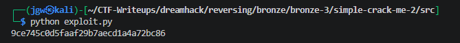


## 4. 획득 결과
도출된 역연산 스크립트를 통해 생성된 바이트 값을 문자열로 디코딩하여 최종 플래그 식별 성공.

* **FLAG:** `9ce745c0d5faaf29b7aecd1a4a72bc86`


## 5. 대응 방안
프로그램 내에서 중요한 인증 키나 라이선스 데이터를 검증할 때, 데이터가 손쉽게 리버싱되어 역추적되는 것을 방지하기 위해 프로그램 소스코드 단에 다음과 같은 시큐어 코딩 조치 적용.

* **하드코딩된 키 사용 지양:** 암호화 키 값(`DEADBEEF` 등)을 바이너리의 데이터 영역(.data, .rodata)에 평문 형태로 하드코딩하는 것을 절대 금지. 실행 시 사용자 입력을 통해 키를 파생시키거나, 외부의 안전한 키 관리 시스템(KMS) 연동 등 동적 생성 방식 적용.

* **강력한 표준 암호화 알고리즘 도입:** 단순한 1바이트 덧셈, 뺄셈, XOR의 조합은 정적 분석 및 Z3와 같은 솔버(Solver)를 통한 역추적이 매우 쉬움. 검증 로직 구현 시 SHA-256과 같은 단방향 해시를 통해 원본 노출을 막거나, AES-256과 같이 보안성이 검증된 산업 표준 대칭키 암호화 알고리즘(OpenSSL 라이브러리 등)을 활용하도록 소스코드 재설계.


## 6. 블루팀 관점 요약

### 6.1. 탐지 및 분석 한계
* **네트워크 행위 없음:** 해당 프로그램은 오프라인에서 검증 로직을 수행하는 단독 실행형 바이너리로 동작하므로, 외부 C2(명령 및 제어) 서버와의 통신이 일절 발생하지 않음. 따라서 기존의 네트워크 관제 장비(NTA/IPS)로는 침해 시도 및 행위 탐지 불가.

* **대응 방향:** EDR 및 호스트 엔드포인트 보안 모니터링 체계를 통해 의심스러운 실행 파일의 덤프 행위나 디버깅 툴(Ghidra, x64dbg) 프로세스 접근 이력을 모니터링해야 함. 또한 역공학 분석을 통해 확보된 정적 정보(시그니처, 문자열)를 바탕으로 파일 기반의 패턴 매칭 탐지 규칙 생성이 필요.

### 6.2. YARA 탐지 룰 (IoC)
바이너리 정적 분석 과정에서 식별된 하드코딩 암호화 키(Hex 시그니처) 및 성공/실패 시 출력되는 주요 문자열을 활용한 정적 탐지 룰 제안.

```yara
rule Detect_Simple_CrackMe_2 {
    strings:
        // 하드코딩된 암호화 키 Hex 시그니처
        $hex_key1 = { DE AD BE EF 00 }
        $hex_key2 = { EF BE AD DE 00 }
        $hex_key3 = { 11 33 55 77 99 BB DD 00 }
        
        // 대상 파일의 주요 출력 문자열
        $s1 = "Correct!" ascii
        $s2 = "your input is wrong" ascii
        $s3 = "your input length is wrong" ascii
        
    condition:
        // 시그니처 중 최소 1개의 키와 최소 2개의 문자열 조합 시 탐지
        any of ($hex_key*) and 2 of ($s*)
}
```