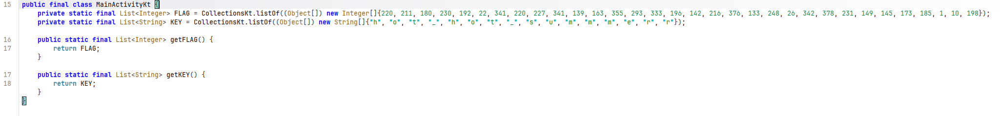
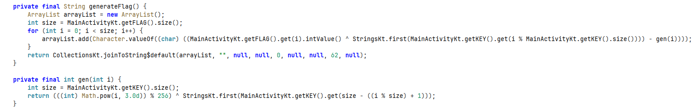

# [Dreamhack] Summer Fan - Reversing

## 1. 문제 개요

* **문제 링크:** [Dreamhack - Summer Fan](https://dreamhack.io/wargame/challenges/651)

* **분야:** Reversing

* **목표:** 제공된 안드로이드 APK 파일의 디컴파일을 통해 하드코딩된 배열 데이터와 커스텀 암호화 로직(XOR, 모듈러, 거듭제곱 등)을 정적 분석하고, 도출한 알고리즘을 바탕으로 역연산 파이썬 스크립트를 작성하여 원본 입력값(FLAG) 복구.

## 2. 취약점 분석
제공된 APK 파일(`SUMMER_FAN.apk`)을 JADX 디컴파일러로 분석한 결과, `MainActivityKt` 클래스 내부에 평문으로 하드코딩된 2개의 배열(`FLAG`, `KEY`)이 존재하며, `MainActivity` 클래스에서 이 배열들을 호출하여 특정 수식을 거쳐 플래그를 생성하는 구조 파악.

```java
// ... (중략) ...

public final class MainActivityKt {
    private static final List<Integer> FLAG = CollectionsKt.listOf(new Integer[]{220, 211, 180, 230, 192, 22, 341, 220, 227, 341, 139, 163, 355, 293, 333, 196, 142, 216, 376, 133, 248, 26, 342, 378, 231, 149, 145, 173, 185, 1, 10, 198});
    private static final List<String> KEY = CollectionsKt.listOf(new String[]{"h", "o", "t", "_", "h", "o", "t", "_", "s", "u", "m", "m", "e", "r", "r"});
    
    public static final List<Integer> getFLAG() {
        return FLAG;
    }
    
    public static final List<String> getKEY() {
        return KEY;
    }
}

// ... (중략) ...

public final class MainActivity {

// ... (중략) ...

    private final String generateFlag() {
        ArrayList arrayList = new ArrayList();
        int size = MainActivityKt.getFLAG().size();
        for (int i = 0; i < size; i++) {
            arrayList.add(Character.valueOf((char) ((MainActivityKt.getFLAG().get(i).intValue() ^ StringsKt.first(MainActivityKt.getKEY().get(i % MainActivityKt.getKEY().size()))) - gen(i))));
        }
        return CollectionsKt.joinToString$default(arrayList, "", null, null, 0, null, null, 62, null);
    }

    private final int gen(int i) {
        int size = MainActivityKt.getKEY().size();
        return (((int) Math.pow(i, 3.0d)) % 256) ^ StringsKt.first(MainActivityKt.getKEY().get(size - ((i % size) + 1)));
    }
}
```

* **분석 결론:** 플래그 복원에 필요한 원본 데이터 배열(`FLAG`, `KEY`)이 메모리 영역에 평문으로 하드코딩되어 있으며, 연산에 사용되는 수식 구조(`gen()` 함수 호출 및 XOR, 뺄셈 등)가 모두 노출되어 있으므로, 해당 자바 코드를 파이썬으로 동일하게 재현하여 플래그 복호화 스크립트 작성 가능.

## 3. 공격 수행

1. JADX를 통해 `SUMMER_FAN.apk` 파일의 전체적인 구조 및 타겟 데이터가 포함된 `MainActivity` 클래스 확인.



2. 하드코딩된 로직인 `generateFlag()`와 `gen()`의 연산 순서 파악. `gen(i)` 값을 먼저 연산한 뒤, `FLAG[i] ^ KEY[main_idx]` 연산 결과에서 해당 값을 빼주는 전체 로직의 흐름 식별.



3. 파이썬을 활용하여 분석한 자바 함수의 연산 순서를 그대로 재현하는 익스플로잇 스크립트 작성 및 실행.

```python
FLAG = [ 220, 211, 180, 230, 192, 22, 341, 220, 227, 341, 139, 163, 355, 293, 333, 196, 142, 216, 376, 133, 248, 26, 342, 378, 231, 149, 145, 173, 185, 1, 10, 198 ]
KEY = [ "h", "o", "t", "_", "h", "o", "t", "_", "s", "u", "m", "m", "e", "r", "r" ]

flag_result = ""
key_size = len(KEY)

for i in range(len(FLAG)):
    gen_idx = key_size - ((i % key_size) + 1)
    gen_val = ((i ** 3) % 256) ^ ord(KEY[gen_idx][0])
    
    main_idx = i % key_size
    char_val = (FLAG[i] ^ ord(KEY[main_idx][0])) - gen_val
    
    flag_result += chr(char_val)

print(flag_result)
```

## 4. 획득 결과
작성한 파이썬 스크립트 실행을 통해 하드코딩된 배열의 암호화 로직을 우회하여 최종 플래그 텍스트 식별 성공.

* **FLAG:** `BISC{it_1s_so_hott_4c5515c5553a}`

## 5. 대응 방안
프로그램 내에서 중요한 인증 키나 민감 데이터를 보호하기 위해 소스코드 단에 다음과 같은 시큐어 코딩 조치 적용.

* **하드코딩된 타겟 정보 제거:** 암호화의 기준이 되는 키(`KEY`) 및 플래그 조합용 원본 데이터(`FLAG`)를 코드 내부에 평문 형태로 하드코딩하는 것을 금지. 중요 정보는 Android Keystore 시스템을 통해 안전하게 관리하거나 서버 측에서 검증을 수행하도록 설계.

* **표준 암호화 알고리즘 도입:** 단순한 배열 인덱스 참조, 산술 연산, XOR 조합 방식의 커스텀 암호화는 정적 분석을 통한 역추적이 매우 쉬움. 검증 로직 구현 시 AES-256과 같이 보안성이 검증된 산업 표준 대칭키 암호화 알고리즘 활용 권장.

* **동적 분석 및 리버싱 방지 기법 적용:** 모바일 환경 특성상 디컴파일이 용이하므로 난독화 솔루션(ProGuard/R8)을 적용하여 원본 로직 파악을 어렵게 구성. 추가로 안티 디버깅 및 무결성 검증 로직을 추가하여 앱의 변조 방지.

## 6. 블루팀 관점 요약

### 6.1. 탐지 및 분석 한계
* **네트워크 행위 없음:** 해당 프로그램은 오프라인 환경에서 단독으로 검증 로직을 수행하는 모바일 앱으로 동작하므로, 외부 C2(명령 및 제어) 서버와의 통신이 일절 발생하지 않음. 따라서 기존의 네트워크 관제 장비(NTA/IPS 등)로는 침해 시도 및 비정상 행위 탐지 불가.

* **대응 방향:** 모바일 엔드포인트 보안 솔루션(MTD)을 통해 출처를 알 수 없는 앱의 설치 이력 및 비정상적인 권한 요구 상태 모니터링 필요. 또한 분석을 통해 확보된 정적 정보(클래스명, 하드코딩 문자열)를 바탕으로 파일 기반의 패턴 매칭 탐지 규칙 생성 요구.

### 6.2. YARA 탐지 룰 (IoC)
바이너리 정적 분석 과정에서 식별된 하드코딩 데이터 및 특정 암호화 함수명을 활용한 정적 탐지 룰 제안.

```yara
rule Detect_Summer_Fan {
    strings:
        // 하드코딩된 특정 키 배열 문자열 특징
        $key_str_1 = "\"h\", \"o\", \"t\", \"_\", \"s\", \"u\", \"m\", \"m\", \"e\", \"r\", \"r\"" ascii wide
        
        // JADX 디컴파일 시 식별 가능한 앱 내부 고유 함수 및 클래스명 패턴
        $func_gen = "gen" ascii fullword
        $func_generateFlag = "generateFlag" ascii fullword
        $class_name = "MainActivityKt" ascii wide

    condition:
        // APK 압축 파일 매직 넘버(ZIP 헤더) 식별을 통한 파일 포맷 한정
        uint32(0) == 0x04034b50
        and all of ($func_*)
        and ($key_str_1 or $class_name)
}
```